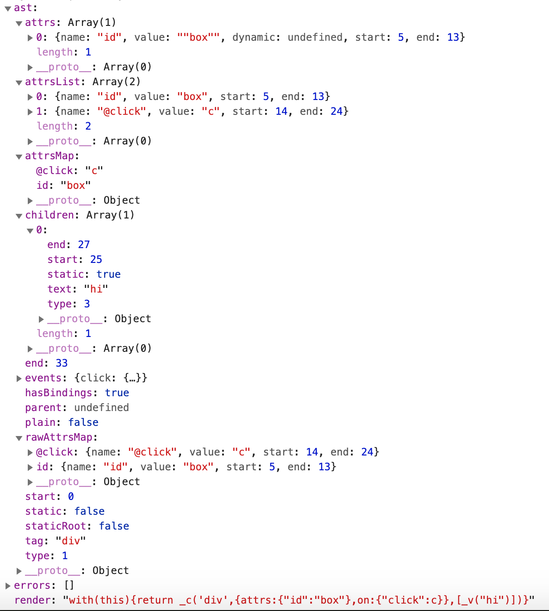

# 代码生成器

## 生成器作用

代码生成器的作用是将 AST 转换成渲染函数中的内容。如模版：

```
<div id="box" @click="c">hi</div>
```

经过编译后会生成一个编译对象。



上图可以看到，

- ast 就是经过解析器解析后的 ast 对象。
- 代码生成器会根据 ast 对象，生成 render 方法体。
- 创建节点的方法
  - `_c`: createElement 是创建元素节点
  - `_v`: createTextVNode 是创建文本节点
  - `_e`: createEmptyVNode 是创建注释节点

上面 render 方法体再通过 new Function 就可以生成渲染函数。

```js
const code = `with(this){return 'hi'}`;
const hi = new Function(code);
hi(); // 'hi'
```

## 生成器原理

生成器会对 ast 对象进行递归，根据具体的节点类型(`node.type`)生成具体的代码，然后拼接起来。

```js
export function generate(ast, options) {
  const state = new CodegenState(options);
  const code = ast ? genElement(ast, state) : '_c("div")';
  return {
    render: `with(this){return ${code}}`,
    staticRenderFns: state.staticRenderFns,
  };
}

export function genElement(el, state) {
  if (el.parent) {
    // 跳过这个元素和它的子元素的编译过程。可以用来显示原始 Mustache 标签。
    // v-pre
    el.pre = el.pre || el.parent.pre;
  }

  // 如果 el.plain 是 true，表示节点没有属性
  const data = el.plain ? undefined : genData(el, state);
  const children = genChildren(el, state);
  let code;
  // _c('div', props, [children1, children2])
  code = `_c('${el.tag}')
    ${data ? `, ${data}` : ""}
    ${children ? `, ${children}` : ""}
  `;
  return code;
}

function genData(el, state) {
  let data = "{";
  if (el.key) {
    data += `key:${el.key},`;
  }
  if (el.ref) {
    data += `ref:${el.ref},`;
  }
  if (el.pre) {
    data += `pre:true,`;
  }
  if (el.attrs) {
    console.log("el.attrs", el.attrs);
    data += `attrs:${genProps(el.attrs)},`;
  }
  if (el.props) {
    data += `domProps:${genProps(el.props)},`;
  }
  if (el.events) {
    data = `${genHandlers(el.events, false)},`;
  }
  // ...
  data = data.replace(/,$/, "") + "}";
  return data;
}

function genProps(props) {
  let staticProps = ``;
  let dynamicProps = ``;
  for (let i = 0; i < props.length; i++) {
    const prop = props[i];
    const value = prop.value;
    if (props.dynamic) {
      dynamicProps += `${prop.name},${value},`;
    } else {
      staticProps += `"${prop.name}":${value},`;
    }
  }
  staticProps = `{${staticProps.slice(0, -1)}}`;
  if (dynamicProps) {
    return `_d(${staticProps},[${dynamicProps.slice(0, -1)}])`;
  } else {
    return staticProps;
  }
}

function genHandlers() {}

function genChildren(el, state) {
  const children = el.children;
  if (children.length) {
    return `[${children.map((c) => genNode(c, state))}]`;
  }
}

function genNode(node, state) {
  if (node.type === 1) {
    return genElement(node, state);
  }
  if (node.type === 3 && node.isComment) {
    return genComment(node);
  } else {
    return genText(node);
  }
}
```
