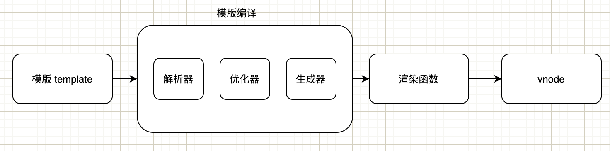
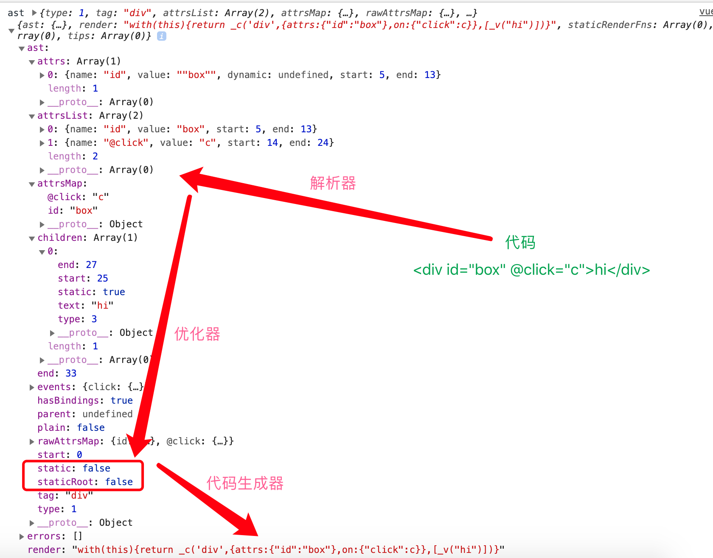

# 模版编译流程

vue 允许我们在开发时使用模版，如下代码：

```js
new Vue({
  template: `<div id="box" @click="c">hi</div>`,
});
```

在底层实现上，它会将模版编译成虚拟 DOM 渲染函数 `render`。执行 `render()` 方法时，会生成一个新的 vnode，然后使用这个 vnode 进行页面渲染。

模版编译成渲染函数的过程：

1. 将模版解析成 AST： 解析器
2. 遍历 AST 标记静态节点： 优化器
3. 使用 AST 生成渲染函数： 代码生成器



再结合下图来详细看看：



可以看到，模版`<div id="box" @click="c">hi</div>`首先会经过编译会产出一个编译对象：

```
{
  ast:{},
  render: "with(this){return _c('div',{attrs:{"id":"box"},on:{"click":c}},[_v("hi")])}"
}
```

这里的 ast 对象就是解析器生成的，然后优化器会对 ast 对象标记静态属性 static|staticRoot，最后代码生成器会根据 ast 对象生成一个 render 方法体。render 方法体会转换为 render 方法。

```
res.render = createFunction(compiled.render, fnGenErrors);
```

执行这个 render 方法，会生成 vnode 对象，用于页面的渲染。
