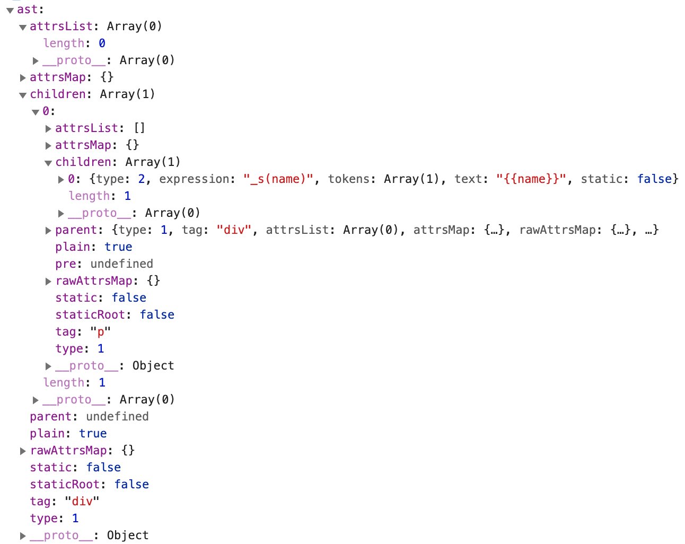

# 解析器

### 解析器工作流程

解析器的作用就是将模版变成 AST(抽象语法树)，如代码:

```html
<div>
  <p>{{name}}</p>
</div>
```

解析为 AST 后的样子如下：



可以看到，这里所谓的 AST，其实就是用 js 对象来描述模版的结构。

解析器会循环解析模版，每次循环从模版中截取一小段字符串，触发对应类型的钩子函数，然后重复，直到整个模版字符串为空。伪代码如下：

```js
function parse() {
  let root;
  let stacks = [] // 用来维护 DOM 层级
  parseHTML(html, {
    start(tag, attrs, unary) {}, // 解析到开始标签触发的钩子
    end(tag) {}, // 解析到结束标签触发的钩子
    chars(text) {}, // 解析到文本触发的钩子
    comment(text) {}, // 解析到注释触发的钩子
  });
  return root;
}
function parseHTML(html, options) {
  while (html) {
    if (isMatchTagStart) {
      // 如果是开始标签
      options.start();
      html = html.substring(isMatchTagStart[0].length);
    }
    if (isMatchText) {
      // 如果是文本
      options.chars();
      html = html.substring(isMatchText[0].length);
    }
    ...
  }
}
```

匹配模版的片段类型包括：

- 开始标签，如 `<div>`
- 结束标签，如 `</div>`
- HTML 注释，如 `<!-- 注释 -->`
- DOCTYPE，如 `<!DOCTYPE html>`
- [条件注释](http://www.divcss5.com/html/h436.shtml)，如 `<!--[if !IE]-->条件注释<![endif]-->`
- 文本，如 `hello world`

## HTML 解析器

### 匹配开始标签

一个合法的 XML 名称可以是：

- 用户自定义的`<bug></bug>`
- 带自定义前缀的`<k:bug></k:bug>`，k 就是前缀
- 带命名前缀的 `<k:bug xmlns:k="http://www.xxx.com/xxx"></k:bug>`，xmln 就是给前缀 k 设定命名空间

所以一个合法的 XML 名称可以是`<前缀:标签名称>`

```js
// could use https://www.w3.org/TR/1999/REC-xml-names-19990114/#NT-QName
// but for Vue templates we can enforce a simple charset
// ncame概念 https://msdn.microsoft.com/zh-cn/library/ms256452.aspx
// An XML name that does not contain a colon (:) 不包含:的XML名称
const ncname = "[a-zA-Z_][\\w\\-\\.]*";

// https://www.w3.org/TR/1999/REC-xml-names-19990114/#NT-QName
// qname 就是 <前缀:标签名称> 即合法的 XML 标签
// 分组会捕获整个标签名称
const qnameCapture = `((?:${ncname}\\:)?${ncname})`;

const startTagOpen = new RegExp(`^<${qnameCapture}`);

const startTagClose = /^\s*(\/?)>/;
```

startTagOpen 用来捕获开始标签部分，如对于 `<div>` 会捕获 `<div`。

- 开始标签的特点是：以 `<` 开头，后面一个字母是英文或\_。
- 开始标签被拆分成了 标签名`<div`，属性`class="box"`和结尾`>`三个部分来解析。

startTagClose 用来捕获剩余的部分 `>`，或者自闭合标签的`/>`，如 ``。

### 匹配属性

html 属性通常有多种写法：

- 双引号类型 `class="some-class"`
- 单引号类型 `class='some-class'`
- 无引号类型 `class=some-class`
- 只有属性名的 `disabled`

```js
const attribute = /^\s*([^\s"'<>\/=]+)(?:\s*(=)\s*(?:"([^"]*)"+|'([^']*)'+|([^\s"'=<>`]+)))?/;
console.log('class="some-class"'.match(attribute)); // 测试双引号
console.log("class='some-class'".match(attribute)); // 测试单引号
console.log("class=some-class".match(attribute)); // 测试无引号
console.log("class = some-class".match(attribute)); // 测试有空格
console.log("disabled".match(attribute)); // 测试无属性值
```

具体匹配结果如下：

```
// 双引号
[
  'class="some-class"',
  'class',
  '=',
  'some-class',
  undefined,
  undefined,
  index: 0,
  input: 'class="some-class"',
  groups: undefined
]
// 单引号
[
  "class='some-class'",
  'class',
  '=',
  undefined,
  'some-class',
  undefined,
  index: 0,
  input: "class='some-class'",
  groups: undefined
]
// 无引号
[
  'class=some-class',
  'class',
  '=',
  undefined,
  undefined,
  'some-class',
  index: 0,
  input: 'class=some-class',
  groups: undefined
]
// 只有属性
[
  'disabled',
  'disabled',
  undefined,
  undefined,
  undefined,
  undefined,
  index: 0,
  input: 'disabled',
  groups: undefined
]
```

### 匹配结束标签

endTag 用来匹配结束标签的名称。

```js
const endTag = new RegExp(`^<\\/${qnameCapture}[^>]*>`);
```

### 匹配 doctype

```js
const doctype = /^<!DOCTYPE [^>]+>/i;
```

这个正则用来匹配文档的 DOCTYPE 标签，没有捕获组。

### 匹配 comment

```js
// https://github.com/vuejs/vue/issues/7298
const comment = /^<!\--/;
```

之前 comment 是常量 `<!--`，后来由于 #7298 改成正则了，因为如果使用 `<!--`，在将 vuejs 库内联到 html 中时，会将它当作是 html 注释，导致报错。

### 匹配条件注释

```js
const conditionalComment = /^<!\[/;
```

### 匹配文本

如果当前模版最前面不是 `<`，那么它就是文本了。只需要找到下一个 `<`的位置，它前面所有的字符都属于文本，例如`我是文本<br/>`。

有个特殊情况，就是文本中包含`<`时：`1<2<br/>`。针对这种情况，解决思路是如果截取完`<`前面的字符后，剩余的模版不符合任何需要被解析的片段类型，这说明当前`<`也是文本的一部分，例如对于`1<2<br/>`:

1. 第一次解析文本 1
2. `<2` 不符合所有片段类型，说明 `<` 属于文本一部分，所以继续找下一个 `<`
3. 将 `<2` 追加到文本 1 后面，此时文本为 `1<2`，剩余模版为`<br/>`。

### 匹配纯文本内容元素

纯文本内容元素是指 `<script>`、`<style>`、`<textarea>`这样的元素，这三种标签里的内容处理逻辑不同，它们内部的文本需要当作纯文本来进行处理。

### 使用栈维护 DOM 层级

HTML 解析器内也有个 stacks，它的作用有 2 个：

- 用来维护 DOM 层级
- 检查标签是否正确闭合，从而在开发环境下报警告。

## 文本解析器

文本解析器的作用是对 HTML 解析器解析出来的文本进行二次处理。文本分为两种类型：

- 纯文本：无需额外处理
- 带变量的文本：需要进行处理

而 HTML 解析器不会区分它们。

```
hello, zhangsan
hello, {{name}}
```

vue 内部在得到文本后，会对文本进行区分。

```js
parseHTML(template, {
  ...
  chars(text, start, end) {
    let res;
    let child;
    const children = currentParent.children;
    if ((res = parseText(text))) {
      child = { // 带有 {{}} 变量的文本
        type: 2,
        expression: res.expression,
        tokens: res.tokens,
        text,
      };
    } else {
      child = { // 纯文本
        type: 3,
        text,
      };
    }
    if (child) {
      children.push(child);
    }
  },
});
```

可以看到，vue 内部使用了 parseText 方法来判断 text 是否是带变量的文本，如果是，其 type 就是 2，如果是纯文本，其 type 就是 3。

parseText 方法如下：

```js
// 使用正则，判断文本是否是 {{x}} 形式
const defaultTagRE = /\{\{((?:.|\r?\n)+?)\}\}/g;
export function parseText(text, delimiters) {
  const tagRE = delimiters ? buildRegex(delimiters) : defaultTagRE;
  // 单纯的文本
  if (!tagRE.test(text)) {
    return;
  }

  // 否则，将文本 hello {{name}} world 依次放入数组，即 ['hello', _s(name), 'world']
  const tokens = [];
  const rawTokens = [];
  let lastIndex = (tagRE.lastIndex = 0);
  let match, index, tokenValue;
  while ((match = tagRE.exec(text))) {
    index = match.index;
    // 把 {{ 前面的文本放入 tokens 中
    if (index > lastIndex) {
      rawTokens.push((tokenValue = text.slice(lastIndex, index)));
      tokens.push(JSON.stringify(tokenValue));
    }
    // 把 {{name}} 变成 _s(${name}) 放入到 tokens 中
    const exp = parseFilters(match[1].trim());
    tokens.push(`_s(${exp})`);
    lastIndex = index + match[0].length;
  }
  if (lastIndex < text.length) {
    rawTokens.push((tokenValue = text.slice(lastIndex)));
    tokens.push(JSON.stringify(tokenValue));
  }
  return {
    expression: tokens.join("+"),
    tokens: rawTokens,
  };
}
```

可以看到，vue 如果没有匹配到 `{{}}`，就是纯文本，直接 return 返回 undefined 了。如果匹配到 `{{}}`，就是带变量文本，它会从左到有依次查找，然后将变量文本转换为一个函数形式，放到 tokens 中，即`hello {{name}} world` 会得到 `['hello', _s(name), 'world']`，最后使用 `join('+')`拼接起来，变成了`'hello' + _s(name) + 'world'`。

上面变量 lastIndex 主要是为了方便获取变量文本前面的纯文本和最后剩余的纯文本。

## parseHTML 代码

```js
const ncname = "[a-zA-Z_][\\w\\-\\.]*";
const qnameCapture = `((?:${ncname}\\:)?${ncname})`;
const startTagOpen = new RegExp(`^<${qnameCapture}`);
const attribute = /^\s*([^\s"'<>\/=]+)(?:\s*(=)\s*(?:"([^"]*)"+|'([^']*)'+|([^\s"'=<>`]+)))?/;
const startTagClose = /^\s*(\/?)>/;
const endTag = new RegExp(`^<\\/${qnameCapture}[^>]*>`);
const doctype = /^<!DOCTYPE [^>]+>/i;
const comment = /^<!\--/;
const conditionalComment = /^<!\[/;

export const isPlainTextElement = makeMap("script,style,textarea", true);

const decodingMap = {
  "&lt;": "<",
  "&gt;": ">",
  "&quot;": '"',
  "&amp;": "&",
  "&#10;": "\n",
  "&#9;": "\t",
  "&#39;": "'",
};

const encodedAttr = /&(?:lt|gt|quot|amp|#39);/g;
const encodedAttrWithNewLines = /&(?:lt|gt|quot|amp|#39|#10|#9);/g;

// shouldDecodeNewlines 是否解析换行
// 将属性里的转义字符恢复，如 'aa&lt;bb' 变成 'aa<bb'
function decodeAttr(value, shouldDecodeNewlines) {
  const re = shouldDecodeNewlines ? encodedAttrWithNewLines : encodedAttr;
  return value.replace(re, (match) => decodingMap[match]);
}

function parseHTML(html, options) {
  const stack = [];
  const expectHTML = options.expectHTML;
  const isUnaryTag = options.isUnaryTag || no;
  let index = 0;
  let last, lastTag; // lastTag 表示是否结束

  while (html) {
    last = html;
    // console.log('last', last)
    if (!lastTag || !isPlainTextElement(lastTag)) {
      let textEnd = html.indexOf("<");
      if (textEnd === 0) {
        // 注释
        if (comment.test(html)) {
          const commentEnd = html.indexOf("-->");
          if (commentEnd >= 0) {
            advance(commentEnd + 3);
            continue;
          }
        }

        // 条件注释
        if (conditionalComment.test(html)) {
          const conditionalEnd = html.indexOf("]>");

          if (conditionalEnd >= 0) {
            advance(conditionalEnd + 2);
            continue;
          }
        }

        // Doctype:
        const doctypeMatch = html.match(doctype);
        if (doctypeMatch) {
          advance(doctypeMatch[0].length);
          continue;
        }

        // 结束标签
        const endTagMatch = html.match(endTag);
        if (endTagMatch) {
          const curIndex = index;
          advance(endTagMatch[0].length);
          parseEndTag(endTagMatch[1], curIndex, index);
          continue;
        }

        const startTagMatch = parseStartTag();
        if (startTagMatch) {
          handleStartTag(startTagMatch);
          continue;
        }
      }

      let text, rest, next;
      if (textEnd >= 0) {
        rest = html.slice(textEnd);
        text = html.substring(0, textEnd);
      }

      if (textEnd < 0) {
        text = html;
      }

      // 从第一个 < 开始解析
      if (text) {
        advance(text.length);
      }

      if (options.chars && text) {
        options.chars(text, index - text.length, index);
      }
    } else {
    }

    // 最后都没有匹配上
    if (html === last) {
      options.chars && options.chars(html);
      break;
    }
  }

  // 清除剩余标签
  parseEndTag();

  function advance(n) {
    index += n;
    html = html.substring(n);
  }

  function parseStartTag() {
    const start = html.match(startTagOpen);
    if (start) {
      const match = {
        tagName: start[1],
        attrs: [],
        start: index,
      };
      advance(start[0].length);
      let end, attr;
      // 不是开始标签的末尾 >
      // 匹配到了属性
      while (
        !(end = html.match(startTagClose)) &&
        (attr = html.match(attribute))
      ) {
        attr.start = index;
        advance(attr[0].length);
        attr.end = index;
        match.attrs.push(attr);
      }
      // 结束
      if (end) {
        match.unarySlash = end[1];
        advance(end[0].length);
        match.end = index;
        return match;
      }
    }
  }

  function handleStartTag(match) {
    const tagName = match.tagName;
    const unarySlash = match.unarySlash;

    const unary = isUnaryTag(tagName) || !!unarySlash;
    const l = match.attrs.length;
    const attrs = new Array(l);
    for (let i = 0; i < l; i++) {
      const args = match.attrs[i];
      const value = args[3] || args[4] || args[5] || "";
      attrs[i] = {
        name: args[1],
        value: decodeAttr(value),
      };
    }

    if (!unary) {
      stack.push({
        tag: tagName,
        lowerCasedTag: tagName.toLowerCase(),
        attrs,
        start: match.start,
        end: match.end,
      });
      lastTag = tagName;
    }

    if (options.start) {
      options.start(tagName, attrs, unary, match.start, match.end);
    }
  }

  function parseEndTag(tagName, start, end) {
    let pos, lowerCasedTagName;

    // 清空剩余标签时有用
    if (start == null) start = index;
    if (end == null) end = index;

    if (tagName) {
      lowerCasedTagName = tagName.toLowerCase();
      // pos 表示最靠近的一个开始匹配标签的位置，比如 </div> 需要到栈中找 <div>
      for (pos = stack.length - 1; pos >= 0; pos--) {
        if (stack[pos].lowerCasedTag === lowerCasedTagName) {
          break;
        }
      }
    } else {
      // 如果没有 tag，就表示是清空栈
      pos = 0;
    }

    if (pos >= 0) {
      for (let i = stack.length - 1; i >= pos; i--) {
        if (options.end) {
          options.end(stack[i].tag, start, end);
        }
      }
      stack.length = pos;
      lastTag = pos && stack[pos - 1].tag;
    } else if (lowerCasedTagName === "br") {
      // 如果没有匹配的开始标签，如 </br>，会变成 <br/>
      if (options.start) {
        options.start(tagName, [], true, start, end);
      }
    } else if (lowerCasedTagName === "p") {
      // 如果没有匹配的开始标签，如 </p> 会当作是 <p></p>
      if (options.start) {
        options.start(tagName, [], false, start, end);
      }
      if (options.end) {
        options.end(tagName, start, end);
      }
    }
  }
}

export default parseHTML;
```

## parse 代码

```js
export function parse(template) {
  const stack = [];
  let root;
  let currentParent;

  function closeElement(element) {
    if (currentParent) {
      currentParent.children.push(element);
      element.parent = currentParent;
    }
  }

  parseHTML(template, {
    start(tag, attrs, unary) {
      let element = createASTElement(tag, attrs, currentParent);
      if (!root) {
        root = element;
      }
      // 如果不是自闭合标签
      if (!unary) {
        currentParent = element;
        stack.push(element);
      } else {
        closeElement(element);
      }
    },
    end(tag, start, end) {
      const element = stack[stack.length - 1];
      stack.length -= 1; // pop stack
      currentParent = stack[stack.length - 1];
      closeElement(element);
    },
    chars(text, start, end) {
      let res;
      let child;
      const children = currentParent.children;
      if ((res = parseText(text))) {
        // 带有 {{}} 变量的文本
        child = {
          type: 2,
          expression: res.expression,
          tokens: res.tokens,
          text,
        };
      } else {
        // 纯文本
        child = {
          type: 3,
          text,
        };
      }
      if (child) {
        children.push(child);
      }
    },
    comment(text) {
      console.log("comment", text);
    },
  });
  return root;
}

export function createASTElement(tag, attrs, parent) {
  return {
    type: 1,
    tag,
    attrsList: attrs,
    attrsMap: makeAttrsMap(attrs),
    rawAttrsMap: {},
    parent,
    children: [],
  };
}
```

parse 内部有个栈 stacks 用来维护 DOM 层级，从而可以生成 ast 的 children、parent：

- 当解析到开始标签时，将元素 push 到栈中。
- 当解析到结束标签时，将元素 pop 出栈。
- 解析到文本时，不用入栈，因为它没有 children
- 当前元素的 parent 是栈顶元素
