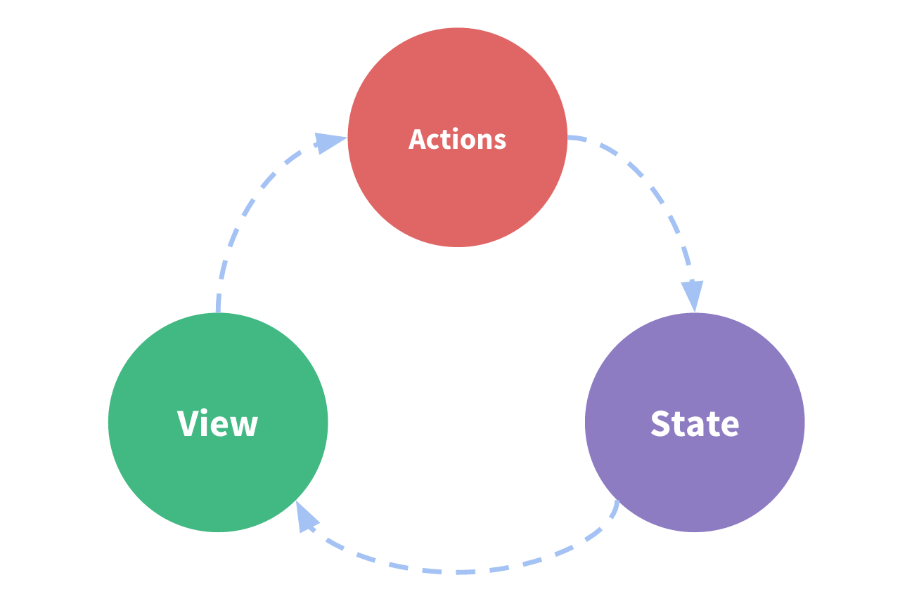

# Vuex

## 简介

Vuex 使用流程如下：

```js
import Vuex from "vuex";
// 1. 使用插件
Vue.use(Vuex);

// 2. 创建 store
let store = new Vuex.Store({});
// 3. 注入 store
new Vue({
  store,
});

// 4. 在页面中获取数据和触发事件
this.$store.state;
this.$store.dispatch("initAge");
```

## 单向数据流

单向数据流理念是数据的流向是单向的。即用户操作页面时，触发 action，然后去改变数据 state，数据改变后，更新视图 view。



但是在 Vue 中，当多个组件共享同一数据时，这种单向性的简洁性容易被破坏。

- 多个视图依赖于同一状态。
- 来自不同视图的行为需要变更同一状态。

## Vuex 核心思想

Vuex 的思想是将状态独立出来进行管理。它的核心是 Store。Store 内部包含数据和修改数据的方法。当数据更新后，它会让所有依赖该数据的组件进行更新。


## Vuex 怎么做的

1. `Vue.use(Vuex)`做了什么？怎么和`new Vue({store})`建立的联系？
1. 所有组件中都有 `this.$store` 属性?
1. 模块化写法 module 内部是怎么处理的？如何实现的下面这种？

```js
{
  modules: {
    a: {
      namespaced: true,  // 不加 namespaced 时，同名 方法会被合并到根上
      state: {
        age: 100
      },
      mutations: {
        setAge(state, payload) {
          state.age += payload
        }
      },
      actions: {
        syncSetAge({ state, commit }, payload) {
          console.log('a syncSetAge', state)
          commit('setAge', 2)  // 命名空间不需要加
        }
    },
  }
}
```

3. 内部是如何 state 变化了，就更新视图的?
