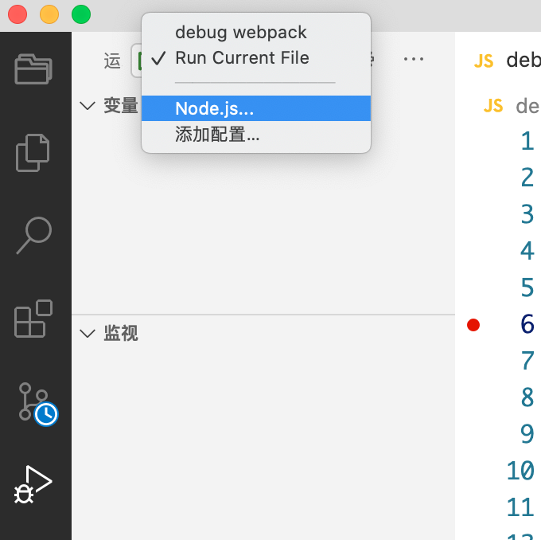

# webpack 工作流程

## 调试 webpack

### 生成调试文件

vscode 可以新增调试文件入口 `.vscode\launch.json`，然后点击调试按钮。

vscode 里的路径有问题，所以 entry 使用绝对路径 path.resolve 一下，然后再 cli.js 里 debugger 即可。

```
{
  "version": "0.2.0",
  "configurations": [
    {
      "type": "node",
      "request": "launch",
      "name": "调试 webpack",
      "cwd": "${workspaceFolder}",
      "skipFiles": [
          "<node_internals>/**" // 跳过 node 内部模块
      ],
      "program": "${workspaceFolder}/node_modules/webpack-cli/bin/cli.js"
    }
  ]
}
```

### debugger.js

新建 debugger.js 文件，然后点击调试 -> 选择 node.js -> 选择 Run Current File。



```js
const webpack = require("webpack");
const config = require("./webpack.config");

const compiler = webpack(config);
debugger;
compiler.run((err, stats) => {
  console.log(
    stats.toJson({ assets: true, chunks: true, modules: true, entries: true })
  );
});
```

## tapable.js

- tapable 类似 nodejs 里的 EventEmitter 库，但是更专注自定义事件的触发和处理。
- webpack 里使用 tapable 将实现与流程解耦，实现是通过插件的形式存在。

```js
// const { SyncHook } = require('tapable')
class SyncHook {
  constructor() {
    this.taps = [];
  }
  tap(name, fn) {
    this.taps.push(fn);
  }
  call() {
    this.taps.forEach((tap) => tap());
  }
}

// 这里的参数无意义，只是标识一下接收几个参数
// tapable 内部会将后续的参数 [].slice.call(arguments, 0, arr.length)
const hook = new SyncHook(["name"]);
hook.tap("aa", () => console.log("你好"));

// 插件的原理: webpack 内部会调用插件的 apply 方法
class Plugin {
  apply() {
    hook.tap("Plugin", () => console.log("插件调用"));
  }
}

new Plugin().apply();
hook.call();
// 你好
// 插件调用
```

## webpack 编译流程

1. 初始化参数：从配置文件和 Shell 语句中读取合并参数，得到最终配置
2. 用配置实例化 compiler: new Compiler(config)
3. 用配置里的 plugins 挂载所有的插件
4. 执行 compiler 对象的 run 方法开始编译
5. 根据配置中的 entry 得到入口文件的绝对路径
