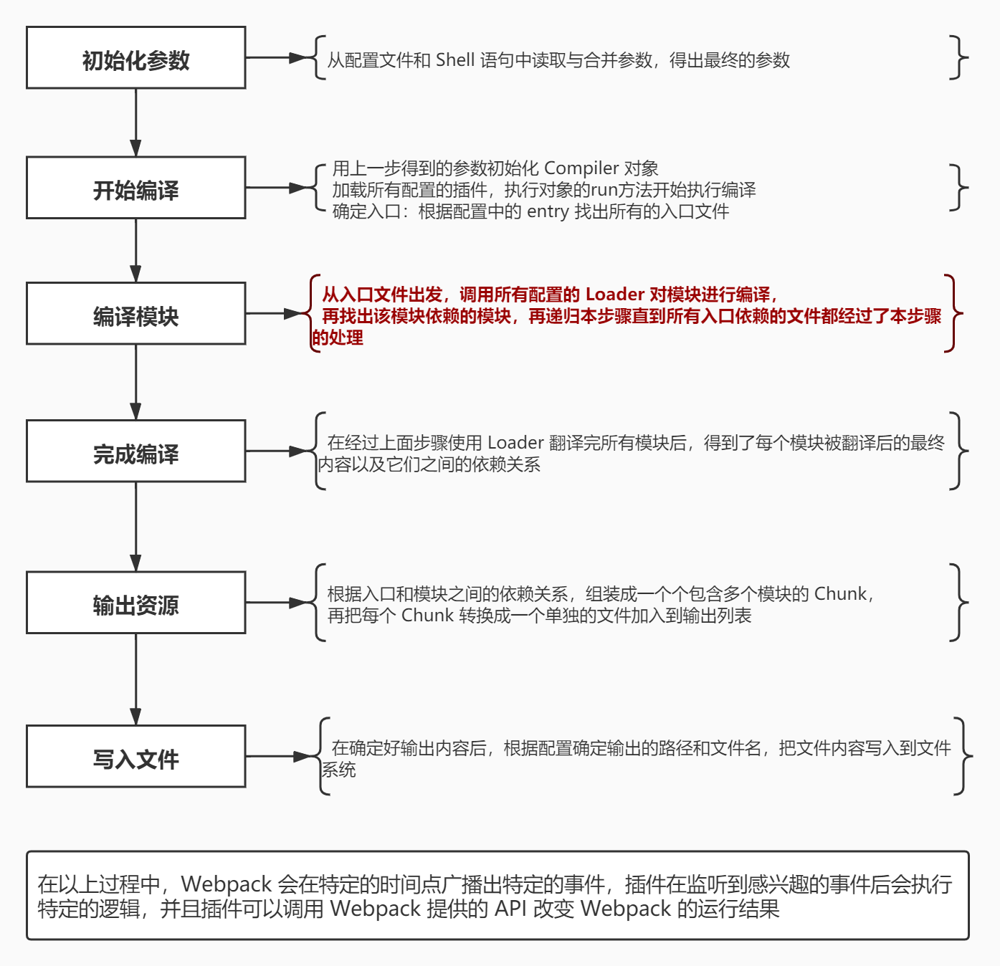
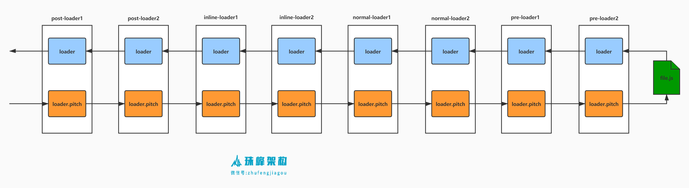

# loader

## loader 简介

- loader 是一个函数，它接收上一个 loader 产生的结果或资源文件作为参数。
- compiler 对于每个资源，需要得到最后一个 loader 产生的结果，这个结果是 String 或 Buffer(会被转为 string)

### loader 工作流程





webpack 查找 loader 的方式：

1. resolveLoader.alias
2. resolveLoader.modules
3. 使用绝对路径

```js
module.exports = {
  ...
  resolveLoader: {
    alias: {
      'loader1': path.resolve(__dirname, 'loaders/loader1.js')
    },
    modules: [path.resolve(__dirname, 'loaders'), 'node_modules'],
  }
}
```

### loader 的分类

loader 按照顺序和使用分为 4 类：

- pre: 最先处理
- normal: 普通
- inline loader: 写在代码里的 `require('a-loader!b-loader!./src/index.js')`
- post loader: 最后处理

### 特殊配置

[有 3 个符号](https://webpack.js.org/concepts/loaders/#configuration)可以过滤处理当前资源的 loader。如`require(!!./src/index.js)`。

- `-!`: noPreAutoLoaders，不要前置和普通 loader
- `!`: noAutoLoaders，不要普通 loader
- `!!`: noPrePostAutoLoaders 不要前后置和普通 loader，即只要内联 loader

### loader.pitch

- 比如 `['loader1','loader2','loader3']`,loader 的执行顺序实际是 `loader1.pitch -> loader2.pitch -> loader3.pitch -> 读取资源 -> loader3 -> loader2 -> loader1`。
- 如果有某个 pitch loader 返回了值，那么右边的 loader 不会走，直接返回，而且这个返回值会被当作当前 loader 的返回值传递给它的上一个 loader。
- loader 的返回值，最左边的需要返回 js 代码，因为要给 webpack 转成 ast 去依赖分析，否则会转换失败。

### loader-runner

- loader-runner 是 webpack 执行 loader 链条的模块。

```js
const path = require("path");
const fs = require("fs");
const { runLoaders } = require("loader-runner");

let resource = "-!inline-loader!./src/main.js"; // ! 表示不用普通loader
let rules = [
  {
    test: /\.js$/,
    use: ["normal-loader1", "normal-loader2"],
  },
  {
    test: /\.js$/,
    enforce: "post", //post webpack保证一定是后执行的
    use: ["post-loader1", "post-loader2"],
  },
  {
    test: /\.js$/,
    enforce: "pre", //一定先执行eslint
    use: ["pre-loader1", "pre-loader2"],
  },
];
let resolveLoader = (loader) => path.resolve(__dirname, "loaders", loader);

// 1. 合并 loader， loader 来源可能是 rules 配置或行内 loader
const flagReg = /^[-!]?!/;
let flag = resource.match(flagReg);
let parts = resource.replace(flagReg, "").split("!");
resource = parts.pop();

// 2. loader 分类
let inlineLoaders = parts.map((part) => resolveLoader(part));
let preLoaders = [];
let normalLoaders = [];
let postLoaders = [];

rules.forEach((rule) => {
  if (rule.test.test(resource)) {
    if (rule.enforce === "pre") {
      preLoaders.push(...rule.use);
    } else if (rule.enforce === "post") {
      postLoaders.push(...rule.use);
    } else {
      normalLoaders.push(...rule.use);
    }
  }
});
preLoaders = preLoaders.map(resolveLoader);
postLoaders = postLoaders.map(resolveLoader);
normalLoaders = normalLoaders.map(resolveLoader);

// 3.根据特殊符号合并最终的 loader
let loaders = [];
if (flag) {
  flag = flag[0];
  if (flag.startsWith("!!")) {
    loaders = [...inlineLoaders];
  } else if (flag.startsWith("~!")) {
    loaders = [...postLoaders, ...inlineLoaders];
  } else if (flag.startsWith("!")) {
    loaders = [...postLoaders, ...inlineLoaders, ...preLoaders];
  } else {
    loaders = [
      ...postLoaders,
      ...inlineLoaders,
      ...normalLoaders,
      ...preLoaders,
    ];
  }
}

runLoaders(
  {
    resource,
    loaders,
    context: { name: "banli" },
    readResource: fs.readFile.bind(fs),
  },
  (err, result) => {
    console.log(err);
    console.log(result);
  }
);
```

## loader 上下文

loader 函数里的 this 对象的属性有：

```js
let thisContext = {
  'version',
  'getOptions',  // 可以获取到webpack配置里loader的options参数
  'emitWarning',
  'emitError',
  'getLogger',
  'resolve',
  'getResolve',
  'emitFile',   // 向 assets 里添加要写的文件
  'addBuildDependency',
  'utils',
  'rootContext',
  'webpack',
  'sourceMap',
  'mode',  // webpack配置的 mode
  '_module',
  '_compilation',
  '_compiler',
  'fs',
  'target',
  'loadModule',
  'context',  // loader 的上下文
  'loaderIndex',
  'loaders',
  'resourceQuery',
  'resourceFragment',
  'async',     // 异步返回，如果不返回loader会处于等待状态，不会执行下个 loader
  'callback',  // 如果要返回多个值，用 this.callback
  'cacheable',
  'addDependency',
  'dependency',
  'addContextDependency',
  'addMissingDependency',
  'getDependencies',
  'getContextDependencies',
  'getMissingDependencies',
  'clearDependencies',

  'request',   // 资源的绝对路径
  // /Users/banli/Desktop/learn/demo/s_project/c_webpack/4.loader/src/main.js
  'resource',  // 要处理的资源绝对路径
  'resourcePath', // 要处理的资源绝对路径

  'currentRequest', // 当前的 loader，如下
  // /Users/banli/Desktop/learn/demo/s_project/c_webpack/4.loader/loaders/babel-loader.js??ruleSet[1].rules[0].use[0]!/Users/banli/Desktop/learn/demo/s_project/c_webpack/4.loader/src/main.js

  'previousRequest', // 前面的 loader
  'remainingRequest', // 后面的 loader + 资源路径
  'query',
  'data',  // 当前 loader 的数据，默认是 {}，可以在 pitch 时添加属性，然后在 loader 函数里获取
}
```

## babel-loader

babel-loader 的原理是使用 `babel.transform()` 方法将代码转换后，返回。

```js
const path = require("path");
const babel = require("@babel/core");
const { getOptions } = require("loader-utils");
/**
 *
 * @param {*} source 上一个 loader 给此 loader 的内容
 * @param {*} sourceMap 上个 loader 传递过来的 sourceMap
 * @param {*} data meta是模块的元数据，也是可选的
 * @returns
 */
function babelLoader(source, sourceMap, meta) {
  console.log(this.getOptions === getOptions); // false
  console.log(this.data); // {}
  const options = {
    presets: ["@babel/preset-env"],
    inputSourceMap: sourceMap,
    sourceMaps: true,
    filename: path.basename(this.resourcePath),
  };
  let { code, map, ast } = (result = babel.transform(source, options));
  return this.callback(null, code, map, ast);
}
module.exports = babelLoader;
```

## file-loader

loader-utils 上有很多方法：

- getOptions
- interpolateName: 可以根据带占位符的名称生成真实名称，如`[name]_[hash:5].[ext]`变成`bg_31ca6.jpg`

```js
const path = require("path");
const babel = require("@babel/core");
const { getOptions, interpolateName } = require("loader-utils");

function fileLoader(source, sourceMap, meta) {
  // 1. 将文件按照 [name]_[hash:5].[ext] 生成文件名字
  const { filename = "[hash].[ext]" } = getOptions(this);
  const output = interpolateName(this, filename, { content: source }); // bg45_31ca6.jpg
  // 2. 发射文件
  this.emitFile(output, source);
  // 3. 返回模块，就是图片的路径字符串
  return `module.exports = ${JSON.stringify(output)}`;
}

fileLoader.raw = true;
module.exports = fileLoader;
```

## url-loader

- 超过 limit 的会用 file-loader 处理
- 小于 limit 的文件会转 base64

```js
let { getOptions } = require("loader-utils");
var mime = require("mime");
function loader(source) {
  let options = getOptions(this);
  let { limit, fallback = "file-loader" } = options;
  if (limit) limit = parseInt(limit, 10);

  // 根据 mimetype 获取 base64
  const mimetype = mime.getType(this.resourcePath);
  if (!limit || source.length < limit) {
    let base64 = `data:${mimetype};base64,${source.toString("base64")}`;
    return `module.exports = ${JSON.stringify(base64)}`;
  } else {
    let fileLoader = require(fallback || "file-loader");
    return fileLoader.call(this, source);
  }
}
loader.raw = true;
module.exports = loader;
```

## less-loader

```js
let less = require("less");
function loader(source) {
  // 如果是异步，需要使用 async() 类似返回一个 resolve
  // 在没有调用 callback 之前不会执行 loader
  let callback = this.async();
  less.render(source, { filename: this.resource }, (err, output) => {
    callback(err, output.css);
  });
}
module.exports = loader;
```

## style-loader

```js
function loader(source) {
  let script = `
      let style = document.createElement("style");
      style.innerHTML = ${JSON.stringify(source)};
    document.head.appendChild(style);
    module.exports = "";
    `;
  return script;
}
module.exports = loader;
```
