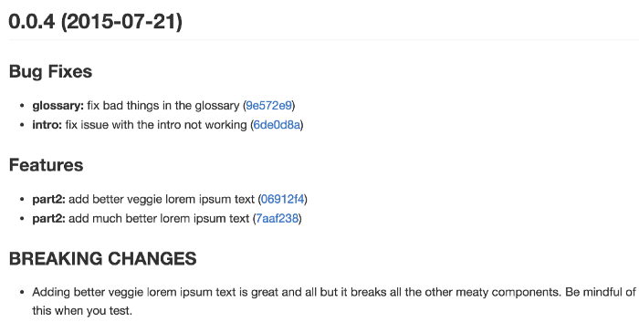

# git 知识总结

## git commit 规范

### commit 的作用

格式化的 commit message 好处如下：

1. 提供标准的历史信息，方便后续快速查看版本变动。

```
$ git log <last tag> HEAD --pretty=format:$s
```

2. 可以过滤某些 commit，快速查找信息。

```
$ git log <last release> HEAD --grep feature
```

3. 可以用于自动生成 Change log。



下面是 Angular 的 commit 规范来说明。

### commit message 的格式

commit message 包括三个部分： Header, Body 和 Footer。

```
<type>(<scope>): <subject>
// 空一行
<body>
// 空一行
<footer>
```

#### Header

- Header 是必须的，Body 和 Footer 可以省略。
- 为了美观，每行都不能超过 72 个字符。
- Header 包括 type（必需）、scope（可选）和 subject（必需）
    - type 用于说明 commit 的类别
    - scope 用于说明 commit 影响的范围
    - subject 是 commit 目的的简短描述，不超过 50 个字符，以动词开头，结尾不要标点符号

```
// type 类别
feat：新增用户功能，而不是新增 build script 功能
fix：修复用户 bug，而不是修复 build script
docs：文档（documentation）
style： 格式，如删掉分号，无生产代码改变
refactor：重构生产代码
test：增加或重构测试，无生产代码改变
chore：构建过程或辅助工具的变动，无生成代码改变
```

如果 type 为 feat 或 fix，则该 commit 会出现在 Change log 中，其它情况，可以自己决定是否放入 Change log，建议是不要。

#### Body

Body 部分是对本地 commit 的详细描述，可以多行。应说明代码变动的原因，以及与之前的对比。

```
More detailed explanatory text, if necessary.  Wrap it to 
about 72 characters or so. 

Further paragraphs come after blank lines.

- Bullet points are okay, too
- Use a hanging indent
```

#### Footer

Footer 用于两种场景

**1）不兼容变动**

```
BREAKING CHANGE: isolate scope bindings definition has changed.

    To migrate the code follow the example below:

    Before:

    scope: {
      myAttr: 'attribute',
    }

    After:

    scope: {
      myAttr: '@',
    }

    The removed `inject` wasn't generaly useful for directives so there should be no code using it.

```


**2）关闭 Issue**

```
Closes #123, #245, #992
```

#### Revert

还有一种特殊情况，如果当前 commit 是用于撤销之前的 commit，则必须以 `revert:` 开头。

```
revert: feat(pencil): add 'graphiteWidth' option

This reverts commit 667ecc1654a317a13331b17617d973392f415f02.
```

Body 格式是固定的，必须是撤销哪个版本。如果当前 commit 与被撤销 commit 在同一个发布，则都不会出现在 Change log 中，如果不在同一发布，则当前 commit 会出现在 Change log 的 Reverts 小标题下。

### Commitizen

[Commitizen](https://github.com/commitizen/cz-cli) 是一个书写合格 Commit message 的工具。

安装命令如下：

```
$ npm install -g commitizen
```

然后，在项目目录里，运行下面命令，使其支持 Angular 的 Commit message 格式。

```
$ commitizen init cz-conventional-changelog --save --save-exact
```

上面的命令做了三件事情：

1. 安装 cz-conventional-changelog 模块
2. 将它保存到 package.json dependencies 或 devDependencies 中
3. 在 package.json 中添加下面内容

```json
{
    "config": {
        "commitizen": {
            "path": "./node_modules/cz-conventional-changelog"
        }
    }
}
```

这里的 path 可以是： 
- npm 包，cz-conventional-changelog
- 相对 cwd 目录，会读取里面的 index.js
- 相对 cwd 的文件名
- 完整相对路径
- 绝对路径

以后，凡事用到 `git commit` 的命令，全部改成 `git cz`(需要全局安装 commitizen)，就会出现选项，来生成规范的 commit。


在项目脚本中添加如下内容，即可以通过 `npm run commit`：

```json
{
    "scripts": {
        "commit": "git cz"
    }
}
```

### validate-commit-msg

[conventional-changelog/commitlint](https://github.com/conventional-changelog/commitlint) 用于检查项目中的 Commit message 是否符合格式。

1. 安装并生成配置文件

```
$ npm install --save-dev @commitlint/config-conventional @commitlint/cli

$ echo "module.exports = {extends: ['@commitlint/config-conventional']}" > commitlint.config.js
```

2. 安装 [husky](github.com/typicode/husky) 并激活

```
$ npm install husky --save-dev

# 1. 初始化
npx husky install

# 2. 增加钩子
$ npx husky add .husky/pre-commit "npm test"
$ git add .husky/pre-commit

# 3. 提交时 npm test 会执行
$ git commit -m "Keep calm and commit"
```

### 生成 Change log

如果所有的 commit 信息都符合 Angular 规范，那么发布新版本时，Change log 就可以用于脚本自动生成（[例子](https://github.com/btford/grunt-conventional-changelog/blob/master/CHANGELOG.md)）。

生成的文档包括下面三个部分：

- New features
- Bug fixes
- Breaking changes

[conventional-changelog](https://github.com/conventional-changelog/conventional-changelog) 是生成 Change log 的工具。

```sh
$ conventional-changelog -p angular -i CHANGELOG.md -w
```

上面命令只会在头部加上自上次发布以来的变动。如果要重新生成所有变动，`-r 0`。

```json
{
  "scripts": {
    "changelog": "conventional-changelog -p angular -i CHANGELOG.md -w -r 0"
  }
}
```

## 学习资料

- [Commit message 和 Change log 编写指南
](https://www.ruanyifeng.com/blog/2016/01/commit_message_change_log.html)