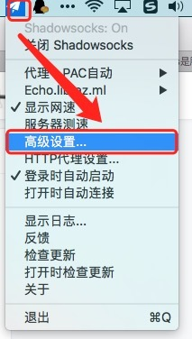
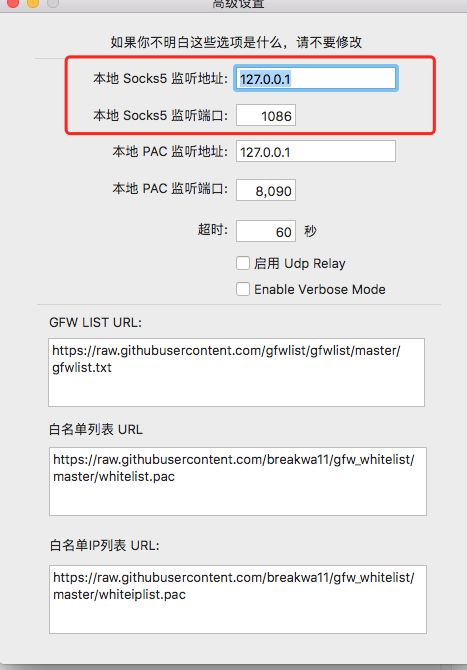

# git

## 常见问题

### git clone 或 push 慢、卡住

1.首先查看自己 socks5 的端口号



2.我这里记下来是 127.0.0.1:1086



3.然后输入命令

```
git config --global http.https://github.com.proxy socks5://127.0.0.1:1086
git config --global https.https://github.com.proxy socks5://127.0.0.1:1086
```

> [参考链接](https://www.zhihu.com/question/27159393/answer/141047266)

**另外对于 http 代理**

只对 github 进行代理，对国内的仓库不影响。

```
git config --global http.https://github.com.proxy https://127.0.0.1:1080
git config --global https.https://github.com.proxy https://127.0.0.1:1080
```

同时，如果在输入这条命令之前，已经输入全局代理的话，可以输入进行取消

```
git config --global --unset http.proxy
git config --global --unset https.proxy
```
