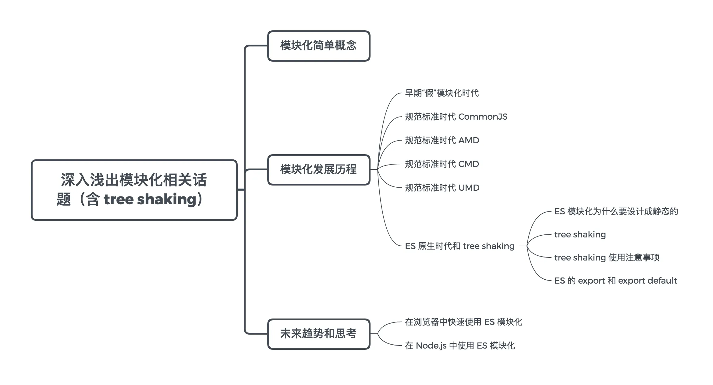

# 模块化

工程化的核心基础是模块化和 Node.js。



## 什么是模块化

模块化是将功能拆分成一个个代码模块，每个模块可以导出和导入。

模块化的优点是：可复用、可组合、独立性。

## 为什么需要模块化

随着项目越来越复杂，代码越来越多，代码的维护越来越复杂。

- 代码之间关系依赖
- 代码阅读

## 发展历史

### 早期

早期一般通过函数、对象或 IIFE 的方式来实现模块化。

```js
// 函数: 调用混乱、命名冲突
function f1(){
   //...
}
function f2(){
   //...
}

// 对象: 封装性不好，外部可以修改值
const module1 = {
   foo: 'bar',
   f11: function f11 () { //... },
   f12: function f12 () { //... },
}

const module2 = {
   data: 'data',
   f21: function f21 () { //... },
   f22: function f22 () { //... },
}

//IIFE
const module = (function(){
   var foo = 'bar'
   var fn1 = function (){
       // ...
   }
   var fn2 = function fn2(){
       // ...
   }
   return {
       fn1: fn1,
       fn2: fn2
   }
})()

// IIFE 进阶：如果需要依赖其它模块，可以把模块传入进去
(function(window, $) {
   var data = 'data'

   function foo() {
       console.log(`foo executing, data is ${data}`)
   }
   function bar() {
       data = 'modified data'
       console.log(`bar executing, data is now ${data} `)
   }
   window.module1 = { foo, bar }
})(window, $)
```

### 规范模块化时代 CommonJS

Node.js 带来了 CommonJS 模块化规范，它规定:

- 每个文件就是一个模块。
- 模块加载后会被缓存，下次重新加载会读取缓存。
- 可以通过 module.exports 导出模块，通过 require 导入模块。
- module.exports 输出的是值的拷贝，如果输出的是引用类型，则是输出的引用。

但是 CommonJS 是同步的，它在 Node.js 上是很好的，但是在浏览器上需要异步才行。

### 规范标准时代 AMD

由于 Node.js 运行于服务器上，所有的文件一般都已经存在了本地硬盘中，不需要额外的网络请求去异步加载，因而 CommonJS 规范加载模块是同步的。只有加载完成，才执行后续操作。但是，如果放在浏览器环境中，我们都需要从服务器端获取模块文件，此时再采用同步的方式，显然就不合适了。这时候，社区上推出了 AMD 规范。

AMD 规范，全称为：Asynchronous Module Definition。它的代表是 `require.js`。

它通过 define(id, dependecies, fn) 方法定义模块，通过 require() 方法引用模块。

define 和 require 是 require.js 全局注入的函数。

require() 方法会创建 script 标签，加载 js 文件，然后插入到 head 中，而且会在插入后，将 dom 移除掉，所以在页面上看不到 script 标签。

### 规范标准时代 CMD

CMD 规范整合了 CommonJS 和 AMD 规范的特点。它的全称为：Common Module Definition，类似 require.js，CMD 规范的实现为 sea.js。

AMD 和 CMD 的两个主要区别如下。

- AMD 需要异步加载模块，而 CMD 在 require 依赖的时候，可以通过同步的形式（require），也可以通过异步的形式（require.async）。
- CMD 遵循依赖就近原则，AMD 遵循依赖前置原则。也就是说，在 AMD 中，我们需要把模块所需要的依赖都提前在依赖数组中声明。而在 CMD 中，我们只需要在具体代码逻辑内，使用依赖前，把依赖的模块 require 进来。

## 规范标准时代 UMD

UMD 全称：Universal Module Definition。它兼容了各种模块化规范。

该模式的核心思想在于利用立即执行函数根据环境来判断需要的参数类别。

- 如果是 AMD 规范，就调用 define()
- 如果是 CommonJS 规范，就调用 module.exports
- 如果是浏览器环境，就

```js
(function (root, factory) {
  if (typeof define === "function" && define.amd) {
    // AMD
    define(["jquery", "underscore"], factory);
  } else if (typeof module === 'object' && module.exports) {
    // Node, CommonJS之类的
    module.exports = factory(require("jquery"), require("underscore"));
  } else {
    // 浏览器全局变量(root 即 window)
    root.returnExports = factory(root.jQuery, root._);
  }
})(this, function ($, _) {
  //    方法
  function a() {} //    私有方法，因为它没被返回 (见下面)
  function b() {} //    公共方法，因为被返回了
  function c() {} //    公共方法，因为被返回了

  //    暴露公共方法
  return { b: b, c: c };
});
```

## ESM原生模块化规范

ES 模块的设计思想是尽量**静态化**，这样可以保证在编译时就确定模块之间的依赖关系，每个模块的输入和输出变量也是确定的。

ES 模块和 CommonJS 等模块规范的区别是：

- CommonJS 和 AMD 模块，无法保证前置即确定这些内容，只能在运行时确定。
- CommonJS 模块输出的是值的拷贝，而 ES 模块输出的是值的引用。

```js
// data.js
export let data = 'data'
export function modifyData() {
   data = 'modified data'
}

// index.js
import { data, modifyData } from './lib'
console.log(data) // data
modifyData()
console.log(data) // modified data
```

**为什么要静态化**

优势：通过静态分析，可以分析出导入的依赖，如果导入的模块没有被使用，就可以通过 tree shaking 减少代码提及，进而提高运行性能。

ES 模块化的静态性带来的的限制:

- 只能在文件顶部 import 依赖
- export 导出的变量类型限制
- 变量不允许被重新绑定，import 的模块名不能是变量，只能是字符串常量

这样的限制带来的便利是：可以通过作用域分析出代码里变量所属的作用域以及它们之间的引用关系。进而推导出变量和导入依赖变量的引用关系。在没有明显引用时，就可以进行去冗余。

## tree shaking

去除无用代码的常见手段是 DCE：

- DCE: dead code elimination(死代码消除)，先打包，再去除无用代码。
- tree shaking: 先去处无用代码，再打包。算是 DCE 的一种新的实现方式。

减少使用 export default，它会导出整体对象结果，不利于 tree shaking 分析，另外 export default 导出的结果可以随意命名，不利于团队统一管理。

tree shaking 是 rollup 首先提出的。

### 如何在浏览器和 Node.js 中使用 ES 模块化

- 浏览器: script 增加 `type="module"` 属性
- Node.js: 在 package.json 中增加 `type: "module"` 字段


https://mp.weixin.qq.com/s/SbJNbSVzSPSKBe2YStn2Zw
