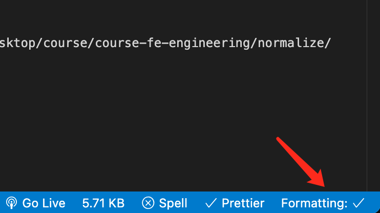

# 规范化标准

## 哪些需要规范化

- 代码检查: 如变量没使用等
- 代码风格
  - 代码：js、ts、css 等
  - 文档
  - 提交日志

## 实施

- 人为的标准约定
- 通过工具实施 Lint

## 常见规范化实现方式

- eslint 使用，定制 eslint 规则
- eslint 对 ts 的支持
- eslint 结合自动化工具或 webpack
- 基于 eslint 的衍生工具
- stylelint 的使用

```sh
banli@mac normalize % npx eslint --init
You can also run this command directly using 'npm init @eslint/config'.
npx: 40 安装成功，用时 5.29 秒
✔ How would you like to use ESLint? · problems
✔ What type of modules does your project use? · esm
✔ Which framework does your project use? · none
✔ Does your project use TypeScript? · No / Yes
✔ Where does your code run? · browser
✔ What format do you want your config file to be in? · JavaScript
A config file was generated, but the config file itself may not follow your linting rules.
Successfully created .eslintrc.js file in /Users/banli/Desktop/course/course-fe-engineering/normalize
```

## eslint 配置

eslint 配置注释

如果某行代码需要设置 eslint 不检测，可以增加 `eslint-disable-line`，还可以在后面加上专门的某个特性，用来不检测这个特性。

```js
const a = 1; // eslint-disable-line no-unused-vars
```

```js
// 结合 gulp 使用
.pipe(plugins.eslint.format())
.pipe(plugins.eslint.failAfterError())
```

```js
// 结合 webpack 使用
// eslint eslint-loader
{
  module: {
    rules: [
      {
        test: /\.js$/,
        exclude: /node_modules/,
        use: "babel-loader",
      },
      {
        test: /\.js$/,
        exclude: /node_modules/,
        use: "eslint-loader",
        enforce: "pre",
      },
    ];
  }
}
```

兼容 jsx，需要安装 `eslint-plugin-react`，然后在 plugins 里配置。

```js
{
  plugins: ["react"];
}
```

一般插件里都提供了 eslint 配置。上面的插件提供了 `recommended` 配置。

```js
{
  extends: ["eslint:recommended", "plugin:react/recommended"],
}
```

检查 typescript，之前是使用 ts-lint，后来 ts-lint 官方建议使用 eslint + ts 插件。

```js
{
  env: {
    browser: true,
    es2020: true
  },
  extends: ['standard'],
  parser: "@typescript-eslint/parser",
  parserOptions: {
    ecmaVersion: 11
  },
  plugins: [
    "@typescript-eslint"
  ]
}
```

## stylelint

- 提供默认的代码检查规则。
- 提供 cli 工具，快速调用。
- 通过插件支持 Sass Less PostCss。
- 支持 gulp 和 webpack 集成。

1、 安装

```sh
npm i stylelint stylelint-config-standard stylelint-config-sass-guidelines -D
```

2、新建配置文件 `.stylelintrc.js`

```js
module.exports = {
  extends: ["stylelint-config-standard", "stylelint-config-sass-guidelines"],
};
```

3、执行检查

```
npx stylelint ./src/*.scss
```

## Prettier

代码格式化工具。

1、安装

```
npm i prettier -D
```

2、执行脚本

```
npx prettier style.css // 会返回格式化后的代码
npx prettier . --write // 会将文件格式化后写入
```

## git hooks

每个 [git 钩子](https://git-scm.com/book/en/v2/Customizing-Git-Git-Hooks#_git_hooks) 都对应一个任务。可以在钩子里执行一些脚本。

```sh
applypatch-msg.sample       pre-push.sample
commit-msg.sample           pre-rebase.sample
post-update.sample          prepare-commit-msg.sample
pre-applypatch.sample       update.sample
pre-commit.sample
```

钩子文件是 `.git/hooks` 目录下的 shell 脚本。因为很多人不熟悉 shell 脚本。所以有人开发了 husky。

[husky](https://github.com/typicode/husky) 可以实现 git hooks 的使用需求，可以在 package.json 里配置。

1、安装 husky

2、初始化钩子，在 package.json 中设置 prepare scripts，并执行 `npm run prepare`。prepare 钩子会在 npm i 时执行。

```json
{
  "scripts": {
    "prepare": "husky install"
  }
}
```

3、在 package.json 中新增钩子任务。

```json
{
  "husky": {
    "hooks": {
      "pre-commit": "npm run eslint"
    }
  }
}
```

https://www.ruanyifeng.com/blog/2016/10/npm_scripts.html

**lint-staged**

lint-staget 可以在 git 暂存文件上运行 linter。

> 所有文件的 lint 是很慢的，而且 lint 的结果可能不重要。`lint-staged` 可以对提交的内容进行 lint，可以对 glob 模式指定的文件运行 shell 任务。

使用步骤：

1、安装。

```sh
npm i lint-staged -D
```

2、使用 husky 设置 pre-commit 以运行 lint-staged。

3、安装一些 lint，如 eslint 或 prettier。

4、配置 lint 任务。

```json
{
  "lint-staged": {
    "*.js": ["eslint --fix", "git add"]
    // "*.{js,jsx}": "eslint"
    // prettier使用JavaScript、TypeScript、Markdown、HTML 或 CSS自动修复代码样式
    // "*.{js,jsx,ts,tsx,md,html,css}": "prettier --write"

    // 压缩图像
    // "*.{png,jpeg,jpg,gif,svg}": "imagemin-lint-staged"
  }
}
```

## 其它插件

- `eslint-config-prettier`: 关闭所有不必要或可能与 Prettier 冲突的规则。此配置仅关闭规则，因此仅将其与其他配置一起使用才有意义。确保把它放在 extends 配置的最后，这样它就有机会覆盖其他配置。
- `eslint-plugin-prettier`: 将 prettier 作为 eslint 插件使用。该插件提供了一个 `plugin:prettier/recommended` 配置，将它设置为 extends 即可，它实际上扩展了 eslint-config-prettier，关闭了两个与 eslint 冲突的箭头函数相关选项。

```
{
  "extends": ["prettier"],
  "plugins": ["prettier"],
  "rules": {
    "prettier/prettier": "error",
    "arrow-body-style": "off", // 要求箭头函数使用大括号 {}
    "prefer-arrow-callback": "off" // 要求使用箭头函数作为回调
  }
}
```

## vscode eslint 自动格式化

1、设置 vscode 的配置项。

```js
"editor.formatOnSave": true,
"editor.codeActionsOnSave": {
    "source.fixAll.eslint": true
},
"eslint.format.enable": true,
```

2、有时候会误将右下角的 editor.formatOnSave 关闭掉，检查下是否勾上。




mac 下 vscode 更新时提示：Could not create temporary directory: 权限被拒绝

```sh
sudo chown $USER ~/Library/Caches/com.microsoft.VSCode.ShipIt/
```

执行上面命令后，重启 vscode。
