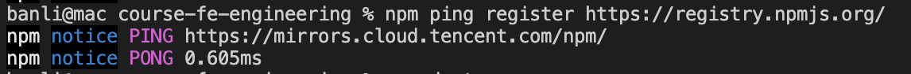
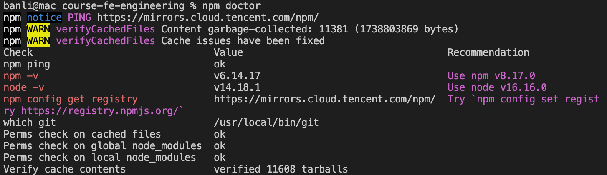
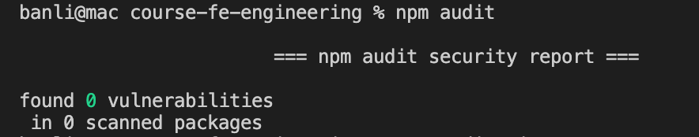

# npm

## 常用命令

### 检查类

- `npm ping`: 看 regiter 是否能 ping 通



- `npm doctor`: 运行一组检查，将检查
  - nodejs 和 git 可执行
  - npm 注册表服务可用
  - npm 使用的目录存在，且可写入
  - npm 缓存存在，且压缩包未损坏



- `npm audit`: 审核校验依赖包安全性，可以加参数  `fix` 自动升级易受攻击的依赖项。



## 账户管理

**创建账户**

1、在 [npm 注册页面](https://www.npmjs.com/signup) 注册
2、在命令行输入下面命令，测试登陆

```sh
# 登陆
npm login

# 登陆后，查看用户名
npm whoaim
```

**修改账户**

目前无法更改 npm 用户名。您需要创建一个新帐户，然后手动将数据迁移到新帐户。

**删除账户**

[删除 npm 用户帐户](https://docs.npmjs.com/deleting-your-npm-user-account)


## npm install

npm install 会先检查 node_modules 目录中是否存在指定模块，如果存在，则不会重新安装，即使远程仓库有新版本。

可以使用 -f 或 --force 强制重新安装。

- `npm install <packageName> --force`
- `npm update <packageName>` 会先查询远程仓库最新版本，如果本地版本不存在或远程版本较新，则会安装。

npm install -g 过程：

1. 包安装在 `{prefix}/node_modules` 下
2. 在全局命令`{prefix}/bin`下生成映射，指向`{prefix}/lib`下真实文件。

## register

如何查询远程仓库的最新版本？ npm 提供了模块的查询服务叫 registry。

如:

```
https://registry.npmjs.org/react
https://registry.npmjs.org/react/v0.14.6
```

会获取到 react 包所有版本信息。和 npm view 一样。

npm view 默认打印包的 latest 版本信息。

```
npm view react

# npm view 的别名
npm info react
npm show react
npm v react
```


npm install 和 npm update 都是通过 registry 查询，然后根据 dist.tarball 下载压缩包，存放到缓存目录 ~/.npm，解压到 node_modules 目录。

下载的压缩包放在缓存目录里。 mac 放在用户的 .npm 目录; windows 默认是 %AppData%/npm-cache

可以通过 npm config get cache 命令获取缓存目录。

npm 缓存基于 cacache 模块，所有缓存的数据在插入和取出时都会进行完整性验证，如果损坏会触发错误，删除并重新获取。所以缓存总是可用的无清除，而 clean 现在需要 --force。

```
npm cache verify 验证缓存
```

maintainers: 维护者

https://juejin.cn/post/6844903582337237006#heading-6
https://dev.to/shree_j/how-npm-works-internally-4012
https://docs.npmjs.com/cli/v7/configuring-npm/npmrc

## npm link

在包中 `npm link`

1. 它会在 `{prefix}/lib/node_modules` 创建快捷方式，指向 npm link 的目录。
2. 将所有 bin 命令链接到 `{prefix}/bin/{name}`。

执行 `npm link package-name` 会在当前包 node_modules 中创建全局包 package-name 的快捷方式。

```
{
  "bin": {
    "v": "./bin/v.js"
  }
}
```

1. 获取 auth 字符串, 命令行输入下面命令

```
echo -n 'username:password' | openssl base64
```


2. 项目下新建 .npmrc 文件

```
registry=https://registry.npm.taobao.org/
_auth=aGV5dWhhbzpBSEhxxxxx(这个换一下)
always-auth=true
```

3. 就可以 npm i 了
   https://stackoverflow.com/questions/35043155/how-should-i-set-auth-in-npmrc-when-using-a-nexus-https-npm-registry-proxy

https://stackoverflow.com/questions/64813775/is-there-any-way-to-fix-package-lock-json-lockfileversion-so-npm-uses-a-specific

## 版本

dependencies "@uino/cli-thing-service": "^1.0.32-beta.10" 在 npm i 时，还是会安装 32 版本。

版本大小比较 1.0.0.alpha1 < 1.0.0.beta1 < 1.0.0.beta2 < 1.0.0.rc1 < 1.0.0.

- https://zhuanlan.zhihu.com/p/66039729
- https://docs.npmjs.com/about-semantic-versioning
- https://semver.org/lang/zh-CN/
- https://semver.npmjs.com/
  

^指明的版本范围，只要不修改 [major, minor, patch] 三元组中，最左侧的第一个非 0 位，都是可以的。也就是说，要确定 ^版本包含的范围，先要找到 最左侧的第一个非 0 位 ，只有在这一位右侧的变动，才被包含在这个 ^ 指定的范围内。举个 ：

^1.2.3 版本包括：>= 1.2.3 并且 < 2.0.0
^0.2.3 版本包括：>= 0.2.3 并且 < 0.3.0
^0.0.3 版本包括：>= 0.0.3 并且 < 0.0.4

```
npm i -g semver

semver -r ^0.12.0 0.12.0 0.12.1 0.12.10 0.13.0 0.13.1
0.12.0
0.12.1
0.12.10

semver -r ^0.0.3 0.0.31 0.0.4
无

semver -r ^4.1.0-beta.83 4.1.1-beta.1
无
```
