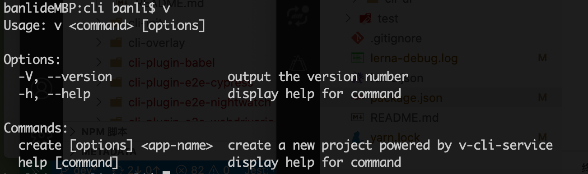
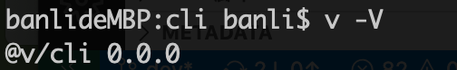

# 抄写命令入口 bin/vue.js 文件

本文将分析`@vue/cli/bin/vue.js`的代码，抄一个 [@v/cli/bin/v.js](../packages/@v/cli/bin/v.js) 文件。

## 检查 node 版本

1. 在 package.json 里定义要求的 node 版本。

```
"engines": {
    "node": "^12.0.0 || >= 14.0.0"
}
```

2. 使用 semver 库检查

```js
function checkNodeVersion(wanted, id) {
  if ( // satisfies 满足
    !semver.satisfies(process.version, wanted, { includePrerelease: true, })
  ) {
    console.log(
      chalk.red(
        `You are using Node ${process.version}, but this version of ${id} requires Node ${wanted} .\nPlease upgrade your Node version.`
      )
    );
    process.exit(1);
  }
}
```

semver 的含义和用法。

- [语义化版本控制规范](https://semver.org/lang/zh-CN/)
- [node-semver](https://github.com/npm/node-semver)

## 开启 debug 模式

在 `/packages/test` 目录下或其子目录下运行 v 命令会开启 DEBUG 模式。

```js
const fs = require('fs')
const path = require('path')
const slash = require('slash')
const minimist = require('minimist')

if (
    slash(process.cwd()).indexOf('/packages/test') > 0 && (
        fs.existsSync(path.resolve(process.cwd(), '../@v')) ||
        fs.existsSync(path.resolve(process.cwd(), '../../@v'))
    )
) {
    process.env.VUE_CLI_DEBUG = true
}
```

- [slash](https://github.com/sindresorhus/slash): 将 windows 路径的 `\\`转成 `/`。
- [minimist](https://github.com/substack/minimist): 用来解析命令行参数的库

## 开始写命令和选项

- [commander](): 可以设置命令和选项

### 添加命令行用法和帮助

```js
// v --version
program.version(`@v/cli ${require('../package').version}`)
    // 给 v 命令添加使用方法，在命令行敲 v 回车提示
    .usage('<command> [options]')
```

上面代码，实现了在命令行执行 v 命令时输出 Usage 信息:



以及查看版本信息命令。



### v create 命令

接着开始写 `v create` 命令。

```js
program
    .command('create <app-name>')  // < > 表示必选参数
    .description('create a new project powered by v-cli-service')
    // 使用预设的配置
    .option('-p', '--preset <presetName>', 'Skip prompt and use saved or remote preset')
    // 使用默认的预设
    .option('-d, --default', 'Skit prompts and use default preset')
    // 使用行内 json 预设
    .option('-i, --inlinePreset <json>', 'Skip prompts and use inline JSON string as preset')
    // 安装依赖时，使用此 npm registry 地址，只针对 npm
    .option('-r, --registry <url>', 'Use specified npm registry when installing dependencies (only for npm)')
    // 强制使用初始化信息对 git 初始化
    .option('-g, --git [message]', 'Force git initialization with initial commit message')
    // 跳过 git 初始化
    .option('-n, --no-git', 'Skip git initialization')
    // 如果目录存在，会强制覆盖
    .option('-f, --force', 'Overwrite target directory if it exists')
    // 如果目录存在，会合并目录
    .option('--merge', 'Merge target directory if it exists')
    // 当使用远程预设时，用 git clone 拉取
    .option('-c, --clone', 'Use git clone when fetching remote preset')
    // 创建项目时使用代理
    .option('-x, --proxy <proxyUrl>', 'Use specified proxy when creating project')
    // bare 光秃秃的，无初学者指导的脚手架工程
    .option('-b, --bare', 'Scaffold project without beginner instructions')
    // 跳过 Get started 介绍
    .option('--skipGetStarted', 'Skip displaying "Get started" instructions')
```

可以看到 vue create 有很多配置，用法如下：

```
vue create app-name 
vue create app-name -px
vue create app-name --preset preset_name
```

linux 命令的格式一般是:

```
command [option] [paraments]
```

对于 option，有两种类型：

- `-` 短选项，由一个连字符和一个字母组成，可以组合使用，如 `ls -ah`
- `--` 长选项，由两个连字符和单词组成

设置了 vue create 命令的选项后，就要编写解析的方法了。

```js
.action((name, options) => {
    // 1. vue create x y 提示只有第一个参数会当作 app 名称，后面的将忽略
    if (minimist(process.argv.slice(3))._.length > 1) {
        console.log(chalk.yellow('\n Info: You provided more than one argument. The first one will be used as the app\'s name, this rest are ignored'))
    }

    // 2. 如果带 -g 或 --git，就设 forceGit 为 true 
    if (process.argv.includes('-g') || process.argv.includes('--git')) {
        options.forceGit = true
    }

    // 3. 真正解析 vue create 命令
    require('../lib/create')(name, options)
})
```

1. vue create x y 提示只有第一个参数会当作 app 名称，后面的将忽略
2. 如果带 -g 或 --git，就设 forceGit 为 true 
3. 真正解析 vue create 命令

## 其它命令

上面的 v create 就是一个模版，先编写命令格式，再编写命令如何解析。

用同样的方式实现了下面几个命令

- v add
- v invoke
- v inspect
- v serve
- v build
- v ui
- v init 用远程模版创建项目
- v config
- v outdated 查看过期的服务插件
- v upgrade 升级插件
- v migrate 实验性的，迁移一个已经安装的插件
- v info 查看环境信息


然后是监听未知的命令：

```js
program.on('command:*', ([cmd]) => {
  // 只展示帮助信息，不退出程序
  program.outputHelp()
  console.log(`  ` + chalk.red(`Unknown command ${chalk.yellow(cmd)}.`))
  console.log() // 换行，貌似只 node 里有用，浏览器里报错
  suggestCommands(cmd)
  process.exitCode = 1
})
```

suggestCommands 方法会提示可能的命令。比如有可能是将`v create`输错成`v creat`了，这样会提示。

```js
function suggestCommands(unknownCommand) {
  const availableCommands = program.commands.map(cmd => cmd._name)

  let suggestion

  availableCommands.forEach(cmd => {
    const isBestMatch = leven(cmd, unknownCommand) < leven(suggestion || '', unknownCommand)
    if (leven(cmd, unknownCommand) < 3 && isBestMatch) {
      suggestion = cmd
    }
  })

  if (suggestion) {
    console.log(`  ` + chalk.red(`Did you mean ${chalk.yellow(suggestion)}?`))
  }
}
```

这里因为要实现一个字符串最佳匹配算法，所以用到了 leven 包。

1. 在可执行命令中找与敲入命令差异最小
2. 差异小于 3 个字符

### v help

commander 实现了默认的 --help 命令，如果想在打印信息后面添加额外信息，可以使用下面方法：

```js
program.on('--help', () => {
  console.log()
  console.log(`  Run ${chalk.cyan(`v <command> --help`)} for detailed usage of given command.`)
  console.log()
})
```

可以看到是增加了一个 `v <command> --help` 命令。


然后给所有的命令的 --help 后面加了一空行。

```js
// 这里的 --help 不能用 -h
program.commands.forEach(c => c.on('--help', () => console.log()))
```

## 扩展错误信息

为了在 commander 打印的信息后面添加一些额外信息（如缺失参数、未知选项），可以修改它的原型方法。


```js
const enhanceErrorMessages = require('../lib/util/enhanceErrorMessages')

enhanceErrorMessages('missingArgument', argName => {
  return `Missing required argument ${chalk.yellow(`<${argName}>`)}.`
})

enhanceErrorMessages('unknownOption', optionName => {
  return `Unknown option ${chalk.yellow(optionName)}.`
})

enhanceErrorMessages('optionMissingArgument', (option, flag) => {
  return `Missing required argument for option ${chalk.yellow(option.flags)}` + (
    flag ? `, got ${chalk.yellow(flag)}` : ``
  )
})
```

```js
const program = require('commander')
const { chalk } = require('@vue/cli-shared-utils')

module.exports = (methodName, log) => {
  program.Command.prototype[methodName] = function (...args) {
    // 如果允许未知选项
    if (methodName === 'unknownOption' && this._allowUnknownOption) {
      return
    }
    this.outputHelp()
    console.log(`  ` + chalk.red(log(...args)))
    console.log()
    process.exit(1)
  }
}
```

可以看到它是改写了 program.Command.prototype 下的对应方法。

## 最后是启动解析参数

```js
program.parse(process.argv)
```

到这里，主入口文件就抄写完成了。