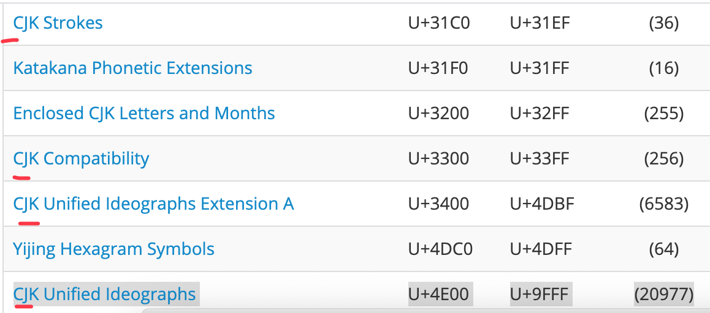

# js 词法、类型

unicode 编码

a 97
A 65

(unicode blocks)[http://www.fileformat.info/info/unicode/block/index.htm]
写个正则，匹配所有的 Number
写一个 utf8_encoding

```
U+000A	LINE FEED (LF) 换行，打字机的纸前进一行
U+0007   "\u0007"  BELL 响一声、即命令行会报警
U+000D  CR CARRiage Return 回车。 打字机指针回到行首
U+0020  SPACE (U+0020) 空格

// 正则判断中文 [\u4e00-\u9fa5] 实际不太准确，因为 CJK 很分散，如下图所示
// CJK 即 china japen koren 中日韩 文
CJK Unified Ideographs	U+4E00	U+9FFF	(20977)
```



BMP 基本字符平面 group 0 的 plane 0 被称作 `Basic Multilingual Plane`, 即 BMP

js 可以很好处理 BMP 内的字符。如果超出就需要 codePointAt 等 API。
http://www.fmddlmyy.cn/text6.html
最早版本的 unicode 所允许的值是 U+0000 to U+FFFF
后来 unicode 扩充了，取值范围变成了 U+0000 to U+10FFFF .
原先的
U+0000 to U+FFFF 这个集合就称作 BMP (Basic Multilingual Plane)

```js
var 厉 = 1; // 文件里放中文可能会导致问题
// 可以用 \u 转义，即 unicode 码的 16进制
// "厉".charCodeAt(0).toString(16);
//"5389";
var \5389 = 1;
```

Punctuator： 标点符号

js 词法

```
// js 文件的输入组成
InputElement
    WhiteSpace 空白符
        TAB U+0009 制表符 \t，在做表格时方便对齐。一般是4个字符,不足4个补足4个，如下，数字会自动对齐
            100 10
            20  33
            3   9
        VT U+0011 纵向制表符 \v
        FF  \f
        SP: U+0020 space
        NBSP: none break space，非断开空格 如果 hello&nbsp;world 这样空间不足时，这两个词总在一起，如下图
        ZWNBSP: zero-width no-break space 零宽非断开空格 0xFEFF 是一个实际不存在的字符，用于判断文本字节流是大端还是小端（BOM：bit order mark 比特序，解析文本的规则）
    LineTerminator  换行符(编辑器会自动处理)
        U+000A LF(line feed) 换行 \n
        U+000D CR(carriage return) 回车 \r
    Comment  注释
    Token
        早期分类
            (用于帮助形成结构)
            Punctuator 标点符号，包括 {}.;+-*/等等
            Keywords 关键字
            (自己写的有效信息)
            IdentifierName 标识符(词法扫描时都当作IdentifierName，语法解析时会尝试解析)
                变量名(不能和关键字重合)
                属性名(可以和关键字重合)  早期 div class 不能用，要 className，现在可以当属性了 div.class = xx 了。
            Literal 直接量(如 true null 等)
        目前分类
            Punctuator
            IdentifierName
                Keywords
                Identifier
                Future reserved Keywords: enum 将来可能用的关键字
            Literal 直接量(如 true null 等)
                Number
                    - IEEE754 Double Float
                        - Sign(1)
                        - Exponent(11)
                        - Fraction(52)
                    - DecimalLiteral 小数写法可以如下
                        - 0
                        - 0.
                        - .2
                        - 1e3 或 1E3
                    - BinaryInteralLiteral 2进制，parseInt("100", 2) -> 4
                        - 0b011 -> 3
                    - OctalInteralLiteral 8进制
                        - 0o10 -> 8
                    - HexInteralLiteral 16进制
                        - 0x111 -> 273
                String
                    编码
                        - ASCII
                        - Unicode，编码方式有
                            - UTF8 动长的，如果前面有几个1会用于表示占了几个字节
                            - UTF16 一个字用2个字节(js)，因为BMP之外字符用的太少
                                - charAt API
                                - codePointAt 系列API
                            - UTF32 只是理论上，太占内存
                        - UCS 就是 Unicode BMP 范围 U+0000 - U+FFFF
                        - GB 收录了 ASCII 加大部分中文
                            - GB2312
                            - GBK(GB13000)
                            - BG18030
                        - ISO-8859 收录了 ASCII 加欧洲字符
                        - BIG5 台湾，繁体中文
                    语法
                        - ''
                            - SourceCharacter but not one of " or \ or LineTerminator
                            - \ EscapeSequence
                            - LineContinuation
                        - ""
                        - `` 如 hello ${name}, let's go ${address} 会被引擎解析为 5个部分 hello ${ + name +  }, let's go ${ + address + }
                Boolean
                    - true
                    - false
                Object
                Null
                Undefiend
                Symbol
```

undefined 不是关键字，只是个不能修改的全局变量。

关于 nbsp。


```
'\t'.codePointAt(0)
9
```

```
word-break: break-all;  // 如下图，hello被断开了
word-break: break-word;  //默认，是按照每个词来断开的，单个词没有被断开
```


https://www.cnblogs.com/yanze/p/9922894.html
https://www.cnblogs.com/winter-cn/archive/2012/04/17/2454229.html

练习：

1. 写一个符合所有数字的正则。

Number 最佳实践

- Safe Integer
  - Number.MAX_SAFE_INTEGER.toString(16) 即 9 千万亿 "1fffffffffffff"(9007199254740991)
- Float Compare 浮点数比较的方法
  - Math.abs(0.1 + 0.2 - 0.3) < `Number.EPSILON * 4`
  - 转成整数

Number.EPSILON 是 JavaScript 的最小精度

```
Number.EPSILON == Math.pow(2, -52);
true
```

在实际中，需要设置一个自己的最小精度。

```js
// error
1.1 + 1.3 - 2.4 < Number.EPSILON;
false;

// ok
1.1 + 1.3 - 2.4 < Number.EPSILON * Math.pow(2, 2);

//或者
function toFloatFixed(x, j = 10) {
  return parseFloat(x.toFixed(j));
}
toFloatFixed(1.1 + 1.3 === 2.4);
```

```
9.toString() 报错，词法问题，解析成了小数
9 .toString() 正确
```

```
'你好\
      哈哈\
      太好了'.charAt(6)  // " "
"你好      哈哈      太好了"
// 会全部转换为空格
```

2. 写一个满足字符串的正则


关于正则表达式直接量

```
// 下面会被当作除法，能当除号就是除号，否则就是正则
var a ;
a   // 这里没有插入分号
/a/ g;
```

IEEE754 隐藏了个 1(小数部分始终是正)。

> 写个 js ，浮点数转成二进制。 [https://jsfiddle.net/pLh8qeor/19/](https://jsfiddle.net/pLh8qeor/19/)


检查+0，-0

```js
function check(zero) {
  let a = 1 / zero;
  if (a === Infinity) {
    return "+0";
  } else if (a === -Infinity) {
    return "-0";
  }
}
```

取符号位，是 0 还是 1

```
Infinity/Infinity -> NaN
0/0 -> Infinity
-0/0 -> NaN
```
