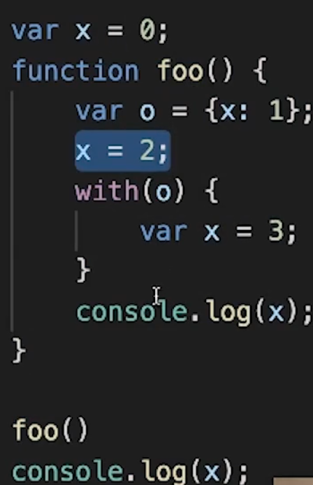

# js 语句对象

- block
  - BlockStatement

```
{

}
```

Iteration

- while
- do while
- for(;;)
- for(key in obj)
- for(v of array) 循环可迭代对象

label

try

- `[[type]]`: return
- `[[value]]`: --
- `[[target]]`: label

```
try{

} catch(){

} finally{

}
```



