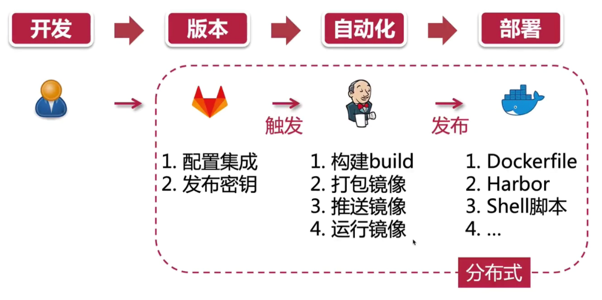
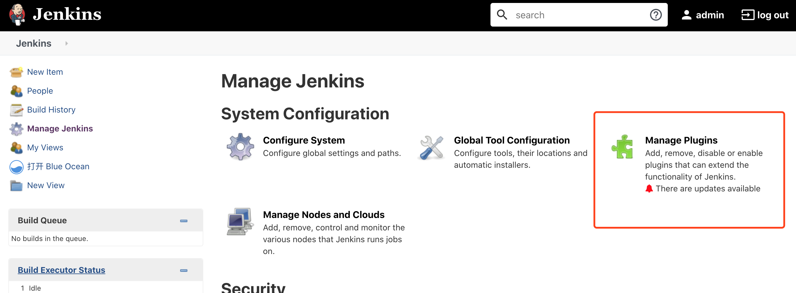

# 开发环境 Jenkins+Gogs

## Jenkins

java 写的，跨平台。

### yum 安装

yum 理论上最简单，但是我这安装一直失败。

```
yum install jenkins
```

yum 替换源(替换了我的还是一直安装失败)：

```
# 备份
mv /etc/yum.repos.d/CentOS-Base.repo /etc/yum.repos.d/CentOS-Base.repo.backup
# 更换阿里云源
wget -O /etc/yum.repos.d/CentOS-Base.repo http://mirrors.aliyun.com/repo/Centos-7.repo
# 清缓存
yum makecache
```

### RPM 安装(推荐)

1. 使用清华镜像

```
wget https://mirrors.tuna.tsinghua.edu.cn/jenkins/redhat-stable/jenkins-2.235.1-1.1.noarch.rpm
```

2. 在当前目录下，执行安装命令。

```
rpm -ivh jenkins-2.235.1-1.1.noarch.rpm
```

> 如果报错某些目录没有，则手动创建。

3. 软连接到环境目录下。

```
ln -s /etc/init.d/jenkins   /usr/local/bin/
```

4.  启动 jenkins 后，访问 url ： `http://ip:port:8080` 即可。

```
service jenkins start
```

### 常见报错

1. 安装后打开页面报错`No such plugin: cloudbees-folder`。

访问地址 `http://xx.xx.xx.xx:8080/restart`，进行重启一下。

### docker 安装

1. 首先安装 java。然后按照步骤 [https://www.jenkins.io/doc/book/installing/#on-macos-and-linux](https://www.jenkins.io/doc/book/installing/#on-macos-and-linux)进行安装。

2. 安装完成后，打开`http://xx.xx.xx.xx:8080`

3. docker 安装时，通过下面命令查看安装日志，里面有初始密码。

```
docker container logs jenkins-blueocean
```


docker-compose.yml



```sh
# 11005:8080 是端口映射，--name 指定名称 -itd 增加交互式终端并后台执行
docker run --name jenkins_m -itd -p 11005:8080 -p 50000:50000 jenkins/jenkins:lts

```

问题：

1. 有可能端口占用，就改端口
2. 名字已经有了，通过下面命令查看

```sh
docker ps | grep jenkins_m  # 查看正在运行的服务
docker ps -a | grep jenkins_m  # 查看全部的服务，包括停止的
docker ps -a  # 查看全部docker服务

# 删除的方法
docker stop jenkins_m
docker rm jenkins_m
```

## Gogs

防火墙开放

```sh
firewall-cmd --add-port=11005/tcp --permanent
firewall-cmd --reload
```

插件库


配置加速源：

**1. 在线情况下**

在 Plugin Manager -> Advanced -> [Update Site](http://192.168.25.201:8080/pluginManager/advanced) 里面输入镜像地址即可。

```
清华大学镜像：https://mirrors.tuna.tsinghua.edu.cn/jenkins/updates/update-center.json
jenkins官方：https://updates.jenkins.io/update-center.json
```

**2. 离线内网情况下**

在 [https://plugins.jenkins.io/](https://plugins.jenkins.io/)搜插件，右边有个 archives 按钮下载。

然后 Plugin Manager -> Advanced ->`Upload Plugin`。

### 常用插件

备份 docker 容器内的东西到宿主。

## 搭建 git Gogs

1. 首先安装 git

```sh
yum install git -y
```

2. 新建 git 用户，Gogs 默认以 git 用户运行，运行后，用户不能再通过 ssh 登录。

```sh
sudo adduser git
su git
mkdir ~/.ssh  # 用来生成密钥
```

3. 下载 gogs

```sh
wget https://dl.gogs.io/0.11.34/linux_amd64.zip

unzip linux_amd64.zip

cd gogs/

# 执行命令
./gogs web  # 默认运行在 3000 端口
```

4. 登录安装即可。

### 常见报错

1. 查看日志文件，报错 `Fail to initialize ORM engine: migrate: sync: dial tcp 127.0.0.1:3306: getsockopt: connection refused`

是数据库 mysql 启动失败，查看 mysql 状态并重启。

## 防火墙

1、开放端口

```sh
firewall-cmd --zone=public --add-port=5672/tcp --permanent # 开放 5672 端口

firewall-cmd --zone=public --remove-port=5672/tcp --permanent #关闭 5672 端口

firewall-cmd --reload # 配置立即生效
```

2、查看防火墙所有开放的端口

```
firewall-cmd --zone=public --list-ports
```

3.、关闭防火墙

如果要开放的端口太多，嫌麻烦，可以关闭防火墙，安全性自行评估

```
systemctl stop firewalld.service
```

4、查看防火墙状态

```
firewall-cmd --state
```

5、查看监听的端口

```sh
netstat -lnpt
```

> PS:centos7 默认没有 netstat 命令，需要安装 net-tools 工具，yum install -y net-tools

6、检查端口被哪个进程占用

```sh
netstat -lnpt |grep 5672
lsof -i:8080
```

7、查看进程的详细信息

```sh
ps pid
```

8、中止进程

```sh
kill -9 6832
```

fs-extra https://github.com/jprichardson/node-fs-extra/blob/HEAD/docs/outputFile.md

download
微信小程序实现类 3D 轮播图
https://blog.csdn.net/laishaojiang/article/details/82384233

pm2 启动模式 fork 和 cluster 的区别
https://segmentfault.com/q/1010000005972763/a-1020000006078840
https://pm2.keymetrics.io/docs/usage/application-declaration/

https://image.baidu.com/search/index?tn=baiduimage&ipn=r&ct=201326592&cl=2&lm=-1&st=-1&fm=result&fr=&sf=1&fmq=1593240735874_R&pv=&ic=&nc=1&z=0&hd=&latest=&copyright=&se=1&showtab=0&fb=0&width=&height=&face=0&istype=2&ie=utf-8&hs=2&sid=&word=%E7%86%8A%E7%8C%AB%E5%A4%B4
https://www.zhihu.com/question/276797767
