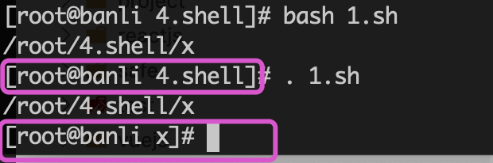

# Shell

## 什么是 Shell

Shell 是命令解释器，用于解释用户对操作系统的操作。

> Shell 相当于在 linux 内核外套一层壳，用来将用户的脚本解释为内核能识别的代码，执行完成后再反馈给用户。

Shell 有很多种，通过下面命令查看：

```
cat /etc/shells
```

CentOS 7 默认使用的 Shell 是 bash。

查看 shell 的帮助命令

- man bash: 查看 bash 的命令帮助
- info bash: 查看 bash 的文档
- help: 显示 bash 支持哪些命令，如果想查看某个命令的详细，可以使用如 `help if`

```
~]$ help
GNU bash, version 3.2.57(1)-release (x86_64-apple-darwin19)
...
enable [-pnds] [-a] [-f filename]  eval [arg ...]
exec [-cl] [-a name] file [redirec exit [n]
for NAME [in WORDS ... ;] do COMMA for (( exp1; exp2; exp3 )); do COM
...
```

## Linux 启动过程

- BIOS
- MBR
- BootLoader(grub)
- kernel
- systemd
- 系统初始化
- shell

## Shell 脚本的格式

- 以 `.sh`结尾
- 执行脚本`bash 1.sh`
- Sha-Bang，即第一行的`#!/bin/bash`
  - `bash 1.sh`这样执行，会当作注释
  - `./1.sh` 这样执行，会当作要用什么解释器执行
- 设置脚本可执行权限`chmod u+rx filename`
- 执行命令方式
  - `bash ./filename.sh`: 会创建一个子进程，来运行脚本
  - `./filename.sh` 需要赋予可执行 x 权限，会用 Sha-Bang 执行，也会创建新进程
  - `source ./filename.sh`: 在当前进程运行
  - `. filename.sh`: 在当前进程运行

上面执行命令的区别演示：

**1.sh**

```
#!/bin/bash
cd ./x
pwd
```

通过上面四种执行命令来执行脚本，前两种执行完成后，进程还是在当前目录。后两种执行完成后，进程就会处于 x 目录下了，如下图。



内建命令和外部命令的区别：

- 内建命令不需要创建子进程
- 内建命令对当前 Shell 生效

## 管道与重定向

- 管道与信号一样，也是进程通信的方式之一
- 管道用于连接应用程序，前一个数据会传递给后一个
- 匿名管道(管道符)是 Shell 编程经常用到的通信工具
- 管道符是`|`，将前一个命令的执行结果传递给后面的命令
  - `ps | cat | more`
  - `echo 123 | ps`

### echo

- 输出命令
- `--e` 支持反斜线控制的字符转换
  - `\n`: 换行符
  - `\r`: 回车键
  - `\t`: 制表符，也就是 Tab 键
  - `\v`: 垂直制表符
  - `\onnn`: 照八进制 ASCII 码表输出字符，其中 0 为数字零，nnn 是三位八进制数
  - `\xhh`: 按照十六进制 ASCII 码表输出字符，其中 hh 是两位十六进制数

sh -x 调试模式
