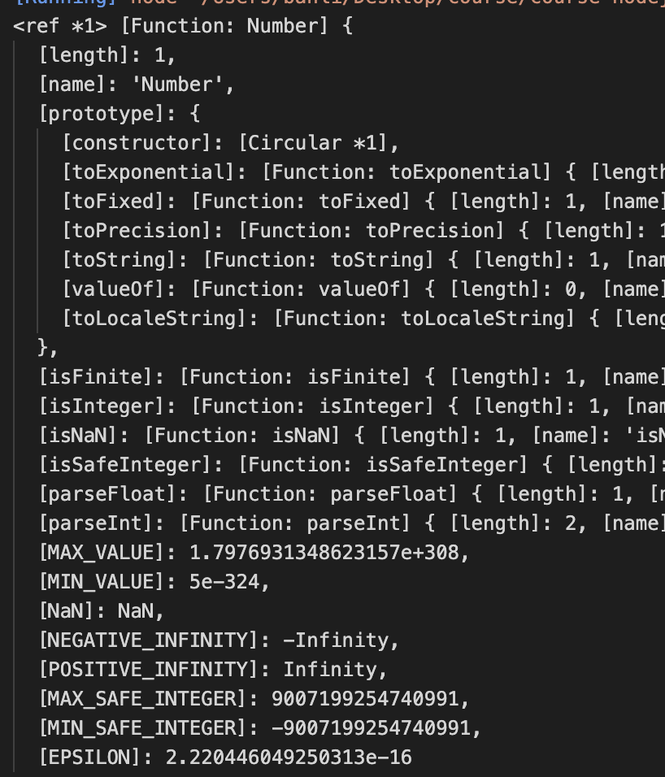
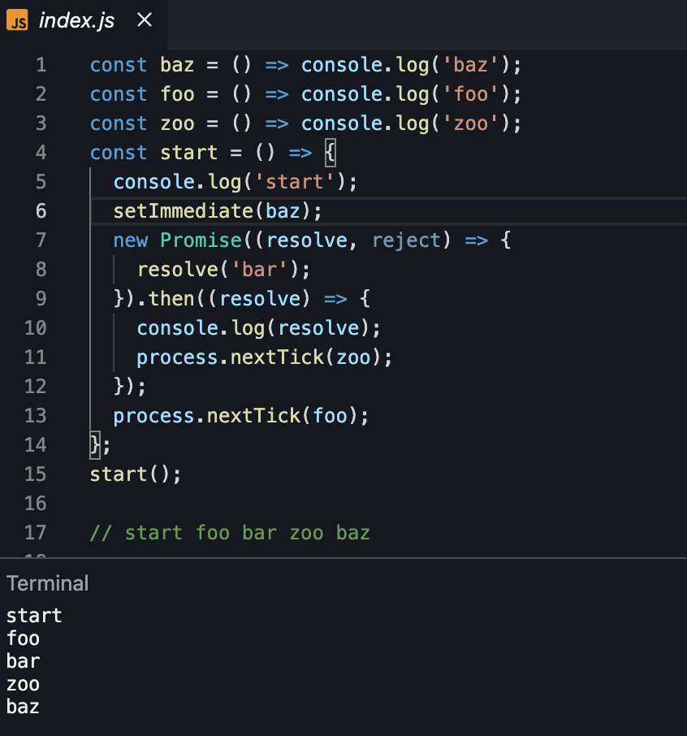

# NodeJs 简介

## 安装

- [https://nodejs.dev/download/](https://nodejs.dev/download/)
- [nvm](https://github.com/nvm-sh/nvm)

## 运行 nodejs

1、通过 node 命令

```
node app.js
```

2、通过 shebang，在 js 文件顶部增加:

```
#!/usr/bin/env node
```

然后，执行 `./app.js`，此时会提示需要权限，通过 `chmod u+x app.js` 解决。


## 自动重启 Node 程序

```sh
npm i -g nodemon

nodemon app.js
```

## 退出 Node 程序

1、前台运行情况下，可以通过 ctrl + c 结束

2、process.exit(code)，可以传 code，通常 code=1 表示正常结束

3、`process.exitCode = 1` 设置该属性后，程序结束时，会返回该退出码

4、可以通过向命令发送信号退出

```js
process.on('SIGTERM', () => {
  server.close()
})

process.kill(process.pid, 'SIGTER')
```

`SIGTERM` 表示优雅的退出，会等挂起或正在处理的请求处理完成再退出。

`SIGKILL`告诉进程立即终止，理想情况下，和 `process.exit()` 一样。

## 读取环境变量

通常传递给 node 环境变量的方式如下：

```sh
USER_ID=200 USER_KEY=foo node app.js
```

node 会自动将它挂在 process.env 上。

```js
process.env.USER_ID // 200
process.env.USER_KEY // foo
```

## 读取命令行参数

`process.argv` 数组存储了命令参数。

第一个参数是 node 命令路径，第二个参数是执行脚本路径，

```
A=1 node app.js name=zhangsan age=12
```

```
0: /Users/banli/.nvm/versions/node/v14.18.1/bin/node
1: /Users/banli/Desktop/course/course-nodejs/core/basic/app.js
2: name=zhangsan
3: age=12
```

通过 `process.argv.slice(2)` 获取后面的参数，要解析参数，可以使用库 `minimist`。

```js
import minimist from minimist;
const ret = minimist(process.argv.slice(2))
```

## 打印信息

console.log 如果传入对象，将会打印字符串。

可以通过传递变量和格式说明符来格式化漂亮的短语。

```js
console.log('My %s has %d ears', 'cat', 2)
```

- %s 将变量格式化为字符串
- %d 将变量格式设置为数字
- %i 将变量格式化为其整数部分
- %o 将变量格式化为对象

```
console.log('%o', Number);
```



console.clear() 清除控制台（行为可能取决于所使用的控制台）。

console.count(str) 打印字符串次数，str 默认是 'default'。

console.countRest(str) 重置计数

console.trace() 打印堆栈信息

```
const function2 = () => console.trace();
const function1 = () => function2();
function1();
```

将打印如下内容：

```
Trace
    at function2 (repl:1:33)
    at function1 (repl:1:25)
    at repl:1:1
    at ContextifyScript.Script.runInThisContext (vm.js:44:33)
    at REPLServer.defaultEval (repl.js:239:29)
    at bound (domain.js:301:14)
    at REPLServer.runBound [as eval] (domain.js:314:12)
    at REPLServer.onLine (repl.js:440:10)
    at emitOne (events.js:120:20)
    at REPLServer.emit (events.js:210:7)
```

计算花费的时间

console.time(str)
console.timeEnd(str)

标准 stdout 和 stderr

console.log 会输出到 stdout
console.error 会输出到 stderr

打印颜色

https://gist.github.com/iamnewton/8754917

```js
console.log('\x1b[33m%s\x1b[0m', 'hi!')
```

简单的方式是使用 [Chalk](https://github.com/chalk/chalk) 库。

打印进度条

[Progress](https://www.npmjs.com/package/progress)

```js
impor ProgressBar from 'progress'

const bar = new ProgressBar(':bar', { total: 10 });
const timer = setInterval(() => {
  bar.tick();
  if (bar.complete) {
    clearInterval(timer);
  }
}, 100);
```

## 命令行交互

node v7 新增了 readline 模块用于实现它：用于接收可读流，比如 process.stdin，每次接收一行。

简单的方式是通过 [readline-sync 包](https://www.npmjs.com/package/readline-sync)。

更好的解决方法是 inquirer 包。

## 导出

```
exports
module.exports
require
```

## npm

npm 是 Node.js 标准的包管理工具

> yarn 和 pnpm 是 npm cli 的替代品

安装包

```
npm install
npm install <package-name>
```

- `-D, --save-dev` 会添加到 devDependencies 里
- `--no-save`
- `-O, --save-optional`: 会安装到 optionDependencies 里
- `-S, --save`
- `--no-optional`

更新包

```
npm update
npm update <package-name>
```

版本控制 semver

```
npm i <package-name>@<version>
```

运行任务

```
npm run <task-name>
```

```json
{
  "scripts": {
    "start-dev": "node lib/server-development",
    "start": "node lib/server-production"
  }
}
```

包安装在哪里

```
npm i  # 在本地 node_modules 下
npm i -g  # 在全局 node_modules 下，通过 npm root -g 查看

npm root -g
# macos /Users/banli/.nvm/versions/node/v14.18.1/lib/node_modules
# windows C:\Users\YOU\AppData\Roaming\npm\node_modules
```

package.json: 工具配置的中央存储库，也存储安装包名称和版本信息。

```
version表示当前版本
name设置应用程序/包名称, 少于 214 个字符，只能是小写字母、-_, 因为发布到线上会根据它获取 url
description是应用/程序包的简要说明
main设置应用程序的入口点
private如果设置为防止应用/程序包意外发布在truenpm
scripts定义了一组可以运行的节点脚本
dependencies设置作为依赖项安装的包的列表npm
devDependencies设置作为开发依赖项安装的包的列表npm
engines设置此包/应用适用于哪些版本的 Node.js
browserslist用于告诉您要支持的浏览器（及其版本）
```

## nextTick

每次事件循环一次，叫做一个 tick。

process.nextTick() 接收一个函数，引擎会在当前操作结束时，下一次事件循环的开始，去执行函数。

这是一种异步的方式。

setTimeout() 会在下次 tick 最后执行，比 process.nextTick() 后执行。

## setImmediate

事件循环顺序是：先执行 process.nextTick 队列，再执行 promise 微任务队列，再执行宏任务队列。

事件循环是针对引擎来说的，每次 v8 执行 js 代码执行都是一轮 tick。

setImmediate 会放在宏任务前面。



“事件循环”只是一种编程模式，V8 允许插入外部事件循环实现以使用其 JavaScript 运行时。利用这种灵活性，Chrome 浏览器使用 libevent 作为其事件循环实现，NodeJS 使用 libuv 实现事件循环

## 学习 Promise

静态方法

- Promise.reject()
- Promise.all()
- Promise.any(): 会

async await

## EventEmitter

- on()
- emit()
- once()
- removeListener() /off()
- removeAllListeners()

## 创建 http 服务

```js
http.createServe((req, res) => {})
```

当每次收到请求时，会执行回调函数，并会传递两个参数对象：request(一个 http.IncomingMessage 对象) 和 response (一个 http.ServerResponse 对象)。

```js
res.statusCode = 200 // 设置状态码
res.setHeader('Content-Type', 'text/html') // 设置响应头
res.end(`<h1>hello world</h1>`) // 返回数据
```

如何发送请求 http.request
如何获取请求数据(get、post)

## 获取文件状态

## 文件路径

路径格式的不同

```sh
# linux/macOS
/users/joe/file.txt

# windows
C:\users\joe\file.txt
```

- path.resolve()
- path.normalize()
- path.join()

## 读文件

```js
fs.readFile(url, options, callback)

fs.readFile(url, 'utf8', callback)
fs.readFile(url, { encoding: 'utf8' }, callback)
```

## 写文件

```
fs.writeFile('/Users/joe/test.txt', content, { flag: 'a+' }, err => {});
```

## 环境

为了区分 development 和 prodcution，可以设置 process.env.NODE_ENV

```
NODE_ENV node app.js
```

一般框架里，如 express 里会区分这些模式, production 下会:

- 减少打印日志
- 性能优化
