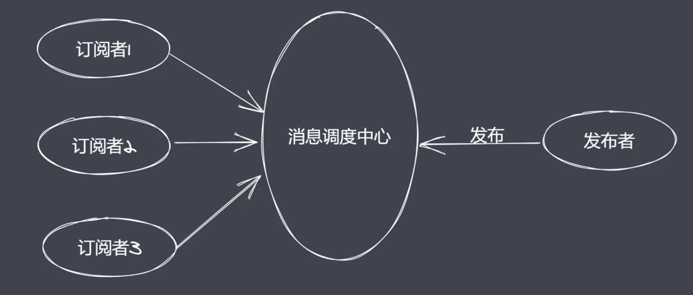
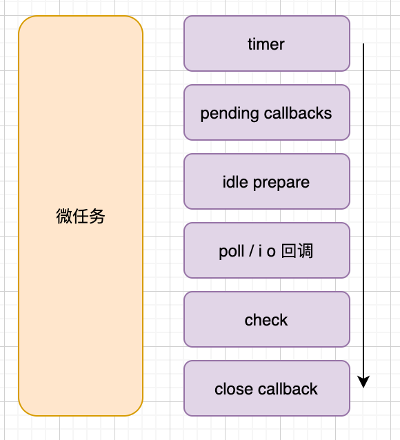

# events 模块

EventEmitter 类

## API

- on
- emit
- once
- off

发布订阅模式

- 解耦

发布订阅要素
- 缓存队列，存放订阅者信息
- 具有增加、删除订阅的能力
- 状态改变时通知所有订阅者执行监听

区别

- 观察者模式没有中间的发布订阅中心。
- 状态改变时，发布订阅无需主动通知

## 浏览器事件环

完整事件环执行顺序
从上至下执行所有的同步代码
●执行过程中将遇到的宏任务与微任务添加至相应的队列
●同步代码执行完毕后，执行满足条件的微任务回调
微任务队列执行完毕后执行所有满足需求的宏任务回调
循环事件环操作
●注意:每执行一个宏任务之后就会立刻检查微任务队列

## Nodejs 事件环

### 队列说明

- timers:执行setTimout与setInterval回调
- pending callbacks:执行系统操作的回调，例如tcp udp
- idle, prepare: 只在系统内部进行使用
- poll:执行与I/O相关的回调
- check:执行setlmmediate中的回调
- close callbacks:执行close事件的回调

### Nodejs完整事件环

- 执行同步代码，将不同的任务添加至相应的队列
- 所有同步代码执行后会去执行满足条件微任务
- 所有微任务代码执行后会执行timer队列中满足的宏任务
- timer中的所有宏任务执行完成后就会依次切换队列

注意:在完成队列切换之前会先清空微任务代码

### 区别

- 任务队列数
  - 浏览器只有2个(微、宏)，node 有 6 个事件队列
- 微任务执行时机
  - 都会在同步代码执行完后执行微任务
  - 浏览器平台下每个宏任务执行完后会清空微任务
  - Node 平台在事件队列切换时回去清空微任务（10版本，新版本和浏览器一样）
- 微任务优先级
  - 浏览器中微任务是先入先出
  - Nodejs 中 process.nextTick 先于 promise.then
