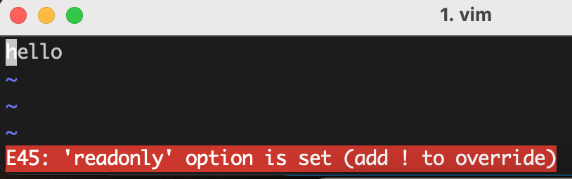

# 08-fs 模块

fs 是 nodejs 核心模块，提供了文件系统的 API。


## 权限位

- 用户对文件所具备的操作权限分为三类：读（r=4）、写（w=2）、执行（x=1）
  - r 表示可读，对目录来说，就是 ls 获取目录下的文件
  - w 表示可写，对目录来说，就是在目录下创建文件和目录，或改名（可以修改文件内容）
  - x 表示可执行，对目录来说就是可进入。某些脚本文件需要 x 权限，才可以执行。
- 操作系统对用户分为三类：文件所有者、文件所属组、其他用户


上图中，第一行最左边的一段字符串 `drwxr-xr-x` 解释如下：

```
d 目录
rwx 文件所有者权限
r-x 文件所属组权限
r-x 其他用户权限
```

> @ 符号是 mac 扩展的，如果文件或目录有扩展属性,则使用 -l 选项执行 ls 命令时，会在权限许可字段后面附加一个字符 @。如果文件或目录有扩展安全信息，则使用 -l 选项执行 ls 命令时，会在权限许可字段后面附件一个字符 +。

通过 `chmod -h 444 1.txt` 命令，可以将文件修改为只读，然后就只能查看文件了，在修改文件时会报错。




如果文件没有 x 权限，在执行文件时会报权限错误。


windows 默认是 rw, 八进制文件权限表示为 0o666, 十进制表示为 438

## 文件描述符 flags

- r: 表示可读
- w: 表示可写
- s: 表示同步操作
- +: 表示增加相反操作, 如 r+ 表示可读可写操作(可读 + 相反操作).
- x: 表示排它操作
- a: 表示追加操作


上图中要注意的是:

- 如果文件不存在，r、r+ 不会创建文件，会报错，而 w 和 a 都会新建文件。
- truncate 表示是否清空文件内容
- w 和 a 的区别是，一个是重新写，一个是追加内容(append)

## 文件标识符

fd 就是操作系统分配给被打开文件的标识,由于系统不同, nodejs 将 fd 抽象成了数字，从 3 开始。
0， 1， 2 分别是输入流、输出流、错误流。

为什么需要 open 和 close ?

因为 writeFile、readFile 是一次性加载到内存中的。对于大文件来说，需要一种流的方式处理文件：打开、读取、关闭。

## 大文件读写操作


## 常用 API

**获取文件信息**

- access() 查看文件是否存在并且有访问权限(或指定权限)，如果没有，则报错。
- stat() 获取文件或目录的信息，如果文件不存在，会报错
- lstat() 和 stat() 一样，只是在处理链接文件时，stat 可以获取到真实的文件信息

**文件和目录操作**

- open() 打开文件
- close() 关闭文件
- readFile() 读文件，文件不存在会报错
- writeFile() 写文件，文件不存在会新建
- unlink() 删除文件，如果文件不存在则会报错
- mkdir() 创建目录，父目录必须存在，否则报错，可以设置 recursive 为 true 递归创建目录。
- rmdir() 删除目录，默认只能删除空目录，可以设置 recursive 为 true 删除非空目录。
- rm() 删除目录
- readdir() 读目录，返回一个由文件或目录组成的数组。
- fs.rename( oldPath, newPath, callback ) 重命名文件或目录

> node v16 废弃了 fs.rmdir() 的 recursive 参数。使用 rm() 代替

### stat

stat 方法用于获取文件的信息，如果文件不存在，会报错。

```js
fs.stat(filepath, (err, stats) => {
  stats.isFile()
  stats.isDirectory()
  stats.isSymbolicLink()
  stats.size // 字节
})
```

## 软链接与硬链接

软链接 soft link -> system file -> disk real file
硬链接 hard link -> disk real file <- system file

因为[循环引用的问题](https://www.zhihu.com/question/50223526)，所以 linux 里目录无法创建硬链接。

在 linux 里一切都是文件，目录是一种特殊的文件。下面用 js 来模拟：

```js
class iNode {} // 代表真实的文件节点
let inode1 = new iNode()
let inode2 = new iNode()
let inode3 = new iNode()

// dir2/dir1
let file1 = {
  link: inode1,
}
let file2 = {
  link: inode2,
}
let file3 = {
  link: inode3,
}
let dir1 = {
  parent: '..',
  current: '.',
  children: [file1, file2],
}
let dir2 = {
  parent: '..',
  current: '.',
  children: [dir1, file3],
}

function hardLink(file) {
  return {
    link: file.link, // 实际也是只想了 inode
  }
}

function softLink(file) {
  return file
}

let hardLink1 = hardLink(file1)
deleteFile(file1) // 删除文件时， hardLink1 并没有删除掉, inode1 也还在

let softLink1 = softLink(file1)
deleteFile(file1) // 因为 file1.link = null 了，所以 softLink 就和 inode 也断链了

function deleteFile(file) {
  // 删除硬盘真实文件
  // 检查 inode 的链接数，进行清理 inode，有点像 gc 回收
  const num = checkLinkNum(file.link)
  if (num === 0) {
    file.inode = null
  }

  // 删除系统文件里的显示
  file.link = null
  file = null
}
```

## fs-extra
