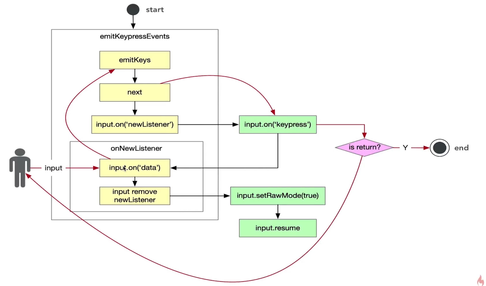

# readline

## 简介

`readline` 模块可以用于从 可读流 中一次读取一行数据。

```js
import readline from 'readline/promises'
// node 17 支持 promise 版本 readline

const rl = readline.createInterface({
  input: process.stdin,
  output: process.stdout,
})

const answer = await rl.question(`what do you think of Node.js?`)

console.log(`Thank you for you feedback ${answer}`)

rl.close() // 默认不会自动关闭
```

## readline 源码

1. 调用 Interface 函数会强制返回一个 Interface 实例

```js
function Interface(...){
  if(!(this instanceof Interface)){
    return new Interface(...)
  }

  ...
}
```

2. 继承自 EventEmitter

```js
EventEmitter(this)
```

3. 键盘事件监听


## readline 核心原理图



- setRawMode(true) 将整行监听改为逐字监听
