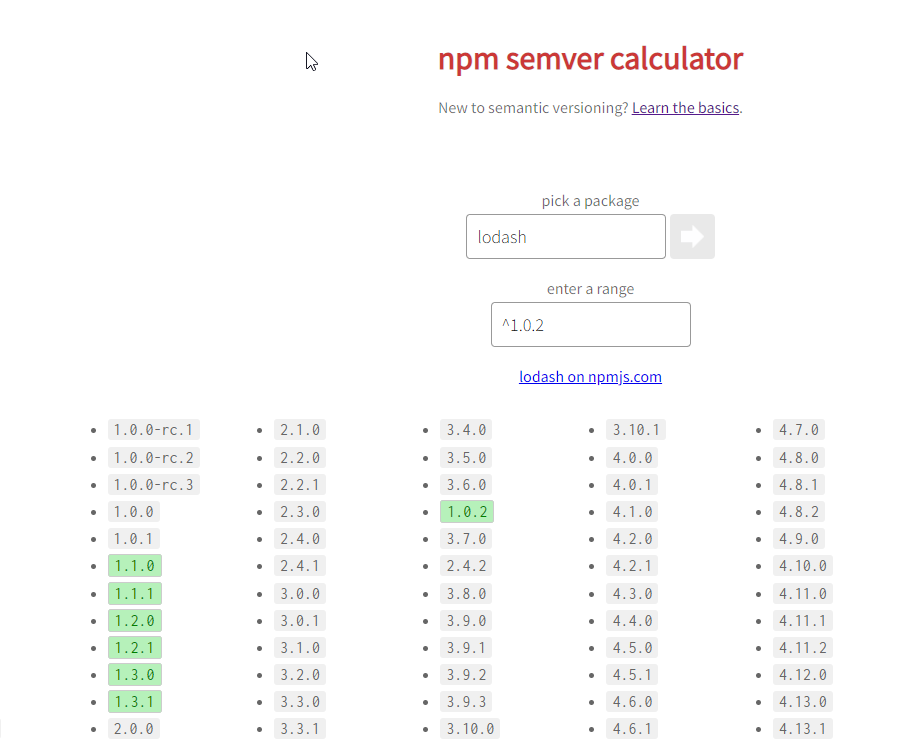

1. 获取 auth 字符串, 命令行输入下面命令

```
echo -n 'username:password' | openssl base64
```


2. 项目下新建 .npmrc 文件

```
registry=https://registry.npm.taobao.org/
_auth=aGV5dWhhbzpBSEhxxxxx(这个换一下)
always-auth=true
```

3. 就可以 npm i 了
https://stackoverflow.com/questions/35043155/how-should-i-set-auth-in-npmrc-when-using-a-nexus-https-npm-registry-proxy


https://stackoverflow.com/questions/64813775/is-there-any-way-to-fix-package-lock-json-lockfileversion-so-npm-uses-a-specific

## 版本


dependencies "@uino/cli-thing-service": "^1.0.32-beta.10" 在 npm i时，还是会安装 32 版本。

版本大小比较  1.0.0.alpha1 < 1.0.0.beta1 < 1.0.0.beta2 < 1.0.0.rc1 < 1.0.0.

- https://zhuanlan.zhihu.com/p/66039729
- https://docs.npmjs.com/about-semantic-versioning
- https://semver.org/lang/zh-CN/
- https://semver.npmjs.com/


^指明的版本范围，只要不修改 [major, minor, patch] 三元组中，最左侧的第一个非0位，都是可以的。也就是说，要确定 ^版本包含的范围，先要找到 最左侧的第一个非0位 ，只有在这一位右侧的变动，才被包含在这个 ^ 指定的范围内。举个 ：

^1.2.3版本包括：>= 1.2.3 并且 < 2.0.0
^0.2.3版本包括：>= 0.2.3 并且 < 0.3.0
^0.0.3版本包括：>= 0.0.3 并且 < 0.0.4


```
npm i -g semver

semver -r ^0.12.0 0.12.0 0.12.1 0.12.10 0.13.0 0.13.1
0.12.0
0.12.1
0.12.10

semver -r ^0.0.3 0.0.31 0.0.4
无

semver -r ^4.1.0-beta.83 4.1.1-beta.1
无
```
