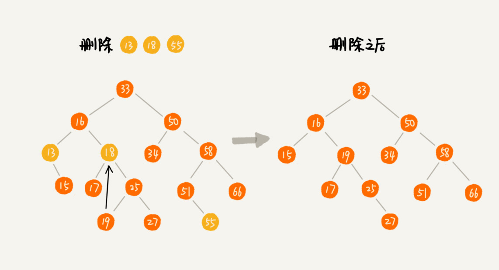
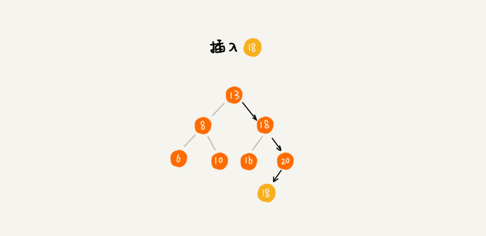

## 理论

链表是特殊的树(后继节点可以多个)，树是特殊的图(有环)。

二叉树：

0. 最多只有两个儿子。

二叉树遍历方式：

-   前序(pre-order): 根-左-右
-   中序(in-order): 左-根-右
-   后序(post-order): 左-右-根

二叉搜索树(binary search tree)：有序二叉树、排序二叉树，是指一棵空树或具有下列性质的二叉树：

1. 左子树上所有节点的值都小于它的根节点的值。
1. 右子树上所有节点的值都大于它的根节点的指。
1. 左、右子树也分别为二叉搜索树(这就是重复性)。

查询和操作都是 O(logN)。

-   插入操作：查找到合适的位置，比左节点大，比右节点小，插入。
-   删除：如果这个节点不是叶子节点，一般是将其替换为第一个大于这个节点的节点。


## 验证二叉排序树

validate BST，leetcode 98 题。

1. in-order 中序遍历（左、根、右），应该是一个升序的 array。
2. 递归

## 二叉搜索树

二叉搜索树(binary search tree)，的目的是为了实现快速搜索。另外它还可以快速插入和删除。

二叉搜索树的特点：

-   任意一个节点的左子树的每个节点的值都小于这个节点的值。
-   任意一个节点的右子树节点的值都大于这个节点的值。


**查找**


**插入**

新插入的数据一般都是在叶子节点上。如果节点要插入的位置为 null，则可以插入。


**删除**

0. 55 是叶子节点，直接删除。
1. 13 只有一个子节点，直接删除，然后将指针指向其子节点。
1. 18 有 2 个子节点，找到其右子树最小子节点进行替换。因为最小子节点一定是叶子节点。



删除操作还一个取巧的方法：只是简单的标记它为删除元素。这样的缺点是比较浪费内存空间，但是它操作起来很简单，也不会影响插入和查找。

**快速地查找最大节点和最小节点**

最右边的节点就是最大节点(没有 rightNode)，最左边的节点就是最小节点(没有 leftNode)。

**快速地查找前驱节点和后继节点**

二叉搜索树还有一个特点：中序遍历二叉搜索树，可以输出有序的数据序列，时间复杂度是 O(n)，非常高效。

## 支持重复数据的二叉查找树

如果有重复数据，有两种思路解决：

1. 同样的数据的节点使用一个链表进行存储。
2. 将相同的数据当做比原节点大的元素来处理，放在右子树里。

**插入**



**查找**

找到元素后，不停止，继续在右子树上查找。


**删除**

使用前面的方法，依次删除。


**二叉查找树的复杂度分析**


插入、删除、查找都是和树的高度成正比。

树的高度等于最大层数减一，对于完全二叉树：

```
n >= 1+2+4+8+...+2^(L-2)+1
n <= 1+2+4+8+...+2^(L-2)+2^(L-1)
```

L 的范围在 `[log2(n+1), log2(n)+1]`，所以二叉树的高度小于等于 log2(n)。

如何用程序确定二叉树的高度？

1. 递归遍历，最大高度+1。
2. 层遍历。

二叉树退化成链表，时间复杂度就退化成了 O(n)。所以需要一种稳定的平衡二叉搜索树。

**散列表和二叉搜索树**

散列表的插入、删除、查找时间复杂度可以是 O(1)，平衡二叉搜索树才 O(logn)，为什么还是需要平衡二叉搜索树呢？

1. 散列表是无序的，如果要输出有序的数据，需要先排序，而二叉搜索树只需要中序遍历即可(On)。
2. 散列表扩容耗时很多，当遇到散列冲突时，性能不稳定，工程中使用的平衡二叉搜索树性能稳定，时间复杂度在 O(logn)。
3. 散列表在散列冲突时，查找耗时不一定比 logn 小。
4. 散列表构造比二叉树复杂，需要考虑的东西多，如散列函数的设计，冲突解决方法，扩容，缩容。而平衡二叉树只需要考虑平衡性，这个问题已经有比较成熟固定的解决方案。

## 题目

## 145. 二叉树的后序遍历

题目: [https://leetcode-cn.com/problems/binary-tree-postorder-traversal/](https://leetcode-cn.com/problems/binary-tree-postorder-traversal/)

```js
/**
 * Definition for a binary tree node.
 * function TreeNode(val) {
 *     this.val = val;
 *     this.left = this.right = null;
 * }
 */
/**
 * @param {TreeNode} root
 * @return {number[]}
 */

// 递归
var postorderTraversal = function (root) {
    if (!root) return [];
    return [
        ...postorderTraversal(root.left),
        ...postorderTraversal(root.right),
        root.val,
    ];
};
```

### 94. 二叉树的中序遍历

题目：[https://leetcode-cn.com/problems/binary-tree-inorder-traversal/](https://leetcode-cn.com/problems/binary-tree-inorder-traversal/)

```js
/**
 * Definition for a binary tree node.
 * function TreeNode(val) {
 *     this.val = val;
 *     this.left = this.right = null;
 * }
 */
/**
 * @param {TreeNode} root
 * @return {number[]}
 */
// 递归
var inorderTraversal = function (root) {
    if (!root) return [];
    return [
        ...inorderTraversal(root.left),
        root.val,
        ...inorderTraversal(root.right),
    ];
};

// 模拟栈
var inorderTraversal = function (root) {
    if (!root) return []; // 可以省略
    var stack = [];
    var res = [];
    while (root || stack.length) {
        if (root) {
            stack.push(root);
            root = root.left;
        } else {
            root = stack.pop();
            res.push(root.val);
            root = root.right;
        }
    }
    return res;
};
```

## 144. 二叉树的前序遍历

题目: [https://leetcode-cn.com/problems/binary-tree-preorder-traversal/](https://leetcode-cn.com/problems/binary-tree-preorder-traversal/)

```js
/**
 * Definition for a binary tree node.
 * function TreeNode(val) {
 *     this.val = val;
 *     this.left = this.right = null;
 * }
 */
/**
 * @param {TreeNode} root
 * @return {number[]}
 */
// 递归
var preorderTraversal = function (root) {
    if (!root) return [];
    return [
        root.val,
        ...preorderTraversal(root.left),
        ...preorderTraversal(root.right),
    ];
};

// 迭代
var preorderTraversal = function (root) {
    let list = [root];
    let arr = [];
    while (list.length) {
        node = list.pop();
        if (!node) return arr;
        arr.push(node.val);
        node.right && list.push(node.right);
        node.left && list.push(node.left);
    }
    return arr;
};
```

## 590. N 叉树的后序遍历

题目: [https://leetcode-cn.com/problems/n-ary-tree-postorder-traversal/](https://leetcode-cn.com/problems/n-ary-tree-postorder-traversal/)

## 589. N 叉树的前序遍历

题目：[https://leetcode-cn.com/problems/n-ary-tree-preorder-traversal/](https://leetcode-cn.com/problems/n-ary-tree-preorder-traversal/)

## 429. N 叉树的层序遍历

题目：[https://leetcode-cn.com/problems/n-ary-tree-level-order-traversal/](https://leetcode-cn.com/problems/n-ary-tree-level-order-traversal/)

## 参考链接

-   树的遍历 Demo https://visualgo.net/zh/bst
