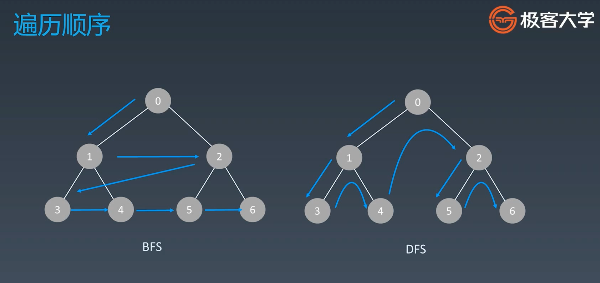

## 概念

搜索-遍历

-   每个节点都要访问一次
-   每个节点仅仅访问一次

搜索方式

-   深度优先搜索
-   广度优先搜索
-   优先级优先：启发式搜索，应用于推荐算法等

## 深度优先搜索 DFS

deep first search

**简单示例**

```py
def dfs(node):
    if node in visited:
        return

    visited.add(node)

    # 处理当前节点
    process_current_node()

    # 遍历 children
    dfs(node.left)
    dfs(node.right)
```

**递归写法**

把节点一个个添加到数组里，然后遍历数组。

```py
visited = set()

def dfs(node, visited):
    visited.add(node)
    # 处理当前节点
    process_current_node()

    for next_node in node.children():
        if not next_node in visited:
            def(next_node, visited)
```

**非递归写法**

模拟栈，pop 最后一个元素，将这个元素的子元素再 push 到栈中。

```py
def dfs(self, tree):
    if tree.root is None:
        return []

    visited, stack = [], [tree.root]

    while stack:
        node = stack.pop()
        visited.add(node)

        process(node)

        if node.child:
            for child in node.child:
                stack.add(child)

```

**js 示例**

```js
let node = {
    id: "1",
    child: [
        {
            id: "1_2",
            child: [
                {
                    id: "1_2_3",
                },
                {
                    id: "1_2_4",
                },
            ],
        },
        {
            id: "2_2",
            child: [
                {
                    id: "2_2_3",
                },
                {
                    id: "2_2_4",
                },
            ],
        },
    ],
};

function dfs(node) {
    let nodes = [];
    let stack = [node];

    while (stack.length) {
        let item = stack.pop();
        nodes.push(item);

        process(item);

        if (item.child) {
            for (let i = item.child.length - 1; i >= 0; i--) {
                stack.push(item.child[i]);
            }
        }
    }

    return nodes;
}

console.log(dfs(node));

/* result
[
    { id: "1", child: [[Object], [Object]] },
    { id: "1_2", child: [[Object], [Object]] },
    { id: "1_2_3" },
    { id: "1_2_4" },
    { id: "2_2", child: [[Object], [Object]] },
    { id: "2_2_3" },
    { id: "2_2_4" },
];
*/
```

## 广度优先搜索

`breadth-first-search`，一层一层向下扩展，像水波纹一样。更符合人脑的思考方式。

可以遍历树的最短路径，如从根节点到某个节点，第一次遍历某个节点到就是最短路径。



**使用队列实现**

-   java 链表或双端队列
-   python 用数组

```py
def bfs(graph, start, end):
    queue = []
    queue.append([start])
    visited.add(start)

    while queue:
        node = queue.pop()
        visited.add(node)

        process(node)
        nodes = generate_related_nodes(node)
        queue.push(nodes)
```

**js 实现**

```js
let node = {
    id: "1",
    child: [
        {
            id: "1_2",
            child: [
                {
                    id: "1_2_3",
                },
                {
                    id: "1_2_4",
                },
            ],
        },
        {
            id: "2_2",
            child: [
                {
                    id: "2_2_3",
                },
                {
                    id: "2_2_4",
                },
            ],
        },
    ],
};

function bfs(node) {
    let nodes = [];
    let queue = [node];

    while (queue.length) {
        let item = queue.shift();
        nodes.push(item);

        if (item.child) {
            queue.push(...item.child);
        }
    }
    return nodes;
}

console.log(bfs(node));

/*
[ { id: '1', child: [ [Object], [Object] ] },
{ id: '1_2', child: [ [Object], [Object] ] },
{ id: '2_2', child: [ [Object], [Object] ] },
{ id: '1_2_3' },
{ id: '1_2_4' },
{ id: '2_2_3' },
{ id: '2_2_4' } ]
*/
```

-   https://shimo.im/docs/ddgwCccJQKxkrcTq
-   https://shimo.im/docs/P8TqKHGKt3ytkYYd

## 题目

### 102. 二叉树的层序遍历

-   题目地址： [https://leetcode-cn.com/problems/binary-tree-level-order-traversal/#/description](https://leetcode-cn.com/problems/binary-tree-level-order-traversal/#/description)

https://leetcode-cn.com/problems/minimum-genetic-mutation/#/description
https://leetcode-cn.com/problems/generate-parentheses/#/description
https://leetcode-cn.com/problems/find-largest-value-in-each-tree-row/#/description
课后作业
https://leetcode-cn.com/problems/word-ladder/description/
https://leetcode-cn.com/problems/word-ladder-ii/description/
https://leetcode-cn.com/problems/number-of-islands/
https://leetcode-cn.com/problems/minesweeper/description/
