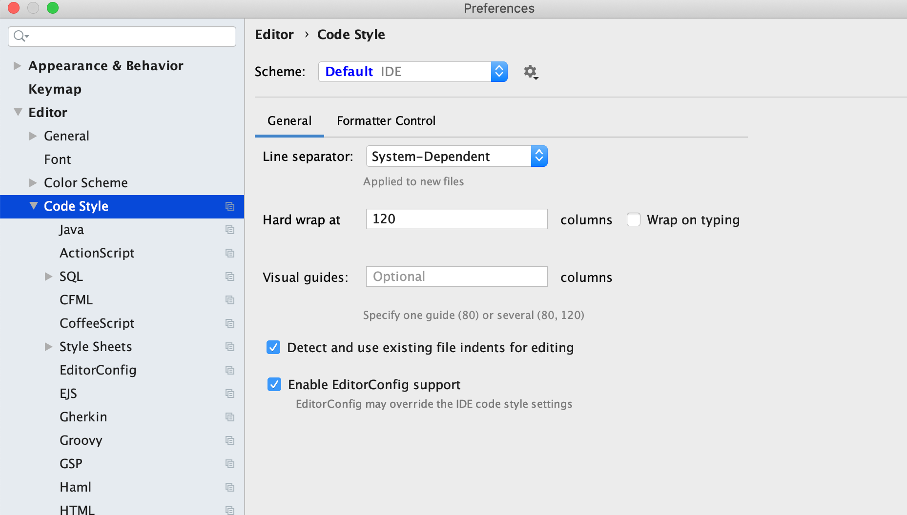

# 兼容性问题

# 适配方案

分享手淘过年项目中采用到的前端技术
https://www.h3399.cn/201803/552878.html

https://github.com/amfe/lib-flexible/issues?page=2&q=is%3Aissue+is%3Aclosed
https://blog.csdn.net/qq_21729177/article/details/79466951
https://www.jianshu.com/p/1f1b23f8348f
https://www.zhihu.com/question/37179916
https://www.jianshu.com/p/2c6a3249dfcd
https://www.jianshu.com/p/c5fc2c5c2b53
https://www.jianshu.com/p/8300a5ec6480

https://segmentfault.com/q/1010000013935863
http://www.manongjc.com/article/28215.html
https://juejin.im/post/5ba5abedf265da0aa664c0f6

研究一下 proxy 的写法



# 搭建 vue 开发环境

```sh
vue create vue-template
```

https://blog.csdn.net/weixin_41010198/article/details/88055078
