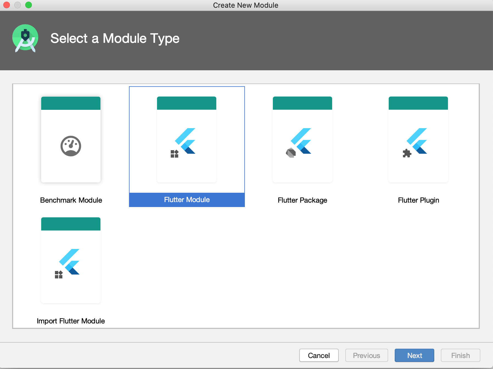
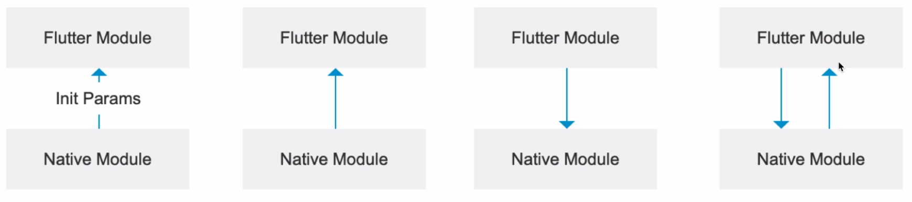

## Flutter Android 混合开发

-   Flutter Android 混合开发
-   Flutter ios 混合开发
-   Flutter 和 Android 通信
-   Flutter 和 ios 通信

场景：

-   独立页面加入，flutter 页面打开原生页面或原生页面打开 flutter 页面。
-   作为一部分嵌入。

步骤：

1. 创建 Flutter module。
2. 添加 Flutter module 依赖。
3. 在 Java/Object-c 中调用 Flutter module。
4. 编写 Dart 代码。

### 1. 创建 Flutter module

在 Flutter 中创建 module 有 2 种方式：

1. 第一种是通过命令行的方式：

```
cd flutter_trip
flutter create -t module flutter_module
```

2. 通过 android studio 创建，点击菜单的`File -> New -> New module -> Flutter Module`来创建。



### 2. 为已存在的 Andorid 项目添加依赖


创建一个新的 `android project`：FlutterHibirdAndroid，完成后用 android studio 打开 FlutterHibirdAndroid 项目，继续下面的操作：

1. 将 android studio 项目切换到 android 模式下。


2. 在 Gradle Scripts -> settings.gradle 里，新增下面代码

```
setBinding(new Binding([gradle: this]))
evaluate(new File(
        settingsDir.parentFile,
        'flutter_module/.android/include_flutter.groovy'
))
```

3. 在 Gradle Script -> build.gradle(Module: app) 里，新增下面代码：

```
android {
    ...

    // 新增
    compileOptions {
        sourceCompatibility JavaVersion.VERSION_1_8
        targetCompatibility JavaVersion.VERSION_1_8
    }
}

dependencies {
    ...
    implementation project(':flutter')  // 新增
}
```

### 3. 在 Java 中调用 Flutter module

在 Java 中调用 Flutter 模块有两种方式：

-   使用`Flutter.createView` API 的方式
-   使用`FlutterFragment`的方式

**使用`Flutter.createView`API 的方式**

首先打开 MainActivity.java 文件。

```java title="FlutterHibirdAndroid/app/src/main/java/com.x/MainActivity.java"
public void onClick(View view) {
    View flutterView = Flutter.createView(
            MainActivity.this,
            getLifecycle(),
            "route1"
    );
    FrameLayout.LayoutParams layout = new FrameLayout.LayoutParams(600, 800);
    layout.leftMargin = 100;
    layout.topMargin = 200;
    addContentView(flutterView, layout);
}
```

**使用`FlutterFragment`的方式**

```

```

### 4. 编写 Dart 代码

混合开发时编写 Dart 后，热重启失效了，解决方法是：

1. 打开一个模拟器，或连接一个设备到电脑上。
2. 关闭 APP，然后运行命令`flutter attach`。

如果有多个设备，fltter attach 会提示选择一个设备：

```
flutter attach -d '设备名'
```

调试混合开发模型下的 Dart 部分代码。

1. 关闭 APP (关键)
2. 点击 Android Studio 的菜单的 Flutter Attach 按钮


## Flutter iOS 混合开发

## Flutter 与 Native 通信

### 通信场景



### 通信机制

Flutter 和 Native 通过 Channel 进行数据传递。

Flutter 定义了三种不同类型的 Channel。

-   BasicMessageChannel: 用于传递字符串和半结构化的信息，持续通信，收到消息后可以回复此次消息，如：Native 将遍历到的文件信息陆续传递到 Dart，再比如：Flutter 将从服务端陆续获取到的信息交给 Native 加工，Native 处理完后返回等。
-   MethodChannel: 用于传递方法调用(method invocation) 一次性通信：如 Flutter 调用 Native 拍照。
-   EventChannel: 用于数据流(event streams)的通信，持续通信，收到消息后无法回复此次消息，通常用于 Native 向 Dart 的通信，如：手机电量变化，网络连接变化，陀螺仪，传感器等。

### Native 端
