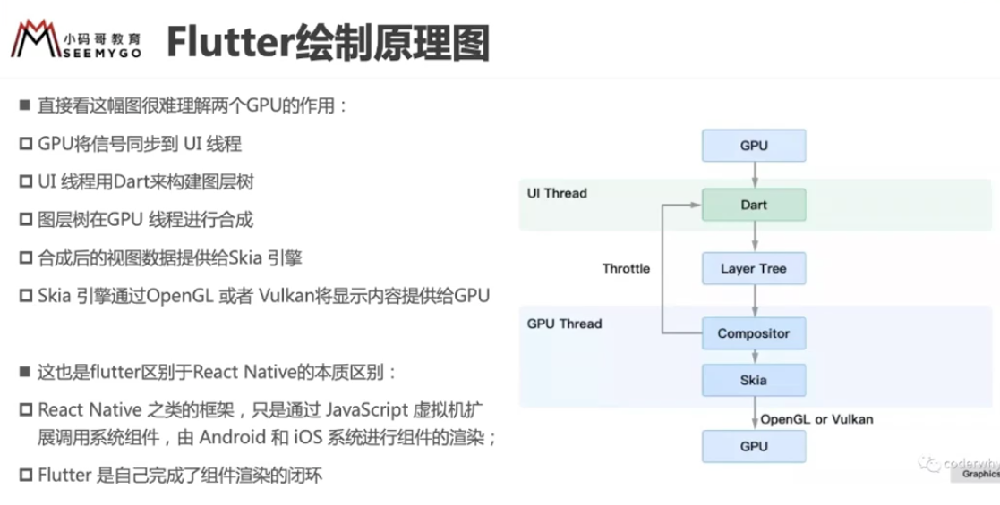
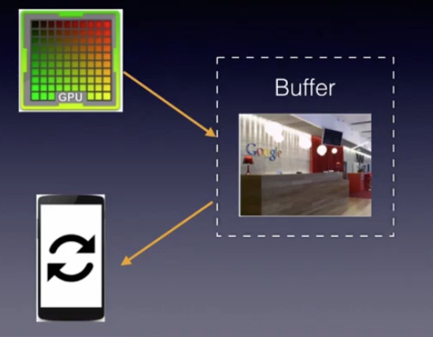
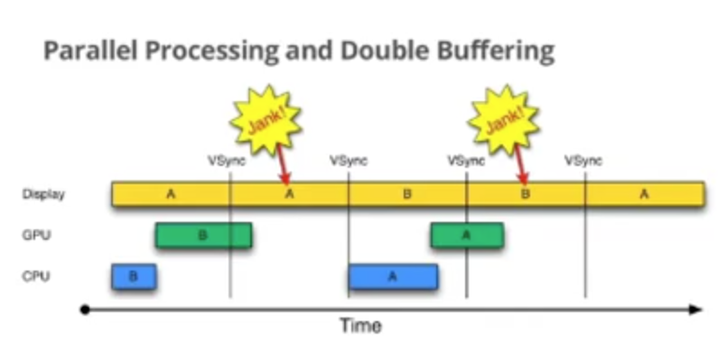
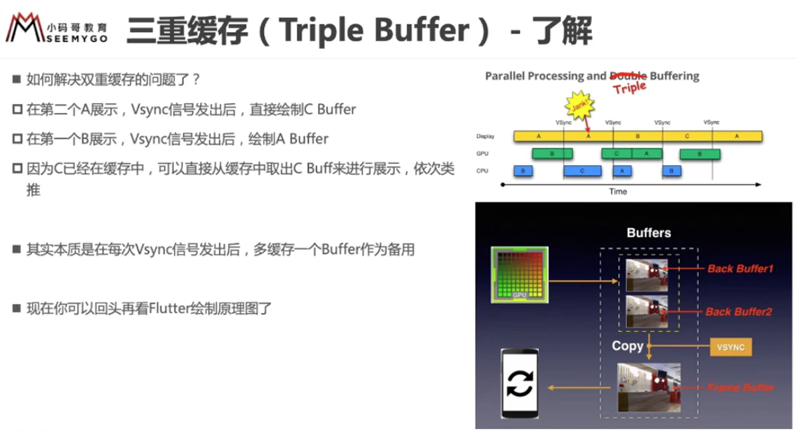
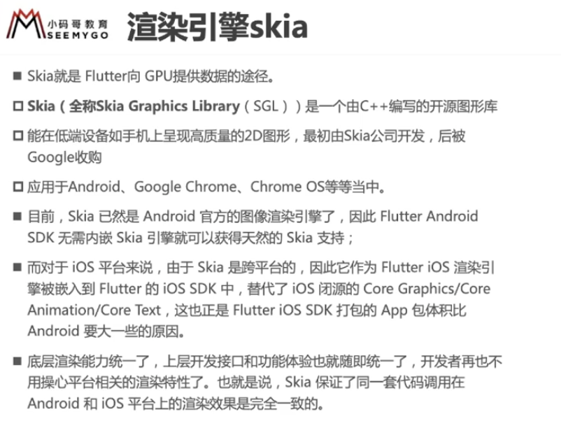

webview
rn /weex
flutter

## 流程

## 绘制原理

### 图像是如何显示的

屏幕上可以看到的东西本质都是图像。

动画是图像播放速度非常快， 16 帧(16 张图)，人眼就觉得流畅，少于 16 帧，就会觉得卡顿。

帧率(fps): Frames Per Second，每秒显示多少张图片。
刷新率：显示器的刷新频率，比如 iphone 的 60Hz，ipad 的 120 Hz。

帧率和刷新率的关系：

CPU/GPU 绘制时，会将图像数据(一帧)放在 Buffer 中。显示器刷新时会将 Buffer 数据中取出图片进行显示。生产者-消费者模型。

理想的情况时帧率和刷新率相等，每绘制一帧，屏幕显示一帧。但是实际往往它们的大小是不同的。

如果没有锁来控制同步，很容易出现问题。例如，当帧率大于刷新频率，当屏幕还没有刷新第 n-1 帧的时候，CPU 已经在生成第 n 帧了，从上往下开始覆盖第 n-1 帧的数据，当屏幕开始刷新第 n-1 帧的时候，Buffer 中的数据上半部分是第 n 帧数据，而下半部分是第 n-1 帧的数据。显示出来的图像就会出现上下部分明显偏差的现象，这称为“tearing”（撕裂）。

为了解决单缓存的撕裂问题，引入了双重缓存(Double Buffer)，Vsync。
两个缓存： Back Buffer 和 Frame Buffer
GPU 向 Back Buffer 中写数据，屏幕从 Frame Buffer 读取数据。
VSync 信号负责调度从 Back Buffer 到 Frame Buffer 的复制操作(底层交换地址，瞬间完成，效率高)。
工作流程：

1. 从某个时间点，一个屏幕刷新周期完成，Vsync 信号产生，先完成复制操作，然后通知 GPU/CPU 绘制下一帧图像。
2. 复制操作完成后，屏幕开始下一个刷新周期，将刚复制到 Frame Buffer 的数据显示在屏幕上。
3. 在这种模型下，只有当 VSync 信号产生时，CPU/GPU 才开始绘制。

双重缓存的缺陷在于：当 CPU/GPU 绘制一帧时间过长时(比如超过 16ms)时，会产生 Jank（画面停顿，甚至空白）
蓝色代表 CPU 生成 Display List;
绿色代表 GPU 执行 Display List 中的命令从而生成帧；
黄色代表生成帧完成，在屏幕上显示，按 tick 分间隔。

三重缓存(Triple Buffer)

## 渲染引擎 skia

Skia(Skia Graphics Library (SGL) ) 是

1. 冷启动： 从 0 开始启动
2. 热重载: 最主要是执行 build 方法，像数据状态不会重新执行
3. 热重启: 会重新运行整个 app，状态会重新加载

## 参考资料

-   [The History of the Modern Graphics Processor](https://www.techspot.com/article/650-history-of-the-gpu/)
-   [极客时间计算机原理 30 | GPU（上）：为什么玩游戏需要使用 GPU？]
-   [极客时间计算机原理 31 | GPU（下）：为什么深度学习需要使用 GPU？]
-   [计算机那些事(8)——图形图像渲染原理](http://chuquan.me/2018/08/26/graphics-rending-principle-gpu/)
