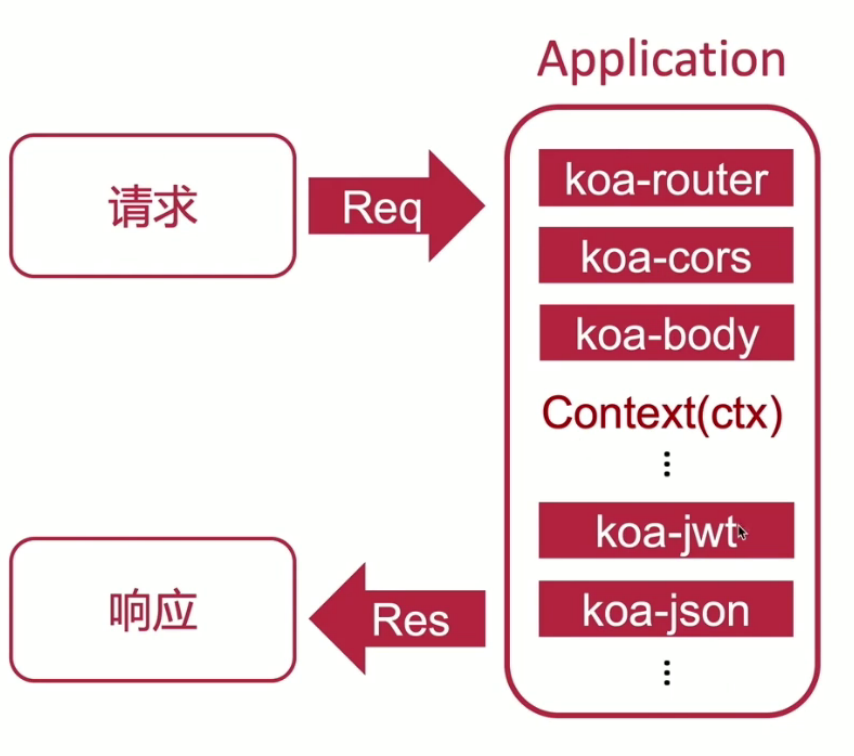

# koa

## koa 核心概念



## 搭建环境

```
mkdir koa-app01
npm init -y
npm i -S koa
```

- koa 开发 restfulAPI

## koa 常用中间件

- 路由 `@koa/router`
  - prefix
- 协议解析 `koa-body`
- 跨域请求 `@koa/cores`
- json 美化 `koa-json`

## Context 属性

```
ctx.request
    - url
    - headers
    - query
    - body
```
