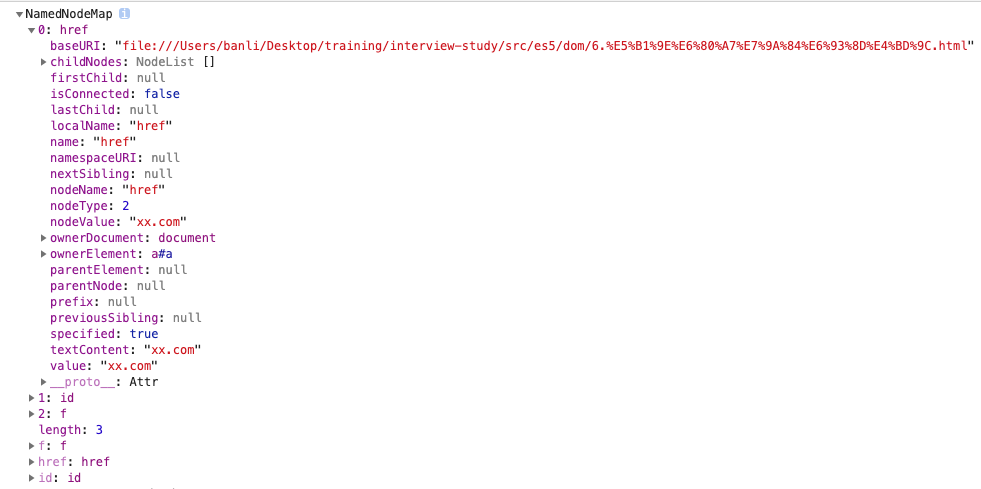

## Node 接口

| 类型               | nodeType | 常量                        | nodeName                | nodeValue |
| ------------------ | -------- | --------------------------- | ----------------------- | --------- |
| `Element`          | 1        | Node.ELEMENT_NODE           | 大写标签名              | null      |
| `Attribute`        | 2        | Node.ATTRIBUTE_NODE         | 属性名                  | 属性值    |
| `Text`             | 3        | Node.TEXT_NODE              | `#text`                 | 文本值    |
| `Comment`          | 8        | Node.COMMENT_NODE           | `#comment`              | 注释文本  |
| `Document`         | 9        | Node.DOCUMENT_NODE          | `#document`             | null      |
| `DocumentType`     | 10       | Node.DOCUMENT_TYPE_NODE     | 文档的类型(如 `"html"`) | null      |
| `DocumentFragment` | 11       | Node.DOCUMENT_FRAGMENT_NODE | `#document-fragment`    | null      |

- Node.prototype.nodeValue 属性返回节点的文本值，可读写。只有文本节点、注释节点、属性节点有文本值。

- Node.prototype.textContent 属性返回当前节点和它所有后代节点的文本内容。

```js
// HTML 代码为
// <div id="divA">This is <span>some</span> text</div>

document.getElementById("divA").textContent;
// This is some text

document.getElementById("divA").textContent = "<p>GoodBye!</p>";
```

该属性可读写，设置该属性值时，会替换原来的子节点，另外它自动对 HTML 标签转义，适合用于用户的输入。

对于文本节点、注释节点、属性节点，textContent 属性的值和 nodeValue 相同，对于其它节点，将返回所有子节点(不包括注释节点)的内容文本。如果没有子节点，则返回空字符串。Document 和 DocumentType 类型的 textContent 属性为 null。如果要读取整个文档的内容，可以使用`document.documentElement.textContent`。

- Node.prototype.baseURI 属性表示当前网页的绝对路径，浏览器根据这个属性，计算网页上相对路径的 URL。该属性只读。该属性的值一般由当前网址 URL (window.location)决定，但是可以使用 `<base>` 标签改变它。

```js
<base href="http://www.example.com/page.html">
```

设置后，baseURI 属性就返回 <base> 标签设置的值。

- Node.prototype.ownerDocument 返回当前节点所在的顶层文档对象，即 document 对象。`document.ownerDocument` 为 null。

- Node.prototype.nextSibling 返回后一个同级节点，如果没有，则返回 null。该属性还包含文本节点和注释节点。

```js
// 遍历所有子节点
var el = document.body.firstChild;
while (el !== null) {
  console.log(el.nodeName);
  el = el.nextSibling;
}
```

- Node.prototype.previousSibling 返回前一个同级节点，如果没有，则返回 null。

- Node.prototype.parentNode 返回当前节点的父节点，可能是 Element、Document 和 DocumentFragment。对于 Document、DocumentFragment 和没有插入 DOM 树的节点，父节点都为 null。

- Node.prototype.parentElement 返回当前节点的父元素节点。如果没有父节点或父节点不是元素节点，则返回 null。

- Node.prototype.firstChild 返回当前节点的第一个节点，没有则返回 null。可能是元素节点、文本节点或注释节点。

- Node.prototype.lastChild 返回当前节点的最后一个节点，没有则返回 null。可能是元素节点、文本节点或注释节点。

- Node.prototype.childNodes 返回一个 NodeList 集合，包括所有子节点(元素节点、文本节点和注释节点)。它是一个动态集合。

- Node.prototype.isConnected 返回一个布尔值，表示当前节点是否在文档之中。没插入到文档的节点为 false。

- Node.prototype.appendChild() 将参数节点作为最后一个子节点插入当前文档，返回值是插入文档的子节点。如果参数节点在 DOM 中已经存在，appendChild() 方法会移动其位置。

- Node.prototype.hasChildNodes() 返回一个布尔值，表示当前节点是否有子节点。

判断节点有子节点的方法还有：`node.firstChild`、`node.childNodes && node.childNodes.length`。

遍历当前节点的所有后代节点：

```js
function DOMComb(parent, callback) {
  if (parent.hasChildNodes()) {
    var node = parent.firstChild;
    while (node !== null) {
      DOMComb(node, callback);
      node = node.nextSibling;
    }
  }
  callback(parent);
}
DOMComb(document.body, console.log);
```

- Node.prototype.cloneNode() 用于克隆一个节点，它可以接收一个参数表示是否克隆子节点。返回新克隆的节点。

要注意的是：

1. 克隆时会拷贝所有属性，但 addEventListener 和 on- 绑定的事件不会拷贝。
2. 克隆的节点没有父节点，需要使用 appendChild 添加到文档中。
3. 克隆后，可能出现 id 或 name 相同的元素，所以需要修改。

- `Node.prototype.insertBefore(newNode, referenceNode)` 用于将某个节点插入父节点内的指定位置。返回值是插入的新节点。如果 referenceNode 为 null，则相当于 appendChild()。如果第二个参数省略会报错。如果要插入的节点是当前 DOM 的节点，则移动位置。

```js
// 没有 insertAfter，可以用 nextSibling 模拟
parent.insertBefore(s1, s2.nextSibling);
```

- Node.prototype.removeChild() 用于移除当前节点的子节点。返回值是移除的子节点。如果参数不是当前节点的子节点，会报错。

```js
// 移除某个子节点
var divA = document.getElementById("A");
divA.parentNode.removeChild(divA);

// 移除所有子节点
var element = document.getElementById("top");
while (element.firstChild) {
  element.removeChild(element.firstChild);
}
```

- Node.prototype.replaceChild(newChild, oldChild) 用新节点替换当前节点的某一节点。返回 oldChild。

```js
var divA = document.getElementById("divA");
var newSpan = document.createElement("span");
newSpan.textContent = "Hello World!";
divA.parentNode.replaceChild(newSpan, divA);
```

- Node.prototype.contains() 返回一个布尔值，如果参数节点为当前节点或当前节点的子节点/后代节点，则返回 true。

- `Node.prototype.compareDocumentPosition()` 返回一个 6 位的二进制，表示参数节点与当前节点的位置关系。

| 二进制值 | 十进制值 | 含义                                               |
| -------- | -------- | -------------------------------------------------- |
| 000000   | 0        | 两个节点相同                                       |
| 000001   | 1        | 两个节点不在同一个文档（即有一个节点不在当前文档） |
| 000010   | 2        | 参数节点在当前节点的前面                           |
| 000100   | 4        | 参数节点在当前节点的后面                           |
| 001000   | 8        | 参数节点包含当前节点                               |
| 010000   | 16       | 当前节点包含参数节点                               |
| 100000   | 32       | 浏览器内部使用                                     |

```js
// HTML 代码如下
// <div id="mydiv">
//   <form><input id="test" /></form>
// </div>

var div = document.getElementById("mydiv");
var input = document.getElementById("test");

div.compareDocumentPosition(input); // 20
input.compareDocumentPosition(div); // 10
```

上面代码中，节点 div 包含节点 input（二进制 010000），而且节点 input 在节点 div 的后面（二进制 000100），所以第一个 compareDocumentPosition 方法返回 20（二进制 010100，即 010000 + 000100），第二个 compareDocumentPosition 方法返回 10（二进制 001010）。

由于 compareDocumentPosition 返回值的含义，定义在每一个比特位上，所以如果要检查某一种特定的含义，就需要使用比特位运算符。

```js
var head = document.head;
var body = document.body;
if (head.compareDocumentPosition(body) & 4) {
  console.log("文档结构正确");
} else {
  console.log("<body> 不能在 <head> 前面");
}
```

上面代码中，compareDocumentPosition 的返回值与 4（又称掩码）进行与运算（&），得到一个布尔值，表示`<head>`是否在`<body>`前面。

- Node.prototype.isEqualNode() 检查两个节点是否相等，即类型、属性、子节点相同。

```js
var p1 = document.createElement("p");
var p2 = document.createElement("p");

p1.isEqualNode(p2); // true
```

- `Node.prototype.isSameNode()` 返回一个布尔值，表示两个节点是否为同一个节点。

- `Node.prototype.normalize()` 清理当前节点内部的所有文本节点，它会去掉空的文本节点，合并相邻的文本节点。

- `Node.prototype.getRootNode()` 返回当前节点所在文档的根节点 document，与 ownerDocument 相同，但是 `document.getRootNode()` 也是 document。

## NodeList 接口

- Node.childNodes
- document.querySelectorAll()

目前，只有 childNodes 返回的是一个动态集合，其它的 NodeList 都是静态集合。

- NodeList.prototype.length
- NodeList.prototype.forEach()
- NodeList.prototype.item() 索引超出或不合法时，返回 null，如果省略参数，会报错。
- NodeList.prototype.keys()
- NodeList.prototype.values()
- NodeList.prototype.entries()

```js
var children = document.body.childNodes;

for (var key of children.keys()) {
  console.log(key);
}
// 0
// 1
// 2
// ...

for (var value of children.values()) {
  console.log(value);
}
// #text
// <script>
// ...

for (var entry of children.entries()) {
  console.log(entry);
}
// Array [ 0, #text ]
// Array [ 1, <script> ]
// ...
```

## HTMLCollection 接口

HTMLCollection 是一个节点对象集合，只能包含元素节点。它没有 forEach 方法，只能使用 for 遍历。

- `document.links`
- `document.forms`
- `document.images`

HTMLCollection 实例都是动态集合。如果元素节点有 id 或 name 属性，那么 HTMLCollection 实例上可以用 id 或 name 引用该节点。如果没有对应节点，则返回 null。

```js
// HTML 代码如下
// 

var pic = document.getElementById("pic");
document.images.pic === pic; // true
```

- HTMLCollection.prototype.length
- HTMLCollection.prototype.item()
- HTMLCollection.prototype.namedItem() 根据 id 或 name 返回元素

## ParentNode 接口

如果当前节点是父节点，就会继承`ParentNode`接口。只有元素节点、文档节点、文档碎片节点有子节点，能继承 ParentNode 接口。

- `ParentNode.children` 返回一个 HTMLCollection 实例，只读。只包含元素子节点。
- `ParentNode.firstElementChild` 返回第一个元素子节点，如果没有，则返回 null。
- `ParentNode.lastElementChild` 返回最后一个元素子节点，如果没有，则返回 null。

```js
document.firstElementChild.nodeName; // "HTML"
document.lastElementChild.nodeName; // "HTML"
```

- `ParentNode.childElementCount` 返回当前节点所有元素子节点的数量。
- `ParentNode.append()` 当前节点追加一个或多个子节点。能添加元素节点和文本子节点。没有返回值。

```js
var parent = document.body;

// 添加元素子节点
var p = document.createElement("p");
parent.append(p);

// 添加文本子节点
parent.append("Hello");

// 添加多个元素子节点
var p1 = document.createElement("p");
var p2 = document.createElement("p");
parent.append(p1, p2);

// 添加元素子节点和文本子节点
var p = document.createElement("p");
parent.append("Hello", p);
```

- `ParentNode.prepend()`

## ChildNode 接口

如果一个节点有父节点，则它就继承了`ChildNode`接口。

- `ChildNode.remove()` 移除当前节点
- `ChildNode.before()` 在当前节点前面插入一个或多个同级节点。可以是文本节点或元素节点。
- `ChildNode.after()` 在当前节点后面插入一个或多个同级节点。可以是文本节点或元素节点。
- `ChildNode.replaceWith()` 使用参数节点，替换当前节点。参数节点可以是文本节点或元素节点。

## Document 节点

document 节点对象代表整个文档，每张网页都有自己的 document 对象。window.document 属性就指向这个对象。

document 对象有不同的办法可以获取。

- 正常的网页，直接使用 document 或 window.document。
- iframe 框架里面的网页，使用 iframe 节点的 contentDocument 属性。
- Ajax 操作返回的文档，使用 XMLHttpRequest 对象的 responseXML 属性。
- 内部节点的`ownerDocument`属性。

document 对象继承了 EventTarget 接口、Node 接口、ParentNode 接口。

快捷方式属性

- `document.defaultView` 指向 document 所属的 window 对象，如果当前文档不属于 window 对象，则返回 null。
- `document.doctype` 返回文档类型(DTD)，如果没有，则返回 null。
- `document.documentElement` 返回当前文档的根元素节点，HTML 网页中通常是`<html>`。
- `document.body` 如果源码中没有 <head> 或 <body>，浏览器会自动创建。
- `document.head`
- `document.scrollingElement` 返回文档的滚动元素。标准模式下，是 `document.documentElement`（即`<html>`），兼容(quirk)模式下，返回的是`<body>`元素，如果该元素不存在，则返回`null`。

```js
// 页面滚动到浏览器顶部
document.scrollingElement.scrollTop = 0;
```

- `document.activeElement` 返回当前获取焦点的 DOM 元素。如果没有，则返回 `<body>` 或 null。
- `document.fullscreenElement` 返回当前以全屏状态展示的 DOM 元素，如果不是全屏状态，返回 null。

```js
if (
  document.fullscreenElement &&
  document.fullscreenElement.nodeName == "VIDEO"
) {
  console.log("全屏播放视频");
}
```

### 节点集合属性

- `document.links` 返回所有设定了`href`属性的`<a>`和`<area>`节点。
- `document.forms` 返回所有`<form>`表单节点。还可以用 id 或 name 来引用表单（document.forms.bar）。
- `document.images` 返回页面所有``图片节点。
- `document.embeds`、`document.plugins` 都返回所有`<embed>`节点。
- `docuemnt.scripts` 返回所有`<script>`节点。
- `document.styleSheets` 返回文档内嵌或引入的样式表集合 StyleSheetList。

除了`document.styleSheets`，以上集合都返回`HTMLCollection`实例。

### 文档静态信息属性

- `document.documentURI`， `document.URL`: 都返回当前文档的网址。不同的是，`documentURI` 继承自`Document`接口，可用于所有文档。`URL`继承自`HTMLDocument`接口，只能用于 HTML 文档。如果文档的锚点(#anchor)变化，这两个属性会跟着变化。

- `document.domain` 返回当前文档的域名，不包含协议和端口。比如，网页的网址是http://www.example.com:80/hello.html，那么domain属性就等于www.example.com。如果无法获取域名，该属性返回null。特殊情况是，比如，当前域名是a.sub.example.com，则document.domain属性可以设置为sub.example.com，也可以设为example.com。修改后，document.domain相同的两个网页，可以读取对方的资源，比如设置的 Cookie。

另外，设置 document.domain 会导致端口被修改为 null。所以双方网页都必须设置这个值，才能保证端口相同。

- `document.location` 和 `window.location` 相同。

- `document.lastModified` 返回当前文档的最后修改时间字符串，不同浏览器返回格式不同。需要用`Date.parse()`方法转换。如果页面上有 javascript 生成的内容，`document.lastModified` 总返回当前时间。

- `document.title` 当前文档的标题，可读写。

- `document.characterSet` 属性返回当前文档的编码，比如 utf8 等。

- `document.referrer` 返回当前文档从哪里来的。如果无法获取，或用户直接输入的网址进入，`document.referrer`将返回空字符串。与 HTTP 头 Referer 保持一致。不过`document.referrer`有两个`r`。

- `document.dir` 返回文字方向。`rtl`表示从右到左，阿拉伯文是这种方式。`ltr`表示从左往右。

- `document.compatMode` 返回浏览器处理文档的模式，可能是`BackCompat`(向后兼容模式)和`CSS1Compat`(严格模式)。如果声明了`DOCTYPE`，一般是严格模式。

### 文档状态属性

- `document.hidden` 表示当前页面是否可见，如果切换了 tab、窗口最小化，将返回`true`。

- `document.visibilityState`返回文档的可见状态。可能值是：

> - `visible`：页面可见。注意，页面可能是部分可见，即不是焦点窗口，前面被其他窗口部分挡住了。
> - `hidden`：页面不可见，有可能窗口最小化，或者浏览器切换到了另一个 Tab。
> - `prerender`：页面处于正在渲染状态，对于用户来说，该页面不可见。
> - `unloaded`：页面从内存里面卸载了。

这个属性可以用在页面加载时，防止加载某些资源；或者页面不可见时，停掉一些页面功能。

- `document.readyState` 返回当前文档的状态，有三种可能值:`loading`(加载 HTML 代码节点，尚未完成解析)，`interactive`(加载外部资源阶段)，`complete`(加载完成)。

这个属性变化的过程如下。

浏览器开始解析 HTML 文档，document.readyState 属性等于 loading。
浏览器遇到 HTML 文档中的`<script>`元素，并且没有 async 或 defer 属性，就暂停解析，开始执行脚本，这时 document.readyState 属性还是等于 loading。
HTML 文档解析完成，document.readyState 属性变成 interactive。
浏览器等待图片、样式表、字体文件等外部资源加载完成，一旦全部加载完成，document.readyState 属性变成 complete。
下面的代码用来检查网页是否加载成功。

```js
// 基本检查
if (document.readyState === "complete") {
  // ...
}

// 轮询检查
var interval = setInterval(function () {
  if (document.readyState === "complete") {
    clearInterval(interval);
    // ...
  }
}, 100);
```

- `document.cookie` 用来操作浏览器 Cookie。

- `document.designMode` 控制当前文档是否可编辑。默认为`off`。设置为`on`表示可编辑，

```js
// HTML 代码如下
// <iframe id="editor" src="about:blank"></iframe>
var editor = document.getElementById("editor");
editor.contentDocument.designMode = "on";
```

- `document.implementation` 返回一个`DOMImplementation`对象，该对象有三个方法，主要用于创建独立于当前文档的新的 Document 对象。

> - `DOMImplementation.createDocument` 创建一个 XML 文档。
> - `DOMImplementation.createHTMLDocument` 创建一个 HTML 文档。
> - `DOMImplemantation.createDocumentType` 创建一个 DocumentType 对象。

```js
var doc = document.implementation.createHTMLDocument("Title");
var p = doc.createElement("p");
p.innerHTML = "hello world";
doc.body.appendChild(p);

document.replaceChild(doc.documentElement, document.documentElement);
```

### 方法

- `document.open()`和`document.close()`

`document.open()`方法清除当前文档的内容，使文档处于可写状态，供`document.write()`方法写入内容。`document.close()`用于关闭`document.open()`打开的文档。

- `document.write()`、`document.writeln()`

`document.write()`用于向文档写入内容。在网页首次渲染阶段，只要页面还没有关闭写入(`document.close()`)，`document.write()`写入的内容就会追加到已有内容后面。如果页面已解析完成(`DOMContentLoaded`事件发生后)，再调用`write`，则会先调用`open()`清空文档内容，然后再写入。`document.write()`不会转义 HTML。

`document.writeln()`与`write()`方法一样，只是会在尾部添加换行符。不过它添加的是 ASCII 码的换行符，在网页上显示不出来，网页上显示换行需要`<br>`。

- `document.querySelector()`、`document.querySelectorAll()`

`document.querySelector()`返回第一个匹配的元素节点，如果没有匹配，则返回`null`。`document.querySelectorAll()`方法返回一个`NodeList`对象，它是静态的，不是动态集合，包含所有匹配的节点。

这两个方法的参数，可以是用逗号分隔的多个 CSS 选择器。但是，它们不支持 CSS 伪元素的选择器（比如:first-line 和:first-letter）和伪类的选择器（比如:link 和:visited），即无法选中伪元素和伪类。这两个方法还定义在 Element 上。

- `document.getElementsByTagName()` 返回一个 HTMLCollection 对象，如果没有匹配，则返回一个空集，只有一个参数。因为 HTML 对大小写不敏感，所以它对大小写不敏感。Element 上也定义了这个方法。

- `document.getElementsByClassName()` 返回一个 HTMLCollection 对象。参数可以是多个 class，用空格分开。正常模式下 CSS 的`class`对大小写敏感(quirks mode 下不敏感)。Element 上也定义了这个方法。

- `document.getElementsByName()` 用于选择拥有`name`属性的 HTML 元素(如`<form>`、`<radio>`、``、`<frame>`、`<embed>`和`<object>`等)，返回一个 NodeList 对象，因为`name`属性相同的元素可能不止一个。

- `document.getElementById()` 返回匹配 id 的元素节点。如果没有匹配，则返回 null。对大小写敏感。这个方法只能在`document`上使用。

- `document.elementFromPoint()`、`document.elementsFromPoint()`

`document.elementFromPoint()`方法返回位于页面指定位置最上层的元素节点。

```js
var element = document.elementFromPoint(50, 50);
```

如果位于该位置的 HTML 元素不可返回（比如文本框的滚动条），则返回它的父元素（比如文本框）。如果坐标值无意义（比如负值或超过视口大小），则返回`null`。

`document.elementsFromPoint()`返回一个数组，成员是位于指定坐标（相对于视口）的所有元素。

- `document.caretPositionFromPoint()` 返回一个 CaretPosition 对象，包含指定坐标点在节点对象内部的位置信息。CaretPosition 对象就是光标插入点的概念，用于确定光标点在文本对象内部的具体位置。chrome 还没有实现。

```
var range = document.caretPositionFromPoint(clientX, clientY);
```

上面代码中，range 是指定坐标点的 CaretPosition 对象。该对象有两个属性。

CaretPosition.offsetNode：该位置的节点对象
CaretPosition.offset：该位置在 offsetNode 对象内部，与起始位置相距的字符数。

- `document.createElement(tagName)` 用于生成元素，并返回该元素。tagName 对大小写不敏感。如果参数包含尖括号(即`<`和`>`)会报错。可以是自定义标签名，如`document.createElement('hello')`。

- `document.createTextNode()` 用来生成文本节点，并返回该节点。参数是文本节点的内容。

```js
var div = document.createElement("div");
div.appendChild(document.createTextNode("<span>Foo & bar</span>"));
console.log(div.innerHTML);
// &lt;span&gt;Foo &amp; bar&lt;/span&gt;
```

需要注意的是，该方法不对单引号和双引号转义，所以不能用来对 HTML 属性赋值。

```js
function escapeHtml(str) {
  var div = document.createElement("div");
  div.appendChild(document.createTextNode(str));
  return div.innerHTML;
}

var userWebsite = '" onmouseover="alert(\'derp\')" "';
var profileLink = '<a href="' + escapeHtml(userWebsite) + '">Bob</a>';
var div = document.getElementById("target");
div.innerHTML = profileLink;
// <a href="" onmouseover="alert('derp')" "">Bob</a>
```

- `document.createAttribute(name)` 用来生成一个新的属性节点，并返回它。参数`name`是属性的名称。

```js
var node = document.getElementById("div1");

var a = document.createAttribute("my_attrib");
a.value = "newVal";

node.setAttributeNode(a);
// 或者
node.setAttribute("my_attrib", "newVal");
```

- `document.createComment()`

- `document.createDocumentFragment()`

- `document.createEvent()`

- `document.addEventListener()`、`document.removeEventListener()`、`document.dispatchEvent()`

- `document.hasFocus()` 返回一个布尔值，表示当前文档中是否有元素被激活或获取焦点。注意，有焦点的文档必定被激活（active），反之不成立，激活的文档未必有焦点。比如，用户点击按钮，从当前窗口跳出一个新窗口，该新窗口就是激活的，但是不拥有焦点。

- `document.adoptNode()`、`document.importNode()`

- `document.createNodeIterator()`

- `document.createTreeWalker()`

- `document.execCommander()`、`document.queryCommandSupported()`、`document.queryCommandEnabled()`

- `document.getSelection()` 指向 `window.getSelection()`。

```js
document.getSelection === window.getSelection; // false
document.getSelection() === window.getSelection(); // true
```

## Element

## 属性的操作

HTML 元素会被转成 DOM 树对象。单个属性本身也会转为 Attr 对象，但是很少使用，一般都是通过元素节点来操作。

### Element.attributes 属性

`Element.attributes`返回一个类似数组的动态对象(NamedNodeMap)，存放着当前 HTML 元素转为 DOM 后所有的属性集合。其它类型节点虽然也有这个属性，但是都返回`null`。

```js
<a href="xx.com" id="a" f="xx">
  你好
</a>;

a.attributes;
// 获取属性对象
a.attributes[0];
a.attributes["href"];
```

上面的 HTML 元素的 attributes 属性返回对象如下，每一个属性(如 href、id)都是一个属性节点对象：



属性节点的 name 和 value 属性，等同于 nodeName 和 nodeValue 属性。

### 元素的标准属性

HTML 元素的标准属性，会自动成为 DOM 元素节点对象的属性。

```js
<a href="xx.com" id="a" f="xx">
  你好
</a>;

a.href; // "file:///Users/banli/Desktop/training/interview-study/src/es5/dom/xx.com" 会转为绝对路径
a.id; // "a"
a.f; // undefined
```

```js
var f = document.forms[0];
f.action = "submit.php";
f.method = "POST";
```

注意，对于表单，虽然可以读写属性，但是无法用`delete`删除。

HTML 属性名转为 javascript 属性时，有 2 个特殊的：

- `for`属性改为`htmlFor`
- `class`属性改为`className`

HTML 属性值一般时字符串，但是 javascript 属性会自动转换类型，不如字符串`true`会转为布尔值，`onClick`的值会转为函数，`style`的值会转为`CSSStyleDeclaration`对象。

### 属性操作的标准方法

元素节点属性操作方法有 6 个：

- `getAttribute(name)` 返回当前元素节点的属性值，如果属性不存在，则返回`null`。
- `getAttributeNames()` 返回一个属性名组成的数组。
- `setAttribute(name, value)` 用于给当前元素新增或编辑属性，没有返回值。
- `hasAttribute(name)` 返回一个布尔值，表示当前元素节点是否有指定属性。
- `hasAttributes()` 返回一个布尔值，表示当前元素节点是否有属性。
- `removeAttribute(name)` 用于移除指定属性，没有返回值。

### dataset 属性

标准的`data-*`属性会变成元素节点对象的`dataset`属性(DOMStringMap)。所以可以通过`.dataset.`来操作它。可以用`delete` 删除它。

```js
// html
<div id="mydiv" data-foo="bar">

var n = document.getElementById('mydiv');
n.dataset.foo // bar
n.dataset.foo = 'baz'

delete document.getElementById('myDiv').dataset.foo;
```

注意，data-后面的属性名有限制，只能包含字母、数字、连词线（-）、点（.）、冒号（:）和下划线（\_)。而且，属性名不应该使用 A 到 Z 的大写字母，比如不能有 data-helloWorld 这样的属性名，而要写成 data-hello-world。

html 元素转 dom 时，`data-hello-world` 会变成`dataset.helloWorld`。js 设置时，`dataset.helloWorld` 会转成 `data-hello-world`。

## Text 节点

通常我们使用父节点的 firstChild、nextSibling 等属性获取文本节点，或者使用 Document 节点的 createTextNode 方法创造一个文本节点。
浏览器原生提供一个 Text 构造函数。它返回一个文本节点实例。它的参数就是该文本节点的文本内容。

```
// 空字符串
var text1 = new Text();

// 非空字符串
var text2 = new Text('This is a text node');
```

文本节点除了继承 Node 接口，还继承了 CharacterData 接口。以下的属性和方法大部分来自 CharacterData 接口。

### Text 节点的属性

- `data` 等同于`nodeValue`，用来设置和读取文本节点的内容。
- `wholeText` 将当前文本节点与毗邻的文本节点，作为整体返回。大多数情况下，返回值与`data`、`textContent`属性相同。但是有时会有差异。

```js
<p id="para">
  A <em>B</em> C
</p>;

// 相同
var el = document.getElementById("para");
el.firstChild.wholeText; // "A "
el.firstChild.data; // "A "

// 差异，移除<em> 后
el.removeChild(para.childNodes[1]);
el.firstChild.wholeText; // "A C"
el.firstChild.data; // "A "
```

- `length` 返回当前文本节点的文本长度

- `nextElementSibling`、`previousElementSibling` 返回元素节点，如果取不到，则返回`null`。

### Text 节点的方法

- `appendData(text)` 在 Text 节点尾部追加字符串
- `deleteData(start, length)` 删除 Text 节点内部的子字符串
- `insertData(start, text)` 在 Text 节点插入字符串
- `replaceData(start, length, text)` 用于替换文本
- `subStringData(start, length)` 用于获取子字符串
- `remove()`
- `splitText()` 将 `Text`节点一分为二，变成两个毗邻的`Text`节点，返回后一个字符串。它的参数就是分割位置，分割到该位置之前结束。如果分割位置不存在，则报错。分割后，原`Text`节点变成只包含分割位置前方的字符串。父元素的`normalize()`方法可以合并毗邻的`Text`节点。

```js
// html 代码为 <p id="p">foobar</p>
var p = document.getElementById("p");
var textnode = p.firstChild;

var newText = textnode.splitText(3);
newText; // "bar"
textnode; // "foo"

p.childNodes.length; // 2

// 将毗邻的两个 Text 节点合并
p.normalize();
p.childNodes.length; // 1
```

## DocumentFragment 节点

DocumentFragment 节点代表一个文档的片段，本身就是一个完整的 DOM 树形结构。它没有父节点，parentNode 返回 null，但是可以插入任意数量的子节点。它不属于当前文档，操作 DocumentFragment 节点，要比直接操作 DOM 树快得多。

它一般用于构建一个 DOM 结构，然后插入当前文档。document.createDocumentFragment 方法，以及浏览器原生的 DocumentFragment 构造函数，可以创建一个空的 DocumentFragment 节点。然后再使用其他 DOM 方法，向其添加子节点。

```js
var docFrag = document.createDocumentFragment();
// 等同于
var docFrag = new DocumentFragment();

var li = document.createElement("li");
li.textContent = "Hello World";
docFrag.appendChild(li);

document.querySelector("ul").appendChild(docFrag);
```

上面代码创建了一个 DocumentFragment 节点，然后将一个 li 节点添加在它里面，最后将 DocumentFragment 节点移动到原文档。

注意，DocumentFragment 节点本身不能被插入当前文档。当它作为 appendChild()、insertBefore()、replaceChild()等方法的参数时，是它的所有子节点插入当前文档，而不是它自身。一旦 DocumentFragment 节点被添加进当前文档，它自身就变成了空节点（textContent 属性为空字符串），可以被再次使用。如果想要保存 DocumentFragment 节点的内容，可以使用 cloneNode 方法。

```js
document.querySelector("ul").appendChild(docFrag.cloneNode(true));
```

下面是一个例子，使用 DocumentFragment 反转一个指定节点的所有子节点的顺序。

```js
function reverse(n) {
  var f = document.createDocumentFragment();
  while (n.lastChild) f.appendChild(n.lastChild);
  n.appendChild(f);
}
```

DocumentFragment 节点对象没有自己的属性和方法，全部继承自 Node 节点和 ParentNode 接口。

## CSS 操作

## Mutation Observer API

Mutation Observer API 用来监视 DOM 变动。节点的增减、属性的变动、文本内容的变动，这个 API 都可以得到通知。

它和事件的区别是：事件是同步触发，即 DOM 的变动立刻会触发相应的事件。Mutation Observer 则是异步触发，DOM 的变动并不会马上触发，而是等到当前所有 DOM 操作都结束才触发。

这样的设计是为了应付 DOM 变动频繁的特点。举例来说，如果文档中连续插入 1000 个<p>元素，就会连续触发 1000 个插入事件，执行每个事件的回调函数，这很可能造成浏览器的卡顿；而 Mutation Observer 完全不同，只在 1000 个段落都插入结束后才会触发，而且只触发一次。

Mutation Observer 有以下特点：

- 异步触发，即等
- 它将 DOM 变动记录封装成一个数组进行处理，而不是一条条个别处理。
- 它可以观察 DOM 的所有变动，也可以观察某一类变动。

### 用法

```js
// mutations 表示变化记录的对象
// observer 就是下面的监控对象
function callback(mutations, observer){}
// 创建监控对象
var observer = new MutationObserver(callback)

var body = document.body  // 要监控的元素

var options = {
    // options 必须下面3个中的一个，否则报错
    childList: true,     // 是否监控子元素变化(新增、删除、修改)
    attributes: true,    // 是否监控属性的变化
    characterData: true  // 节点内容或文本的变化

    // 其它选项
    subtree: true,       // 是否将该观察器用于该节点的所有后代节点
    attributeOldValue: true, // 属性变化时，是否记录变动前的属性值
    characterDataOldValue: true, // 文本变化时，是否记录变动前的值
    // attributeFilter: ['class', 'src'] // 需要观察的属性
}

observer.observe(body, options)
```

多次添加同一个观察器，回调函数只触发一次。但是如果`options`不同，就会当作两个不同的观察器。

- `observer.disconnected()` 方法用来停止观察。
- `observer.takeRecords()` 方法用来清除变动记录。即不再处理未处理的变动。该方法返回变动记录的数组。

### MutationRecord 对象

DOM 每次发生变化，就会生成一条变动记录（MutationRecord 实例）。该实例包含了与变动相关的所有信息。Mutation Observer 处理的就是一个个 MutationRecord 实例所组成的数组。

MutationRecord 对象包含了 DOM 的相关信息，有如下属性：

- `type`：观察的变动类型（attributes、characterData 或者 childList）。
- `target`：发生变动的 DOM 节点。
- `addedNodes`：新增的 DOM 节点。
- `removedNodes`：删除的 DOM 节点。
- `previousSibling`：前一个同级节点，如果没有则返回 null。
- `nextSibling`：下一个同级节点，如果没有则返回 null。
- `attributeName`：发生变动的属性。如果设置了 attributeFilter，则只返回预先指定的属性。
- `oldValue`：变动前的值。这个属性只对 attribute 和 characterData 变动有效，如果发生 childList 变动，则返回 null。

如果遇到`<script>`标签，会立即触发一次 callback。

```js
<!DOCTYPE html>

<head>
    <script>
        const callback = mutations => {
            console.log('新的一次 callback')
            mutations.forEach((mutation, i) => {
                // 这里的 node 是新增的节点
                [...mutation.addedNodes].forEach(node => {
                    console.log(i, node.nodeType, node.nodeName, node.nodeValue)
                    if (node.nodeType !== 1) return;
                    if (node.querySelector('div p'))
                        console.log('--div p ', node.nodeName);
                    if (node.querySelector('div a'))
                        console.log('--div a ', node.nodeName);
                });
            });
        };
        const opts = {
            childList: true,
            subtree: true
        };
        new MutationObserver(callback).observe(document, opts);
    </script>111
</head>222

<body>333
    <div>444
        <p></p> 555
        <script></script> 666
        <a></a> 777
    </div> 888
</body>

</html>
```


上面显示，新增 script 后立即触发了一次 MutationObserver 的 callback。所以 script 分开了两个 mutations，script 前可以找到`div p`，但是 script 后，就与前面的记录无关了(即 body, div 之前已经添加完成了)。

## 事件

DOM 的事件操作（监听和触发），都定义在 EventTarget 接口。所有节点对象都部署了这个接口，其他一些需要事件通信的浏览器内置对象（比如，XMLHttpRequest、AudioNode、AudioContext）也部署了这个接口。

该接口主要提供三个实例方法。

addEventListener：绑定事件的监听函数
removeEventListener：移除事件的监听函数
dispatchEvent：触发事件

## 页面元素尺寸相关汇总

页面尺寸是在平时开发中经常用到的知识，之前对原生 js 和 jquery 尺寸都还是很熟悉的。但是很长时间没用也迷迷糊糊了，今天专门花 2 个小时学习总结一下。

## 学习资料

- [如何使用 JavaScript 获取页面、窗口的高度？](https://www.zhihu.com/question/20816879)

## window 窗口尺寸

```
// 含滚动条，不含浏览器边框
window.innerWidth
window.innerHeight

// 浏览器窗口宽高，包含浏览器边框
window.outerWidth
window.outerHeight
```

## 元素尺寸

一共有 13 个相关属性。

**元素宽度**

- Element.clientWidth 返回一个整数，表示元素的 css 宽度，单位是 px。只对块级元素有效，行内元素返回 0。如果块元素没有设置 css 高度，返回实际高度。包含 padding。如果有滚动条，要减去滚动条的宽度(15px)。这个值始终是整数，如果是小数会四舍五入。
- Element.clientHeight

```
// 可视区宽高，不含滚动条
document.documentElement.clientWidth
document.documentElement.clientHeight
```

关于网页 document 的宽高，可以看最下面 jquery 源码的获取方式。

- Element.scrollWidth
- Element.scrollHeight 只读。返回一个整数(小数会四舍五入)，表示当前元素的总高度，单位是 px。包括溢出容器，当前不可见的部分。包括 padding，不包括 border、margin 以及滚动条的高度，还包括伪元素(:before，:after)的高度，绝对定位后就不包括了。

**边框宽度**

- Element.clientLeft 返回一个整数（小数会四舍五入），表示元素节点左边框的宽度，单位是 px。不包括左侧的 padding 和 margin。如果没有设置左边框，或者是行内元素(display: inline)，则返回 0。
- Element.clientTop

**滚动距离**

- Element.scrollLeft 滚动的距离，没有滚动条则返回 0。可读写。
- Element.scrollTop

```
// 网页垂直水平滚动距离
document.body.scrollTop
document.body.scrollLeft
```

**相对 offsetParent 尺寸**

- Element.offsetParent 返回最靠近当前元素的、并且 CSS 的 position 属性不等于 static 的上层元素(包括当前元素)。用于确定子元素位置偏移的计算基准。Element.offsetTop、Element.offsetLeft 就是 offsetParent 元素计算的。如果该元素是不可见的(display:none)，或者位置是固定的(position:fixed)，则 offsetParent 属性返回 null。如果没有，则是 body 元素。
- Element.offsetHeight 返回 css 的垂直高度，包括元素的高度，padding 和 border，还有滚动条的高度(如果有滚动条)。不包括溢出部分。
- Element.offsetWidth
- Element.offsetLeft 返回元素左上角距离 Element.offsetParent 节点的水平距离。单位是 px。
- Element.offsetTop

## 读 jQ 源码

jQ 中和尺寸相关的方法有下面几个：

```javascript
width(); // 内容宽
height();
innerWidth(); // 含padding
innerHeight();
outerWidth(); // 含border
outerHeight();
outerWidth(true); // 含margin
outerHeight(true);
```

jq 用一段代码生成了上面几个方法：

```javascript
// Create innerHeight, innerWidth, height, width, outerHeight and outerWidth methods
jQuery.each({ Height: "height", Width: "width" }, function (name, type) {
  jQuery.each(
    { padding: "inner" + name, content: type, "": "outer" + name },
    function (defaultExtra, funcName) {
      // Margin is only for outerHeight, outerWidth
      jQuery.fn[funcName] = function (margin, value) {
        var chainable =
            arguments.length && (defaultExtra || typeof margin !== "boolean"),
          extra =
            defaultExtra ||
            (margin === true || value === true ? "margin" : "border");

        return access(
          this,
          function (elem, type, value) {
            var doc;

            if (isWindow(elem)) {
              // $( window ).outerWidth/Height return w/h including scrollbars (gh-1729)
              return funcName.indexOf("outer") === 0
                ? elem["inner" + name]
                : elem.document.documentElement["client" + name];
            }

            // 获取document的宽高
            if (elem.nodeType === 9) {
              doc = elem.documentElement;

              // 获取scroll[Width/Height] or offset[Width/Height] or client[Width/Height]中的最大值
              return Math.max(
                elem.body["scroll" + name],
                doc["scroll" + name],
                elem.body["offset" + name],
                doc["offset" + name],
                doc["client" + name]
              );
            }

            return value === undefined
              ? // 获取元素宽、高
                jQuery.css(elem, type, extra)
              : // 给元素设置宽、高
                jQuery.style(elem, type, value, extra);
          },
          type,
          chainable ? margin : undefined,
          chainable
        );
      };
    }
  );
});
```

上面的代码可以看出，下面这些常用的方法：

```javascript
$(window).width(); // 返回可视区宽度
$(window).innerWidth(); // 可视区宽度 + 滚动条宽度
```

html 结构解析成 dom 树后，js 可以通过 DOM API 对 dom 树进行操作。

## 节点 NODE

节点的类型，都是继承自 NODE。

- Node
  - ELEMENT_NODE(1)
  - ATTRIBUTE_NODE(2)
  - TEXT_NODE(3)
  - CDATA_SECTION_NODE(4)
  - ENTITY_REFERENCE_NODE(5)
  - ENTITY_NODE(6)
  - PROCESSING_INSTRUCTION_NODE(7)
  - COMMENT_NODE(8)
  - DOCUMENT_NODE(9)
  - DOCUMENT_TYPE_NODE(10)
  - DOCUMENT_FRAGMENT_NODE(11)
  - NOTATION_NODE(12)

可以通过`.nodeType`获取节点类型，IE 没有公开 Node 函数，所以不能用如`NODE.ELEMENT_NODE`这样进行比较，但是可以用对应的数字比较。

```javascript
a.nodeType === 1;
```

- `nodeName`：元素节点值为大写标签名
- `nodeValue`：元素节点值为 null
- `childNodes`：是个动态的 NodeList 类数组对象。可以通过`[]`或`item()`访问元素。

```
// ie8及之前无效
function convertToArray(nodes){
    var array = null;
    try {
        array = Array.prototype.slice.call(nodes, 0); //针对非 IE8之前浏览器
    } catch (ex) {
        // IE8及之前NodeList是通过COM对象实现，不能像JScript对象那样
        array = new Array();
        for (var i=0, len=nodes.length; i < len; i++){
            array.push(nodes[i]);
        }
    }
    return array;
}
```

- `previousSibling`：没有则为 null
- `nextSibling`：没有则为 null
- `firstChild`：第一个子节点，没有则为 null
- `lastChild`
- `hasChildNodes()`：看是否有子节点
- `ownerDocument`：指向文档节点
- `appendChild()`：向 childNodes 列表末尾添加一个节点，然后对应的关系指针会更新，更新完成后返回新增的节点。如果有这个元素，则是移动到新位置。
- `insertBefore()`：插入到参考节点的前面。`p.insertBefore(newNode, 参考节点)`，如果参考节点为 null，则和 `appendChild()` 一样。
- `replaceChild()`：替换节点，`p.replaceChild(newNode, 被替换的节点)`，返回被替换掉的节点。注意被替换的节点不能是 null。
- `removeChild()`： 删除子节点，`p.removeChild(p.firstChild)`。

并不是所有节点都有子节点，在不支持子节点的节点上调用操作节点的方法，会报错。下面 2 个方法是所有类型节点都有的。

- `cloneNode()`：参数为 true 表示深拷贝，即复制该节点及其子节点。否则浅拷贝只复制该节点。
- `normalize()`：当子节点中文本节点包含文本，或 2 个相邻的文本节点，可以用这个方法来合并为一个文本节点。可以通过 `document.normalize()`合并文档中所有的相邻文本。

## Document 类型

- `nodeType`：9
- `nodeName`：值为"#document"
- `nodeValue`：null
- `parentNode`：null
- `ownerDocument`：null
- 其子节点可能是 DocumentType(最多一个)、Element（最多一个）、ProcessingInstruction 或 Comment。
- `documentElement`：指向`<html>`
- `body`：指向`<body>`
- `doctype`：指向`<!DOCTYPE>`，IE8 及之前会解释为注释，值为 null。
- 注释：Firefox 会忽略，IE8 及以前和其他浏览器只解析第一条注释，IE9 及之后都解析。

**文档信息**

- `title`：`<title>`中的文本，可读写。
- `URL`：地址栏的 URL，只读。
- `domain`：页面的域名，可写，但是因为安全问题只能设置成包含的域，如当前为`p.x.com`，则可以设置为`x.com`。它可以用于框架之间通信，比如`p.x.com`里有个`q.x.com`的内嵌框架，因为 document.domain 不同，所以无法相互访问 js 对象，都设置成`x.com`后就可以访问了。而且设置后不能再设置。
- `referrer`：链接到当前页面的页面的 URL，没有则为空字符串，只读。

**查找元素**

- `getElementById()`：没有则返回`null`，如果有多个相同 ID，只会返回第一个。ie7 及以前不区分 id 大小写，而且还会将表单元素 name 和 ID 相同的元素也当作匹配的元素。
- `getElementByTagName()`：返回一个 NodeList，在 HTML 文档中，返回一个动态的 HTMLCollection 对象。HTMLCollection 对象还有个`namedItem()`方法，可以通过标签的 name 属性获取对应的项，也可以通过[]。参数可以是 \*，表示全部。ie 中将注释节点也当作元素节点实现，所以还会返回注释节点。

```html


images.namedItem['myImage'] images['myImage']
```

- `getElementByName`：只有 HTMLDocument 类型才有的方法，返回一个 HTMLCollection, 比如单选按钮，会全部返回。但是 namedItem() 方法只能取第一项。

**特殊集合**

这些集合都是 HTMLCollection。

- document.anchors: 返回带 name 的`<a>`元素。
- document.forms: 返回所有的`<form>`元素。
- document.images: 返回所有的``元素。
- document.links: 返回所有带 href 的`<a>`元素。

**DOM 一致性检测**

```javascript
// 接受DOM功能的名称和版本号
var hasXmlDom = document.implementation.hasFeature("XML", "1.0");
```

最好用能力检测。

**文档写入**

将输出流写入到网页中。chrome54 之后不推荐使用 write()，会在控制台报警告`[Violation] Avoid using document.write().`。因为它对网页加载时间有重大影响。

- write()：原样写入。
- writeln()：末尾会添加换行符(\n)。
- open()：打开网页的输出流
- close()：关闭网页的输出流

页面加载时调用 write() 会自动调用 open() 方法，如果不想追加内容，可以使用`open('text/html','replace')`。如果页面加载完成后，open() 将会重新打开文档（清空文档），这就是页面加载完使用`document.write()`会重写文档的原因。

注意写入`</script>`时要转义。因为会被解释成与外部`<script>`标签匹配。

```javascript
document.write('<script type="text/javascript" src="file.js"></script>');
```

## Element 类型

Element 类型用 于表现 XML 或 HTML 元素，提供了对元素标签名、子节点及特性的访问。

- nodeType: 1
- nodeName: 大写元素标签名
- nodeValue: null
- parentNode: Document 或 Element
- 子节点可能是 Element、Text、Comment、ProcessingInstruction、CDATASection 或
  EntityReference。

- tagName: 和 nodeName 一样，主要是为了清晰。html 中始终是大写，xml 中和源代码一致。

**html 元素**

下面几个属性是每个 HTML 元素中都存在的标准特性。

- id
- title: 元素的附加说明信息。
- lang: 元素内容的语言代码，很少用。
- dir: 语言的方向，ltr 或 rtl，很少用。
- className

**获取特性**

- getAttribute()，如果不存在返回 null
- setAttribute()：
- removeAttribute()：删除元素的特性，不常用。ie6 不支持。

特性的名称不区分大小写，注意根据 html5 规范自定义特性应该加 data- 前缀。

元素的特性也可以通过 DOM 元素本身的属性来访问，但是只有公认的特性才会以属性的形式添加到 DOM 对象中。

**attributes 属性**

attributes 属性包含一个 NamedNodeMap 动态集合。它有下面方法：

- `getNamedItem(name)`
- `removeNamedItem(name)`：和 removeAttribute() 效果一样，区别是 removeNamedItem() 返回删除的 Attr 节点。
- `setNamedItem(node)`：不常用，参数是一个 Attr 特性节点。
- `item(pos)`


```javascript
// 获取特性的值
el.attributes.getNamedItem("id").nodeValue;
el.attributes["id"].nodeValue;

// 设置特性的值
el.attributes["id"].nodeValue = "id";
```

注意:

- attributes 特性的顺序，不同的浏览器返回可能不同。
- ie7 及之前会返回 html 元素所有可能的特性，包括没有指定的特性。每个特性都有 specified 属性表示 html 中是否指定了这个属性，指定则为 true，通过这个属性可以过滤掉没有指定的特性。

**创建元素**

`document.createElement()`可以创建一个元素，参数是要创建元素的标签名，在 html 中不区分大小写。创建元素的同时，也为新元素指定了 ownerDocument 属性。

ie 中 createElement() 的参数还可以是完整的元素标签。

```javascript
var div = document.createElement('<div id="id"></div>');
```

通过这种方式，可以解决 ie7 及之前版本动态创建元素的一些问题。

```javascript
if (client.browser.ie && client.browser.ie <= 7) {
  // 1. 解决不能设置动态创建的<iframe>的name特性
  var iframe = document.createElement('<iframe name="name"></iframe>');

  // 2. 解决reset() 不能重设动态创建的<input>元素
  var button = document.createElement('<button type="checkout"></button>');

  // 3. 解决动态创建 reset 的 <button>不能重设表单
  var button = document.createElement('<button type="reset"></button>');

  // 4. 解决动态创建name相同的单选按钮毫无关系
  var radio1 = document.createElement(
    '<input type="radio" name="choice" value="1">'
  );
  var radio2 = document.createElement(
    '<input type="radio" name="choice" value="2">'
  );
}
```

**元素的子节点**

childNodes 包含所有子节点，可能是元素、文本节点、注释或处理指令。不同浏览器处理不同。

```html
<ul>
  <li></li>
  <li></li>
  <li></li>
</ul>
```

上面的代码，ie 会认为 ul 有 3 个子节点，分别是 3 个 li 元素。其他浏览器任务 ul 有 7 个元素，包括 3 个 li 元素和 4 个文本节点。所以使用 childNodes 时要检测一下 nodeType 属性。

## Text 类型

- nodeType：3
- nodeName：#text
- nodeValue：节点所包含的文本
- parentNode：一个 Element
- 不支持子节点
- data：和 nodeValue 相同，而且是关联的，修改一个另一个会同时变化。
- appendData(text)： 将 text 添加到节点的末尾。
- deleteData(offset, count)：从 offset 指定的位置开始删除 count 个字符。
- insertData(offset, count)：从 offset 值指定的位置插入 text。
- replaceData(offset, count, text)
- splitText(offset)：分割为 2 个文本节点。返回新的文本节点。
- substringData(offset, count)：提取从 offset 指定的位置开始到 offset+count 为止处的字符串。
- length：文本的长度

```javascript
var textNode = div.firstChild; // div.childNodes[0]
div.firstChild.nodeValue = "hello";
```

修改文本节点时，字符串会经过 HTML 编码(或 XML 编码)。因为本来要插入的是文本，所以会转义。

```html
//输出结果是"Some &lt;strong&gt;other&lt;/strong&gt; message"
div.firstChild.nodeValue = "Some <strong>other</strong> message";
```

**创建文本节点**

- `document.createTextNode()`
- `parentNode.normalize()`：将子文本节点合并

如果有两个文本节点是相邻同胞节点，可以调用父节点的 normalize()方法合并。和 normalize()相反的是 splitText()。

## Comment 类型

- nodeType：8
- nodeName: #comment
- nodeValue: 注释的内容
- parentNode: Document 或 Element
- 不支持子节点
- data：和 nodeValue 相同
- `document.createComment()` 创建注释节点，浏览器不会识别`</html>`后面的注释。

Comment 类型和 Text 类型继承自相同的基类，它拥有除 splitText()外所有字符串操作方法。

## CDATASection 类型

CDATASection 类型只针对 XML 文档，表示 CDATA 区域。它继承自 Text 类型，拥有除 splitText()外所有字符串操作方法。

- nodeType：4
- nodeName：#cdata-section
- nodeValue：CDATA 区域中的内容
- parentNode：可能是 Document 或 Element
- 不支持子节点
- document.createCDataSection()：创建 CDATA 区域

它的功能是还原该语句本来含义。

举个例子，“<”这个符号我们知道是一个节点的开始符号，如果，我有个字符串，是这样的"我家门前有棵树<葡萄树>"，那么，如果直接放在节点对之间，当解析到"<"的时候就会报错，所以，当我们加上 CDATA 的时候，我们就是再告诉解析器，这个里面是内容，不希望被解析，希望被直接输出来。

html 中的 CDATA 区域会被浏览器解析为 Comment 或 Element。比如下面这段代码里的 CDATA 会被 chrome 浏览器解析为 Comment，data 是`[CDATA[This is some content.]]`。

```html
<div id="myDiv"><![CDATA[This is some content.]]></div>
```


## DocumentType 类型

包含和 doctype 相关的信息。

- nodeType: 10
- nodeName: doctype 的名称，`<!doctype html>`为"html"。
- nodeValue：null
- parentNode：Document
- 不支持子节点
- `document.doctype`：获取 doctype 可以使用。ie8 及之前不支持这个对象，返回 null。ie9 有这个对象，但是不支持访问。
- `document.doctype.name`：里保存的是 doctype 名称，和 nodeName 一样。

## DocumentFragment 类型

文档片段(document fragment)是一种轻量级文档，可以包含和控制节点，但是不会像完整文档那样占用额外的资源。

- nodeType: 11
- nodeName: #document-fragment
- nodeValue: null
- parentNode: null
- 子节点可以是 Element、ProcessingInstruction、Comment、Text、CDATASection 或 EntityReference。

```javascript
var fragment = document.createDocumentFragment();
```

将文档片段插入到页面时，实际本身不会被插入，而是插入的文档片段的子元素。

## Attr 类型

特性就是存在于元素 attributes 属性的节点。

- nodeType: 2
- nodeName: 特性的名称
- nodeValue: 特性的值
- parentNode: null
- 在 HTML 中不支持子节点
- 在 XML 中子节点可以是 Text 或 EntityReference

尽管它们也是节点，但特性却不被认为是 DOM 文档树的一部分。Attr 对象有 3 个属性：

- name
- value
- specified

创建特性节点可以使用`document.createAttribute()`，参数是特性的名称。

attributes 和 getAttributeNode() 会返回对应特性的 Attr 节点，而 getAttribute() 只返回特性的值。

- getAttributeNode()
- setAttributeNode()

```javascript
var attr = docuemnt.createAttribute("align");
attr.value = left;
element.setAttributeNode(attr);

element.attributes["align"].value;
element.getAttributeNode["align"].value;
element.getAttribute("align");
```

## DOM 操作技术

### 动态脚本

方法 1: script.src。

```javascript
function loadScript(url, callback) {
  var script = document.createElement("script");
  script.type = "text/javascript";
  script.src = url;
  script.onload = callback;
  document.body.appendChild(script);
}
```

方法 2: 行内方式，这种方式和`eval()`一样。

```javascript
function loadScript(code) {
  var script = document.createElement("script");
  script.type = "text/javascript";
  try {
    // 非IE浏览器支持
    // ie中script特殊，不能操作字节点，会抛出错误
    script.appendChild(document.createTextNode(code));
  } catch (e) {
    // safari3.0前不支持 text
    script.text = code; // ie
  }
  document.body.appendChild(script);
}
```

## 动态样式

方法 1: link

```javascript
function loadCss(url) {
  var link = document.createElement("link");
  link.rel = "stylesheet";
  link.type = "text/css";
  link.href = url;
  document.head.append(link);
}
```

方法 2:嵌入式

```javascript
function loadCss(code) {
  var style = document.createElement("style");
  style.type = "text/css";
  try {
    style.appendChild(document.createTextNode(code));
  } catch (e) {
    // ie将style也当作特殊节点,注意ie里重用这个<style>元素并再次设置时，有可能导致浏览器崩溃
    style.styleSheet.cssText = code;
  }
  document.head.appendChild(style);
}
```

## 操作表格

使用一般的方法操作表格太麻烦，所以 HTML DOM 提供了一些属性和方法。

**<table>元素的属性和方法**

- caption: 获取`<caption>`元素。
- tBodies: 获取`<tbody>`元素的 HTMLCollection。
- tFoot
- tHead
- rows
- createTHead()
- createTFoot()
- createCaption()
- deleteTHead()
- deleteTFoot()
- deleteCaption()
- deleteRow(pos): 删除制定位置的行
- insertRow(pos)

**<tbody>元素的属性和方法**

- rows: 保存`<tbody>`元素中行的 HTMLCollection。
- deleteRow(pos): 删除指定位置的行。
- insertRow(pos): 向 rows 集合中的指定位置插入一行，返回对新插入行的引用。

**<tr>元素的属性和方法**

- cells: 保存`<tr>`元素中单元格的 HTMLCollection。
- deleteCell(pos): 删除指定位置的单元格。
- insertCell(pos): 向 cells 集合中的特定位置插入一个单元格，返回对新插入单元格的引用。

```javascript
var table = document.createElement("table");
table.border = 1;
table.width = "100%";

var tbody = document.createElement("tbody");
table.appendChild(tbody);

tbody.insertRow(0);
tbody.rows[0].insertCell(0);
tbody.rows[0].cells[0].appendChild(document.createTextNode("cell 1,1"));
tbody.rows[0].insertCell(1);
tbody.rows[0].cells[1].appendChild(document.createTextNode("cell 2,1"));
```

## 使用 NodeList

NodeList，NamedNodeMap 和 HTMLCollection 都是动态集合。所有 NodeList 对象都是在访问 DOM 文档时实时运行的查询。所以下面代码会死循环。

```javascript
var divs = document.getElementsByTagName("div"); // HTMLCollection
for (var i = 0; i < divs.length; i++) {
  document.body.appendChild(document.createElement("div"));
}
```

尽量减少访问 NodeList 的次数，因为每次访问都会允许一次基于文档的查询，所以最好缓存起来。

## DOM 扩展

- 选择符 API: 为了让浏览器支持 css 查询
- HTML5

### 选择符

之前只能通过 js 来查询元素，库开发者不断改进性能。但是变成原生 API 后，解析和树查询操作可以在浏览器内部通过编译后的代码来完成，极大的改善了性能。

- querySelector(): 没找到元素会返回 null，如果传入的选择器不支持会抛出错误。
- querySelectorAll(): 返回一个 NodeList 实例，但是是快照，这样可以避免使用 NodeList 对象引起的性能问题。

它们可以通过 Document、DocumentFragment 和 Element 类型的实例调用。

- `matchesSelector()`: 为 Element 新增的方法，可以查看这个元素是否匹配 css 选择器。

```javascript
if (document.body.matchesSelector("body.page1")) {
}
```

### 元素遍历

为了解决 ie(<=9)和其它浏览器里 childNodes 和 firstChild 等属性的行为不一致(空格的处理)。新增了下面属性：

- childElementCount
- firstElementChild
- lastElementChild
- previousElementSibling
- nextElementSibling

### HTML5

**与 class 相关**

- `getElementsByClassName()`:返回一个 NodeList。多个类名用空格分开。Document/Element 都可以调用。ie8 及以下不支持。
- `classList`: 返回 DOMTokenList 集合，它有下面几个方法。
  - `add(className1,className2,..)`
  - `remove(className1,className2,...)`
  - `contains(className1,className2,..)`
  - `toggle(className)`: 返回是否有那个 class,有则是 true，没有为 false。
  - `value`

**焦点管理**

- `document.activeElement`:返回获得焦点的元素。获取焦点的方式有：页面加载完成(`document.body`)，用户输入(通常是按 tab 键)或`focus()`。页面加载时，为 null。
- `document.hasFocus`: 确定文档是否获得了焦点，只要焦点在文档上就返回 true。可以确认用户是否和页面交互。

**HTMLDocument 的变化**

- `readyState`: Document 的 readyState 属性值变化时它的`readystatechange`会被触发。`readyState`可能值是：

  - `loading`: 文档加载时
  - `interactive`: 文档加载完成且被解析，资源还在加载。
  - `complete`: 文档和资源都加载完成，load 事件即将触发。

- `compatMode`:表示当前浏览器用的是标准模式(CSS1Compat)还是混杂模式(ie，值为 BackCompat)。
- `head`: ie8 及以下不支持。兼容处理`document.head || document.getElementsByTagName('head')[0]`
- `charset`: 表示文档实际使用的字符集。如`UTF-8`。characterSet 是其别名。在 chrome 只读。
- `defaultCharset`: 表示当前浏览器文档默认的字符集

```javascript
if (document.charset !== document.defaultCharset) {
}
```

- 自定义数据属性，使用`data-`前缀。dataset 属性返回 DOMStringMap 实例。

```html
<div data-appId="hello"></div>

div.dataset.appId // hello div.dataset.appId = 'hi' // hello
```

- innerHTML: 解决插入大量 HTML 内容，使用 DOM 操作很复杂的问题。

```html
// 设置和获取的结果不一致，是因为HTML字符串创建的DOM树会经过序列化 div.innerHTML
= "Hello & welcome, <b>\"reader\"!</b>";
<div id="content">Hello &amp; welcome, <b>&quot;reader&quot;!</b></div>
```

大多数浏览器通过 innerHTML 插入 script 不会执行脚本。ie8 可以，但是必须为 script 指定 defer，并且必须位于`有作用域元素`之后。script 元素是无作用域的，在页面上看不到，和 style 和注释类似。innerHTML 插入的字符串开头如果是一个无作用域元素，ie 会在解析时删除该元素。

```html
// 会被解析为空字符串 ''
div.innerHTML = "<script defer>alert('hi');<\/script>"; //无效

// 影响布局，所以需要移除文本节点_
div.innerHTML = "_<script defer>alert('hi');<\/script>";

// div里面必须放内容，否则无效，影响布局，所以需要移除它
div.innerHTML = "<div>&nbsp;</div><script defer>alert('hi');<\/script>";

// 推荐，不影响页面
div.innerHTML = "<input type=\"hidden\"><script defer>alert('hi');<\/script>";
```

大多数浏览器可以通过 innerHTML 插入 style 元素。ie8 将 style 当作没有作用域的元素，所以需要前置一个有作用域的元素。

不支持 innerHTML 的元素有:`<col>`、`<colgroup>`、 `<frameset>`、`<head>`、`<html>`、`<style>`、`<table>`、`<tbody>`、`<thead>`、`<tfoot>`和`<tr>`。此 外，在 IE8 及更早版本中，`<title>`元素也没有 innerHTML 属性。

为了保证插入的 HTML 安全，ie8 提供了`window.toStaticHTML()`方法，可以删除源 HTML 里的脚本节点和事件处理程序属性。

```html
var text = "<a href=\"#\" onclick=\"alert('hi')\">Click Me</a>";
var sanitized = window.toStaticHTML(text); //Internet Explorer 8 only
alert(sanitized); //"<a href=\"#\">Click Me</a>"
```

- outerHTML: 和 innerHTML 类似。
- insertAdjacentHTML(): 第一个参数必须小写。第二个参数必须是元素，不能是文本。

```javascript
//作为前一个同辈元素插入
element.insertAdjacentHTML("beforebegin", "<p>Hello world!</p>");
//作为第一个子元素插入
element.insertAdjacentHTML("afterbegin", "<p>Hello world!</p>");
//作为最后一个子元素插入
element.insertAdjacentHTML("beforeend", "<p>Hello world!</p>");
//作为后一个同辈元素插入
element.insertAdjacentHTML("afterend", "<p>Hello world!</p>");
```

- `insertAdjacentElement()`

**内存和性能问题**

使用 innerHTML、outerHTML 和 insertAdjacentHTML()时，最好先删除被替换元素的所有事件处理程序和 js 对象属性。否则被删除元素和事件处理程序之间的绑定关系在内存中并没有删除，如果这种情况多，会导致页面内存占用增加。也就是:

```javascript
a.onclick = function () {};

// 下面删除a，a和onclick之间的关系还在内存中
a = null;

// 还需要
a.onclick = null;
```

## html 属性(attribute)和 DOM 属性(property)

html 结构转成 DOM 时，公认的 html 属性(如 id, class 等)会转成 DOM 节点的属性。html 属性会存在 DOM 节点的 attributes 属性中，操作的方式是通过 getAttribute()、setAttribute()。

```html
<a href="" xx="oo"> a.xx // undefined (IE除外)</a>
```

操作 DOM 节点时，公认的 html 属性也会映射到 html 属性上，而非公认的不会。

```html
// 操作公认属性 a.href = 'http://xx.com' // 结果
<a href="http://xx.com" xx="oo">
  同时a.attributes里的href也变化了 // 操作非公认属性 a.xx = 'ee' // 结果
  <a href="http://xx.com" xx="oo"> a.attributes里的xx没有变化</a></a
>
```

有几个特殊的 html 属性转成 DOM 属性会改变：

1. class 变成了 className。
2. style 变成了 CSSStyleDeclaration 对象。
3. label 的 for 属性 变成了 htmlFor。
4. onclick 会变成函数。

ie7 及之前 getAttribute() 返回的值和 DOM 属性的值一样。如 style 是对象，onclick 是函数。ie8 修复了这个问题。

因为这些差别，js 操作 dom 时，经常不使用 getAttribute()，而是用对象的属性，只有自定义特性值的情况才使用 getAttribute()。

注意 input 的 value 不是公认属性，页面上显示值是 DOM 属性的值，而不是特性的值。

通过 setAttribute() 设置的属性名会统一转为小写，即 ID 会变成 id。ie7 及之前这个方法设置 class、style、事件无效。

**操作样式**

1. `el.style.fontSize = '12px'`
2. `el.style = 'font-size:12px;color:red';`
3. 通过 class

**修改内容**

- 文本节点
- html 可以通过 innerHTML 和 outerHTML 修改

```
$0.childNodes[0].data = 'hello'

$0.innerHTML = 'hello'
```

**dom 遍历**

document.getElementByTagName(')

- 访问子元素：children 只包含元素节点。childNodes 不常用，因为它还包含文本节点类型。
- 访问父元素：parentNode
- 访问兄弟节点：
  - 常用 previousElementSibling，而 previousSibling 不常用。
