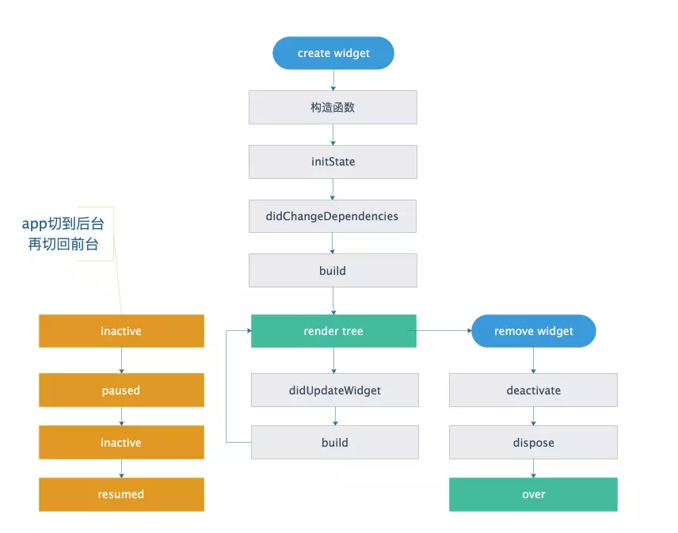

## Flutter 生命周期

### Widget 生命周期

在 StatefulWidget 插入到 widget 树中时，会通过 StatefulWidget.createState() 方法创建 State 对象。如果从树中删除后再插入，则会重新创建 State 对象，以简化 State 的生命周期。

State 对象有两个常用属性：

- widget: 与该 State 关联的 widget 实例
- context

State 对象的生命周期如下：

- `createState`: 通过 StatefulWidget.createState() 方法创建 State 对象。
- 新创建的 State 对象和 BuildContext 关联，这种关联是永久的，State 对象用于不会修改 BuildContext，但是 BuildContext 本身可以随树及其子树一起移动。
- `initState`: 重写父类 initState，以执行一次依赖于 BuildContext(context 属性) 或 widget(widget 属性) 的初始化。
- `didChangeDependencies`: State 对象的依赖关系发生变化时调用，会在 initState 后立即调用。或者比如组件依赖系统的主题发生改变、或者组件的子组件是 InheritedWidget，状态发生了变化后调用。
- `build`: 构建视图。会在 `initState()`、`didUpdateWidget()`、`setState()`、`didChangeDependencies()`后调用。
- `reassemble`: 专门为开发调试提供，在 hot reload 时会被调用。release 模式下不会调用。
- `didUpdateWidget`: widget 重新构建时，会调用 `Widget.canUpdate` 来检测 Widget 树中的新旧节点是否需要更新，它在新旧 widget 的 key 和 runtimeType 相等时更新，调用 `didUpdateWidget`。很少重写，可以做一些网络请求。
- `deactivate()` : State 被从视图中移除时调用，比如页面切换、或销毁时。如果将子树移除后，重新插入，即移动位置，则不会调用`dispose()`。如果没有重新插入，则会调用`dispose()`。
- `dispose`: 子类应重写此方法以释放资源。调用 `dispose` 后，State 对象被卸载， mounted 属性为 false。再使用 setState 会报错。

## Android 生命周期

Activity 生命周期

onCreate.
onStart
onResume
— — — — — — — —
onPause
onStop
(forever alone onRestart)
onDestroy

### IOS 生命周期

UIViewController

viewDidLoad
viewWillAppear
viewDidAppear
— — — — — — — — — — —
viewWillDisappear
viewDidDisappear
viewDidUnload
