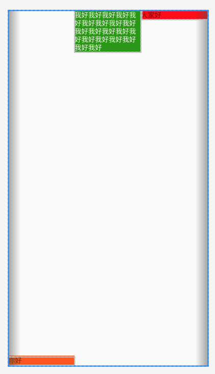
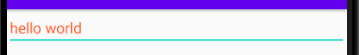

## 简介

Andy Rubin: android 开发领头人，原 google 公司副总裁。

-   SDK: software development kit 软件开发工具包
-   NDK: native developement kit，Android 原生工具开发包，某些开发中可能要接入 c, c++

**Android 系统架构**


**project 和 module**

android studio 工具：

-   工作区间 project
-   工程 module

Project 是最顶级的结构单元，一个 Project 可以有多个 Module。目前，主流的大型项目结构基本都是多 Module 的结构，这类项目一般是按功能划分的，模块之间彼此可以相互依赖。

**如何创建 Android 工程**

-   sdk 选择
-   activity, layout 的创建

**页面的组成部分**

-   activity: 逻辑代码
-   layout: ui

通常主页面叫 MainActivity，布局叫做 activity_main，
创建 project 时，会自动创建一个叫做 app 的 module。

**创建 module**

创建`Phone & Table module`，创建后会和 app 同级别目录，它是可以单独运行的。

运行 module 的 2 种方法:

1. 选择工具栏选择后运行。
2. 进入 module 右键 MainActivity 运行 Run。

**删除 module 的方法**

首先右键 `Open Module Settings(command+下)`，将模块移除，然后再右键删除。


**导入 module**

**Android 目录结构**

```
- res: Android 应用程序设置图标
- src: java 代码目录
- gen: 自动生成的，用来存放资源 id
- libs: 存放第三方包
```

**Gradle**

google 官方的 Android 主流的编译工具。

```
项目级别
    - setting.gradle  记录哪些 module 应该加入编译过程
    - build.gradle 配置会被用到所有的项目中
Module级别
    - build.gradle 如果和项目级别 build.grade 重复，则会覆盖项目的 gradle
```

**Gradle 中的部分配置**

-   `minSdkVersion`: 兼容的最小 API level，如果设备 API 版本低于这个 API level，则设备会阻止安装。
-   `compileSdkVersion`: 编译的 SDK 版本，建议用最新的，不会打包到应用里，只是会编译警告或错误。
-   `targetSdkVersion`: 目标版本，同一个应用在不同设备上可能产生差异，这个属性用于禁止可能产生的差异。
-   `dependencies`: 依赖配置，依赖的库。

## 常见问题

### 导入项目版本兼容问题

```
// 1. 项目的 build.gradle 不一致
dependencies {
    // 将这个版本改为现在的
    classpath 'com.android.tools.build:gradle:3.0.1'
}

// 2. gradle-wrapper.properties
// 在项目/gradle/wrapper/gradle-wrapper.properties
// 下载下来后，把远程地址改为本地的 file://
distributionUrl=https://services.gradle.org/distributions/gradle-4.1-all.zip

3. module 中的 build.gradle 文件
```

### gradle 更新问题

```
1. Error: Unable to tunnel through proxy, Proxy returns 'HTTP/1.1 400 Bad Request'
一般是自己的工具打开别的工具开发的项目导致


2. gradle 一直更新状态
3. Gradle project sync failed
```

## android 运行流程

1. 根据 `AndroidManifest.xml` 启动应用，并打开首页。

```xml
<!-- 配置页面 -->
<activity android:name=".MainActivity">
    <!-- intent-filter 代码放在哪儿，就会首先打开哪个页面 -->
    <intent-filter>
        <!-- 指定为启动页面 -->
        <action android:name="android.intent.action.MAIN" />
        <!-- 让应用在应用列表里面形成图标 -->
        <category android:name="android.intent.category.LAUNCHER" />
    </intent-filter>
</activity>
```

2. 根据 MainActivity 执行 MainActivity.java 代码。

```java
public class MainActivity extends AppCompatActivity {

    @Override
    protected void onCreate(Bundle savedInstanceState) {
        super.onCreate(savedInstanceState);

        // 设置视图
        setContentView(R.layout.activity_main);
    }
}
```

3. 展示页面模版 `res/layout/activity_main.xml`。

## 布局

### Activity

Activity: 可视化的界面类

-   `MainActivity extend AppCompatActivity`
-   `onCreate()`：打开界面就会执行，初始化工作
-   `setContentView(R.layout.activity_main)`: 设置视图内容

R: 为每个资源文件按类别分配一个索引，使程序员通过 `R.类别名.资源名` 去操作对应的资源。

-   布局文件: layout 里的 xml 文件
-   清单文件: `AndroidManifest.xml`，可以指定启动界面

### 常用布局

常用布局如下：

-   线性布局 LinearLayout：横着或竖着布局
-   相对布局 RelativeLayout：相对某个元素布局
-   帧布局 FrameLayout: 一层层叠加布局
-   表格布局 TableLayout
-   网格布局 GridLayout
-   约束布局 ConstraintLayout

**添加布局的方式**

1. 利用 xml 文件设计。

```java
setContentView(R.layout.activity_main);
```

2. 使用 java 代码添加。

```
LinearLayout ll = new LinearLayout(this);
ll.setLayoutParams(new LinearLayout.LayoutParams(ViewGroup.LayoutParams.MATCH_PARENT, ViewGroup.LayoutParams.MATCH_PARENT));
ll.setBackgroundColor(Color.RED);
setContentView(ll);
```

### 线性布局 LinearLayout

新建 LinearLayout 布局文件，注意名称只能由`小写字母`、`下划线_` 组成。

**通用布局属性**

-   `android:layout_width` 宽度：
    -   `match_parent`: 和父容器一样大，如果没有父容器，则和屏幕一样
    -   `wrap_content`: 和内容一样大，最大为屏幕大小
    -   数值+单位， 如 100dp。dp、px、sp、in、mm、pt
-   `android:layout_height` 高度
-   `android:layout_padding` 内边距
-   `android:layout_margin` 外边距

**线性布局属性**

-   `android:orientation` 设置主轴的方向
-   `android:layout_weight` 权重，相当于 flex
-   `android:layout_gravity` 重力，设置元素在副轴上的布局，bottom、center 等。

三个元素，如果要第一个元素占满空余空间，就设置 `android:layout_weight=1`，如果要最后一个元素占满空余空间，可以设置`android:layout_width=match_parent`。如果要按比例分配，要设置 `android:layout_width=0dp`。如果不设置 0dp，文字超长的情况下会挤出更长的宽度，如下图。


所以设置 weight 时候，最好将 width 设为 0dp。

文本字体大小 `android:textSize=20sp`，单位为 sp。

```xml title="linearlayout_test.xml"
<?xml version="1.0" encoding="utf-8"?>
<LinearLayout xmlns:android="http://schemas.android.com/apk/res/android"
    android:layout_width="match_parent"
    android:layout_height="match_parent"
    android:orientation="horizontal">

    <TextView
        android:layout_width="0dp"
        android:layout_height="wrap_content"
        android:text="你好"
        android:layout_weight="1"
        android:background="#f50"
        android:layout_gravity="bottom"
        ></TextView>
    <TextView
        android:layout_width="0dp"
        android:layout_height="wrap_content"
        android:text="我好我好我好我好我好我好我好我好我好我好我好我好我好我好我好我好我好我好我好我好"
        android:background="#290"
        android:textColor="#fff"
        android:layout_weight="1"
        ></TextView>
    <TextView
        android:layout_width="0dp"
        android:layout_height="wrap_content"
        android:text="大家好"
        android:background="#f00"
        android:layout_weight="1"
        ></TextView>
</LinearLayout>
```



### 相对布局 RelativeLayout

**相对布局的重要属性**

-   相对于父容器(取值：true/false)，可以多个一起使用
    -   `android:layout_centerInParent` 在父容器中间
    -   `android:layout_alignParentLeft` 靠左
    -   `android:layout_alignParentRight` 靠右
    -   `android:layout_alignParentTop` 靠上
    -   `android:layout_alignParentBottom` 靠下
    -   `android:layout_centerVertical` 垂直居中
    -   `android:layout_centerHorizontal` 水平居中
-   相对于其它控件(取值：其它控件 id，如 `@id/center`)，通过`android:id="@+id/center"`给元素添加 id。
    -   `android:layout_toLeftOf` 在左边
    -   `android:layout_toRightOf` 在右边
    -   `android:layout_above` 在上面
    -   `android:layout_below` 在下面
    -   `android:layout_alignRight` 右边对齐
    -   `android:layout_alignLeft` 左边对齐
    -   `android:layout_alignTop` 上边对齐
    -   `android:layout_alignBottom` 下边对齐

```xml title='relativelayout_test.xml'
<?xml version="1.0" encoding="utf-8"?>
<RelativeLayout xmlns:android="http://schemas.android.com/apk/res/android"
    android:layout_width="match_parent" android:layout_height="match_parent">
    <TextView
        android:id="@+id/center"
        android:layout_width="100dp"
        android:layout_height="100dp"
        android:background="#f50"
        android:layout_centerInParent="true"
        ></TextView>
    <TextView
        android:layout_width="100dp"
        android:layout_height="100dp"
        android:background="#f50"
        android:layout_below="@id/center"
        android:layout_toRightOf="@id/center"
        ></TextView>
    <TextView
        android:layout_width="100dp"
        android:layout_height="100dp"
        android:background="#f50"
        android:layout_below="@id/center"
        android:layout_toLeftOf="@id/center"
        ></TextView>
    <TextView
        android:layout_width="100dp"
        android:layout_height="100dp"
        android:background="#f50"
        android:layout_above="@id/center"
        android:layout_toRightOf="@id/center"
        ></TextView>
    <TextView
        android:layout_width="100dp"
        android:layout_height="100dp"
        android:background="#f50"
        android:layout_above="@id/center"
        android:layout_toLeftOf="@id/center"
        ></TextView>
</RelativeLayout>
```


### 帧布局 FrameLayout

重要属性

-   `andrioid:layout_gravity`: 控件重力，相对于父容器位置，比如右下`right|bottom`。
-   `android:foreground`: 前景，给 FrameLayout 设置。它处于帧的最上面。
-   `android:foregroundGravity`: 前景重力，相当于 z-index

路由页面跳转:

```
startActivity(new Intent(this, FrameActivity.class));
```

### 表格布局 TableLayout

表格布局是 `<TableLayout>`。如果直接在 TableLayout 中添加控件，那么控件将会和父容器等宽。

表格中的多行要使用 `<TableRow>`，TableRow 中控件的宽度默认为 wrap_content。

TableLayout 的重要属性:

-   `android:stretchColumns`: 设置可伸展的列，如值为`'0,1,2,3'`。
-   `android:shrinkColumns`: 设置可收缩的列，如`'1,2'`。
-   `android:collapseColumns`: 设置隐藏的列，如`'1'`

### 网格布局 GridLayout

GridLayout 网格布局的形式就是一个个格子摆放，写入的控件会自动分配一个格子的大小。

GridLayout 的重要属性:

-   `android:rowCount`: 行数量
-   `android:columnCount`: 列数量
-   `android:layout_row`: 位于第几行，从 0 开始算
-   `android:layout_column`: 位于第几列
-   `android:layout_rowSpan`: 跨几行，需要搭配 `android:layout_gravity='fill'`(会撑满网格)使用。

### 约束布局 ConstraintLayout

ConstraintLayout 约束布局类似与 css 里的 `position:absolute` 布局，它设置一个约束参考元素(relative)，然后设置偏移量。

约束布局的优点：

1. 约束布局更适合可视化操作来搭建页面。
2. 能使页面更加扁平化，减少嵌套。

**重要属性**

-   `app:layout_constraintBottom_toBottomOf`: 约束当前 view 的底部位置到某个元素的底部，属性值为 `parent` 或参照物的 id。
-   `tools:layout_editor_absoluteX`: 控件在布局中 x 轴的绝对位置。
-   `app:layout_constraintHorizontal_bias`: 相对参照物的偏移量，值范围是 [0, 1]。
-   `app:layout_constraintVertical_bias`: 相对参照物的偏移量，值范围是 [0, 1]。
-   `app:layout_constraintGuide_percent`: 百分比

**概念**

-   Guideline，点击多次，切换左、右、百分比
-   自动约束

## UI 基础控件

UI 组件的父控件是 View。下面是一些常见的 View。

-   TextView 处理文本内容
-   Button
-   ImageView
-   EditText: 输入框
-   ProgressBar

通用属性

| 属性                                                                                   | 常见可选值                                                                                                                                           |
| -------------------------------------------------------------------------------------- | ---------------------------------------------------------------------------------------------------------------------------------------------------- |
| android:layout_width                                                                   | match_parent 填充整个父容器 <br/> wrap_content 根据所含内容确定 <br/> 正整数单位 dp 精确大小                                                         |
| android:layout_height                                                                  | 同上                                                                                                                                                 |
| android:id                                                                             | @id/valName 使用已存在 id <br/> @+id/valName 添加新的 id                                                                                             |
| android:layout_margin                                                                  | 正整数单位 dp 和相邻控件或边缘的距离                                                                                                                 |
| android:padding                                                                        | 正整数单位 dp 控件内容距离控件边缘的距离                                                                                                             |
| android:background                                                                     | 十六进制颜色值 颜色作为背景 <br/> @mipmap/resourceId 图片作为背景                                                                                    |
| android:layout_gravity(相对于父容器副轴) <br/> android:gravity(内容相对控件本身的位置) | center_horizontal 水平居中 <br/> center_vertical 垂直居中<br/> center 水平垂直居中 <br/> left 居左 <br/> right 居右 <br/> top 居顶 <br/> bottom 局底 |
| android:visibility                                                                     | visible 可见状态 <br/> invisible 不可见状态，但保留控件位置 <br/> gone 不可见状态，也不保留位置                                                      |

```
setVisibility(View.VISIBLE);
```

### TextView

**TextView 的继承关系**

```java
class TextView extends View{}
class Button extends TextView{}
class EditText extends TextView{}
```

TextView 支持的功能：

-   对长文本进行显示处理
-   支持 html 代码
-   内容有样式、链接效果

在布局里面显示文本的方法。

```java
// res/values/strings.xml
<string name="app_name">imooc</string>

// 布局 xml 文件中通过 name 引用
<TextView android:text="@string/app_name"></TextView>
```

**TextView 的属性**

```
android:textSize='22sp'    文字大小
andorid:textColor='#f50'   文字颜色
android:lineSpacingExtra='15sp' 行间距
android:lineSpacingMultiplier='2' 倍距

// 已经废弃，文字显示一行的方法
android:singleLine="true"  设置文字单行
android:ellipsize="start" 设置省略号位置

// 新的替代方案
android:lines="1"  设置显示多少行

// 跑马灯效果
android:singleLine="true"
android:ellipsize="marquee"
android:focusable="true"  // 获取屏幕焦点，屏幕只有一个焦点，所以不能多个跑马灯
android:focusableInTouchMode="true"  // 触摸时获取焦点
android:marqueeRepeatLimit="marquee_forever"  // 重复次数
```

### EditText

EditText 是输入文本框组件。

| 属性                  | 值                                                                                                                |
| --------------------- | ----------------------------------------------------------------------------------------------------------------- |
| android:inputType     | textPassword 密码 <br/> number 数字 <br/> numberSigned 整数 <br/> numberDecimal 小数 <br/> 可以使用如或组合多个值 |
| android:hint          | 文字占位字符                                                                                                      |
| android:textColorHint | 占位字符的颜色                                                                                                    |
| android:maxLength     | 最长多少字符 ｜                                                                                                   |

java 中可以通过 `.getText().toString()` 获取到输入框的值。

```xml
<EditText
    android:layout_width="match_parent"
    android:layout_height="wrap_content"
    android:hint="hello world"
    android:text="文本框的值"
    android:textColorHint="#f50"
    android:inputType="numberSigned"></EditText>
```



### Button

Button 注册点击事件的方法：

1. 自定义内部类

```java
<Button
    android:id="@+id/btn1"
    android:layout_width="match_parent"
    android:layout_height="wrap_content"
    android:text="通过自定义内部类实现点击事件"></Button>

// 添加事件
Button btn1 = findViewById(R.id.btn1);
MyClickListener mcl = new MyClickListener();
btn1.setOnClickListener(mcl);

class MyClickListener implements View.OnClickListener {
    @Override
    public void onClick(View view) {
        // 控制台打印语句，e 表示 error
        Log.e("TAG", "点击了通过注册了自定义内部类监听器对象的按钮");
    }
}

```

2. 匿名内部类

```java
Button btn2 = findViewById(R.id.btn1);
    btn1.setOnClickListener(new View.OnClickListener(){
        @Override
        public void onClick(View view) {
            Log.e("TAG", "点击了通过注册了匿名内部类监听器对象的按钮");
        }
    });
```

3. 当前 Activity 去实现事件接口

```java
// 1. implements View.OnClickListener
public class MainActivity extends AppCompatActivity implements View.OnClickListener {

    @Override
    protected void onCreate(Bundle savedInstanceState) {
        super.onCreate(savedInstanceState);
        setContentView(R.layout.activity_main);

        // 2. 注册事件监听器
        Button btn3 = findViewById(R.id.btn3);
        btn3.setOnClickListener(this);
    }

    @Override
    public void onClick(View view) {
        Log.e("TAG", "Activity 注册的按钮");
    }
}
```

4. 在布局文件中添加点击事件属性 `android:onClick`，注意 `onClick` 方法要公开 public。

```xml
<Button
    android:layout_width="match_parent"
    android:layout_height="wrap_content"
    android:text="在xml中绑定"
    android:onClick="onClick"
    ></Button>
```

`onClick`的事件对象`View view`的常用属性如下：

-   `view.getId()` 获取 id，如 R.id.btn1。

```java
@Override
public void onClick(View view) {
    switch (view.getId()) {
        case R.id.btn_xml:
            Log.e("TAG", "btn_xml");
            break;
        default:
            Log.e("TAG", "btn_other");
            break;
    }
}
```

其它元素可以添加点击事件，如文本。

### ImageView

ImageView 用来显示和控制图像的控件，可以放大、缩小、旋转等操作。

ImageView 常见的属性有：

-   `android:src`: 指定前景的图片资源，图片比例会保持不变，像 css 的 contain 模式显示。
-   `android:background`: 指定图片的背景图片资源，会拉伸适配控件的大小。

图片放在资源文件夹中： `res/drawable` 或 `res/mipmap` 中。资源命名要求：`小写字母`、`下划线_`、`数字`组合。

mipmap 文件夹的图片会被 mipmap 机制处理。而 drawable 不会。比如缩放，mipmap 会根据情况选择不同的文件，而 drawable 会始终选择同一张图片。

`ImageButton`: 按钮图片组件，结合了 Button 和 ImageView 的属性。


### ProgressBar

ProgressBar 是进度条控件，默认是圆形，没有刻度，是一个不短旋转的动画效果。通过设置 style，可以显示为水平刻度进度条。


ProgressBar 常见属性：

-   `android:progress`: 进度
-   `style="?android:attr/progressBarStyleHorizontal"`: 水平进度条
-   `android:max`: 进度条最大值
-   `android:indeterminate`: true 让进度条一直运动

在 Android4.0 以后不能直接在线程中操作控件，进度条是个特例：

```java
new Thread() {
    @Override
    public void run() {
        for (int i = 0; i <= 100; i++) {
            pb.setProgress(i);
            try {
                Thread.sleep(1000);
            } catch (InterruptedException e) {
                e.printStackTrace();
            }
        }
    }
}.start();
```

### Toast

```
// 语法
Toast.makeText(context, msg, Toast.LENGTH_SHROT).show()

// 例如
Toast.makeText(this, "加载中..", Toast.LENGTH_LONG).show();
```

android studio 链接 网易 mumu 模拟器：

```
// mac
adb kill-server && adb server && adb shell

// win
adb connect 127.0.0.1:7555
adb shell
```

输入上面命令后，就可以在 android studio 里看到模拟器了。

https://juejin.im/post/5cff546e5188253cec3068ef#heading-30
https://mp.weixin.qq.com/s/d9QCoBP6kV9VSWvVldVVwA
