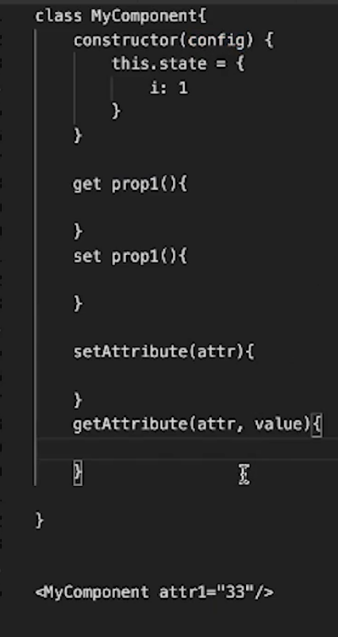
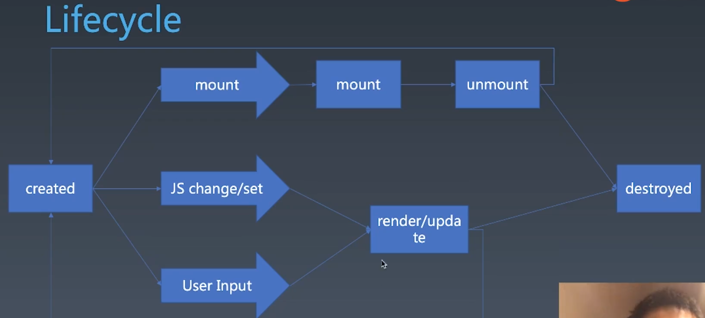
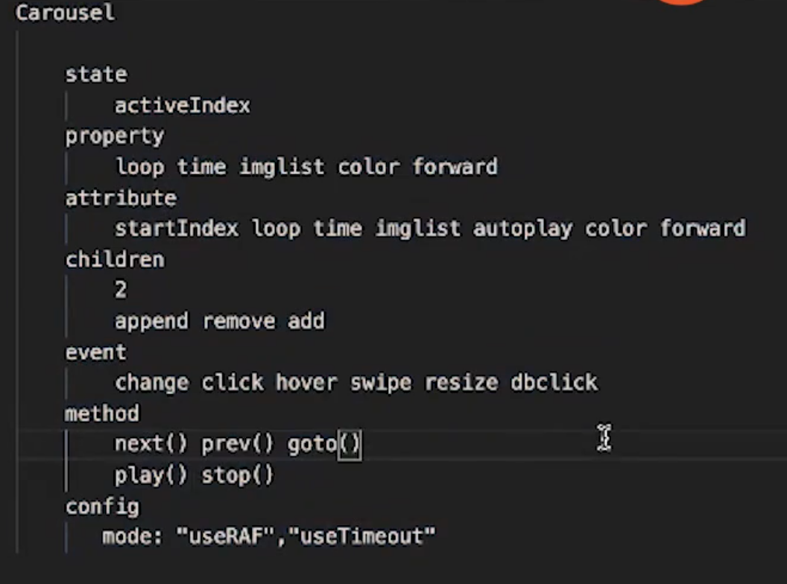
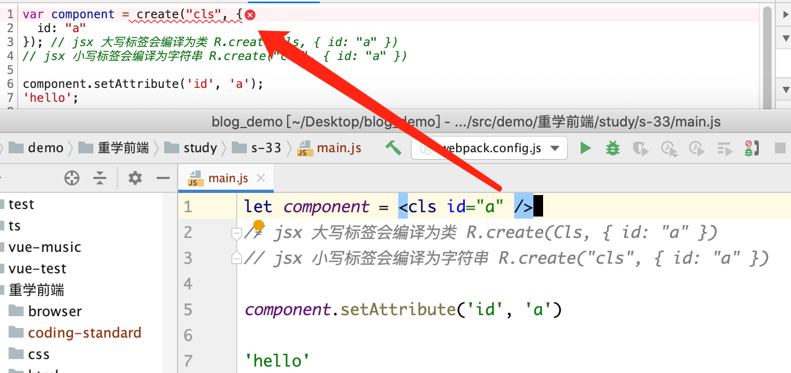
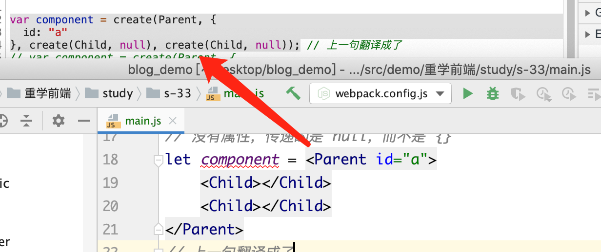
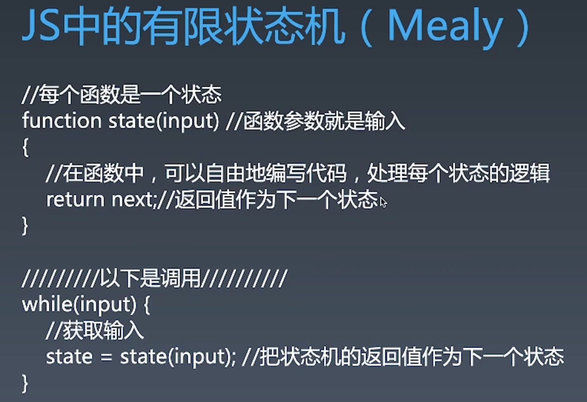
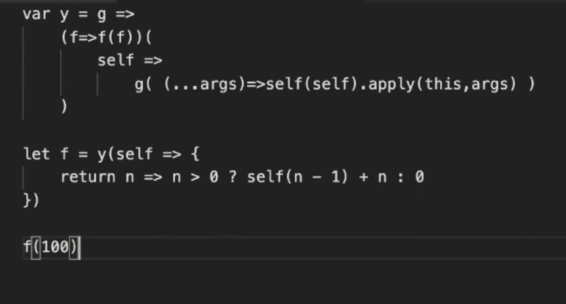

# 重学前端

## 22. DOM API

addEventListener()
第二个参数可以是一个对象 {handleEvent:()=>{}}
第三个参数可以是一个对象

```
{
  capture,
  once,
  passive,
}
```

事件模型：捕获、冒泡

## 23. 其它 API

### Range API

Range 接口表示一个包含节点与文本节点的一部分的文档片段。

**创建**

-   document.createRange()
-   new Range()
-   根据 Selection 对象的 getRangeAt 方法获取

**属性**

-   Range.collapsed 返回开始和终点是否相同
-   Range.endContainer 包含终点的节点
-   Range.startContainer 包含起点的节点
-   Range.startOffset 起点在开始节点中的位置
-   Range.endOffset 终点在结束节点中的位置
-   Range.commonAncestorContainer 包含开始和结束节点的最深的一级公共节点

**方法**

-   range.setStart(startNode, startOffset)
-   range.setEnd()
-   range.setStartBefore(referenceNode)
-   range.setStartAfter(referenceNode)
-   range.setEndBefore(referenceNode)
-   range.setEndAfter(referenceNode)
-   range.selectNode(referenceNode);
-   range.selectNodeContents(referenceNode)
-   range.cloneContents()
-   range.deleteContents()
-   range.extractContents() 将 range 的内容移动到一个文档碎片里
-   range.insertNode() 在 range 起点处插入一个节点
-   range.surroundContents(newParent) 将 range 移动到一个新的节点，注意是新的，否则报错
-   range.compareBoundaryPoints() 比较 range 的端点
-   range.cloneRange()
-   range.detach() 释放，改善性能
-   range.toString()

### CSSOM

CSSOM 可以用来操作 style 样式

```
document.styleSheets
document.styleSheets[0].cssRules
```

window.getComputedStyle(elt, pseudoElt): 第二个参数是伪元素

```
document.styleSheets[0].cssRules[0].style.fontSize = '40px'
```

datauri 格式 : `data:image/svg,base46,经过base64的字符`

窗口 API:

-   window.open

```js
// _self _blank, _parent _top
// 不写第三个参数，会打开一个 tab
let childWindow = window.open(
    "about:blank",
    "_blank",
    "width=100,height=100,left=100,top=100"
);
childWindow.moveBy(0, 0);
childWindow.resizeBy(0, 0);
```

滚动 API

-   window.scrollX
-   window.scrollY
-   window.scrollBy(0, 50)
-   window.scrollTo(0, 50)
-   element.scrollLeft
-   element.scrollTop
-   element.scrollBy(0, 50)
-   element.scrollTo(0, 50)
-   element.getClientRects(): 返回元素中每一个盒子的边界矩形的矩形集合，比如 span 里多行文字，会有多个边界矩形。不包含伪元素。
-   Element.getBoundingClientRect()：返回元素的大小及其相对于视口的位置。是按实际看到区域来的。如果是标准盒子模型，元素的尺寸等于 width/height + padding + border-width 的总和。如果 box-sizing: border-box，元素的的尺寸等于 width/height。
-   window.innerHeight, window.innerWidth 和 document.documentElement.getBoundingClientRect() 相同
-   window.outerHeight, window.outerWidth 包含滚动条
-   window.devicePixelRatio 逻辑像素与物理像素比

-   offsetHeight 只比 clientHeight 多了边框 border 和 滚动条，display:none 时返回 0
-   offsetParent: 非 position:static 上层元素，如果本元素为 display: none 或 fixed，则 offsetParent 返回 null。如果没有，则为 body。
-   offsetLeft 根据 offsetParent 来的。
-   scrollHeight: 包含溢出，padding、滚动条、伪元素。
-   clientLeft: 左边框宽度,行内元素返回 0
-   clientHeight: 元素的高度，包括 padding，不包括滚动条

```
document.documentElement.scrollLeft
document.documentElement.scrollTop
document.documentElement.clientHeight 视口高度
document.body.clientHeight 网页总高度
```

## 24. 编程与算法训练 TicTacToe 井字棋

## 32. 组件的基础知识与轮播组件

### 对象与组件

对象

-   Properties
-   Methods
-   Inherit

组件

-   Properties
-   Methods
-   Inherit
-   Attribute
-   Config & State
-   Event
-   Lifecycle
-   Children

结构图

Attribute 和 Property 的区别？

-   Attribute 强调描述性，外部的描述
    -   html 和 js 都能设置
-   Property 强调从属关系
    -   只有 js 能设置

```
Attribute
<my-component attribute="v" />
myComponent.getAttribute("a")
myComponent.setAttribute("a", "value")

Property
myComponent.a = "value"
```

-   有些名字不一样，如

```
<div class="cl1">
div.className 关键字
div.classList
```

-   input: attr 像是 prop 的默认值。一旦设置了 prop，attr 就改不了了。




### lifecycle

```
created
```



### Children

Content 型 Children 与 Template 型 Children。

```
<my-button>
    {{title}}
</my-button>

<my-list data>
    <li>{{title}}
</my-list>
```

实战：设计轮播图组件

config 是与业务无关的

组件化的本质就是方案：



## 33. 为组件添加 JSX 语法




jsx 的构建顺序是先子后父。

## 34. 轮播组件实现

1.  原生实现
2.  移植到 react

## 35. 组件化 Vue 风格的 SFC

SFC: single file component

## 12. 有限状态机

FSM Finite State Machine 有限状态机

每个状态机都是一个机器

-   在每个机器里，我们可以做计算、存储、输出
-   所有的这些机器接受的输入是一致的(可以理解为参数一致的函数，不能这个是字符串，那个是数字)
-   状态机每一个机器本身没有状态，如果我们用函数来表示的话就是纯函数(无副作用)

每个机器知道下一个状态

-   每个机器都有确定的下一个状态(Moore)
-   每个机器根据输入决定下一个状态(Mealy)



state 是当前状态

## 13. 浏览器工作原理:HTTP 协议+语法与词法分析（三）

先讲了 11 节的错误，是 16 进制，不是 10。

这节主要是讲用状态机 parser html

EOF: end of file

1.  处理标签
    主要标签： 开始 结束 自封闭

解析 html

思路：

1.  搜集标签
2.  搜集属性
3.  标记 token

```
{
  type: 'tagStart',
  tagName: '',
  属性
  content: '',
}
```

-   从标签构建 DOM 树的基本技巧是使用栈
-   遇到开始标签时创建元素并入栈，遇到结束标签时出栈
-   自封闭节点可视为入栈后立刻出栈
-   任何元素的父元素是它入栈前的栈顶

## 40. 工具链: 整体理解一个工具链的设计（一）


演示了 vue-cli create-react-app 的使用


### 使用 yeoman 搭建脚手架

https://yeoman.io/authoring/index.html

1.  初始化项目，安装 `npm i yeoman-generator`

2.  手动 创建目录 generators

```
- package.json
- generators
    - app
        - index.js
    - router
        - index.js
```

npm link 后允许 `yo name`
yo name // 不需要 generator，项目名称为 generator

### 关于 yeoman 报错：requires yeoman-environment at least 3.0.0-beta.1 解决方案

```
解决办法
将yeoman-generator的版本降到4.0
或者5.0需要全局安装yeoman-environment，并且使用yo run <your generator>
```

## 41 工具链: 整体理解一个工具链的设计（二）

演示了 yeoman 基础用法。

yeoman 能力

1.  获取用户信息
2.  npm install
3.  模版文件

如何用原生实现一个命令行选择器。

-   通过鼠标控制光标
-   控制文本颜色

有多个软件包可用于在 Node.js 中格式化控制台文本。最受欢迎的是：

chalk
cli-color
colors


## 42 工具链: Dev 工具

Server

-   build: webpack babel vue jsx postcss
-   watch: fsevent
-   mock
-   http: ws http-server

Client

-   debugger: vscode devtool
    工作原理是：vscode 调试时，执行的命令 node 带 brk(服务端)，可以和客户端通信来控制
-   source map ?

## 43 工具链: 设计并实现一个单元测试工具（一）

mocha
ava 会测试所有 `*.js`:

```
// https://github.com/avajs/ava-docs/blob/main/zh_CN/readme.md
{

}
```

coverage istanbul
nodejs 写 es6，因为测试里要引用前端 js

nyc 是 Istanbul 的命令行接口，即

```
nyc mocha  // 如果安装了 jest，则不需要安装 nyc，如果用 mocha ，则要手动安装
```

## 44 工具链: 设计并实现一个单元测试工具（二）

主要是使用 assert 给 htmlparser 添加测试，并修复 bug

学一下 node 的 assert 模块
动手：使用 jest 修复 htmlparser

## 45 工具链：目录结构与初始化工具

使用 yeoman 创建脚手架
支持 webpack webpack-dev-server babel test less

语义化版本

## 46 发布系统: 实现一个线上 Web 服务（一）

express

```
express --no-view -c less ./server/
banlideMacBook-Pro:demo1 banli$ express --help

  Usage: express [options] [dir]

  Options:

        --version        output the version number
    -e, --ejs            add ejs engine support
        --pug            add pug engine support
        --hbs            add handlebars engine support
    -H, --hogan          add hogan.js engine support
    -v, --view <engine>  add view <engine> support (dust|ejs|hbs|hjs|jade|pug|twig|vash) (defaults to jade)
        --no-view        use static html instead of view engine
    -c, --css <engine>   add stylesheet <engine> support (less|stylus|compass|sass) (defaults to plain css)
        --git            add .gitignore
    -f, --force          force on non-empty directory
    -h, --help           output usage information
```

```
publish-server 负责将代码数据发布到 server 上线
publish-tool 负责将本地代码数据发送到 publish-server 上去
server 线上服务
```

学习 http 模块

-   发送 get post 数据，并接受返回的数据
-   获取相应头、响应状态码等

学习 express api 文档

## 47 发布系统: 实现一个线上 Web 服务（二）

学习 node 流 stream

## 48 发布系统: lint 与 PhantomJS

-   eslint
-   [plantomjs](https://phantomjs.org/download.html)

```
npx eslint --init
```

## 49 发布系统: OAuth

## 50 发布系统: git hook 与 lint

## 51 发布系统: 使用无头浏览器与 DOM 检查
