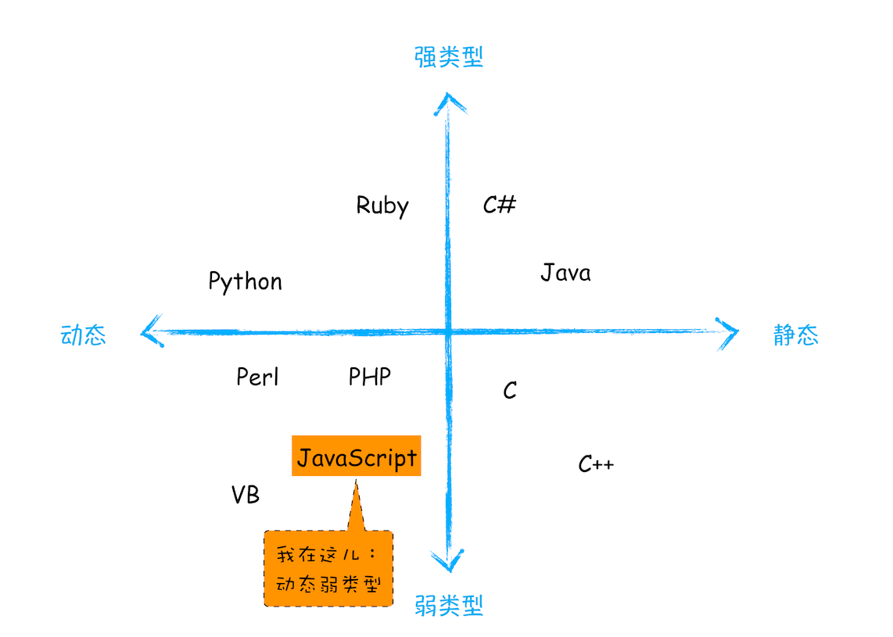
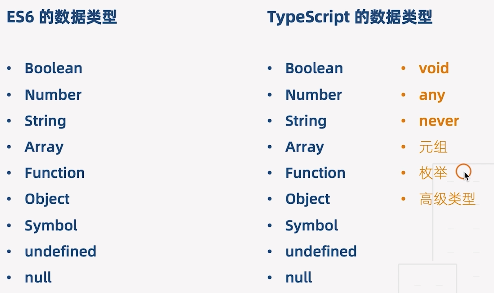
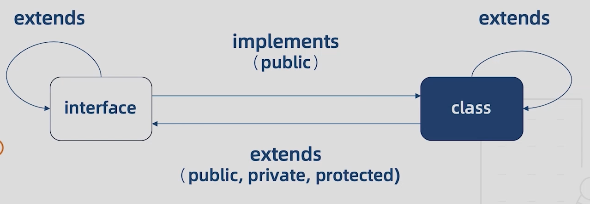
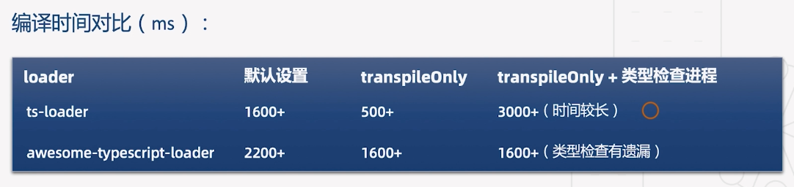
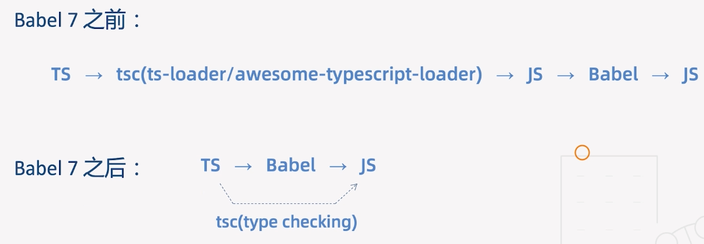
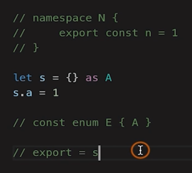

# typescript

## 静态类型与动态类型



静态类型和动态类型指的是类型检查(type check)发生的时机。

类型是语言语法的一部分，但到底是静态检查还是运行期检查，或者是根本不检查，那就是编译器解释器的行为了。

静态类型：编译器在 compile time 执行类型检查。编译的时候就知道每一个变量的类型，因为类型错误而不能做的事情是语法错误。

动态类型：编译器在 runtime 执行类型检查。编译的时候不知道每一个变量的类型，因类型错误而不能做的事情是运行时错误。譬如说你不能对一个数字 a 写 `a[10]`当数组用。

> js 编译时错误和运行时错误：通过在代码上面 console，如果 console 了,则是在运行了。

## 强类型与弱类型

类型安全性(type safe) 是指在碰到错误类型时是否还继续执行。

弱/强类型指的是类型检查的严格程度。
强类型就是检测类型错误时，程序中断执行。即偏向于不容忍隐式类型转换。
弱类型就是偏向于容忍隐式类型转换。
简单地说，在声明了一个变量之后，不能改变它的类型的语言，是静态语言；能够随时改变它的类型的语言，是动态语言。

## 使用

```
npm i -g typescript
tsc --init  // 会创建 tsconfig.js
```



类型注解: 相当于强类型语言中的类型声明。

```
语法 (变量函数): type
```



## 泛型

范型就是将类型作为变量。如函数就可以将此变量类型作为参数和返回值的类型。

好处：

1. 函数和类可以轻松支持多种类型，增强程序的扩展性
2. 不必写多条函数重载，冗长的联合类型声明，增强代码的可读性
3. 灵活控制类型之间的约束

## 类型检查机制

### 类型推断

不需要指定变量的类型, ts 会自动推断类型。

### 类型兼容性

当一个类型 Y 可以赋值给类型 X 时，我们就可以说类型 X 兼容类型 Y。

```
X 兼容 Y: X(目标类型) = Y(源类型)
```

- 类型兼容
- 接口兼容
- 函数兼容性

### 类型保护

可以帮助 ts 确定类型。

- instanceof
- in
- typeof

### 交叉类型和联合类型

交叉类型（Intersection Types）是将多个类型合并为一个类型，新的类型有多个类型的特性。

### 映射类型

```ts
// 映射类型：映射出一个新的类型
// 内置工具类型

// 把接口所有属性变成可读
interface Obj {
  name: string;
  a: string;
  b: string;
}
// type Readonly<T> = { readonly [P in keyof T]: T[P]; };
type ReadonlyObj = Readonly<Obj>;

// 将所有属性变成可选
type PartialObj = Partial<Obj>;

// 新的类型必须从 Obj 的 a b 属性中选取
type PickObj = Pick<Obj, "a" | "b">;

type RecordObj = Record<"x" | "y", Obj>;
```

### 条件类型

```ts
// T extends U ? X : Y
type TypeName<T> = T extends string
  ? "string"
  : T extends number
  ? "number"
  : T extends boolean
  ? "boolean"
  : T extends undefined
  ? "undefined"
  : T extends Function
  ? "function"
  : "object";

type T1 = TypeName<string>;
type T2 = TypeName<string[]>;

// (A|B) extends U ? X : Y
// (A extends U ? X : Y) | (B extends U ? X : Y)
type T3 = TypeName<string | string[]>;

// 从T 中过滤掉 U
type Diff<T, U> = T extends U ? never : T;
type T4 = Diff<"a" | "b" | "c", "a" | "e">;
type NotNull<T> = Diff<T, undefined | null>;
type T5 = NotNull<string | number | undefined | null>;

let t5: T5 = "hi";

// ts 已经实现
// Exclude(T, U)
// NonNullable<T>
// Extract<T, U>
type T6 = Extract<"a" | "b" | "c", "a">;

// ReturnType<T>
type T7 = ReturnType<() => string>;
```

## ES6 和 commonjs 模块

### es6

```ts
export a
export {a, b}
export interface P {}
export function f(){}
export { f as F}
export default function(){}
export {str as hello} from './b' // 引入外部模块，重新导出

import {a, b} from './a' // 批量导入
import {P} from './a' // 导入接口
import {f as F} from './a' // 导入时改名
import * as All from './a' // 导入所有，绑定到 All 上
import fn from './a'  // 导入默认
```

### commonjs

```
module.exports = a
exports.c = 3

require('./a.node')
```

`ts-node`可以直接执行 .ts 文件。

```
tsc ./a.ts -m amd -t es5
// 当 es6 时会默认 es6 模块，不看 -m 参数
```

两个模块混用时，如使用 es6 module 导出，commonjs 导入时。es6 module 默认导出会挂在 default 上，在 commonjs 里使用时需要通过 `a.default` 使用。所以最好避免混用。ts 也提供了 `export = ` 的方式来导出，它会被编译为 `module.exports = `，所以一旦导出后，其它的导出就失效了，如`export let a = 1`。这时，导入可以用下面方式：

```
export = {a: 1, b: 2}

// 下面三种方式在 "esModuleInterop": true 时都可以
let a = require('./a');
import a  = require('./a')
import a  from './a'    // "esModuleInterop": false 时失效
```

## 使用命名空间

命名空间现在有了模块化基本无用，主要是防止重名。它可以被拆分在多个文件里。

```
// a.ts
namespace Shape {
    export function square(x: number){
        return x * x
    }
}

// b.ts
/// <reference path="a.ts">
namespace Shape {
    export function circle(){}
}
Shape.circle()
Shape.square() // 使用了 a.ts 的函数，需要使用 reference 指令
```

它会被编译成一个自执行函数。

```
var Shape;
;(function(Shape){

})(Shape);
```

## 声明合并

同名的接口会被合并。

```
interface A{
    x: number;
    y: string;
    foo (bar: number): number;  // 5
    foo (bar: 'a'): number;  // 2
}
interface A{
    y: number;  // 会被覆盖
    foo(bar: string) : string; // 会进行函数重载 3
    foo(bar: number[]) : number[]; // 4
    foo (bar: 'a'): number; // 参数为常量会提升顺序 1
}
```

函数和命名空间合并

```
// 这 TM 的，不要用
function Lib(){}
namespace Lib {  // 需要放函数后面
    export let version = '1.0'
}
```

类和命名空间合并

```
class C{}
namespace Lib {
    export let state = 1
}
```

枚举和命名空间合并

```
// 顺序没有关系
enum Color{}
namespace Color{
    export function mix(){}
}
```

## 编写声明文件

## tsconfig.json

```json
{
  "files": [
    // 要编译的单文件列表
    "src/a.ts"
  ],
  "include": [
    // 要编译的文件目录
    "src/*/*"
  ],
  "exclude": [
    // 排除编译的文件或目录，默认会排除 node_modules下所有的文件和声明文件
    "src/lib"
  ],
  "extends": "./tsconfig.base.json", // 可以抽离出基础配置用来继承
  "compileOnSava": true, // vscode 不支持，保存时编译
  "incremental": true, // 增量编译，可以在后续编译提速
  "tsBuildInfoFile": "./buildFile", // 增量编译文件的存储位置
  "diagnostics": true, // 打印编译信息

  "compilerOptions": {
    "target": "es5", // 目标语言的版本
    "module": "commonjs", // 生成代码的模块标准
    "outFile": "./app.js", //  将多个相互依赖的文件编译为一个文件，用在 module 为 amd 时

    // es2019.array 支持 flat
    "lib": ["dom", "es5", "scripthost", "es2019.array"], // TS 需要引用的库，即声明文件，es5 默认会导入 "dom", "es5", "scripthost"
    "allowJs": true, // 允许编译 js 文件(js、jsx)
    "checkJs": true, // 允许在 js 文件中报错，通常与 allowJs 一起使用
    "outDir": "./out", // 指定输出目录
    "rootDir": "./", // 指定输入文件目录(用于输出)
    "declaration": true, // 生成声明文件
    "declarationDir": "./d", // 声明文件的输出路径
    "emitDeclarationOnly": true, // 只生成声明文件
    "sourceMap": true, // 生成目标文件的 sourceMap
    "inlineSourceMap": true, // 生成目标文件的 inline sourceMap
    "declarationMap": true, // 生成声明文件的 sourceMap
    "typeRoots": [], // 声明文件目录 默认 node_modules/@types
    "types": [], // 声明文件包

    "removeComments": true, // 删除注释
    "noEmit": true, // 不输出文件，只做类型检查
    "noEmitOnError": true, // 发生错误时不输出文件

    "noEmitHelpers": true, // 不生成 helper 函数(如 A extends B)，需额外安装 ts-helper
    "importHelpers": true, // 通过 tslib 引入 helper 函数，文件必须是模块

    "downlevelIteration": true, // 降级遍历器的实现(es3/5)

    "strict": true, // 开启所有严格的类型检查，开启后，下面的选项都是 true
    // "alwaysStrict": true, // 在代码中注入 "use strict"
    // "strictNullChecks": false,              /* 严格的 null undefined 检查 */
    "strictFunctionTypes": false, // true,      /* 不允许函数参数双向协变 */
    // "strictBindCallApply": true,           /* 严格检查'bind', 'call','apply' 函数类型 */
    // "strictPropertyInitialization": true,  /* 类的实例属性必须初始化 */
    // "noImplicitThis": true,                /* 不允许 this 有隐式 any 类型 */

    // "noUnusedLocals": true,                /* 检查只声明，未使用的局部遍历那个 */
    // "noUnusedParameters": true,            /* 检查未使用的函数参数 */
    // "noImplicitReturns": true,             /* 每个分支都要有返回值 */
    // "noFallthroughCasesInSwitch": true,    /* 防止 switch 语句贯穿 */

    // "esModuleInterop": true,        // 允许 export = 导出，由 import from 导入
    // "allowUmdGlobalAccess": true    // 允许在模块中访问 UMD 全局变量
    // "moduleResolution": "node",     // 模块解析策略
    // "baseUrl": "./",       // 解析非相对模块的基地址
    // "paths": {             // 路径映射，相对于 baseUrl
    //    "jquery": ["node_modules/jquery/dist/jquery.slim.min.js"]
    // },
    // "rootDirs": ["src", "out"]        // 将多个目录放在一个虚拟目录下，用于运行时，比如util.js 编译后存在 out 中，之后不用编译了，src 里只需要用相对路径引用 ./util.js 即可

    "listEmittedFiles": true, // 打印输出的文件
    "listFiles": true // 打印编译的文件(包括引用的声明文件)
  }
}
```

classic 解析策略 amd system es2015

node 解析策略


## ts-loader 到 babel

ts-loader 要做语言转换和检查，所以很慢，可以开启 transpileOnly 只转换进行加速。缺点是编译时无法进行类型检查。这是使用插件 fork-ts-checker-webpack-plugin 将类型检查放在单独的线程中。

awesome-typescript-loader

- 更适合与 babel 集成，使用 babel 的转义和缓存
- 不需要安装额外的插件，就可以把类型检查放在独立的进程中进行






```
@babel/cli
@babel/core
@babel/plugin-proposal-class-properties
@babel/plugin-proposal-object-rest-spread
@babel/preset-env
@babel/preset-typescript  转 .ts 文件
```

babel 不支持的 4 种语法


如何选择 ts 编译工具

1. 如果没有使用过 babel，首选 typescript 自身编译器(可配合 ts-loader 使用)
2. 如果项目中使用了 babel，安装 `@babel/preset-typescript`(可选 tsc 做类型检查)
3. 两种编译工具不要混用

## ESLint

TypeScript 官方转向 ESLint 的原因：

1. TSLint 执行规则存在架构问题，影响性能，而修复会破坏现有规则
2. ESLint 性能更好，更普及
   


```
@typescript-eslint/eslint-plugin 使eslint 识别ts特殊语法
@typescript-eslint/parser 为 eslint 提供解析器
```

babel-eslint 与 typescript-eslint

babel-eslint: 支持 TypeScript 没有的额外语法检查，抛弃 TypeScript，不支持类型检查
typescript-eslint: 基于 TypeScript 的 AST，支持创建基于类型信息的规则(tsconfig.json)

建议：

- 两者底层机制不一样，不要一起使用
- Babel 体系建议使用 babel-eslint，否则使用 typescript-eslint

## jest 测试

工具体系分 ts 系和 babel 系(不能进行类型检查)

编译工具: ts-loader，@babel/preset-typescript
代码检查工具： eslint + typescript-eslint，babel-eslint
单元测试工具 ts-jest，babel-jest

**ts-jest**

```
npx ts-jest config:init // 生成初始化文件 jest.config.js
```

**babel-jest**

```
npm i -D jest babel-jest @types/jest
```


## TS 的未来

- 未来
  - 弱类型/动态 -> 强类型/静态 ? 有必要 ?
  - 类型检查标准？
- ROI(投资回报率)
  - 收益
    - 提高代码质量
    - 增加代码可维护性
    - 提升开发效率
    - 重塑类型思维
  - 成本
    - 思维转换
    - 对接现有开发生态
    - 项目迁移
    - 接口、声明文件的维护
