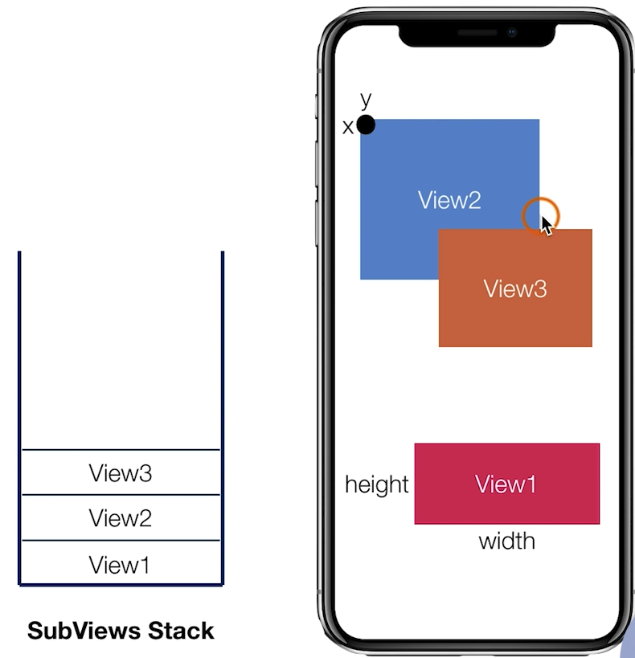

# ios开发

## 常见APP类型

**常见APP类型**

- 通信与存储
- 流媒体、直播技术
- 图片处理
- 内容展示、web
- 组件化
- IM类型
- 音视频、直播类型
- 摄影摄像类型
- 咨询类型
- 工具购物类型

**APP展示界面+动画**
- 底部 TabBar
- Navigation 导航
- 列表
- 图片 ImageView
- Button/Label
- TextView
- WebView
- 常见的动画

**APP通用技术架构**

- 网络
- 存储
- 图片
- 音频视频
- 数据解析
- 布局/渲染
- 启动
- 日志系统
- 上报系统

**APP常见功能**

- 复杂内容页
- 登录
- 分享
- 频道管理
- 推送/定位
- Extension
- 证书
- 上架流程

ios 开发常见软件

- Xcode
- Appcode
- Reveal
- wireshark
- charles
- machoview
- impactor
- apple configurator2
- prepo

## 实现APP基本界面

### IOS 中的 MVC

IOS 中的 MVC: 

```
Modal(数据)

视图(View)    管理(Controller)
UIView         UIViewController
```

### UIView

- 最基础的视图类，管理屏幕上一定区域的内容展示
- 作为各种视图类型的父类，提供基础的能力
- 外观、渲染和动画
- 响应区域内的事件
- 布局和管理子视图


**布局**

- 设置大小，位置。通过 frame 属性设置。
- addSubView

**使用栈管理全部的子View**

- 位置重叠的展示最后入栈的(像图层一样)
- 可以随时调整位置
- 插入到指定位置



### UIView 的生命周期

```
- (void)willMoveToSuperview:(nullable UIView *)newSuperview;
- (void)didMoveToSuperview;                               // 添加到父View中
- (void)willMoveToWindow:(nullable UIWindow *)newWindow;  // 展示到屏幕中
- (void)didMoveToWindow;
```

```c
#import "ViewController.h"

@interface TestView : UIView

@end

@implementation TestView

- (instancetype) init{
    self = [super init];
    if(self){
        
    }
    return self;
}

-(void) willMoveToSuperview:(UIView *)newSuperview
{
    [super willMoveToSuperview: newSuperview];
}

-(void) didMoveToSuperview
{
    [super didMoveToSuperview];
}

-(void)willMoveToWindow:(UIWindow *)newWindow
{
    [super willMoveToWindow: newWindow];
}

-(void)didMoveToWindow
{
    [super didMoveToWindow];
}
@end

@interface ViewController ()

@end

@implementation ViewController

- (void)viewDidLoad {
    [super viewDidLoad];
    
    TestView *view = [[TestView alloc] init];
    view.backgroundColor = [UIColor redColor];
    view.frame = CGRectMake(100, 100, 100, 100);
    [self.view addSubview:view];
}

@end
```

### UIViewController

视图控制器，用来管理视图 View 层级结构。相当于一个组件模块。

自身包含 View，可以理解为一个容器。

- 管理 View 视图的生命周期。
- 响应用户操作。
- 和 APP 整体交互。
- 视图的切换。

ViewController 的生命周期:

- init
- viewDidLoad: UIView 准备好了
- viewWillAppear
- viewDidAppear: View 展示

- viewWillDisappear
- viewDidDisappear
- Dealloc

通过 UIView 和 UIViewController 的特性搭建 App。

- UIView负责页面内容的展示。
- 使用基础的 UIViewController 管理多个 UIView。
- UIViewController 在管理 UIView 的同时，负责不同页面的切换。

**常见的App 页面结构分析**

单页面展示

- 通过列表展示简介
- 通过较长滚动页面展示内容

多页面展示

- 4个或5个底部按钮(UITabBarController)。
- 通过push的方式进行页面切换


UITabBarController 功能就是管理多个 UIViewController 切换通过点击底部对应按钮，选中对应需要展示的 ViewControlle。


**UITabBar**


open quickly 打开方式 `command + shift + o`。


iOS13中appdelegate的职责发现了改变：
iOS13之前，Appdelegate的职责全权处理App生命周期和UI生命周期；
iOS13之后，Appdelegate的职责是：
1、处理 App 生命周期
2、新的 Scene Session 生命周期
那UI的生命周期交给新增的Scene Delegate处理