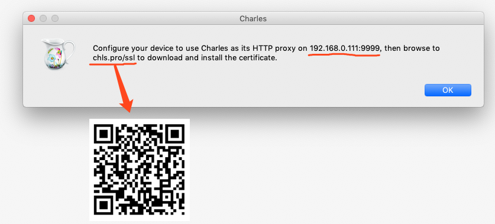

## 配置https抓包

1. mac上安装证书：选择顶部菜单的 `Help` -> `SSL Proxying` -> `Install Charles Root Certificate`安装证书，检查一下是否受信任，改成信任。

2. 手机上安装证书：选择顶部菜单的`Help -> SSLProxying -> Install Charles Root Certificate on a Mobile Device or Remote Browser`，会弹出下面的截图。将手机网络和电脑连在同一个局域网(手机->设置->无限局域网后面有个感叹号->最下面的配置代理手动设置)，然后将手机上的代理设置成Charles的代理`192.168.0.111:9999`，接着打开手机safari浏览器打开截图上的网址：`chls.pro/ssl`，就可以安装了(注意不要用第三方如qq浏览器，这样不会安装)。



3. ios 10.0以上的系统还需要开启证书信任：打开手机`系统设置 -> 关于手机 -> 证书信任设置 -> 开启`即可。

4. 如果要抓`m.baidu.com`的包，就在Charles顶部菜单`Proxy -> SSL Proxying Settings -> SSL Proxying`添加域名和端口即可。


5. 再试一下，就可以看到https包的信息已经显示了。


## 安装

**mac**

1、安装[Mono框架](http://www.mono-project.com/download/#download-mac)。
2、打开命令行，输入下面命令，将`<Mono Version>`换成对应的版本(可以先去目录看看有版本)。

```
/Library/Frameworks/Mono.framework/Versions/<Mono Version>/bin/mozroots --import --sync
```

3、下载并解压[fiddler-mac.zip](https://telerik-fiddler.s3.amazonaws.com/fiddler/fiddler-mac.zip)。
4、在命令行进入上面fiddler解压目录，输入`mono Fiddler.exe`。


## 使用
