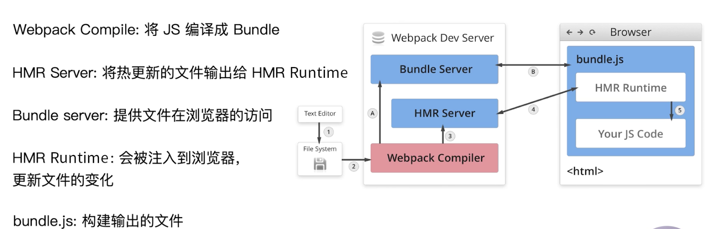

# webpack 基础

## webpack 与构建发展简史

### 为什么需要构建工具

-   转换 ES6/7/8.. 语法（因为现在浏览器支持度不好）
-   转换 jsx (浏览器不识别)
-   css 前缀补齐/预处理(使用预处理更容易维护)
-   压缩混淆
-   图片压缩

### 前端构建演变之路

1.  在线工具压缩、拷贝移动等
2.  `java ant - YUI Tool` (本地压缩)
3.  `nodejs` 出来后
    -   `grunt`(本质是 taskRunner，每次任务处理完后，内容会放到本地磁盘的 temp 里，所以会慢)
    -   `fis3/gulp`(也是个 taskRunner，但是结果不会放到磁盘中，而是会放在内存，所以快)
    -   `rollup/webpack/parcel`

**为什么选 webpack?**

webpack 社区活跃，插件丰富，配置灵活，官方迭代速度快

## webpack 配置文件

webpack 默认配置文件是 `webpack.config.js`，可以通过 webpack --config 指定配置文件

**webpack 配置组成**

-   `entry`
-   `output`
-   `mode` 环境
-   `module`: loader 配置
-   `plugins`: 插件配置

**零配置情况下，默认会包括:**

```
{
    entry: './src/index.js',
    output: './dist/main.js'
}
```

## 安装 webpack

1. 安装 [nvm](https://github.com/nvm-sh/nvm)，安装 node

```sh
curl -o- https://raw.githubusercontent.com/nvm-sh/nvm/v0.35.3/install.sh | bash
# 或者
wget -qO- https://raw.githubusercontent.com/nvm-sh/nvm/v0.35.3/install.sh | bash
```

2. 新建项目目录，然后安装 webpack、webpack-cli

```sh
mkdir my-project
cd my-project
npm init -y
npm i webpack webpack-ci --save-dev
```

通过 npm script 运行 webpack
模块局部安装会在 node_modules/.bin 目录创建软链接，package.json 的 scripts 是可以读取 .bin 目录的。

## webpack 使用

### entry

-   单入口 字符串
-   多入口 对象

```
// 单入口
{
    entry: './src/main.js'
}

// 多入口
{
    entry: {
        main: './src/main.js',
        main2: './src/main2.js'
    }
}
```

### output

Output 告诉 webpack 如何将编译后的文件输出到磁盘。

```
// 单入口
{
    output: {
        filename: 'bundle.js',
        path: __dirname + '/dist'
    }
}

// 多入口配置
{
    entry: {
        main: './src/main.js',
        main2: './src/main2.js'
    },
    output: {
        filename: '[name].js',  // 使用占位符， output 不需要配置多个
        path: __dirname + '/dist'
    }
}
```

### loaders

webpack 开箱即用只支持 js、json 两种文件类型，不支持 .css、.vue 等格式文件。通过 loaders 将文件转成有效模块，并添加到依赖树。

本身是一个函数，接收源文件作为参数，返回转换的结果。

**常见 loader**

-   babel-loader 转换 es6、es7 新特性语法
-   css-loader 支持.css 文件加载和解析
-   less-loader 将 less 文件转换为 css
-   ts-loader 将 ts 转 js
-   file-loader 进行图片、字体等打包
-   raw-loader 将文件以字符串形式导入
-   thread-loader 多进程打包 js 和 css

**Loaders 的用法**

```js
{
    modules:{
        rules:[
            test: /\.txt$/,
            use:  'raw-loader'
        ]
    }
}
```

### plugins

用于增强 webpack，插件常用于用于 bundle 文件的优化，资源管理和环境变量注入。作用于整个构建过程。比如构建之前删除目录。

**常见 plugins**

-   CommonsChunkPlugin 将 chunks 相同的模块代码提取成公共 js
-   CleanWebpackPlugin 清理构建目录
-   ExtractTextWebpackPlugin 将 css 从 bundle 文件里提取成一个独立的 css 文件
-   CopyWebpackPlugin 将文件/文件夹拷贝到构建的输出目录
-   HtmlWebpackPlugin 创建 html 文件去承载输出的 bundle
-   UglifyjsWebpackPlugin 压缩 js
-   ZipWebpackPlugin 将打包出的资源生成一个 zip 包

**用法**

```js
// 放到一个数组中
{
    plugins: [new CleanWebpackPlugin()];
}
```

### mode

设置 mode 可以使用 webpack 内置的函数，默认为 production。

用来指定构建环境是：

| 选项        | 描述                                                                                                                                                                                                                                             |
| ----------- | ------------------------------------------------------------------------------------------------------------------------------------------------------------------------------------------------------------------------------------------------ |
| development | 会将 DefinePlugin 中 设置 process.env.NODE_ENV=development，开启 NamedChunkPlugin 和 NamedModulesPlugin                                                                                                                                          |
| production  | 会将 DefinePlugin 中 process.env.NODE_ENV 的值设置为 production。会开启 FlagDependencyUsagePlugin , FlagIncludedChunksPlugin , ModuleConcatenationPlugin , NoEmitOnErrorsPlugin , OccurrenceOrderPlugin , SideEffectsFlagPlugin and TerserPlugin |
| none        | 不开启任何优化选项                                                                                                                                                                                                                               |

### 解析 ES6 和 React JSX

1. 安装 babel

```sh
# 解析 es6
npm i @babel/core @babel/preset-env babel-loader -D

# 解析 jsx
npm i react react-dom @babel/preset-react -D
```

2. 配置 `.babelrc`

```js
{
    "presets": [
        "@babel/preset-env",
        "@babel/preset-react"
    ],
    "plugins" : []
}
```

3. 配置 webpack

```js
{
    modules: {
        rules: {
            test: /.js$/,
            use: 'babel-loader'
        }
    }
}
```

### 解析 css/less/sass

-   css-loader 用于加载 .css 文件，并转换成 commonjs 对象。
-   style-loader 将样式通过`<style>`标签插入到 head 中。
-   less-loader

1. 安装

```sh
npm i css-loader style-loader less-loader less -D
```

2. 配置

```js
{
    module: {
        rules: [
            {
                test: /\.css$/,
                use: ["style-loader", "css-loader"],
            },
            {
                test: /\.less$/,
                use: ["style-loader", "css-loader", "less-loader"],
            },
        ];
    }
}
```

### 解析图片和字体

-   file-loader: 用于处理文件
-   url-loader 也可以处理文件，可以设置较小资源自动 base64，内部使用的 file-loader

```js
{
    module: {
        rules: [
            {
                test: /\.(png|jpg|jpeg|gif)$/,
                use: [
                    {
                        loader: "url-loader",
                        options: {
                            limit: 10240, // 字节
                        },
                    },
                ],
            },
            {
                test: /\.(woff|woff2|eot|ttf|otf)$/,
                use: ["file-loader"],
            },
        ];
    }
}
```

### 文件监听

文件监听是在文件变化后，自动重新构建出新的输出文件。

1. 启动 webpack 时加上`--watch`
2. 在 webpack.config.js 中加入 `watch: true`

上面方案的缺点: 要手动刷新浏览器。

文件监听的原理分析：
轮训判断文件的最后编辑时间是否变化。某个文件发生了变化，并不会立即告诉监听者，而是先缓存起来，等 aggregateTimeout 后再取执行。如果有其它变化，会一起构建进来。

```js
module.exports = {
    watch: true, // 默认是 false
    watchOptions: {
        ignored: /node_modules/, // 默认为空，不监听的文件或文件夹，支持正则匹配
        aggregateTimeout: 300, // 监听到变化后，等待 300ms 再去执行，默认为 300ms
        poll: 1000, // 判断文件是否发生变化，是通过不停询问系统指定文件有没有变化实现的，默认每秒询问一次
    },
};
```

### 热更新

WDS 不刷新浏览器，WDS 不输出文件，而是放在内存中。watch 是放在磁盘中。

**方式 1. devServer**

使用 HotModuleReplacementPlugin 插件。

1. 配置 package.json

```
{
    "scripts":{
        "dev": "webpack-dev-server --open"
    }
}
```

--open 构建完，自动开启浏览器。

2. 配置 webpack

```js
{
    devServe:{
        contentBase: './dist',  // 服务目录
        hot: true      // 热更新
    },
    plugins: [
        new webpack.HotModuleReplacementPlugin()
    ]
}
```

**方式 2. 使用 webpack-dev-middleware**

WDM 将 webpack 输出的文件传给服务器，适用于灵活的定制场景。

```js
const express = require("express");
const webpack = require("webpack");
const webpackDevMiddleware = require("webpack-dev-middleware");

const app = express();
const config = require("./webpack.config.js");
const compiler = webpack(config);
app.use(
    webpackDevMiddleware(compiler, {
        publicPath: config.output.publicPath,
    })
);
app.listen(3000, function() {
    console.log("app listening on port 3000!\n");
});
```

**热更新原理分析**



### 文件指纹

作用：差异发布、缓存 版本管理

-   Hash: 和整个项目相关，项目文件变化，整个项目构建的 hash 值就会改变。
-   Chunkhash：和 webpack 打包的 chunk 有关，不同的 entry 会生成不同的 chunkhash 值。无法和热更新一起使用，需要在生产环境中用。
-   Contenthash：根据文件内容来定义 hash, 文件内容不变，则 contenthash。 js 里引用了 css，修改了 js，css 的 chunkhash 也变了，css 一般用 Contenthash

**用法**

-   对 js 设置 output filename 使用 [chunkhash]
-   style-loader 会 css 插入页面放入头部，没有 css 文件，一般会设置 MiniCssExtractPlugin 的 filename 使用 [contenthash]，将 css 提取出来，就不要用 style-loader 了。
-   file-loader 的 name 使用 hash，这里的 hash 和前面 hash 不一样，它相当于 contenthash。
    -   file-loader 的占位符
    -   `[ext]`
    -   `[name]`
    -   `[path]`
    -   `[folder]`
    -   `[contenthash]`
    -   `[hash]`
    -   `[emoji]` 一个随机的指代内容的 emoji

```js
{
    output: {
        path: path.join(__dirname, 'dist'),
        filename: '[name]_[chunkhash:8].js',
    },
    plugins: [
        // 将 css 提取成文件，需要使用 MiniCssExtractPlugin.loader
        new MiniCssExtractPlugin({
            filename: '[name]_[contenthash:8].css'
        })
    ],
    modules: {
        rules: [
            {
                test: /.css$/,
                use: [
                    MiniCssExtractPlugin.loader,
                    'css-loader'
                ]
            },
            {
                test: /\.(png|jpg|gif|svg)$/,
                use: [
                    {
                        loader: "file-loader",
                        options: {
                            name: "img/[name][hash:8].[ext]",
                        },
                    },
                ],
            },
        ];
    }
}
```

### 文件压缩

-   js 文件的压缩： webpack4 默认内置了 uglifyjs-webpack-plugin，当 mode 为 produciton 时会自动开启。
-   css 文件的压缩：使用 optimize-css-assets-webpack-plugin 同时使用预处理器 cssnano。注：css-loader 1.0 去掉了压缩的参数。
-   html 文件的压缩： html-webpack-plugin 设置压缩参数。

```js
{
    plugins: [
        new OptimizeCssAssetsWebpackPlugin({
            assetNameRegExp: /\.css$/g,
            cssProcessor: require("cssnano"),
        }),
        new HtmlWebpackPlugin({
            template: path.join(__dirname, "src/index.html"),
            filename: "index.html", // 打包出来的 html 名称
            chunks: ["index"], // 指定生成的 html 要使用哪些 chunk
            inject: true,
            minify: {
                html5: true,
                collapseWhitespace: true,
                preserveLineBreaks: false,
                minifyCSS: true,
                minifyJS: true,
                removeComments: true,
            },
        }),
    ];
}
```

### 清理目录

clean-webpack-plugin 默认删除 output 指定的目录。

Minified React error #200，render 方法里的 dom 元素不存在

### 资源内联

代码层面

-   页面框架的初始化脚本
-   上报相关打点
-   css 内联避免页面闪动

请求层面：减少 http 请求数

-   小图片或字体内联 url-loader

raw-loader 内联 html, 因为使用的 html-webpack-plugin，里面模版引擎是 ejs，所以下面能识别 \${require()}

```
<script>${require('raw-loader!babel-loader!./meta.html')}</script>
```

raw-loader 内联 js

```
<script>${require('raw-loader!babel-loader!../node_modules/lib-flexible')}</script>
```

使用 0.5 的版本，最新版本有点问题

### 多页面打包(MPA)

每个页面一个 entry, 一个 html-webpack-plugin
缺点：每次新增或删除页面需要修改配置

动态获取 entry 和设置 html-webpack-plugin 数量
利用 glob.sync

```
// 同步获取， 关于 *   1.* 一级目录  2.*.js  3.**多级目录
entry: glob.sync(path.join(__dirname, './src/*/index.js'))
```

规则：所有文件放在对应目录下
index/index.js
search/index.js

### source map

作用：通过 source map 定位到源代码
http://www.ruanyifeng.com/blog/2013/01/javascript_source_map.html

开发环境开启，线上环境关闭(会暴露源代码)
排查错误，将 sourcemap 上传到错误监控系统。

source map 关键字
eval: 使用 eval 包裹模块代码
source map: 产生.map 文件
cheap: 不包含列信息
inline: 将.map 作为 DataURI 嵌入，不单独生成.map 文件
module: 包含 loader 的 sourcemap

devtool: 'source-map'

### 公共资源抽离

基础库分离
将 react, react-dom 基础包通过 cdn 引入，不打入 bundle 中

方法：使用 html-webpack-externals-plugin

```
new HtmlWebpackExternalsPlugin({
    externals:[{
        module: 'react',
        entry: '//x.cdn.com/react.js',
        global: 'React'
    },{
        module: 'react-dom',
        entry: '//x.cdn.com/react-dom.js',
        global: 'ReactDOM'
    }]
})
```

上面代码，webpack 将不打包 react 和 reactdom，需要手动在 html 里面引入 cdn。

利用 SplitChunksPlugin 进行公共脚本抽离
webpack4 内置的，用于替代 CommonsChunkPlugin 插件

chunks 参数说明：
async: 默认，异步引入的 js 分离
initial 同步引入的 js 分离
all: 推荐

分离基础包

```
optimization:{
    splitChunks:{
        cacheGroups:{
            commons: {
                test: /(react|react-dom)/,
                name: 'vendors',
                chunks: 'all'
            }
        }
    }
}
```

上面配置，还需要将 vendor 添加到 htmlWebpackPlugin 的 chunk 配置里。

分离页面公共文件

```
splitChunks:{
minSize: 0,  // 分离包体积大小
cacheGroups:{
    commons: {
        name: 'commons',
        chunks: 'all',
        minChunks: 2        // 设置最小引用次数
    }
}
}
```

```
optimization: {
    splitChunks: {
      chunks: 'async',
      minSize: 30000,
      maxSize: 0,
      minChunks: 1,
      maxAsyncRequests: 5,
      maxInitialRequests: 3,
      automaticNameDelimiter: '~',
      name: true,
      cacheGroups: {
        vendors: {
          test: /[\\/]node_modules[\\/]/,
          priority: -10    // webpack 优先分离优先级高的
        },
        default: {
          minChunks: 2,
          priority: -20,
          reuseExistingChunk: true    // 如果当前块包含已从主bundle拆分的模块，则将重用它而不是生成新的块。这可能会影响块的结果文件名

        }
      }
    }
  }
```

### tree shaking

概念：1 个模块可能有多个方法，只要其中的某个方法使用到了，则整个文件都会被打包到 bundle 里，tree shaking 就是只把用到的方法打入 bundle，没用到的方法会在 uglify 阶段被擦除掉。

使用：webpack 默认支持，在 .babelrc 里面设置 modules: false 即可。
.production mode 的情况是默认开启

要求：必须是 ES6 语法，CommonJS 不支持。

DCE(Elimination)
代码不会被执行，不可到达
代码执行的结果不会被用到
代码只会影响死变量(只写不读)

利用 ES6 模块的特点

-   只能作为顶层语句出现
-   `import` 的模块名只能是字符串常量
-   `import binding` 是 immutable 的

代码擦除： 会注释标记代码，在 uglify 阶段删除

### Scope Hoisting

没开启前，构建后的代码存在大量闭包代码。

问题：
大量函数闭包包裹代码，导致体积增大(模块越多越明显)
运行代码时创建函数作用域变多，内存开销变大

结论：
被 webpack 转换后的模块会带上一层包裹
`import` 会转换成`__webpack_require`

分析
打包出来是一个 IIFE
modules 是一个数组，每一项是一个模块初始化函数
`__webpack_require` 用来加载模块，返回 module.exports
通过 WEBPACK_REQUIRE_METHOD(0) 启动，即 entry 模块

scope hoisting 原理
原理：将所有模块代码按照引用顺序放在一个函数作用域，适当重命名防止变量名冲突。
对比 scope hoisting 可以减少函数声明代码和内存开销。

使用：
production 默认会开启。必须是 es6 语法

```
new webpack.optimize.ModuleConcatenationPlugin()
```

modules: false 进制对模块转换。将 es6 转成什么 amd/umd/commonjs/cjs

### 代码分割

对于大的 web 应用，将所有代码都放在一个文件中明显是不够有效的，特别是当你的某个代码块在某些特殊时候才能被用到，webpack 有个功能是将代码库分割成 chunks，当代码运行到需要的时候再加载。

-   抽离相同代码到一个共享块
-   脚本懒加载，使得初始化下载的代码更小，如首屏、tab 显示第一个 单独打包

懒加载的方式：
commonjs: require.ensure
es6 动态 `import`（目前还没有原生 4.6.0+ 支持，低版本需要 babel 转换）。和 commonjs 的 require 比较像

需要使用 @babel/plugin-syntax-dynamic-import

```js
import("./text.js").then((Text) => {});
```

### ESLint

vivo json 重复 key 解析报错，没有用 x5，用的自带浏览器内核。

行内 ESlint 规范实践
eslint-config-airbnb eslint-config-airbnb-base

alloyteam eslint-config-alloy
ivweb eslint-config-ivweb

制定团队的 eslint 规范

-   不重复造轮子，基于 eslint:recommend 配置并改进
-   能发现代码错误的规则，全部开启
-   帮助保持团队的代码风格统一，而不是限制开发体验

落地

1. 和 ci/cd 系统集成

    - 在 build 前增加检查
    - 本地开发阶段增加 precommit 钩子
        - 安装 husky
        - 增加 npm script，通过 lint-staged 增量检查修改的文件。但可以通过 --morefire 绕过检查
        ```
        scripts: {
            precommit: 'lint-staged'
        },
        "lint-staged":{
            "linter":{
                "*.{js.scss}": ["eslint --fix", "git add"]
            }
        }
        ```

2. 和 webpack 集成， 适合新项目
   使用 eslint-loader，构建时检查 js 规范

.eslintrc.js

```
module.exports = {
    parser: "babel-eslint",
    extends: "airbnb",
    "env": {
        browser: true,
        node: true
    },
    rules: {
        semi: "error"
    }
}
```

需要 react
npm i eslint eslint-plugin-import eslint-plugin-react eslint-plugin-react-hooks eslint-plugin-jsx-a11y -D
不需要 react ，只用安装 eslint-config-airbnb-base

npm 钩子函数有哪些？
