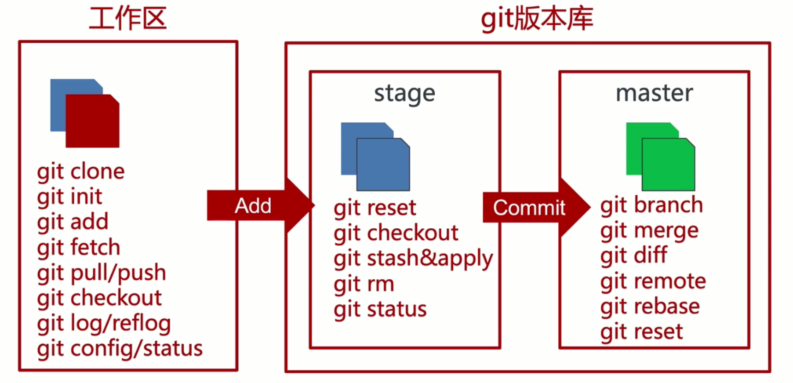
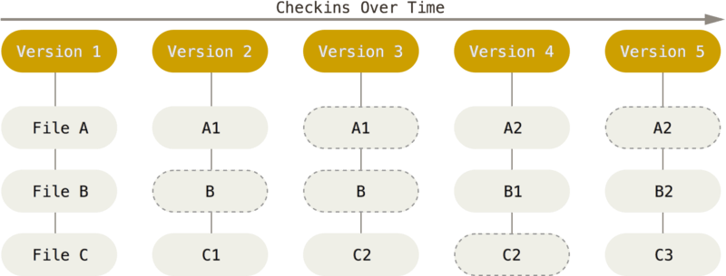
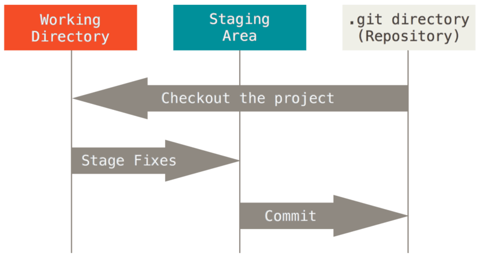

## 起步

**关于版本控制**

版本控制是一种记录文件内容变化，以便将来查阅版本修订情况的系统。

-   本地版本控制系统：文件夹命名来管理。缺点是容易混乱、犯错。优点是简单。
-   集中化版本控制系统：版本记录都在服务器上，协同人员取出的是最新的版本。缺点是服务器坏了，将丢失所有数据，每个人只保存了一个版本。。
-   分布式版本控制系统(DVCS)：客户端是 clone 拉取的完整代码仓库，包括完整的历史记录。这样即使服务器坏了，也可以恢复。

**Git 简史**

因为 BitKeeper 和 linux 内核开源社区合作关系结束。2005 年 Linux 开源社区(Linus Torvalds)开发出 git。

目标：速度和数据量、简单、支持非先行开发(分支)、分布式。

**Git 是什么?**

Git 直接记录快照，而非差异比较。它会对全部文件创建一个快照，并保存这个快照的索引。为了效率，如果文件没有修改，Git 不会再存储该文件，而是只保留一个链接指向之前存储的文件。



Git 中绝大多数操作都是本地的，而且它保存了完整的历史，所以速度很快。

Git 中所有数据在存储前都计算校验和，然后以校验和(SHA-1 散列，hash)来引用，这表示一点点改动 Git 都是知道的。

Git 一般只添加数据，而不会删除。

三种状态：已提交(committed)、已修改(modified)和已暂存(staged)。
三个阶段：工作区、暂存区和 Git 目录。



-   工作区是从 Git 仓库的压缩数据库中提取出来的某个版本的文件，放在磁盘上供修改。
-   暂存区是一个文件，保存了下次将要提交的文件列表信息，一般在 Git 仓库目录中。
-   Git 仓库目录用来保存项目的元数据和对象数据库。克隆时，就是复制的这里的数据。

**安装 Git**

```
# Centos
sudo dnf install git-all

# Ubuntu
sudo apt install git-all
```

## git 分支

1、git 保存的是每个文件的快照。git commit 第一次提交前，会计算每个子目录的校验和，然后将这些目录保存成树对象。之后创建的提交对象，包含提交信息和这个树对象的指针。

2、提交的对象看起来像下图。

3、多次提交之后像下面这样。

4、分支实际是指向 commit 对象的可变指针。git 会使用 master 作为分支的默认名。多次提交后，HEAD 指针会指向最后一次提交对象的 master 分支。每次提交，指针会向前移动。

5、创建分支

```bash
git branch testing
```

创建后，HEAD 还是指向 master 分支，切换分支需要使用下面命令。

```bash
git checkout testing
```

6、每个分支都是相互独立的，可以在各个分支进行修改提交，只需要在最后合适的时候，将分支合并即可。

## 其它

```
# 将远程分支拉取到本地
git fetch origin dev
git checkout -b dev origin/dev
git pull origin dev

# 删除远程分支
git push origin --delete dev

git branch -a
```

## 远程 git 地址修改了

```
git remote remove origin
git remote add origin [new_git_url]
git pull origin [branch_name]
git push
```

## 服务器上的 git

### 生成 SSH 公钥

```bash
ssh-keygen
```

通过下面命令生成秘钥，会存储在用户主目录下的`~/.ssh`目录。`id_dsa`是秘钥，`id_dsa.pub`是公钥。

在 window 下，`ssh-keygen`如果不是内部命令，需要将`ssh-keygen.exe`的路径`C:\Program Files\Git\usr\bin`加入到环境变量中。

## 初始化

生成秘钥

```bash
ssh-keygen

git config --global user.name "John Doe"
git config --global user.email johndoe@example.com
```

## 切换版本

```
git log 查看当前版本之前的提交记录，如果回退了，就看不到后退之后提交的记录了。
git reflog  可以查看所有分支的所有操作记录，包括 commit 和 reset的操作。
git checkout fdss22
```

## 创建和合并分支

1、新建 w0 分支开发新需求。

```
// 新建分支
git checkout -b w0  // -b表示创建分支，checkout表示切换到分支

// 相当于下面2条命令
git branch w0  // 创建分支
git checkout w0  // 切换到分支
```

2、开发完新需求后，在 w0 下提交(commit)分支内容，再切换到主分支，将 w0 分支合并到主分支。

```
// branch w0下
git add .
git commit -m "update"

// 切换到master,合并w0
git checkout master
git merge w0
```

3、删除分支 w0。

```
git branch -d w0  // 删除w0分支
```

4、如果产生冲突时，则处理之后再 add 提交。这样我们就可以在 master 分支发布更新后的项目了。

其它一些命令:

```
# 删除远程分支，feature是分支名
git push origin :feature
```

**其它命令**

```
# 查看分支
git branch 查看本地分支
git branch -a 查看本地分支和远程分支

# 修改分支名称
git branch -m old_name new_name
```

## 回退本地和远程分支

```
# 本地版本回退
git reset --hard commit_id

# 远程分支回退
git push origin HEAD --force
# 或
```

## .gitignore 文件

1、在 git 项目根目录新建文件`.gitignore`，内容为要忽略的文件或目录：

```
**/node_modules
**/android/app/build
**/android/build
**/android/.gradle
**/android/.idea
.idea/

**/local.properties

.gitignore
```

这样在提交的时候，就会忽略上面的这些文件。

2、如果后来修改了`.gitignore`文件，默认 git 不会根据新的规则执行，需要执行下面命令：

```bash
# 有时候需要突然修改 .gitignore 文件，随后要立即生效

git rm -r --cached .  #清除缓存
git add . #重新trace file
git commit -m "update .gitignore" #提交和注释
git push origin master #可选，如果需要同步到remote上的话
```

## 将本地代码同步到 github

我本地写了一些学习时的 demo，想要同步到 github 上面去。

1、首先在 github 上新建一个项目，比如`w3croad-demo`。

2、在我本地的项目根目录执行下面命令。

```
// 1.提交本地代码
git init
git add .
git commit -m ""

// 2.将本地项目和github的w3croad-demo项目连起来
git remote add origin git@github.com:banli17/w3croad-demo.git

// 3.pull一下
// 如果报错fatal: refusing to merge unrelated histories，要加--allow-unrelated-histories
git pull origin master --allow-unrelated-histories

// 4.修复冲突并push
git push --set-upstream origin master  // 以后就可以直接git push
```

如果我一开始就时从 github 上拉取下来的新项目，就没有这么多问题了。

## 问题

1. 本地新建了很多文件夹和文件，`commit` 提交时报错 `error: pathspec 'html' did not match any file(s) known to git.`。

直接执行下面语句：

```
git commit -m "提交"
```

2. 不能直接 `push`，需要先 `commit`。

3) `git status` 时，中文转义了，解决方法是让 `git` 不处理 `utf-8` 文件名。

```
git config --global core.quotepath false
```

4. 删除 github 上所有文件

## 参考资料

-   清空提交记录https://stackoverflow.com/questions/13716658/how-to-delete-all-commit-history-in-github
-   教学全程使用 git 实现协同开发
-   深入学习和使用 git
-   代码管理思想

## 一些报错的解决方法

**1. Updates were rejected because the tip of your current branch is behind**

```
git push -u origin master -f
```

**2. git warning: LF will be replaced by CRLF in**

```
git config core.autocrlf false
```

**3. windows 上 git 提交的内容，在 mac 上报错了。env: bash\r: No such file or directory**

如果上 Mac

```bash
brew install dos2unix # Installs dos2unix Mac
find . -type f -exec dos2unix {} \; # recursively removes windows related stuff
```

如果上 Linux

```bash
sudo apt-get install -y dos2unix # Installs dos2unix Linux
sudo find . -type f -exec dos2unix {} \; # recursively removes windows related stuff
```

之后确保 windows 上首先配置一下提交始终使用 linux 行结束符\n。

```bash
git config --global core.autocrlf input
```

## 常用的图形化软件

-   [sourcetree 支持 mac 和 windows](https://www.sourcetreeapp.com/)
-   [GUI Clients](https://git-scm.com/downloads/guis/)

## 学习资料

-   [git book pro](https://git-scm.com/book/zh/v2)

> 下面只是我学习时的笔记，包括一些不好懂内容的自己的理解，推荐大家以上面的学习资料自学。遇到不懂的再看我的笔记看我有没有遇到过。
