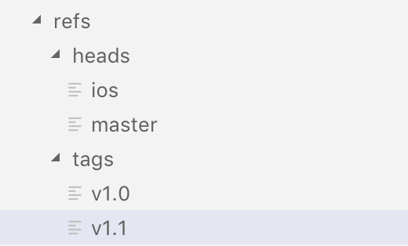

## 学习资料

- [git book pro 第十章](https://git-scm.com/book/zh/v2/Git-%E5%86%85%E9%83%A8%E5%8E%9F%E7%90%86-%E5%BA%95%E5%B1%82%E5%91%BD%E4%BB%A4%E5%92%8C%E9%AB%98%E5%B1%82%E5%91%BD%E4%BB%A4)

> 这一部分有点难度，我花了几天时间详细的边读变操作，总算大致了解了。下面是我的学习笔记。

## 简介

从根本上来讲 Git 是一个内容寻址（content-addressable）文件系统，并在此之上提供了一个版本控制系统的用户界面。简单来说 Git 是将信息保存在 .git 目录里的文件中，然后通过里面的文件来存储对应的版本信息。


## 底层命令和高层命令

git 因为最初是一套面向版本控制系统的工具集，而不是用户友好的版本控制系统，所以还有一些用于完成底层工作的命令，叫做底层(plumbing)命令。而像`checkout`、`remote`之类用户友好的命令叫高层(porcelain)命令。

`git init`会新建一个`.git`目录，这个目录包含几乎所有 Git 存储和操作的对象。所以如果要备份或复制一个版本库，只需要把这个目录拷贝一份即可。下面是拷贝的详细操作。

```
# 目录a是一个版本库
mkdir b
cp -r a/.git b
git reflog
git reset --hard b4970dd
```

按照上面操作完成后，可以看到 b 目录也有了 a 目录的文件。打开.git 目录，它的结构如下：

```
$ ls -F1
HEAD 指示被检出的分支
config*
description 仅供 GitWeb 程序使用，无需关心
hooks/ 包含客户端或服务端的钩子脚本
index  二进制文件，保存暂存区信息
info/  包含一个全局性排除（global exclude）文件，放置不希望被记录在 .gitignore 文件中的忽略模式
objects/ 存储所有的数据内容
refs/    存储指向数据(分支)的提交对象的指针
```

## Git 对象

Git 是一个内容寻址文件系统。它的核心部分是一个简单的键值对数据库，可以往数据库插入任何内容，它会返回一个 key，通过这个 key 可以再次检索该内容。通过底层命令`hash-object`来演示这个效果，它可以将数据保存在.git 目录，并返回 key。

```
# 查看objects里的文件
$ ls .git/objects
info
pack

# 往数据库存一些文本，它会返回key
$ echo 'test content' | git hash-object -w -stdin
d670460b4b4aece5915caf5c68d12f560a9fe3e4
```

`-w`是让 has-object 命令存储数据对象；如果不指定，则命令只返回对应的 key(即内容没有保存)。`--stdin`是从标准输入读取内容；如果不指定，则在命令尾部给出待存储文件的路径。该命令输出一个长度为 40 个字符的校验和。这是一个 SHA-1 哈希值——一个将待存储的数据外加一个头部信息（header）一起做 SHA-1 校验运算而得的校验和。接下来看看 git 是如何存储数据的：

```
# 查看objects里的文件
$ find .git/objects -type f
objects/d6/70460b4b4aece5915caf5c68d12f560a9fe3e4
objects/ce/013625030ba8dba906f756967f9e9ca394464a
objects/2e/81171448eb9f2ee3821e3d447aa6b2fe3ddba1
```

可以看到 key 是目录(头)+文件名。

`cat-file`命令可以从 Git 取回数据。`-p`选项可以自动判断内容类型，并为我们显示友好的格式：

```
$ git cat-file -p d670460b4b4aece5915caf5c68d12f560a9fe3e4
test content

// 如果是tree类型，会显示详情
$ git cat-file -p b4970dd282b4c1763830d7d36e28dae1f21d02fa
tree 2e81171448eb9f2ee3821e3d447aa6b2fe3ddba1
author banli <banli@banlideMacBook-Pro.local> 1545977731 +0800
committer banli <banli@banlideMacBook-Pro.local> 1545977731 +0800

update
```

可以将内容恢复到指定的版本：

```
$ git cat-file -p ce013625030ba8dba906f756967f9e9ca394464a > test.txt
$ cat test.txt
version 1
```

### 10.3 git 引用

我们可以通过`git log 1a410e`这样的命令查看提交历史，但是这串符号不好记忆，所以使用文件来保存 SHA-1 值。并给文件起一个简单的名字。用这个名字指针来替代原始的 SHA-1 值。

这就是引用，可以在`.git/refs`目录找到这类文件。



上图可以看到里面包含分支`ios/master`，还有标签。每个文件只能指向一个 SHA-1 值。所以不能建立相同名称的标签。

我们可以修改文件里的 SHA-1 值，比如让 master 指向另一个提交。可以在 git reflog 时看到，master 已经变化了。


但是不建议直接修改文件，可以通过`update-ref`来完成此事:

```
$ git update-ref refs/heads/master 1a410efbd13591db07496601ebc7a059dd55cfe9
```

如果想在这个提交上创建分支，可以像下面这样：

```
$ git update-ref refs/heads/test 1a410e
```

运行上面命令后，`refs/heads`目录就多了一个 test 文件，也就是多了个名叫 test 的分支。

当运行类似`git branch (branchname)`新增分支时，git 实际上会运行`update-ref`命令，取到当前分支最新的提交对应的 SHA-1 值。并加入到新创建分支的引用中。

那么如何找到最新提交的 SHA-1 值呢？

答案时 HEAD 文件。这个文件指向目前所在的分支。如下：

```
$ cat .git/HEAD
ref: refs/heads/master

# 切换分支
$ git checkout test
$ cat .git/HEAD
ref: refs/heads/test
```

当运行`git commit`时，会创建一个提交对象，并用 HEAD 文件中的 SHA-1 值设置提交字段。

可以用`symbolic-ref`来查看和设置 HEAD 的值。

````
# 查看
$ git symbolic-ref HEAD
refs/heads/test

# 设置
$ git symbolic-ref HEAD refs/heads/master
$ cat .git/HEAD
refs/heads/master
```

**标签引用**

标签对象类似于一个提交对象，包含一个标签创建者信息、一个日期、一段注释信息，以及一个指针。区别是标签对象通常指向一个提交对象，而不是一个树对象。它像是一个永不移动的分支引用——永远指向同一个提交对象，只不过给这个提交对象加上一个更友好的名字罢了。(也就是标签是唯一的，不能重复)。

标签有2种，附注标签和轻量标签。

```
# 创建轻量标签，轻量标签只包含一个固定引用
$ git update-ref refs/tags/v1.0 cac0cab538b970a37ea1e769cbbde608743bc96d

# 创建附注标签，git会创建一个标签对象，然后用一个引用指向它，而不是直接指向提交对象
$ git tag -a v1.4 9be05bee7c0758fd3fe437d556e7d5101eb5129c -m "test tag"

# 查看附注标签内容
$ cat .git/refs/tags/v1.4
5624c8d2a8c749c63813de517ec5e88ecc6de8e1

# 查看提交对象
$ git cat-file -p 5624c8d2a8c749c63813de517ec5e88ecc6de8e1
object 9be05bee7c0758fd3fe437d556e7d5101eb5129c
type commit
tag v1.4
tagger banli <banli@banlideMacBook-Pro.local> 1545997219 +0800

test tag
```

也就是说，创建轻量标签时，`ref/tags/v1.0`里面保存的内容就是一次提交的SHA-1值(cac0cab538b970a37ea1e769cbbde608743bc96d)。而创建附注标签， `ref/tags/v1.4`里面保存的是标签对象的SHA-1值`5624c8d2a8c749c63813de517ec5e88ecc6de8e1`，而不是提交对象的SHA-1值`9be05bee7c0758fd3fe437d556e7d5101eb5129c`。

标签对象并非必须指向某个提交对象；你可以对任意类型的 Git 对象打标签。 例如，在 Git 源码中，项目维护者将他们的 GPG 公钥添加为一个数据对象，然后对这个对象打了一个标签。 可以克隆一个 Git 版本库，然后通过执行下面的命令来在这个版本库中查看上述公钥：

```
$ git cat-file blob junio-gpg-pub
```

**远程引用**

如果添加了远程版本库，并推送过，git 会记录下最近一次推送操作时每个分支所对应的值，并保存在`refs/remotes`目录。比如添加一个叫做 origin 的远程版本库，然后把 master 分支推送上去：

```
$ git remote add origin git@github.com:schacon/simplegit-progit.git
$ git push origin master
```

操作成功后，可以看到`refs/remotes/origin/master`分支的SHA-1值，就是最近一次和服务器通信时本地master分支所对应的SHA-1值。`origin/HEAD`只想最近一个提交的分支。

```
$ cat .git/refs/remotes/origin/HEAD
ref: refs/remotes/origin/master
```

远程引用和分支（位于 refs/heads 目录下的引用）之间最主要的区别在于，远程引用是只读的。 虽然可以 git checkout 到某个远程引用，但是 Git 并不会将 HEAD 引用指向该远程引用。因此，你永远不能通过 commit 命令来更新远程引用。 Git 将这些远程引用作为记录远程服务器上各分支最后已知位置状态的书签来管理。
````
