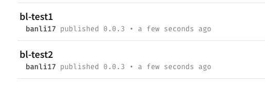

当我们开发多个包的时候，如果这些包有依赖关系，在npm发布的时候会很麻烦。如改了一个包，多个包依赖版本号都需要改，而且都需要`npm publish`一下。

lerna是一个优化多个包管理的工具。它可以：

1. 一次性发布所有包到github和npm上。
1. 自动管理这些包的版本。

## 入门

比如我们现在需要开发2个包`bl-test1`, `bl-test2`。

1. 初始化lerna项目。

```
git init lerna-repo && cd lerna-repo
lerna init
lerna bootstrap
```

上面命令会生成一个lerna-repo目录。而且目录里会初始化文件`lerna.json`，`package.json`和目录`packages`。

2. 在packages目录里新增两个包`bl-test1`, `bl-test2`，分别进入包里用npm init初始化一下。

```
cd packages
mkdir bl-test1 bl-test2
cd bl-test1 && npm init -y
cd ..
cd bl-test2 && npm init -y
```

3. 在github新建lerna-repo仓库，返回lerna-repo目录，使用git remote连接远程仓库，并发布一下。

```
cd ../lerna
git remote add git@github.com:banli17/test-lerna.git
git push origin master
```

4. `npm whoami`查看npm是否登陆。

```
npm whoami
```

5. 在lerna-repo目录下，运行`lerna publish`发布。如果发布成功，在npm官网会出现新增的2个包，github上lerna-repo仓库也同时更新了。注意npm包名和官网其它包名不能相同，否则会报403错误。

```
git add .
git commit -m "update"
lerna publish
```



总结一下：lerna需要先创建并连接github仓库，并且登陆npm。发布需首先提交git。