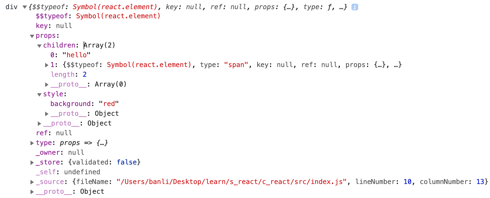
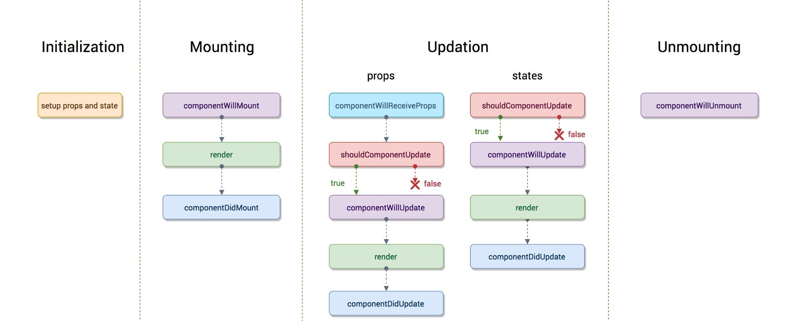

# React

## jsx

jsx : js + xml
jsx 属性不能包含关键字

- class : className
- for : htmlFor
- style：会当作对象

```
style={{color: 'red'}}
```

react 元素创建后，是不可变的

```
let el = <div></div>
```

react 17 后不能修改 el，或给 el 添加额外属性，17 之前是约定，也可以改。

```
Object.freeze(a) : 不能新增 修改删除属性
Object.seal() 密封，只能修改属性
```

之前需要引入 React 库，否则报错，会转成 React.createElement。
react 17 之后会自动引入并转换为 `jsx()` 函数。

```
const H = ()=> <div></div>

// 会转成
import {jsx as __jsx} from 'react/jsx-runtime'
const H = () => __jsx('div', {})
```

```js
JSON.stringify(obj, replacer, spacing);

function replacer(key, value) {
  return value.toUpperCase();
}
```

## 组件

- 函数组件
  - 组件名称首字母大写(会报错)，因为原生组件是小写
  - 组件需要返回并且只返回一个根元素

函数组件的虚拟 dom:

```
$$typeof: Symbol(react.element)
key: null
props: {style: {…}, children: Array(2)}
ref: null
type: props => {…}    是一个函数
_owner: null
_store: {validated: false}
_self: undefined
_source: {fileName: "/Users/banli/Desktop/learn/s_react/c_react/src/index.js", lineNumber: 10, columnNumber: 13}
__proto__: Object
```

## React 实现

### render(vdom, container)

`render(vdom, container)` 方法用来将虚拟 DOM 转成真实 DOM，并挂载到容器中。

下面是一个真实 div 对应的虚拟 dom。



主要属性如下:

- vdom.type: 元素的标签名，函数组件的 type 是一个函数，类组件的 type 是一个类。
- vdom.props 元素的属性
  - vdom.props.children 子元素

通过下面要求即可创建出真实 dom。

1. createElement(vdom) 创建真实元素，并包含子元素
2. 根据 vdom.props 更新属性
3. 将子元素通过 render 挂载到父 dom 上。

```js
function render(vdom, container) {
  const dom = createDOM(vdom);
  container.appendChild(dom);
}
function createDOM(vdom) {
  // 创建dom
  const dom = createElement(type);
  updateProps(dom, props);
  if (isFunction(type)) {
    mountFunctionComponent(type, props);
  }
}
// 将 vdom props 更新到 dom 上
// 注意 style 是个对象，children 是子元素，不处理
function updateProps(dom, newProps) {}
function mountFunctionComponent(type, props) {
  const vdom = type(props);
  return createDOM(vdom);
}
```

### React.Component

- 组件的 vdom 是通过 Component 的子类的 render() 方法创建的
- 调用 setState 方法后会更新组件
- 函数组件的 type 是一个函数，类组件的方法是一个类，本质都是函数，区分的方法是 Component.prototype.isReactComponent = {};（[静态属性拷贝时有可能丢失，所以 React 放在了原型上](https://stackoverflow.com/questions/32509891/warning-react-component-classes-must-extend-react-component-when-using-scalajs)）

### setState

- 在 React 的方法里 setState 是批量更新的，setState 的回调函数也是批量更新的。
- 在 React 控制外，如 queueMicrotask、setTimeout 里，是一个个更新的

### 生命周期



不要在 componentWillUpdate、componentDidUpdate 里写 setState，推荐在 componentDidMount 里写。
