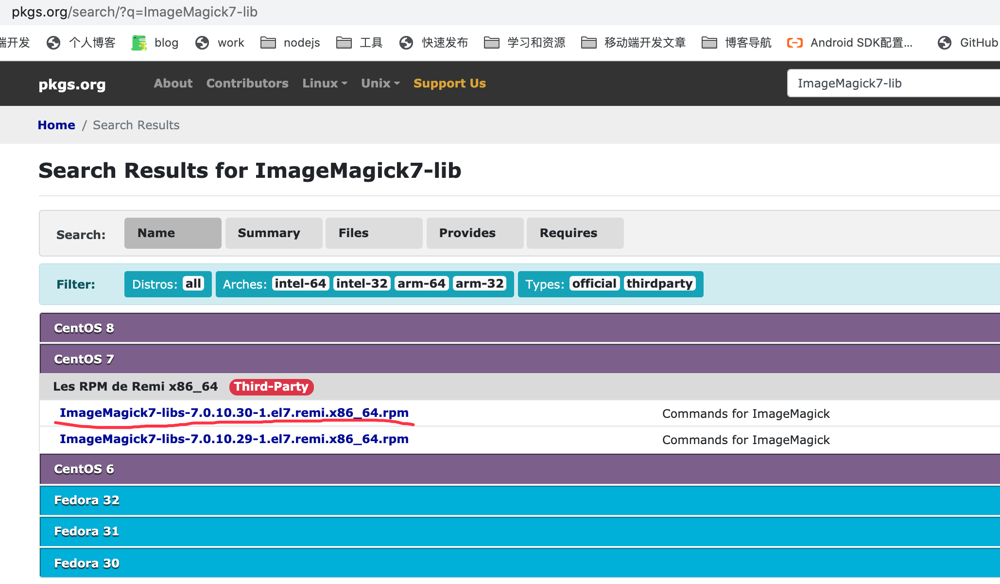
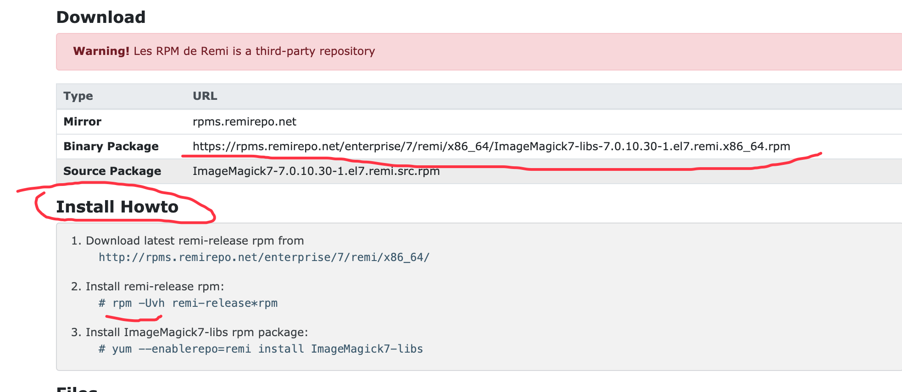
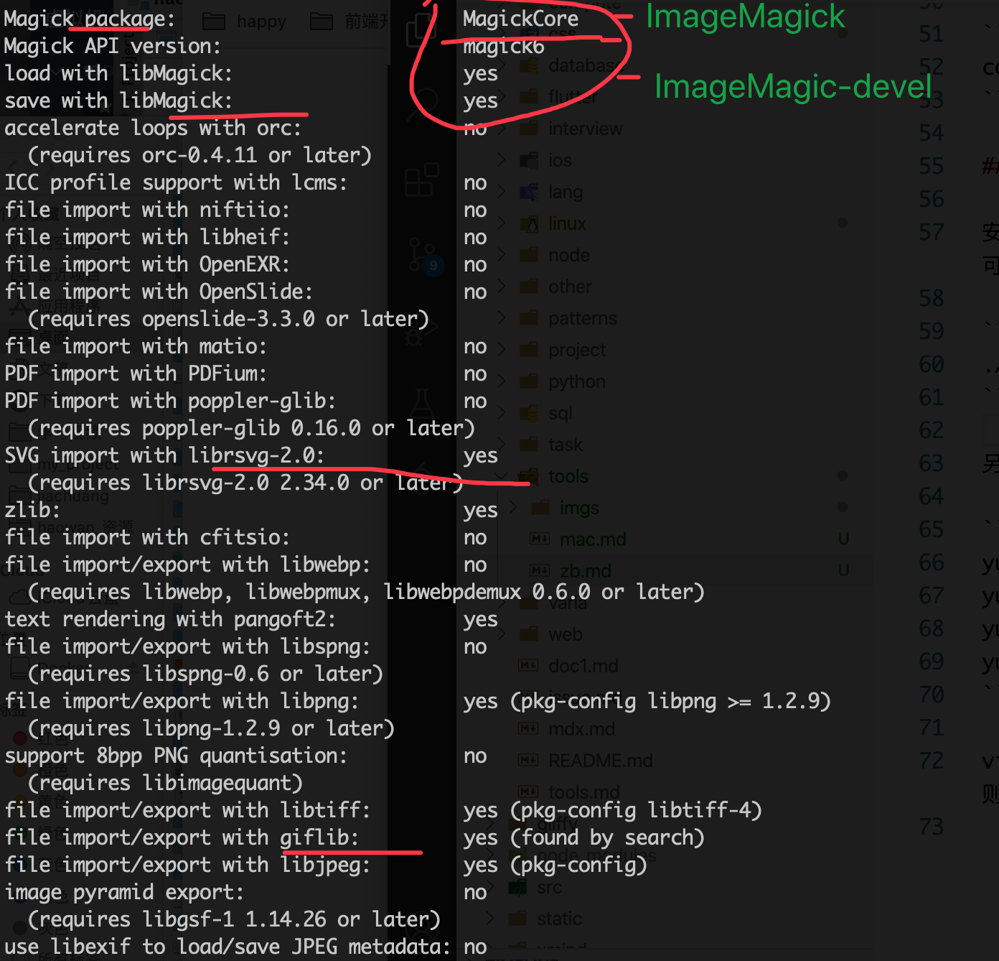

## 安装 imageMagic7

> 这里是旧版本的，不能使用 gif 压缩功能，

1. 安装依赖. 确保系统已经安装以下包

```
yum install -y libjpeg* libpng* libtiff* libungif* freetype zlib
```

2. 在[https://centos.pkgs.org/](https://centos.pkgs.org/7/remi-x86_64/ImageMagick7-devel-7.0.10.30-1.el7.remi.x86_64.rpm.html) 下载 centos7 的 x86_64 rpm 包。然后查看页面下面的 Install Howto 进行安装。





安装时，如果有依赖，则直接搜索安装。需要安装的包有：

```
ImageMagick7
ImageMagick7-devel
ImageMagick7-libs
```

3. 查看是否成功

```
convert --version
```

## 自己编译 libvips

1. 首先需要先安装一些依赖

```
yum install -y libjpeg* libpng* libtiff* libungif* freetype zlib
yum install ImageMagick
yum install ImageMagick-devel
yum install librsvg2-devel
```

vips 如果有一些图片的 loader 库(如 yum install librsvg2-devel)，则会调用，否则会使用 ImageMagick 进行处理。

2. 按照[libvips 文档](https://libvips.github.io/libvips/install.html)安装即可，要注意的是配置：

```
./configure --with-magickpackage=ImageMagick --with-modules
```



3. 检查是否安装好

```
vips
```

## 安装 imageMagic【废弃】

> 这里是旧版本的，不能使用 gif 压缩功能，

1.安装依赖. 确保系统已经安装以下包

```
yum install -y libjpeg* libpng* libtiff* libungif* freetype zlib
```

2.yum 走起

```
yum install ImageMagick -y
```

3. 查看是否成功

```
convert --version
```

## 编译 sharp-libvips【废弃】

> 无效，还是没有 imagemagic 效果，不知什么情况，已经安装了 imagemagic。最后通过安装全局的 ImageMagick7 来编译。

1. 克隆 https://github.com/lovell/sharp-libvips
2. 修改 build.sh 脚本（检查更新会中断执行，去掉检查更新）
3. 执行 `./build.sh 8.10.0 linux-x64`
4. 编译完成后，将打包文件 .bz 放在服务器 `https://hostname/path/v8.10.0/libvips-8.10.0-linux-x64.tar.br` 上(他会按照这个版本命名规则来查找文件)
5. 服务器配置环境变量

```dotnetcli
# 1
vim /etc/profile.d/custom.sh

# 2. 添加下面内容
export npm_config_sharp_libvips_binary_host=https://hostname/path

# 3. 生效
source /etc/profile
```

6. 删除全局 npm 的 sharp 缓存，在安装时会打印缓存的目录日志。

```
rm -rf /root/.npm/_libvips/libvips-8.10.0-linux-x64.tar.br
```

7. 执行`npm i sharp`，这时日志会打印从自定义服务器上下载编译包安装。

## ImageMagick 使用

```
# 注意不是\*，而是 x
convert 0.jpeg -unsharp -resize  100x100  00.jpg
convert 0.jpeg -filter spline -resize  100x100! -unsharp 12x6+0.5+0  00.jpg
```
