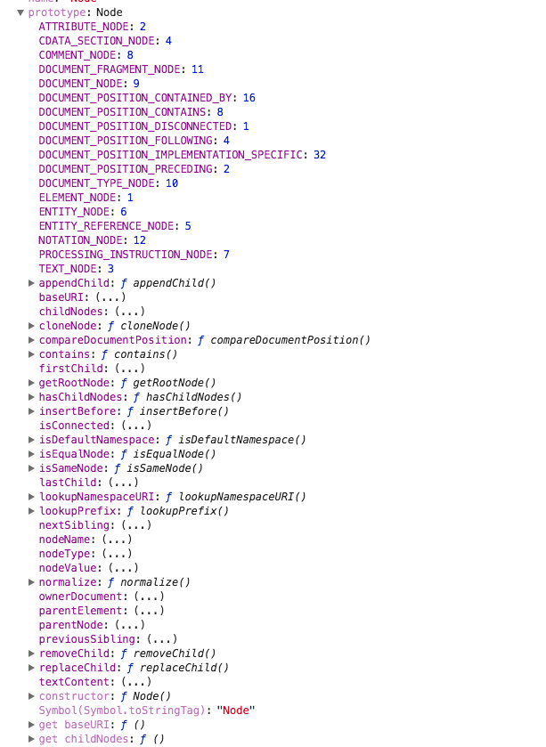

# Node节点

## 目的

看着下面的图片，说出每一个属性的含义？


## 学习资料

- [Node 阮一峰](https://github.com/ruanyf/jstutorial/blob/gh-pages/dom/node.md)

## 节点特性相关的属性

### Node.nodeType

```
nodeType属性返表示节点的类型的整数。

```javascript
document.nodeType === Node.DOCUMENT_NODE  // true
```

常用的 nodeType 类型:

```
element: 1   Node.ELEMENT_NODE
attr: 2      Node.ATTRIBUTE_NODE
text: 3      Node.TEXT_NODE
comment: 8   Node.COMMENT_NODE  
document: 9  Node.DOCUMENT_NODE
documentType: 10  Node.DOCUMENT_TYPE_NODE
DocumentFragment: 11  Node.DOCUMENT_FRAGMENT_NODE
```

### Node.nodeName

nodeName属性返回节点的名称。

```
document : #document
element: 大写的标签名
attr:   属性名称
text:    #text
documentFragment: #document-fragment
documentType:  文档的类型, 比如html   <!doctype html>
comment:   #comment
```

### Node.nodeValue

返回一个字符串，表示当前节点本身的文本值，可读写。只有text和comment有文本值，也可写。其它都是null，且不可写(写了无效，还是null)。

### Node.textContent

返回当前节点和它的所有后代节点的文本内容，它会自动忽视html标签。

```javascript
// <div id="divA">This is <span>some</span> text</div>

document.getElementById('divA').textContent
// This is some text
```

插入的文本含标签时，还是当文本处理。

```javascript
document.getElementById('divA').textContent = '<h1>hello</h1>'
```

上面的h1标签不会被解析。

对于文本节点（text）和注释节点（comment），textContent属性的值与nodeValue属性相同。对于其他类型的节点，该属性会将每个子节点的内容连接在一起返回，但是不包括注释节点。如果一个节点没有子节点，则返回空字符串。

```javascript
document.textContent   // null
doctype.textContent    // null
```

所以如果要读取整个文档的内容，可以使用document.documentElement.textContent。


- Node.baseURI：当前网页的绝对路径。浏览器根据这个属性，计算网页上的相对路径的 URL。该属性为只读。如果无法读到，则返回null。

```javascript
document.baseURI
```

baseURI是先读取 `<base href=''>`的值，如果没有，则读location.href的值。

### Node.ownerDocument

返回当前节点的顶层文档对象，即document对象。但是document.ownerDocument为null。

```javascript
p.ownerDocument === document // true
document.ownerDocument  // null
```

- Node.nextSibling：下一个兄弟节点，如果后面没有，则返回null。包含文本和注释节点。

```javascript
var el = document.getElementById('div1').firstChild;

while (el !== null) {
  console.log(el.nodeName);
  el = el.nextSibling;
}
```


## 表示节点关系的属性

### Node.previousSibling：上一个兄弟节点，没有则是null。包含文本和注释节点。

### Node.parentNode：父节点，可能是三种类型：元素、document、documentFragment。

```javascript
if (node.parentNode) {
  node.parentNode.removeChild(node);
}
```

document、documentFragment、没有插入dom树的节点的父节点都是null。

### Node.parentElement

父元素节点。没有或者类型不是元素，则返回null。

父元素可能有三种类型，父元素节点把另外2种排除了。

### Node.firstChild，Node.lastChild

返回第一个或最后一个子节点，没有则是null。

注意，firstChild返回的除了元素节点，还可能是文本节点或评论节点。



### Node.childNodes

返回一个NodeLists集合，包括所有的子节点。如果没有，则返回一个空的NodeList集合。NodeList对象是一个动态集合，一旦子节点变化，立刻会反应在结果上。

```javascript
var div = document.getElementById('div1');
var children = div.childNodes;

for (var i = 0; i < children.length; i++) {
  // ...
}
```

document只有2个子节点，docType和html。注释和文本会被浏览器自动删除。

### Node.isConnected

布尔值，表示当前节点是否在文档中。

```javascript
var test = document.createElement('p');  // 还没有插入到文档中
test.isConnected // false

document.body.appendChild(test);
test.isConnected // true
```

## 节点操作的方法

### Node.appendChild() 

插入到最后，如果元素存在，则会移动位置。如果是documentFragment，不是插入元素本身，而是其子节点。

### Node.hasChildNodes()

表示是否有子节点。

```javascript
// 判断一个节点是否有子节点
node.hasChildNodes()
node.firstChild !== null
node.childNodes && node.childNodes.length > 0
```

遍历所有后代节点

```javascript
function DOMComb(parent, callback) {
  if (parent.hasChildNodes()) {
    for (var node = parent.firstChild; node; node = node.nextSibling) {
      DOMComb(node, callback);
    }
  }
  callback(parent);
}

// 用法
DOMComb(document.body, console.log)
```

### Node.cloneNode()

克隆节点，接受一个布尔值，表示是否克隆子节点。返回克隆的新节点。

```javascript
var cloneUL = document.querySelector('ul').cloneNode(true);
```

克隆时，会拷贝所有属性，但是事件不会拷贝。即会丧失addEventListener和on-属性。
克隆节点不在文档中，需要用appendChild添加到文档中。
克隆节点有id，或name时，需要修改克隆节点的id和name

### Node.insertBefore()

将节点插入到父节点的指定位置。

```javascript
var insertedNode = parentNode.insertBefore(newNode, referenceNode);
```

插入到最前。

```javascript
var p = document.createElement('p');
document.body.insertBefore(p, document.body.firstChild);
```

如果第二个参数是null，则插入到最后，注意null不能省略。

```javascript
var p = document.createElement('p');
document.body.insertBefore(p, null);
```

注意，如果所要插入的节点是当前 DOM 现有的节点，则该节点将从原有的位置移除，插入新的位置。

由于不存在insertAfter方法，如果新节点要插在父节点的某个子节点后面，可以用insertBefore方法结合nextSibling属性模拟。

```javascript
parent.insertBefore(s1, s2.nextSibling);
```

### Node.removeChild()

从父节点移除某子节点，返回移除的子节点。

```javascript
var divA = document.getElementById('A')
divA.parentNode.removeChild(divA)
```

注意是从父节点调用。如果移除的不是父节点的子节点，则报错。

### Node.replaceChild()

用于替换父节点的某个子节点。

```javascript
var replacedNode = parentNode.replaceChild(newChild, oldChild);
```

下面例子展示了用法：

```javascript
var divA = document.getElementById('divA');
var newSpan = document.createElement('span');
newSpan.textContent = 'Hello World!';
divA.parentNode.replaceChild(newSpan, divA);
```

### Node.contains()

检查节点是否包含某节点，参数可以是当前节点、当前节点的子节点或后代节点。

```javascript
nodeA.contains(nodeA) // true
```

### Node.compareDocumentPosition()

用法和contains一样，返回一个7位二进制值，表示参数节点和当前节点的关系。

````
二进制值	十进制值	含义
000000	0	两个节点相同
000001	1	两个节点不在同一个文档（即有一个节点不在当前文档）
000010	2	参数节点在当前节点的前面
000100	4	参数节点在当前节点的后面
001000	8	参数节点包含当前节点
010000	16	当前节点包含参数节点
100000	32	浏览器内部使用
```

例子
```javascript
// HTML 代码如下
// <div id="mydiv">
//   <form><input id="test" /></form>
// </div>

var div = document.getElementById('mydiv');
var input = document.getElementById('test');

div.compareDocumentPosition(input) // 20 = 16 + 4
input.compareDocumentPosition(div) // 10
```

下面例子是将返回值与掩码运算，得到布尔值：

```javascript
var head = document.head;
var body = document.body;
if (head.compareDocumentPosition(body) & 4) {
  console.log('文档结构正确');
} else {
  console.log('<body> 不能在 <head> 前面');
}
```

### Node.isEqualNode()

返回布尔值，用于检查两个节点是否相等，所谓相等，是类型、属性、子节点相同

```javascript
var p1 = document.createElement('p');
var p2 = document.createElement('p');

p1.isEqualNode(p2) // true
```

- Node.isSameNode()：看2个节点是否是同一个节点

```javascript
var p1 = document.createElement('p');
var p2 = document.createElement('p');

p1.isSameNode(p2) // true
```

### Node.normalize()

用于清理节点内部的文本节点，去除空的文本节点，并将毗邻的节点合并。

```javascript
var wrapper = document.createElement('div');

wrapper.appendChild(document.createTextNode('Part 1 '));
wrapper.appendChild(document.createTextNode('Part 2 '));

wrapper.childNodes.length // 2
wrapper.normalize();
wrapper.childNodes.length // 1
```

该方法是Text.splitText的逆方法

- Node.getRootNode()：返回当前节点所在文档的根节点

```javascript
document.body.firstChild.getRootNode() === document // true
```

## NodeList接口

节点都是单个对象，有时需要一种数据结构，能够容纳多个节点。DOM 提供两种节点集合，用于容纳多个节点：NodeList和HTMLCollection。

NodeList实例是一个类似数组的对象，它的成员是节点对象。通过以下方法可以得到NodeList实例。

> Node.childNodes、document.querySelectorAll()、document.getElementsByTagName()等节点搜索方法

```javascript
document.body.childNodes instanceof NodeList // true
```
NodeList实例很像数组，可以使用length属性和forEach方法。但是，它不是数组，不能使用pop或push之类数组特有的方法。

```javascript
var children = document.body.childNodes;

Array.isArray(children) // false

children.length // 34
children.forEach(console.log)
```

NodeList转数组

```javascript
var children = document.body.childNodes;
var nodeArr = Array.prototype.slice.call(children);
```

注意，NodeList 实例可能是动态集合，也可能是静态集合。所谓动态集合就是一个活的集合，DOM 删除或新增一个相关节点，都会立刻反映在 NodeList 实例。目前，只有Node.childNodes返回的是一个动态集合，其他的 NodeList 都是静态集合。

```javascript
var children = document.body.childNodes;
children.length // 18
document.body.appendChild(document.createElement('p'));
children.length // 19
```

- NodeList.prototype.length
- NodeList.prototype.forEach()
- NodeList.prototype.item()：索引不合法(大于或负数)，则返回null，没有参数则报错。所有类似数组的对象，都可以使用arrlike[i]取元素，而不使用item方法。
- NodeList.prototype.keys()，NodeList.prototype.values()，NodeList.prototype.entries()

## HTMLCollection接口

HTMLCollection没有forEach方法，只能使用for循环遍历。
返回HTMLCollection实例的，主要是一些Document对象的集合属性，比如document.links、docuement.forms、document.images等。
HTMLCollection实例都是动态集合，节点的变化会实时反映在集合中。

如果元素节点有id或name属性，那么HTMLCollection实例上面，可以使用id属性或name属性引用该节点元素。如果没有对应的节点，则返回null。

```html
// HTML 代码如下
// 

var pic = document.getElementById('pic');
document.images.pic === pic // true
```
- HTMLCollection.prototype.length
- HTMLCollection.prototype.item()
- HTMLCollection.prototype.namedItem()：namedItem方法的参数是一个字符串，表示id属性或name属性的值，返回对应的元素节点。如果没有对应的节点，则返回null。

```html
// HTML 代码如下
// 

var pic = document.getElementById('pic');
document.images.namedItem('pic') === pic // true
```

## ParentNode接口

节点对象除了继承 Node 接口以外，还会继承其他接口。ParentNode接口表示当前节点是一个父节点，提供一些处理子节点的方法。ChildNode接口表示当前节点是一个子节点，提供一些相关方法。

如果当前节点是父节点，就会继承ParentNode接口。由于只有元素节点（element）、文档节点（document）和文档片段节点（documentFragment）拥有子节点，因此只有这三类节点会继承ParentNode接口。

- ParentNode.children：该属性只读，children属性返回一个HTMLCollection实例，成员是当前节点的所有元素子节点。

- ParentNode.firstElementChild：返回当前节点的第一个元素子节点。如果没有任何元素子节点，则返回null。
- ParentNode.lastElementChild: document节点的最后一个元素子节点是<HTML>
- ParentNode.childElementCount
- ParentNode.append()，ParentNode.prepend()：没有返回值

```javascript
var parent = document.body;

// 添加元素子节点
var p = document.createElement('p');
parent.append(p);

// 添加文本子节点
parent.append('Hello');

// 添加多个元素子节点
var p1 = document.createElement('p');
var p2 = document.createElement('p');
parent.append(p1, p2);

// 添加元素子节点和文本子节点
var p = document.createElement('p');
parent.append('Hello', p);
```

## ChildNode接口

如果一个节点有父节点，那么该节点就继承了ChildNode接口。

- ChildNode.remove()：用于从父节点移除当前节点
- ChildNode.before()，ChildNode.after()

```javascript
var p = document.createElement('p');
var p1 = document.createElement('p');

// 插入元素节点
el.before(p);

// 插入文本节点
el.before('Hello');

// 插入多个元素节点
el.before(p, p1);

// 插入元素节点和文本节点
el.before(p, 'Hello');
```

- ChildNode.replaceWith()

```javascript
var span = document.createElement('span');
el.replaceWith(span);
```


