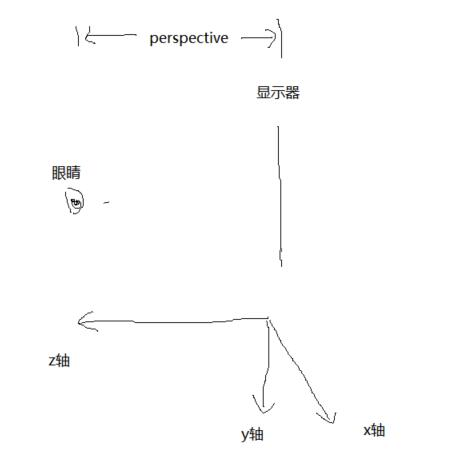

# css transform

## 学习资料

- [CSS3 Transitions, Transforms和Animation使用简介与应用展示](https://www.zhangxinxu.com/wordpress/2010/11/css3-transitions-transforms-animation-introduction/#three)
- [理解CSS3 transform中的Matrix(矩阵)](https://www.zhangxinxu.com/wordpress/2012/06/css3-transform-matrix-%E7%9F%A9%E9%98%B5/)
- [好吧，CSS3 3D transform变换，不过如此！](https://www.zhangxinxu.com/wordpress/2012/09/css3-3d-transform-perspective-animate-transition/)

## transform 2d

transform 指变换，包括`scale`、`skew`、`rotate`、`translate`。2d 变换比较容易，就是平面上的变换。

```php
// 简写
transform: scale(x, y);

// 单条属性写
transform: scaleX(x) scaleY(y);
```

skewX是斜切，下面是效果，是以中心原点变形，方向是从y轴正方形到x轴正方向。skewY是从x轴正方向到y轴正方向。


### transform-origin

默认情况下，变换的原点是元素的中心点。由属性`transform-origin`控制。

```
transform-origin: x  y  z;
```

- `x`：`left/center/right/length/%`，百分比%是以自身宽度为基准。
- `y`：`top/center/bottom/length/%`，百分比%是以自身高度为基准
- `z`：`length`

```css
div {
    width: 100px;
    height: 100px;
    transform: rotate(0deg);
    border: 3px solid #f5871f;
    transform-origin: 10px;  // 变换原点是 (10px, center即50px)
    border-radius: 50%;
    animation: rotate 1s infinite linear;
}
```


## transform 3d

2d是平面的，只有x和y轴。3d是立体的，多了一个z轴。


我们以前肯定看过下面这样的图片。


为什么在平面纸上，描画出来的物体看上去却能是立体的呢。这是因为[透视](https://baike.baidu.com/item/%E9%80%8F%E8%A7%86/10927654?fr=aladdin)。(百度百科：透视是指在平面或曲面上描绘物体的空间关系的方法或技术)。

`perspective`属性指定了观察者与Z=0平面的距离，使具有三维变换的元素产生透视效果。

`perspective`有2种用法：

```css
// 1、给舞台元素加
body{
    perspective: 1000px;
}

// 2、给元素本身加
div{
    transform: perspective(1000px) translateZ(100px);
}
```

这2种用法的区别是参照视点不同。给舞台元素加，视点在屏幕中心线上。给元素本身加，视点在元素中心线上。

**关于透视盲区**

将元素设置`perspective(100px)`，同时设置`transform:translateZ(100px)`后，元素看不见了。这是为什么呢？

```css
// 元素看不见了，translateZ(99px)元素就可见
div{
    width:100px;
    height: 100px;
    transform: perspective(100px) translateZ(100px);
}
```

这是因为`translateZ(100px)`相当于把屏幕移动到和眼睛一个平面了，所以看不到了。`99px`的时候就在眼前，所以几乎铺满全屏幕了。`101px`就在眼睛后面了，完全看不到了。




