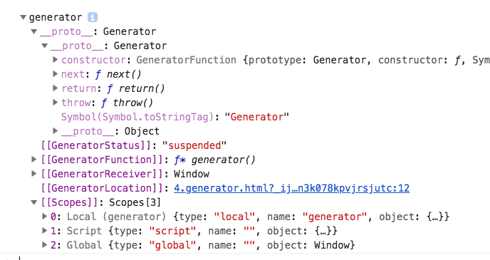

# Generator函数

## 学习资料

- [Iterator 和 for...of 循环](http://es6.ruanyifeng.com/#docs/iterator)
- [es6入门之Generator 函数的语法](http://es6.ruanyifeng.com/#docs/generator)
- [es6入门之Generator 函数的异步应用](http://es6.ruanyifeng.com/#docs/generator-async)

## generator简介

当函数调用时，js引擎会从上向下执行到底，无法中途停止。es6提供了一种函数，可以分步执行，它叫做generator(生成器)函数。

`generator函数`和普通函数的区别是多了一个`*`号。`*`号可以写在任意位置，但是最好写成`function*`。

```javascript
function* generator(){
    console.log(1)
    console.log(2)
}

// all right，but not do it
function * generator(){}
function *generator(){}
function*generator(){}
```

调用 generator 函数不会执行里面的代码，它会创建和返回一个迭代器。

```javascript
// 函数并没有执行
const g = generator()
```

打印 g 对象，如下图所示。



可以看到，它返回的是一个 Generator 对象。可以看到 next() 方法，它的作用才是执行函数代码。

```javascript
g.next()  // 打印出1,2
```

## yield

要暂停代码，需要使用`yield`关键字，它只能再生成器中使用，否则报错。

```javascript
function* generator() {
    console.log(1)
    yield '1 stop'
    console.log(2)
}

const g = generator()

// 值是 {value: '1 stop', done:false}
console.log(g.next())  // 打印1
// 值是 {value: undefined, done:false}
console.log(g.next())  // 打印2
// 值是 {value: undefined, done:true}，函数默认return undefined
console.log(g.next())

// Generator已经执行完了，返回{value: undefined, done:true}
console.log(g.next())
```

**yield 和 return 比较**

yield 可以暂停，可以执行多次。return 只能执行一次。

## next()方法

g.next() 返回的值是一个对象，它有两个属性：value、done。

**value**表示`yield`返回的值，该值会被此 yield 之前的 return 值覆盖。也就是：

```
function* generator(){
    return 11
    yield 2
}

const g = generator()

// {value: 11, done:false}
g.next()
```

**done**表示函数是否执行完了。所以调用next()的次数会比yield的数量多1。

上面主要是通过 yield 暂停函数，还可以通过 yield 传递值。

```javascript
function* generator(){
    const a = yield
    console.log(a)
}

const g = generator()

g.next()
g.next('hi')
```

上面的代码，在第一次调用next()时，函数暂停，第二次执行next()时，next()的参数会赋值给yield。所以代码打印出`'hi'`。

下面上一个稍微复杂的例子。

```javascript
function* generator(){
    var arr = []

    arr.push(yield)
    arr.push(yield)
    arr.push(yield)
    arr.push(yield)

    console.log(arr)
}

const g = generator()
g.next('my')
g.next('name')
g.next('is')
g.next('liming')
g.next(0)

// 打印出 ["name", "is", "liming", 0]
```


