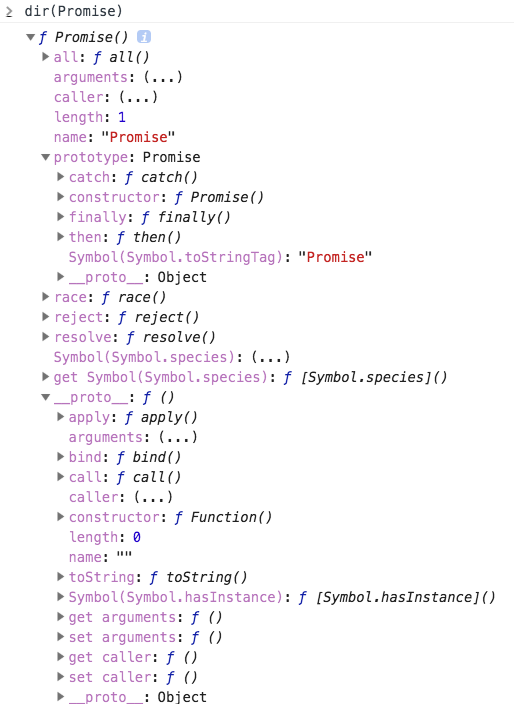

# Promise

## 学习资料

- [es6入门之Promise](http://es6.ruanyifeng.com/#docs/promise)
- [MDN Promise](https://developer.mozilla.org/en-US/docs/Web/JavaScript/Reference/Global_Objects/Promise)
- [JavaScript Promise：简介](https://developers.google.com/web/fundamentals/primers/promises)

## 简介



下面几个方法是非常常用的。

- Promise.all()
- Promise.resolve()
- Promise.reject()
- Promise.race()
- Promise.prototype.then()
- Promise.prototype.finally()
- Promise.prototype.catch()


## Promise的特点

1. Promise 初始状态是`pending`，通过 resolve() 或 reject() 可以将状态修改为`fulfilled(成功)`或`rejected(失败)`。如果状态是`pending`，回调函数永远不会被调用。而且状态一旦改变，就不能再改变。
2. Promise 无法中途取消，一旦新建它将立即执行。
3. Promise 状态是保存的，可以后续再添加回调函数。事件是错过后再监听，是监听不到的。

**Promise和事件**

- Promise 只关心对结果做出反应，不关心过程。
- 事件有可能之前发生了，然后没有捕获到，比如图片加载时添加`img.onload`。
- 多个异步事件的处理，事件会很复杂。

```


<script src='big.js'>
<script>
img.onload = () => {}  // 这里可能不会执行 onload 事件
</script>
```

## 基本用法

Promise 是一个构造函数，用来生产 Promise 实例。

```javascript
new Promise((resolve, reject)=>{
    if(ok){
        resolve('ok')
    }else{
        reject('error')
    }
}).then(resolveCallback, rejectCallback)

function resolveCallback(data){
    // 这里调用的时候data就是ok
}

function rejectCallback(data){
    // 这里调用的时候data就是error
}
```

Promise 新建时就立即执行，就像执行一个函数一样，是同步的。

```javascript
new Promise((resolve, reject)=>{
    resolve('ok')
    console.log('promise')
})
console.log('hello')

// 结果 promise -> hello
```

上面代码也显示出，resolve() 和 reject() 不会阻止函数后续代码的执行。

Promise 的 then 方法，属于 micro-task 类型的异步任务。会在同步任务执行完成后，再执行。具体查看之前我写的[event loop]。

下面是一个用 Promise 实现的图片下载的例子。

```javascript
var img = new Image()
img.src = 'http://xx.com/1.png'
img.onload = ()=>{
    resolve(img)
}
img.onerror = ()=>{
    reject('img download error')
}
```

## Promise.prototype.then()

then 方法返回的是一个新的 Promise 对象，不是之前那个 Promise 对象。

如果前一个 then 方法返回 Promise，则后面的 then 方法会等待 Promise 状态变化后调用。如果返回的是值，则后面的 then 方法的参数就是这个返回值。

```javascript
// then返回值
new Promise((resolve, reject) => {
    resolve('hello')
}).then((res) => {
    console.log(res)  // 'hello'
    return 'res'
}).then((res1) => {
    console.log(res1)  // res
})

// then返回Promise
new Promise((resolve, reject) => {
    resolve('hello')
}).then((res) => {
    console.log(res)  // 'hello'
    return new Promise((resolve,reject)=>{
        resolve('xx')
    }) 
}).then((res1) => {
    console.log(res1)  // xx
})
```

## Promise.prototype.catch()

catch 方法是`.then(null, rejection)`的别名，用于捕获 Promise 内部的错误。

如果 Promise 里有错误或reject()，并且没有使用 then() 的 reject 回调方法，catch则会执行。如果 then 有 reject 回调则会拦截到异常，catch 将不会执行。(错误实际会使状态变为 rejected)

```javascript
Promise((resolve,reject)=>{
    reject('error')
}).then(()=>{}, ()=>{
    console.log('reject error')  // 会执行
}).catch(()=>{
    console.log('catch')         // 不执行
})
```

建议用 catch 来捕获异常，不要使用 then() 的 rejection。

在 resolve() 后抛出的异常不会被捕获。因为 Promise 状态已经改变，不会再发生变化了。

```javascript
new Promise((resolve, reject)=>{
    resolve()
    throw new Error('test')
}).catch(()=>{
    // 不会执行
})
```

下面三段代码是等效的。

```javascript
const promise = new Promise(function(resolve, reject) {
  throw new Error('test');
});
promise.catch(function(error) {
  console.log(error);
});
// Error: test

// 写法一
const promise = new Promise(function(resolve, reject) {
  try {
    throw new Error('test');
  } catch(e) {
    reject(e);
  }
});
promise.catch(function(error) {
  console.log(error);
});

// 写法二
const promise = new Promise(function(resolve, reject) {
  reject(new Error('test'));
});
promise.catch(function(error) {
  console.log(error);
});
```

Node 里的 unhandledRejection 事件，用于捕获没有捕获的 reject 错误。

```javascript
process.on('unhandledRejection', (err, p)=>{})
```

下面这个例子。

```javascript
const promise = new Promise(function (resolve, reject) {
  resolve('ok');
  setTimeout(function () { throw new Error('test') }, 0)
});
promise.then(function (value) { console.log(value) });
// ok
// Uncaught Error: test
```

setTimeout 时，Promise 已经执行完成了。所以错误会抛出到外层，成为未捕获的错误。


## Promise.prototype.finally()

finally 方法指定 Promise 对象最后的执行操作。不管状态是 fulfilled 还是 rejected。它不接受参数。

```javascript
promise.finally(()=>{})

// 等同于
promise.then(()=>{},()=>{})
```

finally 的实现是：

```javascript
Promise.prototype.finally = function (callback) {
  let P = this.constructor;
  return this.then(
    value  => P.resolve(callback()).then(() => value),
    reason => P.resolve(callback()).then(() => { throw reason })
  );
};
```

## Promise.all()

```javascript
const p = Promise.all([task1, task2, task3])
```
task1, task2, task3 都是 Promise 对象。

当所有的 Promise 对象都是 fulfilled 时，p 才是 fulfilled。否则就是 rejected。

```javascript
const p1 = new Promise((resolve, reject) => {
  resolve('hello');
})
.then(result => result)
.catch(e => e);

const p2 = new Promise((resolve, reject) => {
  throw new Error('报错了');
})
.then(result => result)
.catch(e => e);

Promise.all([p1, p2])
.then(result => console.log(result))
.catch(e => console.log(e));  // 不会执行
// ["hello", Error: 报错了]
```

上面的代码，p1 和 p2 都是 resolved (p2 在执行完 catch 后)。如果 p2 没有 catch，则 all 里面的 catch 会执行。

## Promise.race()

根据最快的一个决定状态。

```javascript
const p = Promise.race([task1, task2, task2])
```

## Promise.resolve()

Promise.resolve() 可以将一个对象转成 Promise 对象。

```javascript
Promise.resolve('foo')

// 等价于
new Promise(resolve => resolve('foo'))
```

Promise.resolve() 的参数分为3种情况。

1、参数是 Promise 实例。会原封不动返回。
2、 thenable 对象，也就是具有 then 方法的对象。

```javascript
let thenable = {
    then(resolve, reject){
        resolve(1)
    }
}

let p1 = Promise.resolve(thenable)
p1.then((val)=>{
    console.log(val)  // 1
})
```
Promise.resolve() 会将它转成 Promise 对象，并立即执行 then 方法。

3、一般参数或不带参数

```javascript
const p = Promise.resolve('hello')
p.then((res)=>{
    console.log(res) // 'hello'
})
```

## Promise.reject()

```javascript
Promise.reject()  // 报错了
```

所以需要 catch 捕获。

```javascript
var p = Promise.reject()
p.catch(e=>{})
```

如果传入一个 thenable，后续 then 方法的参数是这个 thenable 对象。

```javascript
const thenable = {
  then(resolve, reject) {
    reject('出错了');
  }
};

Promise.reject(thenable)
.catch(e => {
  console.log(e === thenable)
})
// true
```
