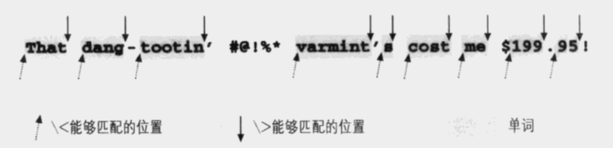
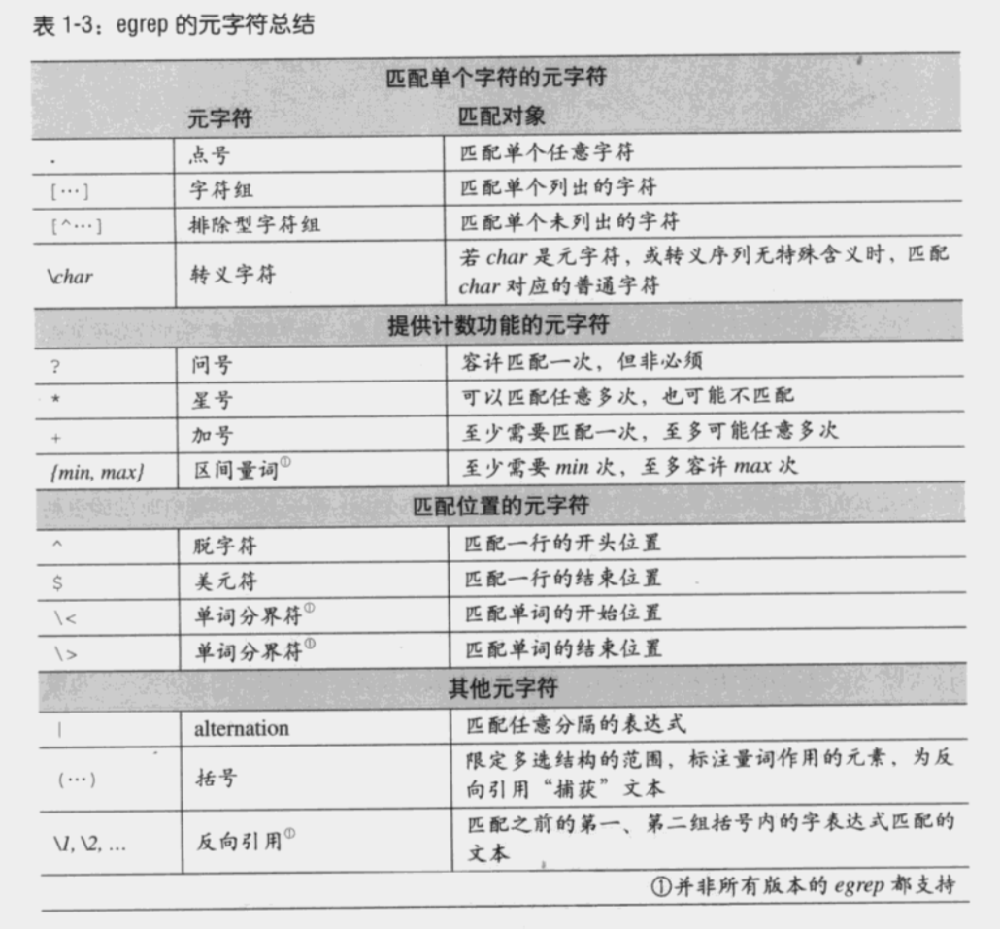

# 正则表达式

## 学习资料

- [mdn RegExp标准库](https://developer.mozilla.org/zh-CN/docs/Web/JavaScript/Reference/Global_Objects/RegExp)
- [JavaScript 中的正则表达式](http://www.cnblogs.com/onepixel/p/5218904.html)
- [RegExp对象](http://javascript.ruanyifeng.com/stdlib/regexp.html)
- [正则表达式](https://developer.mozilla.org/zh-CN/docs/Web/JavaScript/Guide/Regular_Expressions)
- [精通 JS正则表达式](http://www.cnblogs.com/aaronjs/archive/2012/06/30/2570970.html)
- 正则原理


**工具**

- [regexper工具](https://regexper.com/)


## 元字符

理解正则表达式要单个字符的理解，比如`/abcd/`要理解成匹配字符的第一个字符是a，后面是b，再后面是c，后面是d。而不要直接理解为匹配`abcd`字符串。

### 行首、行尾符

`^`表示行首符，`$`表示行尾符。即`^a$`表示行首字符是 a，行尾字符也是 a。

```
/^a$/.test('a')    // true
/^a$/.test('ali')  // false
```

### 字符组

字符组用来匹配某些字符中的一个。比如`1[abc]`用于匹配开始是字符1，后面字符是 a 或 b 或 c。

`[]`里还可以用`-`表示范围，比如`[a-z]`表示字母 a-z 中的一个。还可以组合使用`[a-z0-9A-Z]`或`[a-z!?]`等。这里的 ? 不再是当做元字符，而是字符本身。

`[^a]`表示非 a 的字符。

```javascript
/a[^a]/.test('a')   // false
/a[^a]/.test('ae')  // true

// [^cat$]  匹配单行cat
// [^$]  匹配空行
// [^]  没意义，任何一行都行

/[\w]/.test('t')  // true，也表示单个元字符
/[\t]/.test('   ')
```

`-`表示字符组元字符，只有在字符组 [] 里才表示元字符。在外面表示普通字符。

### 排除型字符组

`[^...]`表示这个字符组匹配任何未列出的字符。比如`[^1-6]`匹配除了1到6以外的任何字符。在字符组里`^`表示排除。

`q[^u]`表示第一个字符是q，后面字符不是u。

### 用点号匹配任意字符

元字符`.`用来匹配任意字符(除了行结束符\n \r \u2028或\u2029)。比如要搜索 03/19/76、03-19-76 或者 03.19.76，可以使用03[.-/]19[.-/]76，或者是 03.19.76。

字符组`[]`只能匹配其中的一个字符，而.能够匹配任何字符。

```
/./.test('\n')   // false
```

## 多选结构

`|`表示或，用来匹配任意子表达式，比如`Bob|Robert`，注意它匹配的是 Bob 或 Robert，而不是 Bobobert 或 BoRobert。如果要匹配他们，需要写成`Bob(b|R)obert`。`|`通常也确实是和`()`一起使用。

### 忽略大小写

i标志符

### 单词边界符

`\b`表示单词边界。`\B`表示非单词边界。边界大致是空格、-、结束、开始、$等字符。



```
/\bcat\b/.test('hellocat')  // false
/\bcat\b/.test('hello cat')  // true
/\bcat\b/.test('hello我cat') // true
/\b我\b/.test('hello我cat')  // true
```

### 量词

- `?`：有或者没有，即 {0, 1}
- `+`：1个或多个，即 {1,}
- `*`：0个或多个，即 {0,}
- `{m, n}`：m个到n个都可以，如果n不确定，可以写成`{m,}`表示大于m个，注意`{,n}`不表示小于n个，而是表示本意。
- `{m}`：m个

### 括号与反向引用

括号的作用有将字符组成一个单元组，用于搭配量词或者多选结构使用。

```
/(abc)?/
/(abc|def)/
```

不过它还有一个重要的用途，就是反向引用，括号会记忆匹配到的文本，可以用 \n 的方式引用这些记忆的文本。

```
/(\d+)(\1)(\2)\3/.test('123123123123')
```

上面的`\1`表示引用第一个括号(也叫子表达式)匹配到的文本，也就是 123。同理 \2、\3 就是第二个、第三个括号里的内容都是 123。

注意括号在字符组 [] 里是括号本身字符，而不是单元组的意思。

### 转义

我们知道 . 表示元字符，会匹配任意字符。但是我们要匹配`0.1`怎么写呢？

这时就需要用到`\.`，叫做转义。转义后，元字符就失去了其意义，直接可以将`\.`看做是匹配.字符。

### 匹配不捕获

`()`里的内容默认是捕获的，如果需要不捕获，则使用`(?:)`。


### 例子

```
# 匹配标志符
[a-zA-Z_][a-zA-Z_0-9]{0, 31}

# 引号内的字符串
"[^"]*"

# 美元金额
$[0-9]*(\.[0-9]{2})?

# html tag
<.*?>
```

### 子表达式

子表达式是正则表达式的一部分。比如`H[1-6]`，H 和 [1-6] 都是子表达式。

### 字符

字符的值代表的字符在不同编码中可能不一样。不过现在基本都是采用unicode编码处理数据。

## 总结


- 各个egrep程序有差异，支持的元字符以及元字符的意义有差异。
- 括号用于：限制多选结构、分组、捕获文本
- 转义的3种情况
    - `\ + 元字符`：表示匹配元字符所使用的普通字符
    - `\ + 非元字符`：组成有意义的元字符序列，比如`\<`表示单词边界
    - `\ + 任意字符`：默认表示匹配该字符，也就是反斜杠会被忽略


## 入门示例扩展


## 总结

**1.如何创建正则表达式，有什么区别？**

js中创建正则对象的方法有两种，第一种是字面量方式，第二种是通过RegExp构造函数的方法。

```javascript
// 通过字面量创建
const reg = /\.\w/gi

// 构造函数方式创建
const reg = new RegExp("\\.\\w", "gi")   // 返回值reg是 /\.\w/gi
```

两种创建方式的区别是：通过字面量方式创建正则时，所有元字符都需要转义(即前面加`\`，比如 `.` 要写出 `\.`)。 而new RegExp模式下，所有元字符都需要双重转义(比如`.`要写成`\\.`)。

**2.元字符有哪些？**

`( [ { \ ^ $ | ) ? * + .] }`

**3.标识符有哪几个，分别是什么意思？**

上面代码`/\.\w/gi`中的gi就是标识符，标识符有三个：

- g  正则匹配默认匹配完第一个就返回了，加上g会匹配全局
- i  默认是区分大小写的，加上i表示不区分大小写
- m  默认是将字符串当做一整行来匹配，即默认只有一个开始^和结束$,但是加上m会多行匹配(以\n换行，一行行匹配)。每行会有一个^和$。

```javascript
// 没有加m
var reg = /^b/
var str = 'aa\nbcd'
reg.test(str) // false

// 加了m
var reg = /^b/m
var str = 'aa\nbcd'
reg.test(str) // true
```

如果要获取标识符，则使用flags属性。

```javascript
/foo/ig.flags;   // "gi"
```

**4.字符含义解释**

- () 的作用是提取匹配的字符串，也叫子表达式
- [] 定义匹配的范围，比如[a-zA-Z0-9]
- ^ 和 $ 表示开始和结尾，注意如果^出现在[]中，表示取反
- \d 非负数字，等价于[0-9]
- \s 空白字符
- \w 英文字符或数字，等价于[a-zA-Z0-9_]
- . 除了换行以外的任意字符，等价于[^\n]
- \b 单词边界，不代表任何字符。所以/\w\b\w/不能匹配任何字符。
- \B 非单词边界
- |  选择符，表示或者
- \r  回车符
- \W [^A-Za-z0-9_]

**5.量词有哪些?**

用来表示数量的字符。

- * 表示匹配0次或多次，比如\d*，表示0个或多个数字
- + 表示匹配1次或多次
- ? 表示0次或1次，相当于{0, 1}
- {} 表示匹配的长度，比如\n{3}表示匹配3个数字，\d{1, 3}表匹配1-3个数字，\d{3,}表示匹配3个以上数字

**6.存储**

- RegExp.$1 - RegExp.$9 存放着最近一次匹配9个子表达式结果，如果没有则是空字符串`""`。
- \n   如果n是正整数表示反向引用，比如\1,表示和对应子表达式一样。

```javascript
/(\d)(\d)/.test('15helo')

RegExp.$1  //1
RegExp.$2  //5

//在replace中使用
"2016-03-26".replace(/(\d+)-(\d+)-(\d+)/,"$1年$2月$3日")

var rgx = /\d{4}(\-|\/|.)\d{1,2}\1\d{1,2}"/
```

**7.js中使用正则**

js中使用正则，主要是字符串的match()、search()、replace()、split()方法，和正则的test()、exec()方法。

- str.match(reg)
- str.replace([RegExp|String],[String|Function])

如果第二个参数是函数，函数的参数有四个：

1. result: 本次匹配的结果
2. $1,...$9: 正则表达式有多少个子表达式，就会传递几个参数
3. offset: 本次匹配的开始位置
4. source: 接受匹配的原始字符串

```javascript
var str1 = '2018-11-12'
var reg2 = /(\d)(\d)/g
var new_str2 = str1.replace(reg2, (...args)=> {
	console.log(args)
})

// 结果
[ '20', '2', '0', 0, '2018-11-12' ]
[ '18', '1', '8', 2, '2018-11-12' ]
[ '11', '1', '1', 5, '2018-11-12' ]
[ '12', '1', '2', 8, '2018-11-12' ]
```

replace第二个参数还有一些符号有特殊含义，比如: $1 - $99，$& 表示整个匹配字符串，$`是匹配字符串左侧文本，$'是右侧文本。$$是直接量符号。

- reg.test(str)  匹配则返回true，否则返回false
- reg.exec(str)

**贪婪匹配和非贪婪匹配**

默认情况下正则会匹配更多的字符，这叫做贪婪匹配。

```javascript
var a = 'hellox'
var reg = /(l+)/
var c = a.match(reg)
console.log(RegExp.$1)   // ll
```

上面的例子匹配了更多的l:`ll`，而没有只匹配一个l，这就是贪婪匹配。

如果要匹配l，则是非贪婪匹配，需要在`+`这种量词后面加上`?`即可。

```javascript
var a = 'hellox'
var reg = /(l+?)/
var c = a.match(reg)
console.log(RegExp.$1)   // l
```

**匹配不捕获**

`?:`表示匹配但不捕获。

```javascript
// 例1
var m = 'abc'.match(/(?:.)b(.)/);
m // ["abc", "c"]

// 例2，匹配foo，或foofoo
var a = /(?:foo){1, 2}/
```

**正向预查和反向预查**

- x(?=y)  先行断言，x只有在y前面才匹配，y不会被计入返回结果。
- x(?!y)  先行否定断言，x只有不在y前面才匹配，y不会被计入返回结果。
- x(?<=y) 后行断言
- x(?<!y) 后行否定断言

```javascript
// 先行断言，转化货币格式
'9999999'.replace(/\d{1,3}(?=\d{3}+)/, '$&,')

// 先行否定断言
var a = 'hello nihao xhell'
var reg = /\b\w+(?!\b)/g
console.log(a.match(reg))  //[ 'hell', 'niha', 'xhel' ]

// 后行断言
/(?<=\$)\d+/.exec('Benjamin Franklin is on the $100 bill')
// 结果["100", index: 29, input: "Benjamin Franklin is on the $100 bill"]
```


## 常用正则表达式

**1. 提取浏览器参数**

```javascript
var str = "name=zhangsan&age=12"
var reg = /([^&=]+)=([^&=]*)/gi; // [^&=]+表示匹配非=&的连续字符串

var paramObj = {}
str.replace(reg, (...args)=> {
	obj[args[1]] = args[2]
})

console.log(paramObj);  // { name: 'zhangsan', age: '12' }
```

**2. 扩展typeof**

```javascript
function getTypeOf(obj){
    return Object.prototype.toString.call(obj)
           .replace(/\[object\s(\w+)\]/,'$1'); //[object Xxx]
}

getDataType(1); //number
getDataType('a'); //string
getDataType(null); //null
getDataType([]); //array

```

**3. 在字符串指定位置插入新字符串**

```javascript
String.prototype.insetAt = function(str,offset){

    offset = offset + 1;
    //使用RegExp()构造函数创建正则表达式
    var regx = new RegExp("(^.{"+offset+"})");

    return this.replace(regx,"$1"+str);
};

"abcd".insetAt('xyz',2); //在c字符后插入xyz
>> "abcxyzd"
```

**4. 将手机号12988886666转化成129****6666**

```javascript
function telFormat(tel){

    tel = String(tel);

    //方式一
    return tel.replace(/(\d{3})(\d{4})(\d{4})/,function (rs,$1,$2,$3){
       return $1+"****"+$3
    });

    //方式二
    return tel.replace(/(\d{3})(\d{4})(\d{4})/,"$1****$3");
}
```

**5. 实现HTML编码，将< / > " & ` 等字符进行转义，避免XSS攻击**

```javascript
function htmlEncode(str) {
    //匹配< / > " & `
    return str.replace(/[<>"&\/`]/g, function(rs) {
        switch (rs) {
            case "<":
                return "&lt";
                break;
            case ">":
                return "&gt";
                break;
            ...
        }
    });
}
```

## 实战

- [正则表达式之简易markdown文件解析器](http://ife.baidu.com/course/detail/id/30)
- [正则表达式之入门](http://ife.baidu.com/course/detail/id/29)


