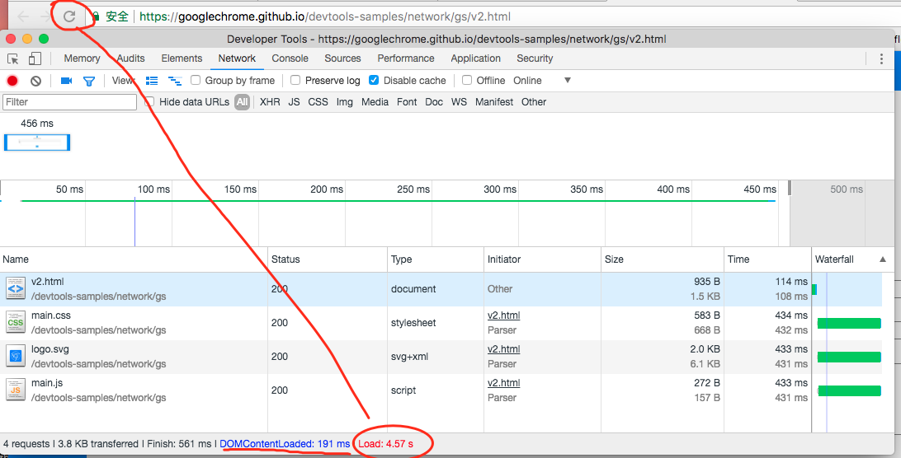

# Network面板

> 这章比较简单，因为平时经常用，只有几个不知道的知识点。

## 学习资料

- [Get Started with Analyzing Network Performance in Chrome DevTools](https://developers.google.com/web/tools/chrome-devtools/network-performance/)
- [Network Issues Guide](https://developers.google.com/web/tools/chrome-devtools/network-performance/issues)
- [Network Analysis Reference](https://developers.google.com/web/tools/chrome-devtools/network-performance/reference)

> 通过[chrome://help](chrome://help)可以查看谷歌浏览器版本

## 总结

**1. 分析网络请求的方法**

- 看是否有js影响页面渲染，因为js下载时会执行，这段时间页面会停止渲染。
- 找大的请求，通过分析加载时各个时间段的截图，看哪里花了长时间。也要分析waterfall里的请求时间。

**1. 将js文件设为async，并放在body的底部?** 

疑问：放开头设置为async会怎么样？

**1. waterfall里面都是些什么?**

TTFB，全称是`Time To First Byte`，意思是等待从服务器返回第一个字节所花费的时间。引起它慢的原因可能是客户端到服务器连接慢，或者服务器响应太慢。可以通过在本地搭建服务器测试，如果照样很慢，则是服务器的问题了。

TTFB时间长的解决方法是：如果是连接慢，可以搭建CDN或者换主机。如果是服务端慢，则优化数据库、缓存或修改服务端配置。

`content download`：表示内容下载。下载慢的原因可能是客户端到服务端连接慢，或者下载的内容太多。解决方法是：搭建CDN或者换主机。减小发送的内容。

**4. 学习资料中，优化后的页面依然会4s后才加载完成是怎么回事？**

原来是因为js的执行不会显示在网络的资源加载面板中，页面js执行完成后，load才完成(浏览器加载转圈按钮才会停止)。

**5. 一些网络请求的问题**

http/1.0或http/1.1，谷歌浏览器下，同一个域名最多同时允许6个tcp连接，比如请求资源时，最多同时请求6个，会形成一个队列，请求完一个后，再插新的请求到队列中。

解决方法是：1、在http1.0或1.1下资源分布到多个域名。2、使用http/2，就不需要多个域名了。3、去掉或延迟不必要的请求，最新加载重要的请求。

**6. 修改用户代理**

可以修改用户代理，最新版谷歌在更多工具里，如图：

**7. filter的使用**

比如说筛选大于1kb的jpeg图片，通过`mime-type:image/jpeg larger-than:1K`。

**8. Hide data URLs是什么?**

哦，它是隐藏`data:`开头的url。

## 深入学习

学习后面的网络数据请求章节。