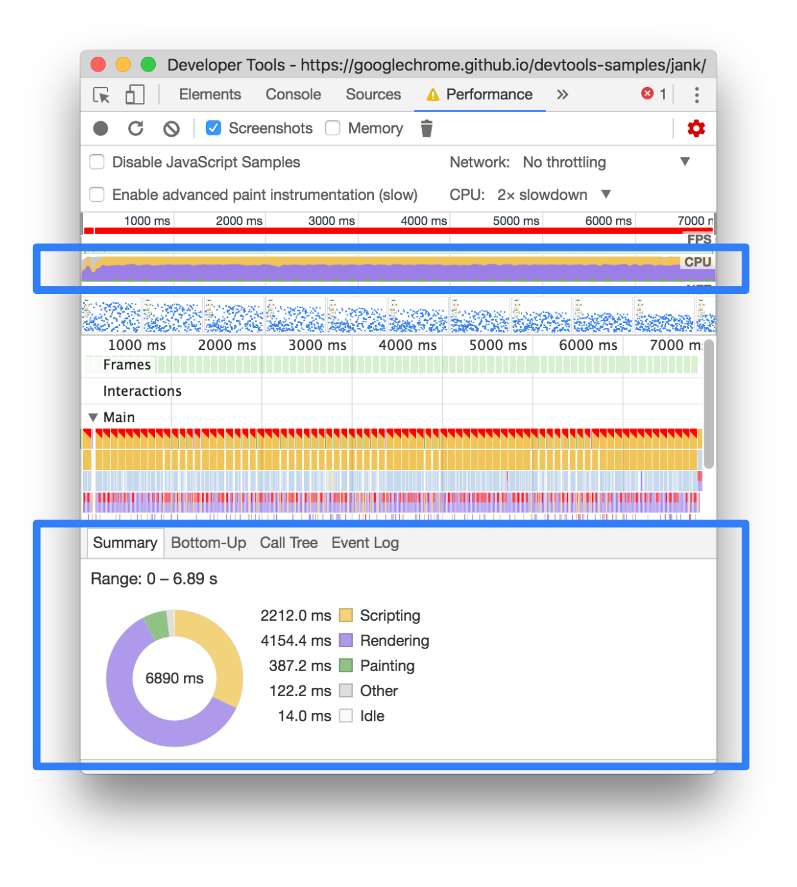

# Chrome开发者工具之Performance

> 这章比较复杂，平时没有用过，而且知识较多。多投入点时间，将学习资料多读10遍。

## 学习资料

- [Get Started With Analyzing Runtime Performance](https://developers.google.com/web/tools/chrome-devtools/evaluate-performance/)
- [分析运行时性能](https://developers.google.com/web/tools/chrome-devtools/rendering-tools/)
- [Performance Analysis Reference](https://developers.google.com/web/tools/chrome-devtools/evaluate-performance/reference)
- [时间线事件参考](https://developers.google.com/web/tools/chrome-devtools/evaluate-performance/performance-reference)
- [加速执行 JavaScript](https://developers.google.com/web/tools/chrome-devtools/rendering-tools/js-execution)
- [如何用 FPS 衡量 web 页面性能？](https://www.zhihu.com/question/47911480)
- [为什么游戏帧数一般要到 60 帧每秒才流畅，而过去的大部分电影帧数只有 24 帧每秒却没有不流畅感？](https://www.zhihu.com/question/21081976)

## 总结

**1. 如何获取页面性能数据?**

- 首先新建无痕浏览模式，快捷键是`ctrl + shift + n` 。因为无痕浏览模式是一个纯净的环境。它会去掉chrome插件对性能的影响。
- 打开Performance面板，点击右侧的设置按钮，会展开一个面板，上面有CPU设置。移动端设备性能比PC要差很多，所以可以将它开启，看看页面在移动端上的表现。

- 记录某时段的性能表现，通过点击Record按钮，等几秒后，按stop按钮。

**2. 如何分析页面性能数据？**

任何动画最主要的性能指标都是`frames per second`(FPS)，如果能达到60 FPS，用户体验会很好。

- 查看FPS图表。如果看到FPS上面有红色条，说明FPS太低，用户体验差。通常绿条越高，FPS越高。

- 查看CPU图标。在FPS下面有个CPU，颜色丰富说明CPU已经最大化和长时间工作，所有时间都花在Rendering和Scripting。需要找出方法减少它的工作。

**3. 

## 深入学习

学习后面的3.3性能与工程化章节。