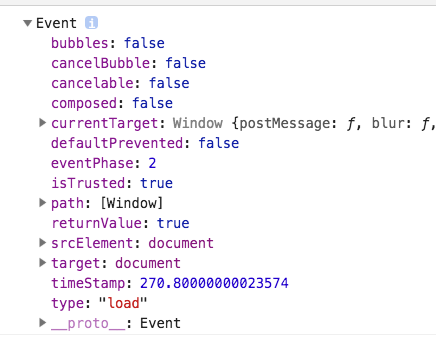

# 事件和事件对象

## 事件

js 和 html 的交互是通过事件来实现的，用户对页面进行操作，然后执行事件函数。事件名有如：click、hover等。事件绑定函数名是在事件名前面加`on`。

```javascript
div.onclick = function(){}
```

## 事件流

点击某个元素时，实际上也点击了其外层元素、body和document等元素。事件流就是事件传播的方向。

```html
<html>
    <head></head>
    <body>
        <div></div>
    </body>
</html>
```

dom2级事件规范规定，事件流有3个阶段。拿点击 div 元素为例，事件传播过程如下。

1. 事件捕获流：即从外层元素往里传播，到达目标元素之前。`document -> html -> body`。
2. 到达目标元素：div。
3. 事件冒泡流：即从 div 离开之后，`body -> html -> document`。

另外还规定，从捕获到目标元素阶段，不触发事件处理函数。

但是各浏览器的实现和规范有一些差异。差异如下：

1. 在目标元素，不管是从捕获来还是冒泡离开，都会触发事件处理函数。
2. 标准规定最上层传播到document，但是 ie9 和 chrome 等浏览器会一直传播到 window。
3. ie8及之前版本只支持事件冒泡流。
4. ie5.5及之前版本冒泡时会跳过 html，从 body 直接到 document。

## 事件处理函数

给元素添加事件绑定函数的方法有3种。

**1、直接在 html 元素上绑定。**

```html
<div onclick="alert(1)" ></div>
```

这种方式绑定的方法里，直接就可以使用this、event这些变量。另外如果是处于form里的input元素，直接可以使用变量。

```html
<form>
    <input name="name" onfocus="console.log(name)">
</form>
```

**2、dom0级事件绑定**

dom0级事件绑定就是通过`on+事件名 = 事件处理函数`的方式。

```javascript
div.onclick = function(){}

// 移除事件处理函数
div.onclick = null
```

**3、dom2级事件绑定**

dom2级事件绑定是通过`addEventListener()`方法进行绑定。

```javascript
div.addEventListener('click', function(){}, false)
```

第一个参数是事件名。第二个参数是事件处理函数，第三个是true表示事件处理函数在捕获阶段触发，false表示在冒泡阶段触发。

通过这种方式绑定的事件处理函数可以通过`removeEventListener()`进行移除。注意第二个参数要是同一个函数才行。

```javascript
// error
div.addEventListener('click', function(){}, false)
div.removeEventListener('click', function(){}, false)

// right
div.addEventListener('click', handler, false)
div.removeEventListener('click', handler, false)
```

上面移除的匿名函数实际不是同一个函数。

dom2级和dom0级事件绑定的主要区别是：dom0级多个事件处理函数后者会覆盖前者，dom2级可以有多个，触发顺序是绑定的先后顺序。

**4、ie事件绑定**

ie8及之前版本只有冒泡，它提供了`attachEvent`和`detachEvent`。

```javascript
div.attachEvent('onclick', function(){
    console.log(this === window)  // true
})
```

ie绑定事件和`addEventListener()`的区别是：

1. 只有冒泡
2. 第一个参数是`on`+事件名
3. attachEvent 事件绑定函数里的 this 是 window，而 addEventListener 里的是当前元素。
4. 事件处理函数触发顺序不同，attachEvent 是倒序，而 addEventListener 是正序。


**5、兼容性处理**

```javascript
function bindEvent(el, ename, handler){
    if(el.addEventListener){
        el.addEventListener(ename, handler, false)
    }else if(el.attachEvent){
        el.attachEvent('on' + ename, handler)
    }else{
        el['on'+ename] = handler
    }
    return handler    // 用于方便移除事件
}

function removeEvent(el, ename, handler){
    if(el.removeEventListener){
        el.removeEventListener(ename, handler, false)
    }else if(el.detachEvent){
        el.detachEvent('on' + ename, handler)
    }else{
        el['on'+ename] = null
    }
}
```

上面的兼容处理只是很简单的处理了一下，没有处理一些如 attachEvent this 的问题。不过现在 ie8 基本都淘汰了，没什么大问题。

## 事件对象

各浏览器都支持事件对象，只是方式不同。

### DOM中的事件对象

事件对象包含事件的相关信息。比如点击鼠标时，鼠标在屏幕的位置，事件名等等。标准的事件对象是通过事件处理函数第一个参数自动传递的。

```html
<div onclick="alert(event)"></div>

div.onclick = function(event){}

div.addEventListener('click', function(event){
    console.log(event)
}, false)
```

**取消事件默认行为**

事件默认行为是指一些元素会有默认的事件行为，比如点击 a 链接时，默认会跳转到其 href 属性的链接。取消的方法是通过`event.preventDefault()`。

```javascript
div.onclick = function(event){
    event.preventDefault();
}

div.addEventListener('click', function(event){
    event.preventDefault();   // 加上这句
}, false)
```

不过前提是这个默认行为能取消掉，可以通过`event.cancelable`来判断。

**事件对象常用的属性：**
- bubbles：表明事件是否冒泡
- cancelable：事件是否可以被取消
- currentTarget：当前绑定处理程序的元素
- target：事件发生的目标
- defaultPrevented：true表示已经调用了`event.preventDefault()`
- detail：事件细节信息
- eventPhase：调用事件程序的阶段，1表示捕获，2表示处于目标，3表示冒泡
- preventDefault()：取消事件默认行为
- stopImmediatePropagation()：取消事件捕获和冒泡，同时阻止后面绑定自身上处理程序的调用
- stopPropagation()：取消事件捕获和冒泡
- trusted：true表示浏览器触发的事件，false表示开发者创建的
- type：通过type可以用判断类型，一个处理函数处理多个事件类型。
- view：与事件关联的抽象视图，等同于发生事件的window对象

**this、currentTarget、target关系**

this、currentTarget是绑定的元素，target是实际触发的元素。

```javascript
// 点击div元素
// 处理函数绑定在div本身上
div.onclick = function(){
    // this == currentTarget == target
}

// 处理函数绑定在父级body上
body.onclick = function(){
    // this == currentTarget == body
    // target == div
}
```

### IE中的事件对象

ie 中 DOM0 级添加事件处理程序时，event 对象是 window 的属性。

```javascript
// 只是通过window.event
div.onclick = function(){
    var event = window.event
    console.log(event.type)  // 'click'
}

// window.event和参数event都可以
div.attachEvent('onclick', function(event){
    console.log(event.type)  // 'click'
    console.log(window.event.type)  // 'click'
})

// 通过event
<input type="button" value="click" onclick="console.log(event.type)"
```

**ie事件对象的属性**

- cancelBubble：默认是false，如果是true则取消冒泡，
- returnValue：默认是true，如果是false则取消默认行为
- srcElement：事件的目标，和 target 一样。
- type：事件类型

注意：attachEvent事件处理程序里的this是window，所以使用`event.srcElement`获取元素，而不要使用this。

## 跨浏览器事件对象

```javascript
var EventUtil = {
    addHandler: function(){},
    removeHandler: function(){},
    getEvent: function(event){
        return event ? event : window.event
    },
    getTarget: function(event){
        return event.target || event.srcElement
    },
    preventDefault: function(event){
        if(event.preventDefault){
            event.preventDefault()
        }else{
            event.cancelBubble = true
        }
    },
    stopPropagation: function(event){
        if(event.stopPropagation){
            event.stopPropagation()
        }else{
            event.returnValue = false
        }
    }
}
```

注意ie不支持事件捕获，所以上面方法只能阻止事件冒泡。

## 事件类型

事件类型分为下面几类：
- UI事件


### UI事件

UI事件包括：load、unload、abort、error、

**load**

页面完全加载完成时，就会触发 window 上的 load 事件。有2种方式定义事件处理程序。

1、通过addHandler

```javascript
EventUtil.addHandler(window, 'load', function(event){

})
```

要注意这里 event.target 指向document。ie不会为这个事件设置 srcElement 属性。




2、通过 body 绑定 onload

```javascript
<body onload="alert('loaded')">
```

一般来说 window 上的任何事件都可以通过 body 绑定的方法指定。dom2 级规范规定在 document 而非 window 上触发 load 事件。但是所以浏览器都是在 window 上实现的。

图像也有 load 事件。

```


// 注意这里img不一定是需要插入到body才下载，只要设置src就开始下载
var img = document.createElement('img')
img.onload = function(){}
document.body.appendChild(img)
img.src = 'xx.png'

// 通过new Image，注意并不是所有浏览器都将new Image当做  元素
// 也就是有些浏览器可以直接插入img，有些不能
var img = new Image()
img.src = 'xx.png'
```

> 在不属于dom文档的图像（包括未添加到文档的和Image对象）上触发 load，ie8及之前不会生成event对象，ie9才修复。

另外，ie9+和现代浏览器支持 <script> 元素的 load 事件。不过和图像不同，它是插入到页面时才会开始下载。firefox3之前其event对象是document。ie 和 opera 还支持 <link> 元素的 load 事件，它也是插入到页面才下载。

**unload**

在页面卸载后(页面刷新或关闭)触发。所以页面加载后存在的对象，如dom等就已经不存在了。操作会报错。

```javascript
window.onunload = function(){
    console.log('hi')  // 会执行
    alert('hi')        // 不会执行
}
```

暂时没发现这个事件有什么用。

dom2级事件本来是规定在 body 上有 unload 事件，单身浏览器在 window 上实现了。

**resize**

浏览器宽高变化时触发，这个事件在 window 上触发。

```javascript
window.onresize = function(){}

<body onresize="">
```

传入的 event.target 依然是 document。ie8及之前版本没有提供任何属性。

firefox是在用户停止调整窗口时触发 resize 事件，而其它浏览器都是在窗口变化 1px 就触发。

**scroll**

虽然 scroll 是在 window 上触发，但是它实际表示页面中元素的变化。在混杂模式下，可以通过 <body> 的 scrollLeft 和 scrollTop 监控这一变化；在标准模式下，除了 safari，都是通过 <html> 元素反映这一变化，safari 还是通过 <body>。

```javascript
// safari3.1之前不支持document.compatMode
EventUtil.addHandler(window, 'scroll', function(event){
    if(document.compatMode == 'CSS1Compat'){
        alert(document.documentElement.scrollTop)
    }else{
        alert(document.body.scrollTop)
    }
})
```

### 焦点事件

**blur**

**focus**

**focusin**

**focusout**


## 模拟事件

模拟事件的步骤：
1. 创建 event 对象。
2. 初始化 event 对象，即设置 type、clientX、clientY等。
3. 触发事件 dispatchEvent(event对象)。

### DOM中的事件模拟

可以使用`document.createEvents(eventString)`来创建 event 对象。DOM2 里都是复数形式，DOM3 都变成了单数。

eventString 可以是：

- UIEvents：一般化UI事件，鼠标和键盘事件都继承自UI事件。DOM3级中是 UIEvent。
- MouseEvents：一般化鼠标事件，DOM3级中是 MouseEvent。
- MutationEvents：一般化DOM变化事件，DOM3中是 MutationEvent。
- HTMLEvents：一般化HTML事件，没有对应的DOM3事件（HTML事件被分散到其他类别中）

DOM2 没有规定键盘事件，DOM3 才正式规定。IE9 支持 DOM3 级键盘事件。

**1、模拟鼠标事件**

```javascript
// 创建事件对象
var e = document.createEvent('MouseEvents')

// 初始化事件对象
e.initMouseEvent('click')

// 触发事件
document.dispatchEvent(e)
```

initMouseEvent 可以接受 15 个参数，分别是：

- type
- bubbles
- cancelable
- view：几乎总是要设置成 document.defaultView
- detail
- screenX
- screenY
- clientX
- clientY
- ctrlKey
- altKey
- shiftKey
- metaKey
- button
- relatedTarget


