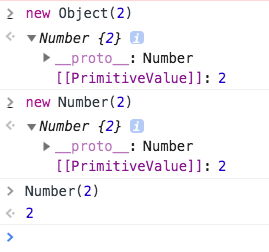

# 对象扩展

种子模块即核心模块，一般有下面几个模块组成：

## 学习资料

- [javascript中的深拷贝和浅拷贝？](https://www.zhihu.com/question/23031215)
- [javaScript中浅拷贝和深拷贝的实现](https://github.com/wengjq/Blog/issues/3)
- [mdn Object.assign()](https://developer.mozilla.org/zh-CN/docs/Web/JavaScript/Reference/Global_Objects/Object/assign)
- [属性的可枚举性和所有权](https://developer.mozilla.org/zh-CN/docs/Web/JavaScript/Enumerability_and_ownership_of_properties)

## 对象扩展

对象扩展：也就是 jq 里的`$.extend()`方法。这个方法是经常用到的，比如写一些插件时，合并配置项。

```
$.extend(true, defaultOptions, userOptions)
```

它涉及到的知识点如下：

- `Object()`的作用
- 对象的深浅拷贝
- 需要学习`$.extend()`的用法和实现
- `Object.assign()`的实现
- 关于对象属性的枚举性

## Object()

`Object()`和`new Object()`一样，会创建一个对象包装器。如果参数是 null 或 undefined，它将返回一个空对象(和`new Object()`一样)。如果传递的是其它值，它会返回对应的对象。比如`new Object(2)`和`new Number(2)`一样，如下图。



如果传递的参数是一个函数，也会原样返回。

```javascript
var a = Object(function(){ return 1})
a()  // 1
```

## 对象的浅拷贝

只需要拷贝属性即可。

```javascript
function copy(origin){
    var target = {}
    for(var i in origin){
        target[i] = origin[i]
    }
    return target
}
```

## 对象的深拷贝

深拷贝的方法是：如果值是值类型，则直接赋值。如果是object，则直接递归，如果是array，则复制。注意如果是函数，可以不用管，因为函数没有什么影响。

```javascript
function deepCopy(origin) {
    var target = {}
    for (var i in origin) {
        if (typeof origin[i] !== 'object' || origin[i] == null || typeof origin[i] === 'function') {
            target[i] = origin[i]
            continue
        }
        if (Object.prototype.toString.call(origin[i]) === '[object Array]') {
            target[i] = origin[i].slice()
            continue
        }

        target[i] = deepCopy(origin[i])
    }
    return target
}
```

上面的代码针对数组，实际还需要特殊处理，因为数组里的项也可能是引用类型。

还有一种方法是通过 JSON 来进行拷贝。

```
function deepCopy(origin){
    try{
        return JSON.parse(JSON.stringify(origin))
    }catch(e){
        throw new Error('不支持拷贝')
    }
}
```

JSON 方法有2个问题：1、有些低版本浏览器不支持JSON。2、函数也会复制一份

## Object.assign()

因为合并对象经常使用，所以 es6 直接提供了`Object.assign(target, ...sources)`方法。它能将多个对象的可枚举属性合并到目标对象，并返回目标对象。

```
// 例子1
var a = {name: 'zs'}
var b = {age: 2}
var c = {say: function(){}}

var d = Object.assign(a, b, c)
console.log(a)  // {name: "zs", age: 2, sex: "man"}

a.say === c.say   // true
d === a           // true
```

注意 Object.assign() 是浅拷贝，并且只会拷贝可枚举属性。如果要赋值属性定义，则需要`Object.getOwnPropertyDescriptor()`和`Object.defineProperty()`。


