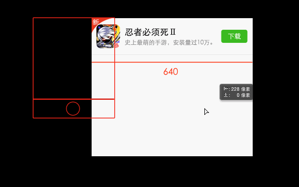

# 移动web页面适配历史方案

> 写这篇文章查阅了很多资料，花费了很多时间，自己动手也写了些测试案例，最终终于自认为是大致了解了移动端的适配方案和原理。这些都是一些曾经的方案。

最新的方案请看[移动web页面适配最新方案](/docs/front-1/mobile/adapter-new.md)

## 学习资料

- [移动端适配方案(下)](https://github.com/riskers/blog/issues/18)
- [使用Flexible实现手淘H5页面的终端适配](https://www.w3cplus.com/mobile/lib-flexible-for-html5-layout.html)
- [手机百度移动适配切图解决方案介绍](http://js8.in/2015/12/12/手机百度移动适配切图解决方案介绍/)
- [移动端高清、多屏适配方案](http://div.io/topic/1092)
- [从网易与淘宝的font-size思考前端设计稿与工作流](http://www.cnblogs.com/lyzg/p/4877277.html)
- [移动端高清屏适配方案](https://juejin.im/entry/585b653061ff4b0058026ca4)
- [MobileWeb 适配总结](http://html-js.com/article/MobileWeb)
- [移动端字体单位font-size选择px还是rem](http://www.cnblogs.com/PeunZhang/p/3407453.html#question_2)
- [走向视网膜（Retina）的Web时代](https://www.w3cplus.com/css/towards-retina-web.html)
- [再谈Retina下1px的解决方案](https://www.w3cplus.com/css/fix-1px-for-retina.html)

可能遇到的一些问题：

- [flexible移动布局使用rem，但字体大小为什么使用px?](https://www.zhihu.com/question/44243091)
- [现在网页设计中的为什么少有人用 11px、13px、15px 等奇数的字体？](https://www.zhihu.com/question/20440679)

## 适配方案

结合上面的学习资料，应该知道移动端的适配方法大致有下面几种：

1. 宽度自适应，高度固定
1. 白色橡树说的方案：单纯只通过媒体查询设置不同尺寸屏幕的`<html>`的font-size，加rem布局。
1. 缩放viewport，直接按照设计图写
1. 淘宝h5方案：缩放viewport，动态设置`<html>`的font-size，rem布局

下面详细说说上面的几种方案。

### 宽度自适应，高度固定

这种方案直接将高度固定写死，然后宽度通过百分比、flex等自适应。它适合要求不高的页面，比如列表展示型。

```html
<meta name="viewport" content="width=device-width,initial-scale=1">
```

### rem布局 + 媒体查询@media

因为rem是根据html节点的font-size来计算的，所以可以针对不同的设备修改`<html>`的 font-size 达到适配的效果。这种适配方案是根据屏幕大小进行适配，方案简单实用，元素采用rem布局自动缩放，文字采用px保证大小一致。不过它的每个screen是一个屏幕范围，无法对每个手机都做精准的适配。

```html
// viewport设置
<meta content="width=device-width,initial-scale=1.0,maximum-scale=1.0,user-scalable=no" name="viewport">

// css代码
<style>
html{font-size:10px}
@media screen and (min-width:321px) and (max-width:375px){html{font-size:11px}}
@media screen and (min-width:376px) and (max-width:414px){html{font-size:12px}}
@media screen and (min-width:415px) and (max-width:639px){html{font-size:15px}}
@media screen and (min-width:640px) and (max-width:719px){html{font-size:20px}}
@media screen and (min-width:720px) and (max-width:749px){html{font-size:22.5px}}
@media screen and (min-width:750px) and (max-width:799px){html{font-size:23.5px}}
@media screen and (min-width:800px){html{font-size:25px}}
</style>
```

### 宽度固定，viewport缩放

原理是直接按照设计稿的尺寸进行布局，然后利用js将viewport修改成对应的比例，比例为`设备宽度/设计稿宽度`，即进行等比例缩放。这种方案是对整体布局和文字都进行了缩放。



```html
<meta name="viewport" content="width=640,initial-scale=0.5,maximum-scale=0.5,minimum-scale=0.5,user-scalable=no">
```

不过看了一下上面学习资料中的例子，现在[荔枝FM](http://m.lizhi.fm/)、[网易新闻](http://c.3g.163.com/CreditMarket/default.html) 都是只设置了下面一句，可能是已经没有兼容性问题了：

```html
<meta name="viewport" content="width=640,user-scalable=no">
```

### 淘宝h5方案

这种方案是淘宝采用的方案，它是上一个方案的改进版，改进内容是：将文字用px设置，不进行缩放，保证大小一致；适配高清的iphone屏。

我们知道，如果在上一个方案的基础上改进的话，保证文字大小一致是个难题。于是它采用的方法是：

1. 所有安卓设备的initial-scale=1，font-size为屏幕宽度/10，这样1rem就是 1/10屏幕宽。(不用viewport缩放的原因是有些android原生浏览器，initial-scale不等于1是无效的)
2. iphone设备由于是retina 高清屏幕，为了避免模糊，所以先将它<html>的font-size放大成window.devicePixelRatio倍，然后再用viewport缩小。(android 也有retina屏幕，但是不处理是因为有些androiddpr不准)


看完上面的解释，还是云里雾里。结合它的[源代码flexible.js](https://github.com/amfe/lib-flexible/blob/master/src/flexible.js)就比较好理解了，核心代码如下。

```javascript
if (!dpr && !scale) {
    var isAndroid = win.navigator.appVersion.match(/android/gi);
    var isIPhone = win.navigator.appVersion.match(/iphone/gi);
    var devicePixelRatio = win.devicePixelRatio;
    if (isIPhone) {
        // iOS下，对于2和3的屏，用2倍的方案，其余的用1倍方案
        if (devicePixelRatio >= 3 && (!dpr || dpr >= 3)) {                
            dpr = 3;
        } else if (devicePixelRatio >= 2 && (!dpr || dpr >= 2)){
            dpr = 2;
        } else {
            dpr = 1;
        }
    } else {
        // 其他设备下，仍旧使用1倍的方案
        dpr = 1;
    }
    scale = 1 / dpr;
}

docEl.setAttribute('data-dpr', dpr);
if (!metaEl) {
    metaEl = doc.createElement('meta');
    metaEl.setAttribute('name', 'viewport');

    // 这里的scale，android设备都是1，ios设备才有区分
    metaEl.setAttribute('content', 'initial-scale=' + scale + ', maximum-scale=' + scale + ', minimum-scale=' + scale + ', user-scalable=no');
    if (docEl.firstElementChild) {
        docEl.firstElementChild.appendChild(metaEl);
    } else {
        var wrap = doc.createElement('div');
        wrap.appendChild(metaEl);
        doc.write(wrap.innerHTML);
    }
}

function refreshRe(){
    // 这里相当于是根据 viewport 的scale 得到页面的宽度
    // android都是1倍宽度
    // ios是 宽度/scale，比如iphoneX 是 375/0.3333 = 1125
    var width = docEl.getBoundingClientRect().width;
    if (width / dpr > 540) {
        width = 540 * dpr;
    }

    // 设置 <html> 的font-size 为屏幕宽度的 1/10，这样1rem就是 1/10宽度
    // iphone 的retina 屏幕会被处理，其fontSize会因为上面的width而放大，然后meta viewport又将它缩小了
    var rem = width / 10;
    docEl.style.fontSize = rem + 'px';
    flexible.rem = win.rem = rem;
}

win.addEventListener('resize', function() {
    clearTimeout(tid);
    tid = setTimeout(refreshRem, 300);
}, false);

// pageshow类似load，但是load是页面从缓存中读取则不触发，pageshow是只要页面加载就触发
// e.persisted是一个boolean，表示页面是否是从缓存中读取的
win.addEventListener('pageshow', function(e) {
    if (e.persisted) {
        clearTimeout(tid);
        tid = setTimeout(refreshRem, 300);
    }
}, false);

// 处理页面文字的大小
if (doc.readyState === 'complete') {
    doc.body.style.fontSize = 12 * dpr + 'px';
} else {
    doc.addEventListener('DOMContentLoaded', function(e) {
        doc.body.style.fontSize = 12 * dpr + 'px';
    }, false);
}


refreshRem();
```

看完上面的代码，清晰了一些，元素的适配很简单，只需要用rem即可。但是如果自定义文字大小呢？如果用px做单位，android上是正常的。iphone下却会缩小了。所以，需要通过[flexible.css]设置来修复这个问题：

```
div {
    width: 1rem; 
    height: 0.4rem;
    font-size: 12px; // 默认写上dpr为1的fontSize
}
[data-dpr="2"] div {
    font-size: 24px;
}
[data-dpr="3"] div {
    font-size: 36px;
}

// sass
@mixin font-dpr($font-size){
    font-size: $font-size;

    [data-dpr="2"] & {
        font-size: $font-size * 2;
    }

    [data-dpr="3"] & {
        font-size: $font-size * 3;
    }
}
@include font-dpr(16px);
```

flexible库详细的使用方法：[点击查看flexible github仓库](https://github.com/amfe/lib-flexible/tree/master)

到这里，大家应该都知道如何做移动端适配了。如果还是不知道，请慢慢思考并动手实践。

接着再说说这个方案的问题：
- iframe里貌似有问题（官方说的，我没有测试）
- 布局时px转rem是个问题，可以通过[postcss-px2rem](https://www.npmjs.com/package/postcss-px2rem)，配置webpack自动完成。